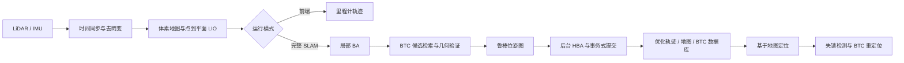
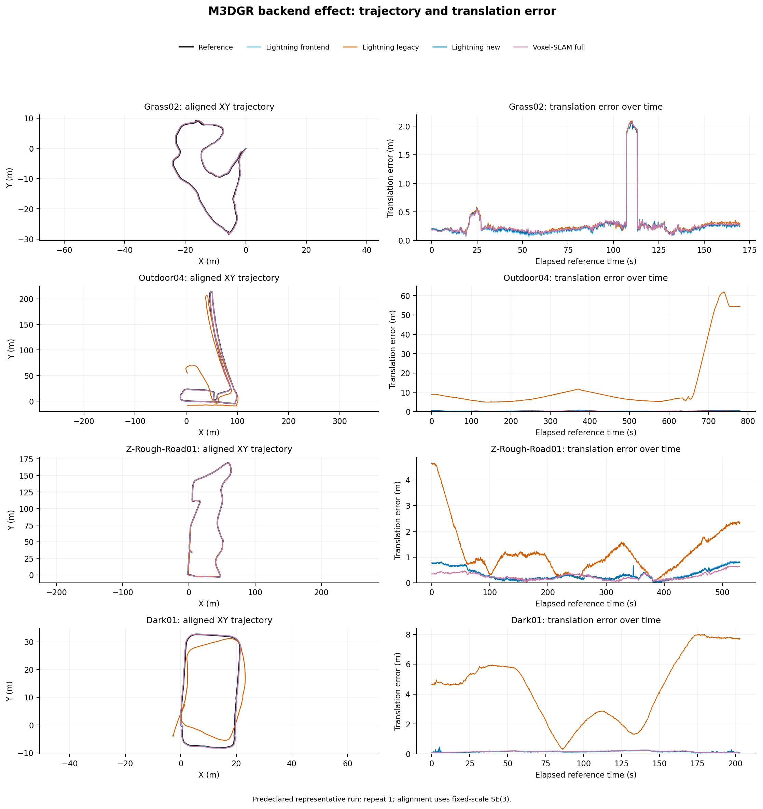
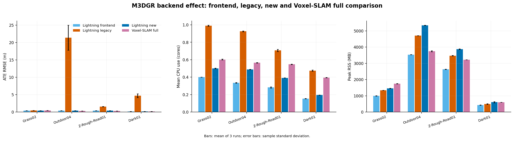

# SLAM 建图定位算法实验与验收报告

| 项目 | 内容 |
|---|---|
| 报告版本 | 1.4（正式验收版，补充后端闭环审计及前后端共同支持对比） |
| 报告日期 | 2026-07-21 |
| 实验批次 | `formal_report_20260717` |
| 项目 | Lightning-LM |
| 正式运行 | 198 次：195 次统计实验，3 次 SANY 代理参考生成 |
| 验收状态 | 通过。本结论限于功能完成度、实验完整性和可复现性；项目未给定精度、时延或资源门槛，因此不构成 SLA 或量产指标认证。 |

## 1. 执行摘要

本轮按预先冻结的矩阵完成了 M3DGR 前端、M3DGR 后端、M3DGR 基于地图定位、SANY 单/四雷达建图以及 SANY 启动/失锁重定位实验，并补充了 M3DGR 四前端的逐帧纯算法计时矩阵。原验收矩阵完成 147 次统计运行，纯计时矩阵完成 48 次统计运行，3 条 SANY 数据各生成 1 份 Voxel-SLAM 114 雷达代理轨迹。原套件与纯计时校验均为 `passed_with_warnings`，失败项为 0；两批警告分别在第 9 节披露。

验收结论如下。

1. Lightning-LM 的前端、完整 SLAM、地图导出、基于地图定位和 BTC 重定位链路均能在统一脚本下完成。所有正式产物留在项目内，输入、配置、脚本、二进制或地图索引均有哈希记录。
2. 前端纯算法计时中，Lightning-LM 在 50,481 个有效帧上的均值/中位数/P95/P99 为 `10.310/9.525/16.473/28.675 ms`，等效计算吞吐率为 `97.0 帧/s`，平均占用 10 Hz 周期的 `10.31%`。六阶段中迭代扫描匹配占平均总耗时的 `89.21%`。
3. 新流水线解决了旧流水线在三条挑战序列上的明显失稳。Outdoor04 的 ATE RMSE 从 `21.382 m` 降至 `0.383 m`，Z-Rough-Road01 从 `1.537 m` 降至 `0.391 m`，Dark01 从 `4.718 m` 降至 `0.173 m`。但旧/新配置同时改变了前端速度传播和后端约束策略，不能把全部改善归因于后端；本轮也没有闭环约束实际进入位姿图。
4. 新后端尚未在所有序列上超过 Voxel-SLAM 完整版。Outdoor04 和 Z-Rough-Road01 的 ATE 分别比 Voxel-SLAM 高 `0.102 m` 和 `0.096 m`；Grass02 与 Dark01 基本持平。
5. M3DGR 双地图定位并不支持“地图来源越好，定位一定越准”这一无条件结论。Voxel-SLAM 地图在 Outdoor04、Z-Rough-Road01 上更好，Lightning 地图在 Grass02、Dark01 上略好。四序列 ATE 算术平均为 `0.347 m` 与 `0.300 m`，Voxel-SLAM 地图平均低 `13.5%`。
6. SANY `data_20260701` 上，四雷达完整 SLAM 相对代理轨迹的 ATE 为 `0.015 m`，单雷达为 `0.135 m`；代价是平均 CPU 从 `0.60` 核增至 `1.28` 核，峰值 RSS 从 `893 MB` 增至 `3307 MB`。
7. SANY 噪声建模不可关闭。四雷达前端关闭噪声抑制后，ATE 从 `0.029 m` 退化至 `205.801 m`。缺失雷达实验中，缺失 187 的 ATE 为 `0.145 m`，其余三种单雷达缺失为 `0.027–0.031 m`，说明 187 在本段路线的几何约束更重要。
8. SANY 启动定位在 data1/data2 的首次接受时延分别为 `3.90 s` 和 `1.90 s`。强制失锁后均在 `21.80 s` 恢复；恢复模式的 ATE 为 `0.058 m` 和 `0.056 m`。这些误差以 Voxel-SLAM 114 单雷达轨迹为代理参考，不是外部测量真值。

## 2. 系统范围与算法结构

Lightning-LM 的正式链路如下。



新后端模式为 `ba_btc_hba`，由持续局部 BA、BTC 全局检索与几何验证、鲁棒位姿图及后台 HBA 组成。与 `legacy` 相比，本版还统一了名义速度与协方差传播，使用速度更新限幅控制非线性更新，收紧 BTC 假阳性门槛，并且只在图约束实际生效时自动触发 HBA。数据结束或服务请求仍可强制优化，结果经安全条件检查后一次性提交。实现依据见 [`backend_ba_btc_hba_four_sequence_optimization_report_20260715.md`](backend_ba_btc_hba_four_sequence_optimization_report_20260715.md)。

项目目录中与交付有关的部分如下。

| 目录 | 用途 |
|---|---|
| `bin/`、`install/` | 离线前端、完整 SLAM、定位程序及运行时库 |
| `config/reproduction/` | 单雷达、多雷达和各消融配置模板 |
| `src/core/lio/` | IMU 传播、LIO 更新、多雷达同步与融合 |
| `src/core/backend/` | BA、BTC、位姿图与 HBA |
| `src/core/localization/` | 地图定位和 BTC 重定位 |
| `scripts/run_*_offline.sh` | 前端、SLAM、定位的统一离线入口 |
| `scripts/reproduction/formal_report/` | 正式矩阵控制器、评测、作图和总体验证 |
| `runs/formal_report_20260717/` | 本报告全部运行、日志、轨迹、地图、资源监控和分析结果 |
| `doc/assets/formal_report_20260717/` | 本报告的可再生图表与图表清单 |

## 3. 数据、实验矩阵与评测协议

### 3.1 数据集与输入

M3DGR 是面向地面机器人的多传感器挑战数据集，官方平台包含 Livox Avia、Livox MID-360、相机、轮速、GNSS/RTK 等传感器。本报告只向各算法提供 MID-360 点云及其内置 IMU，RTK 仅在运行后用于评测，不参与估计。数据集信息可在 [M3DGR 官方仓库](https://github.com/sjtuyinjie/M3DGR)和[数据集论文](https://arxiv.org/abs/2507.08364)核查。

| 序列 | 本地传感器时长 | LiDAR 帧数 | 主要场景 | 参考 |
|---|---:|---:|---|---|
| Grass02 | 172.90 s | 1729 | 草地/非结构化路面 | 官方 RTK 位置 |
| Outdoor04 | 782.80 s | 7828 | 长距离室外路线 | 官方 RTK 位置 |
| Z-Rough-Road01 | 533.70 s | 5337 | 颠簸路面、强姿态激励 | 官方 RTK 位置 |
| Dark01 | 206.20 s | 2062 | 暗光路线；LIO 本身不使用图像 | 官方 RTK 位置 |

SANY 使用四台 MID-360，编号为 114、127、187、195；114 为主雷达。多雷达配置使用固定外参、`0.1 s` 帧周期、`2 ms` 匹配容差和 `0.5 s` 重排窗口。`data_20260701` 用于建图，`data_20260716/data1` 与 `data2` 用于定位和重定位。SANY 没有独立测量真值，因此本报告使用完整 Voxel-SLAM 在 114 雷达上的优化轨迹作为代理参考。代理轨迹可用于同一数据上的一致性比较，不能解释为绝对定位精度。

### 3.2 正式矩阵

| 矩阵 | 单元 | 重复 | 统计运行 |
|---|---:|---:|---:|
| M3DGR 前端精度与端到端资源：4 序列 × 4 方法 | 16 | 3 | 48 |
| M3DGR 前端纯算法计时：4 序列 × 4 方法 | 16 | 3 | 48 |
| M3DGR 后端：4 序列 × 3 方法 | 12 | 3 | 36 |
| M3DGR 定位：4 序列 × 2 地图来源 | 8 | 3 | 24 |
| SANY 建图：7 个前端变体 + 2 个完整 SLAM | 9 | 3 | 27 |
| SANY 重定位：2 段数据 × 2 模式 | 4 | 3 | 12 |
| SANY Voxel-SLAM 114 代理参考 | 3 | 1 | 3 |
| 合计 | 68 |  | 198 |

所有统计实验均使用 1× 数据播放、CPU `0-7` 亲和性和相同主机，单线程串行调度，避免实验之间争用资源。随机调度种子和执行顺序写入各矩阵的 `_state/schedule.json`。三次重复衡量同一输入和同一硬件上的执行重复性，不代表不同天气、车辆或传感器个体的独立样本。

### 3.3 指标与统计

- 轨迹按时间关联，最大插值间隔为 `0.2 s`；对齐使用固定尺度 SE(3)，不允许尺度补偿。
- ATE 报告平移 RMSE、中位数、P95、最大值；表中的主值为三次运行均值，`±` 后为样本标准差，括号内为三次运行中的最差 RMSE。
- RPE 按 `1 m` 与 `10 m` 路径间隔计算平移和旋转 RMSE。M3DGR 官方 RTK 文件中的四元数全部为单位四元数占位值，因此 M3DGR 的旋转 ATE/RPE 标为 `N/A`，平移 RPE 改在对齐后的全局位移上计算。它们不能记成 0。
- M3DGR RTK 文件含乱序和相同时间戳。评测器先稳定排序，再对完全相同的时间戳去重：Grass02 有 95 次逆序并移除 758 行重复；Outdoor04 为 1663/4947；Z-Rough-Road01 为 431/4305；Dark01 为 364/1493。该处理和诊断写入每份 `validation.json`。
- 资源统计采用平均 CPU 核数和进程组峰值 RSS。受 1× 数据播放节奏主导的端到端耗时比不用于算法效率评价，也不进入本报告的结果表格和图表。GPU 未被算法使用，只记录主机型号，不报告 GPU 利用率。
- 补充前端计时矩阵为四个 LIO 前端增加统一逐帧遥测：计时边界为“LiDAR 消息预处理 + 同步后的 LIO 核心更新”，排除 rosbag 等待、ROS 发布、轨迹/地图文件写入和后端优化。每次运行剔除初始化阶段及前 10 个有效跟踪帧；报告均值、中位数、P95、P99、最大值、100 ms 截止期超限率、预算占用率和等效计算吞吐率。
- 定位程序继续报告其原生单帧处理时间均值/P95。未增加逐帧遥测的其它链路保留 wall time 和每输出帧 wall time 作为复现记录，正文的效率比较只采用 CPU、RSS 及已有的算法内部计时。

## 4. M3DGR 前端 LIO

### 4.1 精度

对比方法为 Lightning-LM、FAST-LIO、FAST-LIVO2 的 LIO-only 模式以及 Voxel-SLAM 的 LIO 前端。本节只评价轨迹精度：ATE 分布依次为 `RMSE / 中位数 / P95 / 最大值`，RPE 为 `1 m / 10 m` 路径间隔下的平移 RMSE；CPU、内存和纯算法耗时统一放在 4.2 节。

| 序列 | 方法 | ATE RMSE / 中位数 / P95 / 最大值（m） | ATE RMSE 均值±标准差（最差）（m） | RPE 1 m / 10 m（m） |
|---|---|---|---|---|
| Grass02 | Lightning-LM | 0.419 / 0.193 / 0.465 / 2.091 | 0.419±0.000 (0.419) | 0.260 / 0.726 |
|  | FAST-LIO | 0.424 / 0.199 / 0.467 / 2.071 | 0.424±0.000 (0.424) | 0.261 / 0.730 |
|  | FAST-LIVO2 LIO | 0.423 / 0.196 / 0.470 / 2.075 | 0.423±0.000 (0.423) | 0.261 / 0.731 |
|  | Voxel-SLAM LIO | 0.428 / 0.205 / 0.458 / 2.077 | 0.428±0.000 (0.428) | 0.262 / 0.732 |
| Outdoor04 | Lightning-LM | 0.380 / 0.325 / 0.631 / 0.812 | 0.380±0.000 (0.380) | 0.050 / 0.122 |
|  | FAST-LIO | 0.436 / 0.381 / 0.795 / 0.912 | 0.436±0.018 (0.457) | 0.048 / 0.121 |
|  | FAST-LIVO2 LIO | 0.212 / 0.188 / 0.315 / 0.463 | 0.212±0.000 (0.212) | 0.044 / 0.099 |
|  | Voxel-SLAM LIO | 0.276 / 0.250 / 0.418 / 0.489 | 0.276±0.001 (0.276) | 0.045 / 0.106 |
| Z-Rough-Road01 | Lightning-LM | 0.400 / 0.247 / 0.788 / 0.844 | 0.400±0.000 (0.400) | 0.061 / 0.127 |
|  | FAST-LIO | 0.344 / 0.298 / 0.565 / 0.805 | 0.344±0.020 (0.356) | 0.053 / 0.138 |
|  | FAST-LIVO2 LIO | 0.301 / 0.207 / 0.584 / 0.680 | 0.301±0.014 (0.317) | 0.048 / 0.107 |
|  | Voxel-SLAM LIO | 0.333 / 0.268 / 0.642 / 0.766 | 0.333±0.000 (0.333) | 0.049 / 0.113 |
| Dark01 | Lightning-LM | 0.152 / 0.144 / 0.218 / 0.460 | 0.152±0.000 (0.152) | 0.058 / 0.126 |
|  | FAST-LIO | 0.154 / 0.151 / 0.227 / 0.262 | 0.154±0.000 (0.154) | 0.030 / 0.123 |
|  | FAST-LIVO2 LIO | 0.153 / 0.146 / 0.226 / 0.257 | 0.153±0.000 (0.153) | 0.029 / 0.123 |
|  | Voxel-SLAM LIO | 0.154 / 0.151 / 0.219 / 0.254 | 0.154±0.000 (0.154) | 0.032 / 0.124 |

代表运行的轨迹和逐时误差曲线用于检查总体 ATE 是否掩盖局部漂移、异常峰值或末段发散。


精度结果不存在跨场景唯一最优方法。Lightning-LM 在 Grass02 和 Dark01 的 ATE 最低；FAST-LIVO2 LIO 在 Outdoor04 和 Z-Rough-Road01 最低，并在另外两条序列上接近最佳值。FAST-LIVO2 LIO 修复后的 1 m/10 m RPE 与总体 ATE 排名一致，因此旧版由错误时戳尖峰推导出的连续性退化结论不成立。对外验收时应按场景报告这些结果，不能把某一条序列的优势外推为全工况领先。

### 4.2 资源诊断

资源诊断分为两层：完整离线运行用于统计平均 CPU、进程组峰值 RSS 和输出连续性；前端内部逐帧计时用于评价算法本身的计算效率，并进一步给出尾延迟、100 ms 截止期超限率和等效吞吐率。

#### 4.2.1 CPU、内存与分序列计算耗时

下表把每条序列的资源占用与相同运行条件下的纯计算耗时放在一起。纯计算均值的 `±` 后为三次运行均值的样本标准差，P95 为三次运行各自 P95 的均值；CPU 以平均占用核心数计，RSS 为进程组峰值。

| 序列 | 方法 | 平均 CPU（核） | 峰值 RSS（MB） | 纯计算均值±运行间标准差（ms） | 纯计算 P95（ms） |
|---|---|---:|---:|---:|---:|
| Grass02 | Lightning-LM | 0.40 | 995 | 11.742±0.284 | 18.219 |
|  | FAST-LIO | 0.36 | 289 | 4.477±0.104 | 5.513 |
|  | FAST-LIVO2 LIO | 1.36 | 2891 | 41.532±0.506 | 56.635 |
|  | Voxel-SLAM LIO | 0.36 | 1814 | 19.132±0.173 | 25.345 |
| Outdoor04 | Lightning-LM | 0.33 | 3534 | 10.387±0.032 | 15.159 |
|  | FAST-LIO | 0.34 | 358 | 3.352±0.053 | 4.515 |
|  | FAST-LIVO2 LIO | 1.16 | 7242 | 34.796±0.844 | 50.002 |
|  | Voxel-SLAM LIO | 0.31 | 3872 | 15.028±0.118 | 21.294 |
| Z-Rough-Road01 | Lightning-LM | 0.28 | 2627 | 10.200±0.287 | 16.870 |
|  | FAST-LIO | 0.32 | 356 | 3.395±0.029 | 4.363 |
|  | FAST-LIVO2 LIO | 1.11 | 7592 | 36.277±1.963 | 57.731 |
|  | Voxel-SLAM LIO | 0.27 | 3527 | 14.356±0.112 | 18.300 |
| Dark01 | Lightning-LM | 0.15 | 431 | 9.102±0.319 | 22.023 |
|  | FAST-LIO | 0.27 | 249 | 1.737±0.012 | 2.287 |
|  | FAST-LIVO2 LIO | 0.69 | 816 | 26.699±3.742 | 60.681 |
|  | Voxel-SLAM LIO | 0.17 | 723 | 6.749±0.153 | 8.762 |

下图将精度作为资源取舍的背景，并列展示平均 CPU 与峰值 RSS；逐帧计算时延仍以上表和 4.2.2 节为准。


资源结果给出清晰的轻量化排序。FAST-LIO 在四条序列上的纯计算耗时和峰值 RSS 均最低；FAST-LIVO2 LIO 的平均 CPU、峰值 RSS 和纯计算耗时均最高，但它在 Outdoor04 和 Z-Rough-Road01 取得了最低 ATE，体现的是以资源换取挑战场景精度。Lightning-LM 的纯计算耗时在四条序列上均排名第二，平均 CPU 与 Voxel-SLAM LIO 接近，峰值 RSS 则在四条序列上都低于 Voxel-SLAM LIO 和 FAST-LIVO2 LIO、高于 FAST-LIO。

输出连续性作为运行健康度一并纳入诊断。Lightning-LM 的输出缺口比例为 `0.27%–1.21%`，FAST-LIO 与修复后的 FAST-LIVO2 LIO 均为 `0.04%–0.17%`，Voxel-SLAM LIO 为 `0.18%–0.79%`。FAST-LIVO2 LIO 的 12 次修复运行均未出现超过 `0.2 s` 的轨迹间隔或非单调观测；Voxel-SLAM LIO 仅在 Outdoor04 第 2 次运行出现 2 个略超阈值的间隔，最大值为 `0.202 s`。

#### 4.2.2 总体纯计算效率

为隔离 1× 播放等待，本轮重新编译四个前端并在算法内部记录逐帧单调时钟。统一计时边界为点云回调中的实际 LiDAR 预处理，加上同步数据包进入 LIO 后直至状态与局部地图更新完成的核心计算；不计 rosbag 等待、ROS 消息发布、轨迹序列化、调试/地图文件写入和最终后端优化。四序列、四方法各运行 3 次，固定 CPU `0-7`、Release 构建和 1× 输入节奏。原始 202,947 条记录中，剔除初始化和每次运行前 10 个跟踪帧后纳入 202,455 条。

| 方法 | 有效帧 | 均值 / 中位数（ms） | P95 / P99（ms） | 最大值（ms） | >100 ms | 10 Hz 预算占用 | 等效计算吞吐率 |
|---|---:|---:|---:|---:|---:|---:|---:|
| Lightning-LM | 50,481 | 10.310 / 9.525 | 16.473 / 28.675 | 246.437 | 14（0.028%） | 10.31% | 97.0 帧/s |
| FAST-LIO | 50,712 | 3.284 / 3.423 | 4.754 / 5.551 | 37.776 | 0（0%） | 3.28% | 304.5 帧/s |
| FAST-LIVO2 LIO | 50,671 | 34.962 / 34.208 | 54.614 / 80.429 | 787.863 | 171（0.337%） | 34.96% | 28.6 帧/s |
| Voxel-SLAM LIO | 50,591 | 14.231 / 14.854 | 21.670 / 24.571 | 34.223 | 0（0%） | 14.23% | 70.3 帧/s |

下图比较四种前端的均值、尾延迟、预算占用和等效吞吐率；它回答算法纯计算效率，不替代 CPU、内存和输出连续性诊断。


纯计算效率从高到低依次为 FAST-LIO、Lightning-LM、Voxel-SLAM LIO、FAST-LIVO2 LIO。Lightning-LM 的平均耗时比 Voxel-SLAM LIO 低 `27.6%`、比 FAST-LIVO2 LIO 低 `70.5%`，但约为 FAST-LIO 的 `3.14` 倍。四种方法的 P99 均低于 100 ms；Lightning-LM 和 FAST-LIVO2 LIO 的未截尾最大值超过 100 ms，说明平均处理能力充足并不等于严格最坏情况有界。等效吞吐率只表示当前主机和计时边界内的前端计算能力，不包含 ROS 发布、文件输出和后端处理。

#### 4.2.3 Lightning-LM 耗时拆解

Lightning-LM 的 12 次运行全部通过完整运行契约。按序列池化三次重复后，Grass02 的平均耗时最高；Dark01 均值最低，但 P99 长尾最明显。超 100 ms 的 14 帧分散在 Outdoor04、Z-Rough-Road01 和 Dark01，代表运行的滚动中位数没有同步越过截止线，属于孤立尖峰而非持续积压。

| 序列 | 有效帧 | 均值 / 中位数（ms） | P95 / P99（ms） | 最大值（ms） | >100 ms |
|---|---:|---:|---:|---:|---:|
| Grass02 | 5,091 | 11.742 / 11.102 | 17.950 / 26.142 | 81.398 | 0 |
| Outdoor04 | 23,388 | 10.387 / 10.033 | 15.068 / 22.109 | 246.437 | 6 |
| Z-Rough-Road01 | 15,912 | 10.200 / 9.052 | 16.962 / 30.628 | 219.438 | 4 |
| Dark01 | 6,090 | 9.102 / 6.810 | 21.764 / 42.475 | 126.406 | 4 |
| 总体 | 50,481 | 10.310 / 9.525 | 16.473 / 28.675 | 246.437 | 14 |

六阶段平均耗时构成用于定位 Lightning-LM 的主要计算瓶颈，阶段总和与逐帧总耗时采用相同计时边界。


| Lightning-LM 阶段 | 平均值（ms） | P95（ms） | 平均总耗时占比 |
|---|---:|---:|---:|
| LiDAR 预处理 | 0.192 | 0.283 | 1.86% |
| IMU 传播与去畸变 | 0.380 | 0.439 | 3.69% |
| 降采样 | 0.101 | 0.143 | 0.98% |
| 匹配准备 | 0.003 | 0.007 | 0.03% |
| 迭代扫描匹配 | 9.198 | 15.263 | 89.21% |
| 地图更新 | 0.436 | 0.598 | 4.22% |

Lightning-LM 的耗时瓶颈集中在迭代扫描匹配：该阶段占平均总耗时的 `89.21%`，应作为后续性能优化的首要位置；LiDAR 预处理仅占 `1.86%`，单独优化这一阶段难以显著改变总耗时。分布图将主体缩放到 P99.5，同时在右侧保留未截尾最大值，用于区分常态延迟与少量极端尖峰。


代表运行时序固定使用预先约定的 repeat 1：细线为原始逐帧耗时，粗线为 50 帧滚动中位数。滚动中位数未持续越过 100 ms 截止线，说明当前风险主要是偶发长尾，而非连续计算积压；若面向严格实时部署，应进一步定位这些极端帧的输入规模和调度条件。


## 5. M3DGR 完整 SLAM 与后端优化

为直接回答后端是否改善前端结果，本节把 Lightning 前端 LIO、Lightning 旧后端、Lightning 新 `BA+BTC+HBA` 后端和 Voxel-SLAM 完整版放入同一评测。每条序列的 12 条轨迹共同求可插值 RTK 时间交集，再分别做固定尺度 SE(3) 对齐；因此下表中的前端与后端数值可以直接比较，不再受两个独立评测矩阵时间支持略有差异的影响。

### 5.1 精度及与前端 LIO 的对比

| 序列 | 方法 | ATE RMSE / 中位数 / P95 / 最大值（m） | RMSE 均值±标准差（最差） | RPE 1 m / 10 m（m） |
|---|---|---|---|---|
| Grass02 | Lightning 前端 LIO | 0.420 / 0.194 / 0.463 / 2.089 | 0.420±0.000 (0.420) | 0.260 / 0.726 |
|  | Lightning 旧后端 | 0.436 / 0.216 / 0.483 / 2.091 | 0.436±0.002 (0.439) | 0.264 / 0.735 |
|  | Lightning 新后端 | 0.426 / 0.206 / 0.470 / 2.091 | 0.426±0.000 (0.426) | 0.261 / 0.730 |
|  | Voxel-SLAM 完整版 | 0.433 / 0.216 / 0.456 / 2.074 | 0.433±0.000 (0.433) | 0.262 / 0.735 |
| Outdoor04 | Lightning 前端 LIO | 0.380 / 0.325 / 0.631 / 0.811 | 0.380±0.000 (0.380) | 0.050 / 0.122 |
|  | Lightning 旧后端 | 21.382 / 8.112 / 64.980 / 74.419 | 21.382±3.604 (25.145) | 0.428 / 3.716 |
|  | Lightning 新后端 | 0.383 / 0.327 / 0.635 / 0.831 | 0.383±0.000 (0.383) | 0.051 / 0.127 |
|  | Voxel-SLAM 完整版 | 0.281 / 0.252 / 0.424 / 0.515 | 0.281±0.000 (0.281) | 0.045 / 0.109 |
| Z-Rough-Road01 | Lightning 前端 LIO | 0.399 / 0.247 / 0.785 / 0.847 | 0.399±0.000 (0.399) | 0.061 / 0.127 |
|  | Lightning 旧后端 | 1.537 / 1.163 / 3.011 / 4.085 | 1.537±0.054 (1.593) | 0.076 / 0.390 |
|  | Lightning 新后端 | 0.391 / 0.246 / 0.766 / 0.818 | 0.391±0.000 (0.391) | 0.062 / 0.135 |
|  | Voxel-SLAM 完整版 | 0.295 / 0.230 / 0.552 / 0.654 | 0.295±0.000 (0.295) | 0.050 / 0.117 |
| Dark01 | Lightning 前端 LIO | 0.152 / 0.145 / 0.217 / 0.460 | 0.152±0.000 (0.152) | 0.058 / 0.126 |
|  | Lightning 旧后端 | 4.718 / 4.426 / 7.522 / 7.738 | 4.718±0.548 (5.147) | 0.267 / 2.311 |
|  | Lightning 新后端 | 0.173 / 0.167 / 0.240 / 0.469 | 0.173±0.000 (0.173) | 0.059 / 0.140 |
|  | Voxel-SLAM 完整版 | 0.174 / 0.173 / 0.242 / 0.275 | 0.174±0.000 (0.174) | 0.030 / 0.134 |

新后端相对前端 LIO 的 ATE 变化分别为 Grass02 `+0.006 m（+1.5%）`、Outdoor04 `+0.003 m（+0.9%）`、Z-Rough-Road01 `-0.009 m（-2.2%）`、Dark01 `+0.021 m（+13.8%）`。只有 Z-Rough-Road01 的总体 ATE 小幅下降，但其 1 m/10 m RPE 反而从 `0.061/0.127 m` 增至 `0.062/0.135 m`。因此，本轮结果不支持“加入新后端后精度一致提升”；更准确的结论是，新后端把完整 SLAM 恢复到接近当前前端 LIO 的稳定水平，没有复现旧后端的大幅退化。



### 5.2 旧后端退化原因与新后端闭环审计

旧后端比前端 LIO 差并非单一原因，也不是一个严格的“只开/关后端”消融。首先，正式旧后端配置为 `propagate_velocity: false`，而当前前端 LIO 和新后端均为 `true`。旧配置继续传播 IMU 误差协方差，却不连续传播名义速度；在长距离、粗糙路面或强姿态激励下，名义状态与协方差不一致会放大后续 LiDAR 更新。该问题对 Z-Rough-Road01 的影响已经由完整消融定位，相关实现与证据见 [`backend_ba_btc_hba_four_sequence_optimization_report_20260715.md`](backend_ba_btc_hba_four_sequence_optimization_report_20260715.md)。

其次，旧 `loop_closing` 日志显示其持续接受候选并反复优化位姿图。下表是三次运行的内部计数均值；“最终回环边”是旧模块自身报告的累计边数，不等同于经独立真值确认的真实闭环。

| 序列 | 匹配成功事件/次 | 位姿图优化事件/次 | 最终报告回环边/次 | 旧后端 ATE（m） |
|---|---:|---:|---:|---:|
| Grass02 | 79.0 | 74.7 | 181.7 | 0.436 |
| Outdoor04 | 370.0 | 343.7 | 1302.7 | 21.382 |
| Z-Rough-Road01 | 251.0 | 203.0 | 396.0 | 1.537 |
| Dark01 | 95.0 | 95.0 | 911.3 | 4.718 |

这些计数本身不能证明每条边都是假阳性，但 Outdoor04、Dark01 在大量约束进入图后明显偏离 RTK，说明旧模块缺少足够严格的候选验真、修正量门槛和提交保护，错误或冗余约束很可能把原本可用的前端轨迹拉偏。结合前述速度传播差异，本实验能确定的是“旧流水线失稳”，不能把退化全部归因于某一个后端算子。

新后端把“BTC 候选”“几何验真接受”和“约束实际入图”分别记录。下表为三次运行均值；耗时是各模块内部累计纯算法时间，不是数据播放时长。

| 序列 | 局部 BA 接受/次 | BTC 候选/次 | 闭环接受 / 入图 / 图内点 | HBA 接受 / 运行 | BA / BTC / 位姿图 / HBA（s） |
|---|---:|---:|---:|---:|---:|
| Grass02 | 1698 | 116 | 0 / 0 / 0 | 0 / 1 | 3.34 / 10.36 / 0 / 0.94 |
| Outdoor04 | 7797 | 634 | 1 / 0 / 0 | 0 / 1 | 15.53 / 83.63 / 0 / 4.23 |
| Z-Rough-Road01 | 5305 | 289 | 0 / 0 / 0 | 0 / 1 | 10.27 / 29.88 / 0 / 2.75 |
| Dark01 | 2031 | 4 | 0 / 0 / 0 | 0 / 1 | 3.69 / 0.97 / 0 / 0.67 |

Outdoor04 的唯一接受候选连接关键帧 7619 与 59，但估计修正仅为 `0.131 m / 0.378°`，低于 `0.2 m / 2.0°` 的入图门槛，因此记录为 `optimization_warranted=0`。四条序列的 `loops_applied`、`loops_graph_inliers` 和位姿图耗时都为 0；数据结束时虽各强制运行一次 HBA，但由于没有实际入图的闭环，`require_applied_loop_for_commit` 使 12 次结果全部未提交。

据此，本轮新后端**检测到一个通过几何验真的重访候选，但没有产生实际生效的闭环优化**。新后端相对旧后端的精度恢复不能写成“闭环改善了精度”，只能表述为前端状态传播修复、局部 BA 及更保守的约束安全策略组合后避免了旧流水线失稳。要验证闭环带来的净精度收益，后续必须选择存在可应用真闭环的序列，并增加“同一前端、局部 BA 相同、仅开/关已确认闭环边”的受控消融。

### 5.3 添加新后端后的资源影响

| 序列 | 前端 CPU / RSS | 旧后端 CPU / RSS | 新后端 CPU / RSS | 新后端相对前端增量 |
|---|---:|---:|---:|---:|
| Grass02 | 0.40 核 / 995 MB | 0.99 核 / 1337 MB | 0.50 核 / 1458 MB | +0.10 核 / +463 MB（+46.5%） |
| Outdoor04 | 0.33 核 / 3534 MB | 0.93 核 / 4703 MB | 0.49 核 / 5338 MB | +0.15 核 / +1804 MB（+51.1%） |
| Z-Rough-Road01 | 0.28 核 / 2627 MB | 0.71 核 / 3468 MB | 0.39 核 / 3869 MB | +0.11 核 / +1242 MB（+47.3%） |
| Dark01 | 0.15 核 / 431 MB | 0.47 核 / 494 MB | 0.19 核 / 607 MB | +0.04 核 / +176 MB（+40.8%） |

相对纯前端，新后端的平均 CPU 增加 `0.04–0.15` 核，峰值 RSS 增加 `176–1804 MB`，内存相对增幅为 `40.8%–51.1%`。相对旧后端，新后端平均 CPU 反而低 `0.28–0.49` 核，这与旧模块每次运行触发 75–344 次位姿图优化、新后端本轮没有位姿图求解相一致；与此同时，新后端运行还需保留局部 BA 窗口、BTC 描述子、子图和 HBA 数据，其峰值 RSS 比旧后端高 `114–635 MB`。因此，当前后端的主要资源问题是内存驻留，尤其是 Outdoor04 和 Z-Rough-Road01，而不是平均 CPU。



与 Voxel-SLAM 完整版相比，新后端在四条序列上的平均 CPU 低 `0.08–0.21` 核，但 Outdoor04、Z-Rough-Road01 的峰值内存高 `1591 MB`、`648 MB`。Voxel-SLAM 完整版在每条序列开头有约 `0.9 s` 固定初始化尾差，最终覆盖率仍为 `99.36%–99.86%`，点云文件数与轨迹行数相符；评测器将其保留为协议警告，而不是完成失败。

## 6. M3DGR 基于地图定位

定位器分别加载 Lightning 新后端地图和由 Voxel-SLAM 完整版轨迹、点云确定性转换得到的地图。两组地图均在同一序列上构建并用同一序列定位，属于已知场景回放，结果比跨时段、跨天气定位乐观。

| 序列 | 地图来源 | ATE 分布（m） | RMSE 均值±标准差（最差） | RPE 1 m / 10 m | 平均 CPU（核） | 处理时间均值/P95 | 峰值 RSS |
|---|---|---|---|---|---:|---|---:|
| Grass02 | Lightning 新后端 | 0.424 / 0.211 / 0.503 / 2.078 | 0.424±0.000 (0.424) | 0.261 / 0.728 | 1.00 | 12.07 / 15.64 ms | 283 MB |
|  | Voxel-SLAM 完整版 | 0.429 / 0.211 / 0.466 / 2.120 | 0.429±0.000 (0.429) | 0.261 / 0.733 | 1.00 | 11.97 / 15.48 ms | 282 MB |
| Outdoor04 | Lightning 新后端 | 0.387 / 0.336 / 0.642 / 0.844 | 0.387±0.000 (0.387) | 0.051 / 0.130 | 0.93 | 11.66 / 17.74 ms | 790 MB |
|  | Voxel-SLAM 完整版 | 0.284 / 0.254 / 0.458 / 0.530 | 0.284±0.000 (0.284) | 0.052 / 0.113 | 0.94 | 11.67 / 17.74 ms | 782 MB |
| Z-Rough-Road01 | Lightning 新后端 | 0.399 / 0.250 / 0.797 / 0.839 | 0.399±0.000 (0.399) | 0.062 / 0.135 | 0.91 | 12.25 / 18.25 ms | 743 MB |
|  | Voxel-SLAM 完整版 | 0.301 / 0.232 / 0.591 / 0.697 | 0.301±0.000 (0.301) | 0.062 / 0.128 | 0.90 | 12.06 / 15.80 ms | 733 MB |
| Dark01 | Lightning 新后端 | 0.178 / 0.170 / 0.237 / 0.617 | 0.178±0.000 (0.178) | 0.063 / 0.142 | 0.67 | 9.72 / 13.29 ms | 188 MB |
|  | Voxel-SLAM 完整版 | 0.186 / 0.173 / 0.301 / 0.477 | 0.186±0.000 (0.186) | 0.068 / 0.151 | 0.67 | 9.39 / 12.57 ms | 188 MB |


两种地图的定位有效率均为 `100%`，处理时间与内存几乎相同。差异主要来自地图轨迹和点云本身：Voxel-SLAM 地图在 Outdoor04、Z-Rough-Road01 上分别降低 ATE `26.6%`、`24.6%`；Lightning 地图在 Grass02、Dark01 上分别低 `1.0%`、`4.3%`。因此本轮数据只支持“地图误差会传递到定位”这一较弱结论，不支持单一地图来源在所有场景都更好。

Voxel-SLAM 地图通过本项目的 `convert_voxel_slam_map` 工具转换为 Lightning 地图格式，使用 `0.1 m` 全局体素质心聚合。这里比较的是两种地图来源在同一 Lightning 定位器中的效果，不是 Voxel-SLAM 原生定位器与 Lightning 定位器的比较。

## 7. SANY 单雷达与多雷达建图

`data_20260701` 的 9 个统计单元全部使用 Voxel-SLAM 114 完整版轨迹作为代理参考。前端表中的“缺失”配置仍保持多雷达同步器工作，但移除对应输入，因此每个融合帧都被记录为部分帧。

| 管线/配置 | ATE RMSE/中位/P95/最大（m） | RPE 1 m：m/deg | RPE 10 m：m/deg | 平均 CPU（核） | 峰值 RSS | 部分帧率 |
|---|---|---|---|---:|---:|---:|
| 前端：单 114 | 0.032 / 0.025 / 0.053 / 0.136 | 0.019 / 0.040 | 0.044 / 0.058 | 0.53 | 801 MB | N/A |
| 前端：四雷达 | 0.029 / 0.023 / 0.050 / 0.080 | 0.018 / 0.040 | 0.043 / 0.062 | 1.24 | 3035 MB | 0% |
| 前端：四雷达，关闭噪声模型 | 205.801 / 82.048 / 548.982 / 951.950 | 14.797 / 1.202 | 5.558 / 1.688 | 1.08 | 3908 MB | 0% |
| 前端：缺失 114 | 0.031 / 0.023 / 0.054 / 0.113 | 0.013 / 0.041 | 0.043 / 0.069 | 1.04 | 2032 MB | 100% |
| 前端：缺失 127 | 0.027 / 0.020 / 0.047 / 0.069 | 0.014 / 0.038 | 0.042 / 0.062 | 1.07 | 1991 MB | 100% |
| 前端：缺失 187 | 0.145 / 0.111 / 0.264 / 0.304 | 0.015 / 0.040 | 0.066 / 0.074 | 1.12 | 2070 MB | 100% |
| 前端：缺失 195 | 0.029 / 0.023 / 0.048 / 0.084 | 0.016 / 0.039 | 0.043 / 0.062 | 1.07 | 2030 MB | 100% |
| 完整 SLAM：单 114 | 0.135 / 0.143 / 0.205 / 0.241 | 0.020 / 0.076 | 0.040 / 0.156 | 0.60 | 893 MB | N/A |
| 完整 SLAM：四雷达 | 0.015 / 0.011 / 0.028 / 0.069 | 0.017 / 0.041 | 0.023 / 0.063 | 1.28 | 3307 MB | 0% |

各单元三次运行的 ATE 轨迹输出完全一致，因此 ATE 的样本标准差为 0，最差值等于均值；资源监控仍有波动。完整均值、标准差和最差值保存在分析 CSV 中。


四雷达前端相对单 114 的 ATE 低 `9.1%`，平均 CPU 从 `0.53` 核增至 `1.24` 核，峰值内存约为 `3.79` 倍。后端优化后，四雷达轨迹与代理参考更接近；单 114 完整 SLAM 反而从前端 `0.032 m` 增至 `0.135 m`。这说明在当前代理参考下，单雷达后端产生了不利修正，不能把“有后端”直接等同于“精度更高”。

关闭噪声模型的失败跨三次运行完全复现。该配置没有程序崩溃，却出现百米级轨迹偏差；功能完成不等于结果有效。缺失 187 的影响显著大于缺失 114、127、195，但这是单条短路线上的消融，不能推断 187 在所有 SANY 工况中都最重要。

## 8. SANY 定位与重定位

定位地图来自 `data_20260701` 四雷达完整 SLAM 的第 1 次正式运行。data1、data2 均不提供初始位姿；启动模式记录首次有效定位，强制失锁模式在 data1 第 600 帧、data2 第 350 帧触发恢复。定位误差仍以各段 Voxel-SLAM 114 轨迹为代理参考。

| 数据/模式 | ATE RMSE/中位/P95/最大（m） | RPE 1 m：m/deg | RPE 10 m：m/deg | 有效率 | 启动/恢复时延 | 处理时间均值/P95 | 平均 CPU（核） | 峰值 RSS |
|---|---|---|---|---:|---|---|---:|---:|
| data1 启动 | 0.045 / 0.033 / 0.071 / 0.322 | 0.030 / 0.238 | 0.063 / 0.333 | 96.1% | 3.90 s / N/A | 24.85 / 44.76 ms | 2.00 | 545 MB |
| data1 强制失锁 | 0.058 / 0.038 / 0.101 / 0.313 | 0.046 / 0.232 | 0.095 / 0.349 | 75.0% | 3.90 / 21.80 s | 19.80 / 33.69 ms | 1.83 | 592 MB |
| data2 启动 | 0.029 / 0.024 / 0.046 / 0.093 | 0.019 / 0.103 | 0.051 / 0.189 | 97.0% | 1.90 s / N/A | 24.72 / 29.14 ms | 1.82 | 575 MB |
| data2 强制失锁 | 0.056 / 0.034 / 0.112 / 0.216 | 0.045 / 0.119 | 0.089 / 0.339 | 64.1% | 1.90 / 21.80 s | 17.76 / 26.20 ms | 1.60 | 591 MB |


启动和恢复结果在三次运行中保持一致。强制失锁场景均经历 22 次恢复尝试；`21.80 s` 是当前重试策略、数据内容和接受门槛共同形成的结果，不应解释成算法的固定理论时延。强制失锁模式的有效率包含人为制造的无效区间，因此低于启动模式；恢复后的轨迹仍能回到代理参考附近。

单帧平均处理时间为 `17.76–24.85 ms`，P95 为 `26.20–44.76 ms`，均低于 10 Hz LiDAR 的 `100 ms` 帧周期；平均 CPU 为 `1.60–2.00` 核。该结果说明定位核心处理在本机上具有平均时延余量，但不构成严格最坏情况时延保证。

## 9. 完整性、警告与限制

### 9.1 完整性检查

- 原验收矩阵 147/147 个统计运行通过各矩阵评测器，补充前端纯计时矩阵 48/48 个运行通过专用计时评测器，3/3 个 SANY 代理参考生成成功。
- 每个运行目录含配置、命令、日志、资源采样、完成判据、轨迹及其状态文件；建图和定位运行另含地图或地图哈希。
- 14 张报告图由验证通过的汇总 CSV 生成；原 10 张图写入 `figure_manifest.json`，新增 4 张纯计时图写入 `frontend_compute_figure_manifest.json`，两份清单均记录输入、生成脚本和图片的 SHA-256。
- C++ 测试 8/8 通过。定位绝对时间戳修复后，300 帧烟雾测试产生 279 个有效位姿，时间跨度 `27.90 s`，最大速度 `1.59 m/s`，随后才启动正式定位矩阵。
- FAST-LIVO2 里程计发布时戳改为 LiDAR 状态时刻后，受影响的 12 个前端单元按冻结顺序重跑；旧运行与旧分析分别保存在 `_superseded_fastlivo_ros_now_20260720` 和 `_superseded_m3dgr_frontend_ros_now_20260720`，修复诊断写入 `fastlivo2_timestamp_fix_validation.json`。

### 9.2 校验警告的归类

原验收矩阵的 62 条警告如下。

| 类别 | 数量 | 处理与解释 |
|---|---:|---|
| 四条 M3DGR 序列在开发期已使用 | 1 | 本轮是冻结配置后的确认/回归实验，不是未见留出集 |
| ROS1 基线受控退出返回 137 | 21 | 数据结束后由控制器终止进程组；轨迹、覆盖和独立评测均有效 |
| Dark01 FAST-LIVO2 异常退出日志 | 3 | 输出轨迹可评测，但不视为健康关停 |
| Voxel-SLAM LIO 单次输出间隔 | 1 | Outdoor04 第 2 次运行；不影响最终轨迹完整性 |
| RTK 排序/去重与旋转占位说明 | 24 | 三个 M3DGR 矩阵各 4 序列、每序列 2 条说明 |
| Voxel-SLAM 完整版固定初始化尾差 | 12 | 覆盖率大于 99.3%，按预设容差接受 |
| 合计 | 62 | 无失败项 |

补充纯计时矩阵另有 27 条警告，计时字段、单调性、数值、恒等式与最低覆盖检查均无失败。

| 类别 | 数量 | 处理与解释 |
|---|---:|---|
| ROS1 生命周期或轨迹输出边界 | 26 | 12 次 FAST-LIO、12 次 FAST-LIVO2 和 2 次 Voxel-SLAM 运行含受控 137 退出、输出间隔、非单调记录或关闭期诊断；这些行为位于纯计算计时区间之外，逐帧算法日志另行通过严格检查 |
| FAST-LIVO2 单次相对计时帧覆盖 | 1 | Grass02 第 2 次为同组合最大计时帧数的 `98.84%`，高于预设 `98%` 最低线但低于 `99.5%` 提醒线；Outdoor04 第 1 次为 `99.73%`，不触发该提醒。两次外部轨迹分别在终点前约 `1.97 s`、`2.07 s` 停止，均保留披露 |
| 合计 | 27 | `passed_with_warnings`，无失败项 |

两批验证合计 89 条警告、0 个失败项；总体验证文件统一纳入 195 次统计运行、3 次代理参考和 14 张报告图。

### 9.3 适用边界

1. 项目没有给定验收门槛。本报告可以证明链路完整、结果可复现，并给出当前性能基线；它不能证明满足尚未定义的量产指标。
2. M3DGR 四条序列在算法开发阶段已被使用。正式矩阵冻结后没有按结果删运行或换序列，但仍可能存在开发集过拟合。
3. M3DGR 只有可靠位置真值，没有可用姿态真值。本报告不发布 M3DGR 旋转精度。
4. SANY 参考是 Voxel-SLAM 114 代理轨迹。所有 SANY “精度”都应读作相对一致性误差；代理方法本身的漂移会传入结果。
5. M3DGR 定位使用建图同段数据，SANY 定位只覆盖两个短数据段。跨天、跨季节、长期地图变化和真实遮挡失锁尚未验证。
6. 强制失锁是合成故障注入。它能验证状态机与恢复链路，不能代替通信抖动、雷达污损或大范围初始位置错误测试。
7. 资源结论只适用于本报告硬件、8 核亲和性、1× 串行回放。三次重复不覆盖硬件差异和系统负载分布。
8. 前端纯计时只适用于报告中的源码埋点边界和当前 Release 二进制。它包含正常系统调度影响，但不包含 ROS 发布、文件写入、后端和回放等待；不能直接替代完整产品链路时延。
9. 按项目范围，本轮没有增加点云地图几何质量、覆盖密度或表面一致性指标。

## 10. 复现方法与材料护照

### 10.1 环境

| 项目 | 冻结值 |
|---|---|
| 主机 CPU | Intel Core i7-14700KF，20 核/28 线程 |
| 内存 | 34,181,967,872 byte（约 31.8 GiB） |
| GPU | NVIDIA GeForce RTX 4070 SUPER，驱动 591.86；实验未使用 GPU |
| ROS 2 环境 | Ubuntu 22.04，ROS 2 Humble，WSL2 |
| ROS 1 基线环境 | Ubuntu 20.04，ROS Noetic，WSL2 |
| 源码提交 | `db5adadb032faf39fd1bbcd79e672b7e74fb97db` |
| 分支 | `feature/gj_change_2025.11.19` |
| 工作区 | 非干净工作区；正式运行由各实验 manifest 中的脚本、配置、输入和二进制/地图哈希绑定 |
| 环境快照 | `runs/formal_report_20260717/_environment/environment.json` |

环境快照 SHA-256：`08629bfe602bcd5b691efe54d0ae17427622f965a984fc16d248c2f821fc6837`。

### 10.2 一键矩阵入口

以下命令从项目根目录运行。控制器支持断点续跑，只跳过身份哈希一致且已经独立验收的单元。

```powershell
python scripts/reproduction/formal_report/run_m3dgr_frontend_matrix.py --output-root runs/formal_report_20260717/m3dgr_frontend_v2
wsl -d Ubuntu-20.04 -- bash /mnt/f/SLAM_AI_KnowledgeBase/code/WSL_Ubuntu_22.04/lightning-lm/scripts/reproduction/formal_report/rerun_m3dgr_fastlivo2_timestamp_fix.sh
python scripts/reproduction/formal_report/evaluate_m3dgr_frontend_matrix.py --runs-root runs/formal_report_20260717/m3dgr_frontend_v2
python scripts/reproduction/formal_report/diagnose_fastlivo2_timestamp_fix.py

python scripts/reproduction/formal_report/run_m3dgr_frontend_matrix.py --output-root runs/formal_report_20260717/m3dgr_frontend_compute --play-rate 1.0
python scripts/reproduction/formal_report/evaluate_m3dgr_frontend_compute.py
python scripts/reproduction/formal_report/build_frontend_compute_figures.py

python scripts/reproduction/formal_report/run_m3dgr_backend_matrix.py
python scripts/reproduction/formal_report/evaluate_m3dgr_backend_matrix.py

python scripts/reproduction/formal_report/run_m3dgr_localization_matrix.py
python scripts/reproduction/formal_report/evaluate_m3dgr_localization_matrix.py

python scripts/reproduction/formal_report/run_sany_voxel114_reference.py
python scripts/reproduction/formal_report/run_sany_mapping_matrix.py
python scripts/reproduction/formal_report/evaluate_sany_mapping_matrix.py

python scripts/reproduction/formal_report/run_sany_relocalization_matrix.py
python scripts/reproduction/formal_report/evaluate_sany_relocalization_matrix.py

python scripts/reproduction/formal_report/build_report_figures.py
python scripts/reproduction/formal_report/capture_environment.py
python scripts/reproduction/formal_report/validate_formal_suite.py --require-final-report
```

后端评测器默认从 `m3dgr_frontend_v2` 复用已完成的 12 次 Lightning 前端运行，与旧后端、新后端和 Voxel-SLAM 完整版共同计算时间支持；它不会因此新增算法运行。闭环与优化诊断分别写入 `analysis/m3dgr_backend/backend_activity.csv` 和 `backend_activity_summary.csv`。

### 10.3 材料索引

| 材料 | 路径 | 实验指纹/状态 |
|---|---|---|
| M3DGR 前端运行 | `runs/formal_report_20260717/m3dgr_frontend_v2/` | `6365ed995ff4124ba7ad414066c1838beef778a7c4ca64bf9acb24f917fdb031` |
| M3DGR 前端纯计时运行 | `runs/formal_report_20260717/m3dgr_frontend_compute/` | 48/48 已执行；实验指纹 `6365ed995ff4124ba7ad414066c1838beef778a7c4ca64bf9acb24f917fdb031` |
| M3DGR 后端运行 | `runs/formal_report_20260717/m3dgr_backend/` | `2728b26f3a14cb8fb76e141ffe372bef2ec7836d05f611545a218ac74daf6751` |
| M3DGR 定位运行 | `runs/formal_report_20260717/m3dgr_localization/` | `eeae46e13c3363d5f5405aadf304bed1c07d5491cbd17989b84f85d3ac623e26` |
| SANY 代理参考 | `runs/formal_report_20260717/sany_voxel114_reference/` | `0ac79deda36f15111bf7354763b2f678b89ada1f2a433a68862b5cfbaa16e2f7` |
| SANY 建图运行 | `runs/formal_report_20260717/sany_20260701_mapping/` | `15547c007860288c4fc5ef9b51c56542c2c5724cfc61ae50371a86de6e7107b8` |
| SANY 重定位运行 | `runs/formal_report_20260717/sany_20260716_relocalization/` | `2c8d0a9b4e12ee7e8e3fbe4cc64f1c4bd3d40498393beb2d410d6cbcb2f5be69` |
| 统计汇总与逐帧误差/耗时 | `runs/formal_report_20260717/analysis/` | 原 5 个分析及新增纯计时分析均通过或带说明通过；后端为 48 个共同支持分析条目（含复用的 12 次前端运行），纯计时为 48/48、0 失败、27 警告 |
| FAST-LIVO2 时间戳修复诊断 | `runs/formal_report_20260717/analysis/m3dgr_frontend/fastlivo2_timestamp_fix_validation.json` | 旧版 181/181 个相对误差尖峰落在长缺口后 2 秒内；修复版同定义尖峰与 12 次运行长缺口均为 0 |
| 总体验证 | `runs/formal_report_20260717/suite_validation.json` | `passed_with_warnings`，198 次正式运行，0 失败，89 警告 |
| 图表与哈希清单 | `doc/assets/formal_report_20260717/` | `figure_manifest.json` SHA-256：`e33eaca88b137191932c6f8f86821299f30c75a55f09e000c1abff6e21f52b58` |
| 前端纯计时图表清单 | `doc/assets/formal_report_20260717/frontend_compute_figure_manifest.json` | SHA-256：`1ef8bdce8d2a8d577b3a3e3c5e01a169b4742ca84042e9cd3eaae4304a3cac2e` |

总体验证还执行了 11 类常见统计谬误检查。主要注意项是挑战序列选择偏差、共同时间支持导致的幸存者偏差风险，以及开发期已见数据带来的分叉路径风险。报告始终保留按序列结果、输出连续性和全部预声明重复，不作显著性或因果声明。

## 11. 后续工作

后续实验应优先补两项。第一项是为 SANY 建立独立真值，可选测量全站仪、RTK/组合导航或经测绘控制点校准的参考轨迹；没有这一步，就无法把当前厘米级代理误差写成绝对精度。第二项是补跨时段定位集和真实故障集，覆盖地图变化、较大初始偏差、雷达遮挡、网络抖动与传感器污损。

如果项目后续给出明确门槛，应把门槛、置信区间口径和失败处置规则写入矩阵控制器，再在未见序列上执行一次最终确认。当前报告可作为该阶段的可复现基线。		
