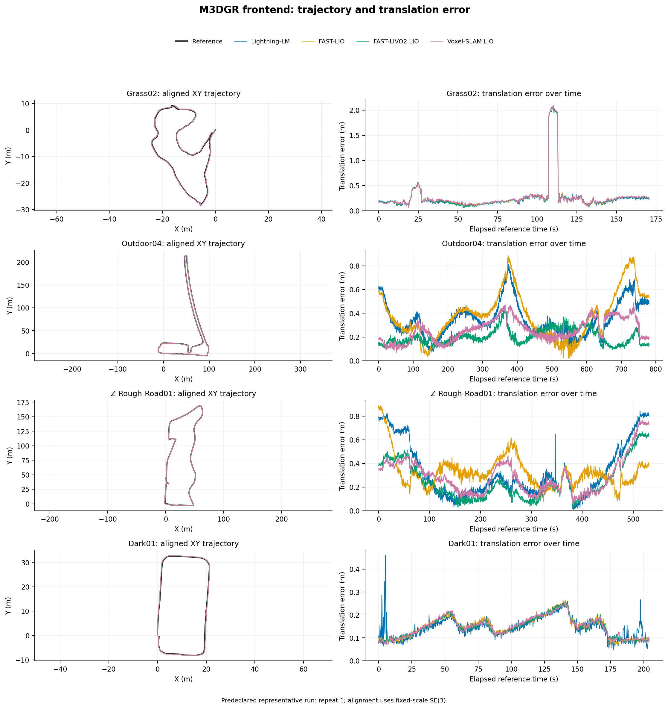
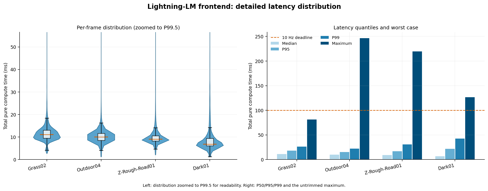
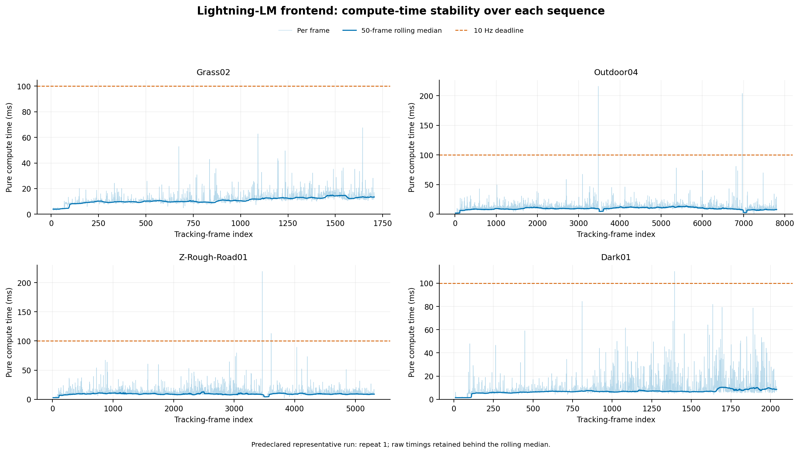

# SLAM建图定位算法报告

## 1.概述

### 1.1.项目目录

```
.
├── bin                            // 可执行文件
├── build                          // 编译产物
├── cmake                          // 构建模块
├── CMakeLists.txt                 // 构建配置
├── config                         // 参数配置
├── data                           // 数据文件
├── doc                            // 项目文档
├── docker                         // 容器配置
├── install                        // 安装产物
├── log                            // 运行日志
├── package.xml                    // ROS包信息
├── pcd                            // 点云数据
├── README_CN.md                   // 中文说明
├── README.md                      // 英文说明
├── runs                           // 运行结果
├── scripts                        // 工具脚本
├── src                            // 源代码
├── srv                            // 服务定义
└── thirdparty                     // 第三方依赖
```

### 1.3.环境

| 项目 | 冻结值 |
|---|---|
| 主机 CPU | Intel Core i7-14700KF，20 核/28 线程 |
| 内存 | 34,181,967,872 byte（约 31.8 GiB） |
| GPU | NVIDIA GeForce RTX 4070 SUPER，驱动 591.86；实验未使用 GPU |
| ROS 2 环境 | Ubuntu 22.04，ROS 2 Humble，WSL2 |
| ROS 1 基线环境 | Ubuntu 20.04，ROS Noetic，WSL2 |
| 分支 | `feature/gj_change_2025.11.19` |

### 1.2.指标与统计

- 轨迹按时间关联，最大插值间隔为 `0.2 s`；对齐使用固定尺度 SE(3)，不允许尺度补偿。
- **ATE** 报告平移 RMSE、中位数、P95、最大值；表中的主值为三次运行均值，`±` 后为样本标准差，括号内为三次运行中的最差 **RMSE**。
- **RPE** 按 `1 m` 与 `10 m` 路径间隔计算平移和旋转 RMSE。M3DGR 官方 RTK 文件中的四元数全部为单位四元数占位值，因此 M3DGR 的旋转 ATE/RPE 标为 `N/A`，平移 RPE 改在对齐后的全局位移上计算。它们不能记成 0。
- **平均 CPU** 以占用核心数计，内存为进程组峰值 RSS。GPU 未被算法使用，只记录了主机型号，不报告 GPU 利用率。
- 只有定位程序提供真实的单帧内部处理遥测，因此定位表报告处理时间均值/P95。其他链路只报告 wall time、每输出帧 wall time和完整运行时间因子。		

## 2.建图

### 2.1.前端LIO里程计

#### 2.1.1.M3DGR开源数据集

M3DGR 是面向地面机器人的多传感器挑战数据集，官方平台包含 Livox Avia、Livox MID-360、相机、轮速、GNSS/RTK 等传感器。本报告只向各算法提供 MID-360 点云及其内置 IMU，RTK 仅在运行后用于评测，不参与估计。数据集信息可在 [M3DGR 官方仓库](https://github.com/sjtuyinjie/M3DGR)和[数据集论文](https://arxiv.org/abs/2507.08364)核查。从中评测了Grass02、Outdoor04、Z-Rough-Road01、Dark01四个数据集。

| 序列           | 本地传感器时长 | LiDAR 帧数 | 主要场景                     | 参考          |
| -------------- | -------------: | ---------: | ---------------------------- | ------------- |
| Grass02        |       172.90 s |       1729 | 草地/非结构化路面            | 官方 RTK 位置 |
| Outdoor04      |       782.80 s |       7828 | 长距离室外路线               | 官方 RTK 位置 |
| Z-Rough-Road01 |       533.70 s |       5337 | 颠簸路面、强姿态激励         | 官方 RTK 位置 |
| Dark01         |       206.20 s |       2062 | 暗光路线；LIO 本身不使用图像 | 官方 RTK 位置 |

##### 2.1.1.1.精度

对比方法为 Lightning-LM(**Ours**)的LIO模式、FAST-LIO、FAST-LIVO2 的 LIO-only 模式以及 Voxel-SLAM 的 LIO 前端。下表的 **ATE** 分布列依次为 `RMSE / 中位数 / P95 / 最大值`；**RPE** 为 `1 m / 10 m` 平移 RMSE。


| 序列           | 方法           | ATE RMSE / 中位数 / P95 / 最大值（m） | ATE RMSE 均值±标准差（最差）（m） | RPE 1 m / 10 m（m） |
| -------------- | -------------- | ------------------------------------- | --------------------------------- | ------------------- |
| Grass02        | Lightning-LM   | 0.419 / 0.193 / 0.465 / 2.091         | 0.419±0.000 (0.419)               | 0.260 / 0.726       |
|                | FAST-LIO       | 0.424 / 0.199 / 0.467 / 2.071         | 0.424±0.000 (0.424)               | 0.261 / 0.730       |
|                | FAST-LIVO2 LIO | 0.423 / 0.196 / 0.470 / 2.075         | 0.423±0.000 (0.423)               | 0.261 / 0.731       |
|                | Voxel-SLAM LIO | 0.428 / 0.205 / 0.458 / 2.077         | 0.428±0.000 (0.428)               | 0.262 / 0.732       |
| Outdoor04      | Lightning-LM   | 0.380 / 0.325 / 0.631 / 0.812         | 0.380±0.000 (0.380)               | 0.050 / 0.122       |
|                | FAST-LIO       | 0.436 / 0.381 / 0.795 / 0.912         | 0.436±0.018 (0.457)               | 0.048 / 0.121       |
|                | FAST-LIVO2 LIO | 0.212 / 0.188 / 0.315 / 0.463         | 0.212±0.000 (0.212)               | 0.044 / 0.099       |
|                | Voxel-SLAM LIO | 0.276 / 0.250 / 0.418 / 0.489         | 0.276±0.001 (0.276)               | 0.045 / 0.106       |
| Z-Rough-Road01 | Lightning-LM   | 0.400 / 0.247 / 0.788 / 0.844         | 0.400±0.000 (0.400)               | 0.061 / 0.127       |
|                | FAST-LIO       | 0.344 / 0.298 / 0.565 / 0.805         | 0.344±0.020 (0.356)               | 0.053 / 0.138       |
|                | FAST-LIVO2 LIO | 0.301 / 0.207 / 0.584 / 0.680         | 0.301±0.014 (0.317)               | 0.048 / 0.107       |
|                | Voxel-SLAM LIO | 0.333 / 0.268 / 0.642 / 0.766         | 0.333±0.000 (0.333)               | 0.049 / 0.113       |
| Dark01         | Lightning-LM   | 0.152 / 0.144 / 0.218 / 0.460         | 0.152±0.000 (0.152)               | 0.058 / 0.126       |
|                | FAST-LIO       | 0.154 / 0.151 / 0.227 / 0.262         | 0.154±0.000 (0.154)               | 0.030 / 0.123       |
|                | FAST-LIVO2 LIO | 0.153 / 0.146 / 0.226 / 0.257         | 0.153±0.000 (0.153)               | 0.029 / 0.123       |
|                | Voxel-SLAM LIO | 0.154 / 0.151 / 0.219 / 0.254         | 0.154±0.000 (0.154)               | 0.032 / 0.124       |

如下图是运行的轨迹和逐时误差曲线用于检查总体 ATE 是否掩盖局部漂移、异常峰值或末段发散。



精度结果不存在跨场景唯一最优方法。Lightning-LM 在 Grass02 和 Dark01 的 ATE 最低；FAST-LIVO2 LIO 在 Outdoor04 和 Z-Rough-Road01 最低，并在另外两条序列上接近最佳值。FAST-LIVO2 LIO 修复后的 1 m/10 m RPE 与总体 ATE 排名一致。

##### 2.1.1.2. 资源诊断

资源诊断分为两层：完整离线运行用于统计平均 CPU、进程组峰值 RSS 和输出连续性；前端内部逐帧计时用于评价算法本身的计算效率，并进一步给出尾延迟、100 ms 截止期超限率和等效吞吐率。

###### 2.1.1.2.1.CPU、内存与分序列计算耗时

下表把每条序列的资源占用与相同运行条件下的纯计算耗时放在一起。纯计算均值的 `±` 后为三次运行均值的样本标准差，P95 为三次运行各自 P95 的均值；CPU 以平均占用核心数计，RSS 为进程组峰值。

| 序列           | 方法           | 平均 CPU（核） | 峰值 RSS（MB） | 纯计算均值±运行间标准差（ms） | 纯计算 P95（ms） |
| -------------- | -------------- | -------------: | -------------: | ----------------------------: | ---------------: |
| Grass02        | Lightning-LM   |           0.40 |            995 |                  11.742±0.284 |           18.219 |
|                | FAST-LIO       |           0.36 |            289 |                   4.477±0.104 |            5.513 |
|                | FAST-LIVO2 LIO |           1.36 |           2891 |                  41.532±0.506 |           56.635 |
|                | Voxel-SLAM LIO |           0.36 |           1814 |                  19.132±0.173 |           25.345 |
| Outdoor04      | Lightning-LM   |           0.33 |           3534 |                  10.387±0.032 |           15.159 |
|                | FAST-LIO       |           0.34 |            358 |                   3.352±0.053 |            4.515 |
|                | FAST-LIVO2 LIO |           1.16 |           7242 |                  34.796±0.844 |           50.002 |
|                | Voxel-SLAM LIO |           0.31 |           3872 |                  15.028±0.118 |           21.294 |
| Z-Rough-Road01 | Lightning-LM   |           0.28 |           2627 |                  10.200±0.287 |           16.870 |
|                | FAST-LIO       |           0.32 |            356 |                   3.395±0.029 |            4.363 |
|                | FAST-LIVO2 LIO |           1.11 |           7592 |                  36.277±1.963 |           57.731 |
|                | Voxel-SLAM LIO |           0.27 |           3527 |                  14.356±0.112 |           18.300 |
| Dark01         | Lightning-LM   |           0.15 |            431 |                   9.102±0.319 |           22.023 |
|                | FAST-LIO       |           0.27 |            249 |                   1.737±0.012 |            2.287 |
|                | FAST-LIVO2 LIO |           0.69 |            816 |                  26.699±3.742 |           60.681 |
|                | Voxel-SLAM LIO |           0.17 |            723 |                   6.749±0.153 |            8.762 |

下图将精度作为资源取舍的背景，并列展示平均 CPU 与峰值 RSS；逐帧计算时延仍以上表和 4.2.2 节为准。


资源结果给出清晰的轻量化排序。FAST-LIO 在四条序列上的纯计算耗时和峰值 RSS 均最低；FAST-LIVO2 LIO 的平均 CPU、峰值 RSS 和纯计算耗时均最高，但它在 Outdoor04 和 Z-Rough-Road01 取得了最低 ATE，体现的是以资源换取挑战场景精度。Lightning-LM 的纯计算耗时在四条序列上均排名第二，平均 CPU 与 Voxel-SLAM LIO 接近，峰值 RSS 则在四条序列上都低于 Voxel-SLAM LIO 和 FAST-LIVO2 LIO、高于 FAST-LIO。

输出连续性作为运行健康度一并纳入诊断。Lightning-LM 的输出缺口比例为 `0.27%–1.21%`，FAST-LIO 与修复后的 FAST-LIVO2 LIO 均为 `0.04%–0.17%`，Voxel-SLAM LIO 为 `0.18%–0.79%`。FAST-LIVO2 LIO 的 12 次修复运行均未出现超过 `0.2 s` 的轨迹间隔或非单调观测；Voxel-SLAM LIO 仅在 Outdoor04 第 2 次运行出现 2 个略超阈值的间隔，最大值为 `0.202 s`。

###### 2.1.1.2.2.总体纯计算效率

为隔离 1× 播放等待，本轮重新编译四个前端并在**算法内部记录逐帧单调时钟**。统一计时边界为点云回调中的实际 LiDAR 预处理，加上同步数据包进入 LIO 后直至状态与局部地图更新完成的核心计算；不计 rosbag 等待、ROS 消息发布、轨迹序列化、调试/地图文件写入和最终后端优化。四序列、四方法各运行 3 次，固定 CPU `0-7`、Release 构建和 1× 输入节奏。原始 202,947 条记录中，剔除初始化和每次运行前 10 个跟踪帧后纳入 202,455 条。

| 方法           | 有效帧 | 均值 / 中位数（ms） | P95 / P99（ms） | 最大值（ms） |       >100 ms | 10 Hz 预算占用 | 等效计算吞吐率 |
| -------------- | -----: | ------------------: | --------------: | -----------: | ------------: | -------------: | -------------: |
| Lightning-LM   | 50,481 |      10.310 / 9.525 | 16.473 / 28.675 |      246.437 |  14（0.028%） |         10.31% |      97.0 帧/s |
| FAST-LIO       | 50,712 |       3.284 / 3.423 |   4.754 / 5.551 |       37.776 |       0（0%） |          3.28% |     304.5 帧/s |
| FAST-LIVO2 LIO | 50,671 |     34.962 / 34.208 | 54.614 / 80.429 |      787.863 | 171（0.337%） |         34.96% |      28.6 帧/s |
| Voxel-SLAM LIO | 50,591 |     14.231 / 14.854 | 21.670 / 24.571 |       34.223 |       0（0%） |         14.23% |      70.3 帧/s |

下图比较四种前端的均值、尾延迟、预算占用和等效吞吐率；它回答算法纯计算效率，不替代 CPU、内存和输出连续性诊断。


纯计算效率从高到低依次为 FAST-LIO、Lightning-LM、Voxel-SLAM LIO、FAST-LIVO2 LIO。Lightning-LM 的平均耗时比 Voxel-SLAM LIO 低 `27.6%`、比 FAST-LIVO2 LIO 低 `70.5%`，但约为 FAST-LIO 的 `3.14` 倍。四种方法的 P99 均低于 100 ms；Lightning-LM 和 FAST-LIVO2 LIO 的未截尾最大值超过 100 ms，平均处理能力充足并不等于严格最坏情况有界。等效吞吐率只表示当前主机和计时边界内的前端计算能力，不包含 ROS 发布、文件输出和后端处理。

###### 2.1.1.2.3.Lightning-LM 耗时拆解

Lightning-LM 的 12 次运行全部通过完整运行契约。按序列池化三次重复后，Grass02 的平均耗时最高；Dark01 均值最低，但 P99 长尾最明显。超 100 ms 的 14 帧分散在 Outdoor04、Z-Rough-Road01 和 Dark01，代表运行的滚动中位数没有同步越过截止线，属于孤立尖峰而非持续积压。

| 序列           | 有效帧 | 均值 / 中位数（ms） | P95 / P99（ms） | 最大值（ms） | >100 ms |
| -------------- | -----: | ------------------: | --------------: | -----------: | ------: |
| Grass02        |  5,091 |     11.742 / 11.102 | 17.950 / 26.142 |       81.398 |       0 |
| Outdoor04      | 23,388 |     10.387 / 10.033 | 15.068 / 22.109 |      246.437 |       6 |
| Z-Rough-Road01 | 15,912 |      10.200 / 9.052 | 16.962 / 30.628 |      219.438 |       4 |
| Dark01         |  6,090 |       9.102 / 6.810 | 21.764 / 42.475 |      126.406 |       4 |
| 总体           | 50,481 |      10.310 / 9.525 | 16.473 / 28.675 |      246.437 |      14 |

六阶段平均耗时构成用于定位 Lightning-LM 的主要计算瓶颈，阶段总和与逐帧总耗时采用相同计时边界。


| Lightning-LM 阶段 | 平均值（ms） | P95（ms） | 平均总耗时占比 |
| ----------------- | -----------: | --------: | -------------: |
| LiDAR 预处理      |        0.192 |     0.283 |          1.86% |
| IMU 传播与去畸变  |        0.380 |     0.439 |          3.69% |
| 降采样            |        0.101 |     0.143 |          0.98% |
| 匹配准备          |        0.003 |     0.007 |          0.03% |
| 迭代扫描匹配      |        9.198 |    15.263 |         89.21% |
| 地图更新          |        0.436 |     0.598 |          4.22% |

Lightning-LM 的耗时瓶颈集中在迭代扫描匹配：该阶段占平均总耗时的 `89.21%`，应作为后续性能优化的首要位置；LiDAR 预处理仅占 `1.86%`，单独优化这一阶段难以显著改变总耗时。分布图将主体缩放到 P99.5，同时在右侧保留未截尾最大值，用于区分常态延迟与少量极端尖峰。



代表运行时序固定使用预先约定的 repeat 1：细线为原始逐帧耗时，粗线为 50 帧滚动中位数。滚动中位数未持续越过 100 ms 截止线，说明当前风险主要是偶发长尾，而非连续计算积压；若面向严格实时部署，应进一步定位这些极端帧的输入规模和调度条件。



#### 2.1.2.SANY单雷达+多雷达


TODO. lightning-lm 运行什么脚本，得到哪些结果

TODO.运行 voxel slam完整版，并得到轨迹作为真值（简单阐述原因）

TODO.参考 F:\SLAM_AI_KnowledgeBase\code\WSL_Ubuntu_22.04\lightning-lm\doc\sany\single_lidar\SANY_MID360_data_20260701_VoxelSLAM测试报告 的报告，简单阐述一下掉帧情况，以及结果的展示

TODO. lightning-lm 运行什么脚本，得到哪些结果

TODO. 还是以voxel slam完整版的轨迹作为真值，对比单雷达和多雷达的精度+耗时

TODO. 绘制图表（主要体现精度+耗时+内存）


### 2.2.后端优化


TODO.老的后端优化和新的后端优化区别，简单阐述做了哪些改进。

#### M3DGR开源数据集

TODO.lightning-lm 运行什么脚本，得到哪些结果，

TODO.只需要评测 voxel slam 即可，其他没有完整的后端优化。

TODO.对于三项，老的后端优化+新的后端优化+voxel slam

TODO. 绘制图表（主要体现精度+耗时+内存）


#### SANY单雷达+多雷达

TODO. lightning-lm 运行什么脚本，得到哪些结果，绘制图表（主要体现精度+耗时）

TODO. 还是以voxel slam完整版的轨迹作为真值，对比单雷达和多雷达的精度+耗时

TODO. 绘制图表（主要体现精度+耗时+内存）

TODO.多雷达的一些其他有意义的实验结果也可以放入这里，例如鲁棒性测试、消融之类的，参考WSL_Ubuntu_22.04\lightning-lm\doc\sany\multi_lidar


## 定位

TODO.简单阐述定位流程

### SANY多雷达+重定位

TODO.简单删除重定位流程，如何评价精度（以voxel slam+建图轨迹为参考）

TODO. lightning-lm 运行什么脚本，得到哪些结果

TODO. 对比建图和定位

TODO. 绘制图表（主要体现精度+耗时+内存），精度以Voxel SLAM 114 单雷达轨迹为真值吧


### M3DGR开源数据集

TODO.以单雷达建图（加上后端优化）后进行定位，rtk为真值，看单雷达基于地图定位的误差是否更大，同时也可以用voxel slam的地图进行定位看下误差，应该会得出如下结论：地图越好，定位精度越高。

TODO. lightning-lm 运行什么脚本，得到哪些结果

TODO. 绘制图表（主要体现精度+耗时+内存）

## 4.风险与待开发

TODO.目前存在的风险项和可能需要但是未开发的地方


要求：

* yaml文件可以不同，但是所有的脚本运行最好统一用模板（WSL_Ubuntu_22.04\lightning-lm\scripts），你可以修改模板来适配你的需求，但是不要单独一个数据跑一个脚本，这样子对复现很不友好。
* 本次的实验所有产出数据放在WSL_Ubuntu_22.04\lightning-lm 的相关目录下，因为我要一一对比实验数据。


* 不管是建图还是定位的轨迹都存在不平滑，在轨迹的Z值上存在毛刺
* 重定位模块改良。目前的重定位需要建图时构建的数据库必须经过初始位置附近，否则无法进行地点识别。


## 5.实验复现脚本

### 5.1.建图

#### 5.1.1.前端 LIO 里程计

本节给出 M3DGR 前端 LIO 实验的统一复现方法。Lightning-LM 的轨迹精度、CPU 和内存数据由正式前端矩阵产生；纯算法逐帧耗时由独立计时矩阵产生。两套实验均使用同一个离线前端入口和同一份算法配置，但保存在不同目录中，避免计时实验与精度/资源实验相互覆盖。

##### 5.1.1.1.输入、环境与固定条件

复现命令从 Windows PowerShell 执行，工作目录为项目根目录：

```powershell
Set-Location F:\SLAM_AI_KnowledgeBase\code\WSL_Ubuntu_22.04\lightning-lm
```

| 项目 | 固定值 |
|---|---|
| 运行环境 | WSL Ubuntu-22.04、ROS 2 Humble |
| 正式序列 | `Grass02`、`Outdoor04`、`Z-Rough-Road01`、`Dark01` |
| ROS 2 数据 | `F:\SLAM_AI_KnowledgeBase\code\_m3dgr_work\ros2_bags\<序列>` |
| 数据库存 | `F:\SLAM_AI_KnowledgeBase\code\_m3dgr_work\bench\inventory\bag_inventory.json` |
| RTK 真值 | `F:\datasets\M3DGR\GT` 下各序列对应文件 |
| Lightning-LM 配置 | `config/reproduction/single_lidar/m3dgr/lightning_m3dgr_mid360_benchmark.yaml` |
| 运行入口 | `scripts/reproduction/formal_report/run_m3dgr_frontend_matrix.py` |
| 单次离线入口 | `scripts/run_frontend_offline.sh` |
| 重复与调度 | 每个序列 3 次，固定种子 `20260717`，1× 播放 |
| 资源约束 | CPU `0-7`，分配 8 个逻辑核，矩阵内串行运行 |

如果源码发生过修改，应先编译 Release 版本。离线入口实际从项目的 `install/` 空间解析可执行文件：

```powershell
wsl -d Ubuntu-22.04 -- bash -lc "cd /mnt/f/SLAM_AI_KnowledgeBase/code/WSL_Ubuntu_22.04/lightning-lm && source /opt/ros/humble/setup.bash && colcon build --packages-select lightning --cmake-args -DCMAKE_BUILD_TYPE=Release"
```

正式运行前可使用 `--dry-run` 检查控制器展开的 12 条 Lightning-LM 命令。该操作不创建实验结果：

```powershell
python scripts/reproduction/formal_report/run_m3dgr_frontend_matrix.py `
  --output-root runs/reproduction_m3dgr_lightning_frontend_20260721/dry_run `
  --methods lightning_lm `
  --dry-run
```

##### 5.1.1.2.Lightning-LM 精度、CPU 与内存实验

以下命令仅运行 Lightning-LM，共执行 4 个序列 × 3 次重复，即 12 次离线前端实验。输出目录必须是新目录；同一目录中的实验清单与本次参数不一致时，控制器会拒绝继续运行。

```powershell
$Sequences = 'Grass02,Outdoor04,Z-Rough-Road01,Dark01'
$Batch = 'runs/reproduction_m3dgr_lightning_frontend_20260721'
$FrontendRuns = "$Batch\m3dgr_frontend"
$FrontendAnalysis = "$Batch\analysis\m3dgr_frontend"

python scripts/reproduction/formal_report/run_m3dgr_frontend_matrix.py `
  --output-root $FrontendRuns `
  --sequences $Sequences `
  --methods lightning_lm `
  --repeats 3 `
  --play-rate 1.0 `
  --cpu-set 0-7 `
  --cpu-count 8
```

控制器按冻结种子生成调度顺序，为每次运行记录输入、配置、运行脚本和实验指纹，并调用 `scripts/run_frontend_offline.sh`。单次运行的目录结构如下：

```text
<FrontendRuns>/<序列>/lightning_lm/repeat_XX/
├── trajectory_mid360.tum
├── bag_contract.json
├── run_metadata.txt
├── resource_samples.csv
├── resource_summary.json
├── watchdog_status.json
├── logs/
│   ├── algorithm.stdout.log
│   ├── algorithm.stderr.log
│   └── resource_monitor.log
└── results/
    ├── trajectory_imu.tum
    ├── trajectory_rear_axle.tum
    ├── map_lio.pcd
    ├── frame_stats.csv
    ├── processing_timing.csv
    └── processing_timing_summary.json
```

12 次运行完成后，使用统一评测器计算固定尺度 SE(3) 对齐后的 ATE、RPE，并汇总平均 CPU、峰值 RSS 和输出连续性：

```powershell
python scripts/reproduction/formal_report/evaluate_m3dgr_frontend_matrix.py `
  --runs-root $FrontendRuns `
  --output-dir $FrontendAnalysis `
  --sequences $Sequences `
  --methods lightning_lm `
  --repeats 3 `
  --max-interpolation-gap 0.2
```

评测目录中的主要产物为：

| 文件 | 内容 |
|---|---|
| `run_metrics.csv` | 每条序列、每次重复的精度和资源指标 |
| `summary_metrics.csv` | 每条序列三次重复的均值、样本标准差和最差值 |
| `aligned_samples.csv` | 与 RTK 对齐后的代表轨迹样本和逐时平移误差 |
| `metrics.json` | 分序列、分运行的机器可读完整指标 |
| `analysis_manifest.json` | 评测器、运行清单、数据库存和真值文件的路径与哈希 |
| `validation.json` | 运行完整性、评测状态、失败项和警告项 |

可用下列命令检查评测是否通过，并读取报告所需字段：

```powershell
Get-Content "$FrontendAnalysis\validation.json"

Import-Csv "$FrontendAnalysis\summary_metrics.csv" |
  Where-Object method -eq 'lightning_lm' |
  Select-Object sequence, ate_rmse_m_mean, ate_median_m_mean,
    ate_p95_m_mean, rpe_1m_translation_rmse_m_mean,
    rpe_10m_translation_rmse_m_mean, mean_cpu_cores_mean,
    peak_rss_mb_mean |
  Format-Table -AutoSize
```

##### 5.1.1.3.Lightning-LM 纯算法逐帧计时

正式报告使用独立矩阵测量前端纯计算耗时，因此复现时另建运行目录。计时边界为“LiDAR 消息预处理 + 同步数据进入 LIO 后的状态估计与局部地图更新”，不包含数据播放等待、ROS 输出、轨迹/地图文件写入和后端优化。

```powershell
$ComputeRuns = "$Batch\m3dgr_frontend_compute"
$ComputeAnalysis = "$Batch\analysis\m3dgr_frontend_compute"

python scripts/reproduction/formal_report/run_m3dgr_frontend_matrix.py `
  --output-root $ComputeRuns `
  --sequences $Sequences `
  --methods lightning_lm `
  --repeats 3 `
  --play-rate 1.0 `
  --cpu-set 0-7 `
  --cpu-count 8

python scripts/reproduction/formal_report/evaluate_m3dgr_frontend_compute.py `
  --runs-root $ComputeRuns `
  --output-dir $ComputeAnalysis `
  --sequences $Sequences `
  --methods lightning_lm `
  --repeats 3 `
  --warmup-frames 10 `
  --deadline-ms 100
```

计时评测默认剔除每次运行最前面的 10 个有效跟踪帧，并输出均值、中位数、P95、P99、最大值、100 ms 截止期超限率、预算占用率和等效计算吞吐率。主要产物如下：

| 文件 | 内容 |
|---|---|
| `frame_timing.csv` | 纳入和剔除标记齐全的逐帧原始耗时及 Lightning-LM 分阶段耗时 |
| `run_timing_summary.csv` | 每次运行的逐帧耗时统计 |
| `sequence_method_summary.csv` | 每条序列三次重复的耗时汇总 |
| `overall_method_summary.csv` | 四条序列池化后的总体耗时与吞吐率 |
| `lightning_stage_summary.csv` | 预处理、IMU 去畸变、降采样、匹配准备、扫描匹配和地图更新耗时 |
| `metrics.json` | 计时指标的机器可读版本 |
| `analysis_manifest.json` | 埋点源码、二进制、运行清单、计时边界和参数哈希 |
| `validation.json` | 计时字段、恒等式、单调性、覆盖率及运行合同检查结果 |

```powershell
Get-Content "$ComputeAnalysis\validation.json"

Import-Csv "$ComputeAnalysis\overall_method_summary.csv" |
  Where-Object method -eq 'lightning_lm' |
  Format-List
```

##### 5.1.1.4.验收判据与严格复现说明

单次 Lightning-LM 运行只有同时满足以下条件才被控制器视为完成：算法返回码为 0、watchdog 正常完成、轨迹到达最后一帧 LiDAR、轨迹没有非法值和非单调时间戳。精度/资源评测还要求相邻轨迹间隔不超过 `0.2 s`；纯计时评测要求计时字段为有限非负值、测量时间戳严格递增、分阶段耗时恒等式误差不超过 `0.05 ms`，且计时帧覆盖率满足预设下限。最终以两份 `validation.json` 中 `failures` 为空作为完成判据；`passed_with_warnings` 表示带已披露警告通过，不等同于失败。

需要特别区分“仅复现 Lightning-LM”与“严格复现本报告比较数值”：

- 上述 `--methods lightning_lm` 命令可以复现 Lightning-LM 的独立轨迹、资源和计时数据。
- 本报告的前端 ATE 使用同一序列中四种方法、三次重复均可插值的公共真值时间域。仅运行 Lightning-LM 时，公共支持域只由它的三次运行决定，因此 ATE 可能与报告表格略有差异。
- 如需严格复现报告中的公共支持域、方法间排序和四方法纯计算对比图，应省略 `--methods lightning_lm`，运行默认的四方法完整矩阵；正式规模为精度/资源 48 次和纯计时 48 次。

完整精度/资源矩阵的命令为：

```powershell
$FullRuns = "$Batch\m3dgr_frontend_full"
$FullAnalysis = "$Batch\analysis\m3dgr_frontend_full"

python scripts/reproduction/formal_report/run_m3dgr_frontend_matrix.py `
  --output-root $FullRuns

python scripts/reproduction/formal_report/evaluate_m3dgr_frontend_matrix.py `
  --runs-root $FullRuns `
  --output-dir $FullAnalysis
```

如需重建四方法纯计算总览及 Lightning-LM 的分阶段、分布和时序图，应另行执行完整计时矩阵，再调用专用作图脚本：

```powershell
$FullComputeRuns = "$Batch\m3dgr_frontend_compute_full"
$FullComputeAnalysis = "$Batch\analysis\m3dgr_frontend_compute_full"
$FigureOutput = "$Batch\figures"

python scripts/reproduction/formal_report/run_m3dgr_frontend_matrix.py `
  --output-root $FullComputeRuns `
  --play-rate 1.0

python scripts/reproduction/formal_report/evaluate_m3dgr_frontend_compute.py `
  --runs-root $FullComputeRuns `
  --output-dir $FullComputeAnalysis

python scripts/reproduction/formal_report/build_frontend_compute_figures.py `
  --analysis-dir $FullComputeAnalysis `
  --output-dir $FigureOutput
```

只运行 Lightning-LM 时不应直接调用四方法总览作图脚本，因为该脚本按设计要求四种方法的分析行均存在。CPU、内存和逐帧耗时会受到操作系统调度与后台负载影响，不应要求逐位一致；轨迹精度应按相同输入、配置、公共支持域和评测脚本核对，资源与耗时则应比较三次重复的统计量及其波动范围。

