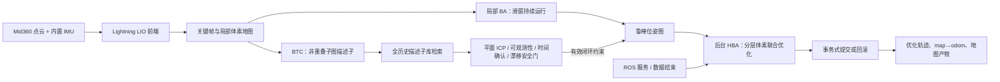
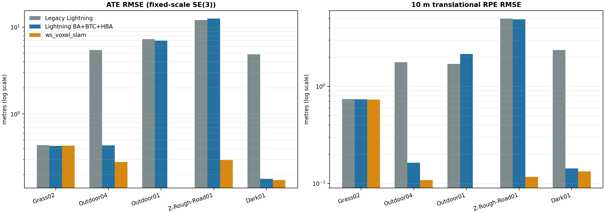
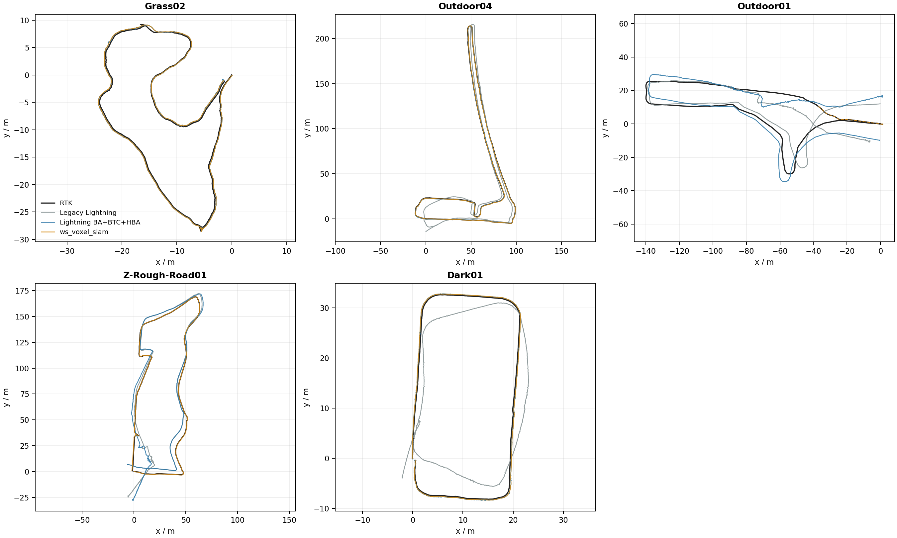
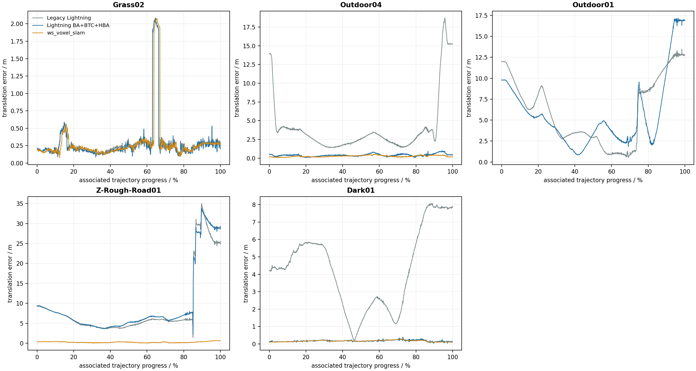
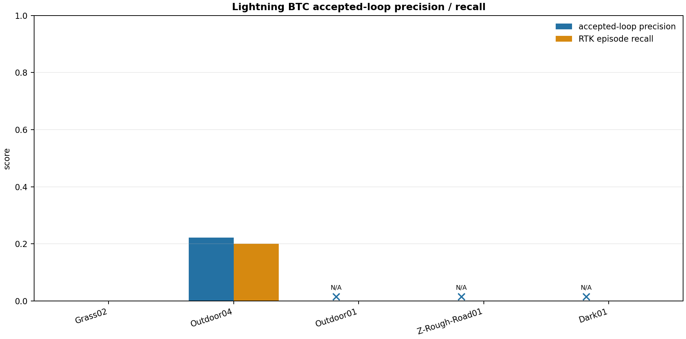
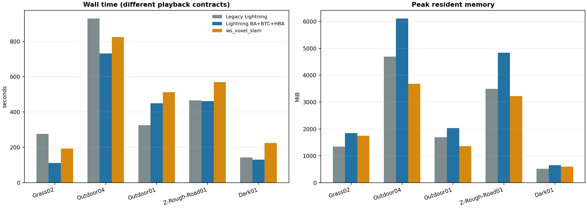
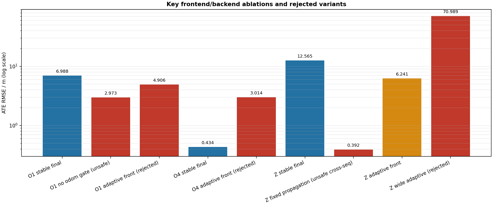

# Lightning-LM 局部 BA + BTC 回环 + HBA 全局优化算法与五序列实验报告

> 报告日期：2026-07-15
> 目标分支：`feature/backend-ba-btc-hba-v2`
> 基线分支：`feature/gj_change_2025.11.19`（基点 `3ec0875`）
> 传感器输入：仅 Livox Mid360 点云与其内置 IMU
> 主判据：RTK 固定尺度 SE(3) 对齐后的轨迹精度
> 次判据：闭环 Precision/Recall、运行耗时、峰值内存
> 不在本报告范围：点云地图分层或地图视觉质量对比

## 1. 管理摘要

### 1.1 结论

本轮开发已经把 Lightning-LM 原先“按里程计距离触发”的回环逻辑替换为可独立工作的描述子全局检索后端，并完成以下工程闭环：

- 局部平面体素 BA 在关键帧滑窗内持续运行；
- BTC 对非重叠局部子图构建描述子，并检索完整历史描述子库，检索阶段不再依赖里程计距离；
- 几何精配准、可观测性、时间确认和漂移比例共同决定候选是否可进入图优化；
- 有效闭环触发后台 HBA；ROS 服务和数据结束也可强制执行；
- HBA 采用事务式提交，没有有效图修正时允许计算但回滚点级更新，避免强制优化破坏稳定轨迹；
- 同一 YAML 可选择 `ba_btc_hba`、`legacy` 或 `disabled`，离线和在线 SLAM 共用同一后端管线；
- 已完成五条 M3DGR 序列的单次全长实验、严格 RTK 评测、资源监控和完整报告资产生成。

精度上，相比旧 Lightning 后端，五序列算术平均 ATE 从 **6.0265 m 降到 4.1193 m，改善 31.65%**；平均 10 m RPE 从 **2.3125 m 降到 1.6215 m，改善 29.88%**。但是，这个平均改善主要来自 Outdoor04 和 Dark01，不能掩盖 Outdoor01 与 Z-Rough-Road01 的问题。

与完整 ws_voxel_slam 比较：

- Grass02：Lightning 新版 ATE 0.4297 m，略优于 ws_voxel_slam 的 0.4313 m；
- Dark01：0.1794 m 与 0.1738 m 基本持平；
- Outdoor04：0.4341 m，仍比 ws_voxel_slam 的 0.2806 m 高 54.7%；
- Z-Rough-Road01：12.5653 m，而 ws_voxel_slam 为 0.2948 m，差距显著；
- Outdoor01：ws_voxel_slam 多次 Reset 后只保存最后 67.6 s，RTK 覆盖 16.2%，不具备全长可比性，结果记为 N/A。

因此，当前版本已经完成“真正的描述子全局回环 + 局部 BA + HBA 后端”的架构目标，也明显修复了旧后端在 Outdoor04、Dark01 的破坏性优化，但**尚未达到“不低于 ws_voxel_slam 全序列精度”的期望**。建议作为带 YAML 回退开关的研发版本合入，不建议宣称后端已经达到量产闭环召回水平。

### 1.2 关键风险与下一阶段优先级

1. **BTC 严格 RTK 指标仍低。** Outdoor04 的 Precision/Recall 为 0.222/0.200；Grass02 接受的 3 个候选均为 RTK 假阳性，但因优化必要性门槛未施加；其余三序列没有接受闭环。
2. **粗糙路面前端是最大精度瓶颈。** Z-Rough-Road01 中 ws_voxel_slam 没有接受回环仍达到 0.2948 m，说明其优势来自 LIO/局部 BA，而非闭环边；Lightning 的 HBA 无法修复没有正确局部约束和回环输入的轨迹。
3. **Outdoor01 仍缺少可信闭环。** 放开安全门槛可把 ATE 降到 2.9725 m，但接受了 2 个 RTK 假阳性，属于用错误约束偶然改善 ATE，不能作为最终参数。
4. **HBA 峰值内存偏高。** Outdoor04 为 6110.5 MiB，明显高于 ws_voxel_slam 的 3680.3 MiB，需要进一步做点云生命周期和层级缓存压缩。
5. **只有单次实验。** 当前结果用于算法方向决策足够，但不能代替多次重复、不同机器和在线实车稳定性测试。

## 2. 算法架构与改动



### 2.1 局部 BA

局部 BA 对滑动关键帧窗口中的位姿执行联合优化。点到局部平面残差写为：

\[
r_{ij}=\mathbf n_j^\mathsf T(\mathbf R_i\mathbf p_{ij}+\mathbf t_i)+d_j,
\]

其中 \(\mathbf p_{ij}\) 为第 \(i\) 帧落入体素平面 \(j\) 的点，\((\mathbf n_j,d_j)\) 为局部平面参数。实现使用平面体素统计、鲁棒核、首帧锚定、步长限制和接受/回滚条件，避免局部优化将短时错误传播到全局。

运行方式不是“数据结束后统一 BA”，而是在建图过程中对每个满足条件的滑窗持续运行。五序列最终运行中，局部 BA 接受次数分别为 1698、7767、4085、5305、2031。

### 2.2 BTC 描述子全局回环

BTC 以非重叠局部子图构建二进制三角组合描述子。核心变化是：

- 描述子查询面向完整历史库；
- `max_odom_revisit_distance: 0.0`，里程计距离不参与候选检索；
- 可选的里程计访问距离检查被移动到描述子匹配和几何精配准之后，只能作为后验安全门，不能再冒充回环检索；
- 候选还需通过描述子分数、平面 ICP、几何可观测性、退化场景更严格分数、时间连续确认、冷却窗口和漂移比例检查；
- `max_drift_ratio` 最终统一设为 0.005，用于拒绝与已行驶路径长度不相称的大修正；
- “检测到候选”和“值得施加图约束”分离，小于最小平移/旋转修正的回环保留诊断记录，但不改变图。

这使模块在定义上成为真正的描述子全局回环检测器；但五序列 RTK 结果说明其当前阈值和描述能力仍未达到高 Precision/Recall。

### 2.3 鲁棒位姿图与 HBA

BTC 有效约束进入鲁棒位姿图。HBA 由三类事件触发：

1. 有效闭环改变图后，后台异步触发；
2. `/lightning/optimize_backend` ROS 服务手动触发；
3. 地图保存、离线数据结束或关闭流程强制触发并等待完成。

HBA 自底向上聚合空间重叠的粗层子图，在顶层联合优化后把修正传播回关键帧。`require_applied_loop_for_commit: true` 实现事务语义：强制运行仍会完整计算，但如果位姿图没有应用过有效闭环，点级 HBA 结果不提交。Grass02 的 HBA 执行 4 次但提交 0 次；Outdoor04 执行 10 次并接受 4 次；其余序列数据结束各执行 1 次但不提交。

### 2.4 离线与在线统一接入

- 离线 `run_slam_offline` 输出原始/优化帧轨迹、关键帧轨迹、后端统计、BTC 候选 CSV 和地图产物；
- 在线 SLAM 使用优化后的 `map -> odom`，不回写高频里程计流；
- 在线和离线使用相同 `BackendPipeline`、HBA 后台线程和 ROS 服务；
- 当前工作只验证了在线入口可编译和后端接线，实时实车性能不作为本轮验收门槛。

### 2.5 YAML 模式与最终安全参数

```yaml
backend:
  mode: ba_btc_hba       # ba_btc_hba | legacy | disabled
  local_ba:
    enabled: true
  btc:
    enabled: true
    max_odom_revisit_distance: 0.0
    max_drift_ratio: 0.005
  hba:
    enabled: true
    require_applied_loop_for_commit: true

fasterlio:
  propagate_velocity: false
  adaptive_velocity_propagation: false
```

`legacy` 生成配置同时关闭实验性前端传播，便于复现旧方案；`disabled` 可用于纯前端消融。固定速度传播和创新自适应传播代码保留为显式实验选项，但最终统一默认关闭，原因见第 6 节。

## 3. 数据、真值与评测协议

### 3.1 数据范围

| 序列 | 类别 | 用途 | 闭环特性 |
|---|---|---|---|
| Grass02 | 轮滑/草地 | 首轮开发与闭环验证 | 有闭环 |
| Outdoor04 | 标准室外 | 长距离闭环与旧后端破坏性修正验证 | 有闭环 |
| Outdoor01 | 标准室外 | 完整数据纠错、泛化验证 | 有闭环 |
| Z-Rough-Road01 | 粗糙路面 | IMU/LIO 高动态与轮滑泛化 | 有闭环 |
| Dark01 | 视觉挑战室外 | 纯 LiDAR/IMU 暗光无关性与后端安全性 | 有闭环 |

SLAM 执行过程中只读取：

- `/livox/mid360/lidar`
- `/livox/mid360/imu`

RTK 不进入前端、局部 BA、BTC、位姿图或 HBA，只在运行结束后进入评测脚本。

### 3.2 Outdoor01 完整性纠错

旧 Outdoor01 归一化数据只有约 262.56 s，本报告不把它用于主结论。最终输入来自：

`F:\datasets\M3DGR\Dataset\Standard\Outdoor01\Outdoor01.bag`

转换契约记录：

| 项目 | 数值 |
|---|---:|
| 完整时长 | 411.566921 s |
| Mid360 点云消息 | 4116 |
| 内置 IMU 消息 | 82312 |
| ROS2 payload SHA-256 | `926fbfa3065cf7ebba1415ca411253d3f8a5ffa38c99a229eb424939ded934d9` |
| 转换契约 | `complete: true` |

旧 262.56 s 结果只作为“数据质量检查失败案例”，不进入任何平均值或主表。

### 3.3 轨迹协议

- 对齐：固定尺度 SE(3) Horn/SVD；禁止 Sim(3) 缩放；
- RTK 插值最大间隔：0.2 s；
- ATE：关联轨迹平移 RMSE；
- RPE：沿 RTK 路径每 10 m 的相对平移 RMSE；
- 闭环真值：描述子查询时间间隔至少 30 s，RTK 距离不超过 5 m；
- Precision：被接受 BTC 检测中满足 RTK 真值的比例；没有接受检测时 Precision 为 N/A，不人为写成 0；
- Recall：被检测到的 RTK 闭环事件片段占全部真值事件片段的比例；
- M3DGR 室外 RTK 四元数为单位占位值，因此不报告姿态误差；
- 所有序列单次运行，不报告方差或置信区间。

## 4. 主实验结果

### 4.1 ATE / RPE



| 序列 | 方法 | RTK 覆盖 | ATE RMSE (m) | ATE 中位数 (m) | RPE@10m RMSE (m) |
|---|---|---:|---:|---:|---:|
| Grass02 | 旧 Lightning | 98.69% | 0.4364 | 0.2243 | 0.7382 |
| Grass02 | **Lightning BA+BTC+HBA** | 98.69% | **0.4297** | **0.2101** | 0.7363 |
| Grass02 | ws_voxel_slam | 99.18% | 0.4313 | 0.2145 | **0.7305** |
| Outdoor04 | 旧 Lightning | 99.78% | 5.4570 | 2.8236 | 1.7755 |
| Outdoor04 | **Lightning BA+BTC+HBA** | 99.78% | 0.4341 | 0.3804 | 0.1639 |
| Outdoor04 | ws_voxel_slam | 99.82% | **0.2806** | **0.2516** | **0.1087** |
| Outdoor01 | 旧 Lightning | 99.41% | 7.3067 | 6.3272 | **1.7037** |
| Outdoor01 | **Lightning BA+BTC+HBA** | 99.41% | **6.9881** | **4.5148** | 2.1587 |
| Outdoor01 | ws_voxel_slam | **16.22%** | N/A | N/A | N/A |
| Z-Rough-Road01 | 旧 Lightning | 99.59% | **12.0604** | **5.7521** | 4.9838 |
| Z-Rough-Road01 | **Lightning BA+BTC+HBA** | 99.59% | 12.5653 | 6.4002 | **4.9057** |
| Z-Rough-Road01 | ws_voxel_slam | 99.78% | **0.2948** | **0.2297** | **0.1168** |
| Dark01 | 旧 Lightning | 98.94% | 4.8719 | 4.3757 | 2.3613 |
| Dark01 | **Lightning BA+BTC+HBA** | 98.94% | 0.1794 | **0.1707** | 0.1430 |
| Dark01 | ws_voxel_slam | 99.31% | **0.1738** | 0.1723 | **0.1333** |

Outdoor01 的 ws_voxel_slam 在完整 bag 中多次 Reset，最终只保存最后 67.60 s；虽然这个片段 ATE 为 0.0346 m，但只有 16.22% RTK 覆盖，故主表记为 N/A。

相对旧 Lightning：

| 序列 | ATE 变化 | RPE@10m 变化 | 判断 |
|---|---:|---:|---|
| Grass02 | -1.53% | -0.25% | 基本持平，小幅改善 |
| Outdoor04 | **-92.05%** | **-90.77%** | 旧后端破坏性闭环被消除 |
| Outdoor01 | -4.36% | +26.70% | 全局 ATE略改善，局部一致性退化 |
| Z-Rough-Road01 | +4.19% | -1.57% | ATE略退化，未解决前端漂移 |
| Dark01 | **-96.32%** | **-93.94%** | 旧后端破坏性优化被消除 |

### 4.2 XY 轨迹与误差过程





图中可见：

- Grass02 三种方法几乎重合，约 65% 进度处的共同误差尖峰来自相同前端/场景约束，而非后端独有问题；
- Outdoor04 旧后端在首尾出现十米级错误，新后端恢复到亚米级，但仍略逊于 ws_voxel_slam；
- Outdoor01 新旧 Lightning 在后半程均发生大漂移，新后端没有获得可信闭环来修正；
- Z-Rough-Road01 的 Lightning 误差在约 85% 进度后跃迁到 30 m 级，ws_voxel_slam 始终维持亚米级；
- Dark01 旧后端把本来稳定的前端轨迹拉坏，新后端与 ws_voxel_slam 基本重合。

### 4.3 闭环 Precision / Recall



| 序列 | 检索候选 | 接受检测 | RTK TP / FP | 应用到图 | Precision | Episode Recall |
|---|---:|---:|---:|---:|---:|---:|
| Grass02 | 114 | 3 | 0 / 3 | 0 | 0.000 | 0.000 |
| Outdoor04 | 639 | 9 | 2 / 7 | 1 | 0.222 | 0.200 |
| Outdoor01 | 74 | 0 | 0 / 0 | 0 | N/A | 0.000 |
| Z-Rough-Road01 | 270 | 0 | 0 / 0 | 0 | N/A | 0.000 |
| Dark01 | 1 | 0 | 0 / 0 | 0 | N/A | 0.000 |

本表采用严格 RTK 真值，不把“几何上通过但 RTK 距离大于 5 m”的候选算作真阳性。Grass02 的 3 个假阳性没有达到最小图修正门槛，因此没有污染轨迹；Outdoor04 的 9 个接受检测中只有 1 条最终改变图。安全性优于无门槛版本，但召回和候选纯度仍不足。

ws_voxel_slam 在 Grass02、Outdoor04、Z-Rough-Road01、Dark01 的日志解析均为 `accepted_edges=0`；它在 Z 和 Dark 的精度优势主要来自前端和局部 BA，不是闭环边。

### 4.4 耗时与内存



| 序列 | 旧 Lightning Wall / RSS | 新 Lightning Wall / RSS | ws_voxel_slam Wall / RSS |
|---|---:|---:|---:|
| Grass02 | 276.36 s / 1346.9 MiB | **112.33 s** / 1849.4 MiB | 192.94 s / 1746.7 MiB |
| Outdoor04 | 929.24 s / 4693.3 MiB | **731.51 s** / 6110.5 MiB | 823.54 s / **3680.3 MiB** |
| Outdoor01 | **325.61 s** / 1696.1 MiB | 449.01 s / 2030.6 MiB | 512.19 s / **1365.7 MiB**（轨迹不完整） |
| Z-Rough-Road01 | 465.52 s / 3496.9 MiB | **462.00 s** / 4831.5 MiB | 568.89 s / **3223.1 MiB** |
| Dark01 | 143.09 s / **517.0 MiB** | **130.37 s** / 652.9 MiB | 225.21 s / 602.0 MiB |

耗时协议不是完全同构：Lightning 以 `playback_rate=0` 尽快离线处理；ws_voxel_slam 通过 ROS1 `rosbag play --rate 1.0` 按传感器时间播放。因此表中 Wall 只能反映本工作流的端到端等待成本，不能直接宣称某算法核心更快。峰值内存在同一台机器、同一 8 核分配下采样，具备更直接的参考意义。

## 5. ws_voxel_slam 基线适配与完整性问题

### 5.1 硬退出修复

完整 Outdoor01 第一次运行在约 335 s 退出，日志末行为 `Too Less Voxel`。根因是 `only_residual()` 中有效体素数小于线程数 2 时直接 `exit(0)`。修复为：

- 有 1 个有效体素时退化为单线程残差计算；
- 0 个体素时返回 0 残差；
- 不调整任何前端、BA、BTC 或 HBA 参数。

补丁在 ws_voxel_slam 独立仓库提交为 `2cda935 fix: avoid voxel residual hard exit`。补丁前失败目录完整保存在 `ws_voxel_slam_full_failed_prepatch`。

### 5.2 多次 Reset 后轨迹不完整

补丁后 Outdoor01 运行完整结束，但多次 Reset 产生 `Outdoor01`、`Outdoor011`、`Outdoor0112`、`Outdoor01123` 等目录，最终只在最后一个目录保存 679 个轨迹点，时间跨度 67.60 s。前面段只有点云分片，没有可拼接的状态轨迹。因此本报告不尝试用地图或人为平移拼接轨迹，也不把最后片段 ATE 当作全长结果。

Lightning 仓库的基线 runner 已改为递归查找最新非空 `alidarState.txt`，以兼容多轮 HBA 输出目录；覆盖率检查仍负责阻止不完整轨迹进入主表。

## 6. 调参与失败实验



### 6.1 BTC 检索门槛

- **按里程计距离检索：否决。** 它不能证明全局描述子回环能力。
- **完全放开检索 + 宽松几何门槛：否决。** Outdoor01 ATE 可到 2.9725 m，Recall 1.0，但 3 个接受检测中有 2 个 RTK 假阳性；精度改善依赖错误约束。
- **子图上下文从 10 增到 20：否决。** Outdoor01 接受 4 个假阳性，Precision/Recall 均为 0。
- **原始点云重叠率二次门控：否决。** Outdoor01 的真/假候选重叠率分布不可分，增加阈值只会制造数据集特判。
- **最终方案：** 全历史 BTC 检索 + 几何后验 + `max_drift_ratio=0.005` + 图修正必要性门槛。它更安全，但 Recall 偏低。

### 6.2 前端速度传播

固定启用 IMU 加速度传播在 Z-Rough-Road01 上把 ATE 从约 12.57 m 降到 0.3916 m，说明粗糙路面前端确有可挖掘空间；但同一参数使完整 Outdoor01 发散到 20 km 级或 26.78 m，因此不能作为统一默认。

随后实现了基于 LiDAR 位姿创新 EMA 的自适应传播：

- Z-Rough-Road01：ATE 6.2408 m，较稳定前端改善但仍不够；
- Outdoor01：ATE 4.9061 m，但 RPE 从 2.1587 m 恶化到 3.2289 m；
- Outdoor04：第二次触发前竖直速度已达 6.04 m/s，末段高度跌到约 -28 m，ATE 3.0135 m；
- 更宽阈值在 Z-Rough-Road01 上发散到 70.9887 m。

即便加入连续启用上限和锁存，Outdoor04 的错误触发发生在数据末尾，剩余帧数不足以上限生效。继续增加“只对某序列有效”的速度/高度阈值会降低可解释性。因此最终配置关闭自适应传播，代码仅保留为显式消融模块。

### 6.3 HBA 提交策略

允许没有有效图闭环时强制提交 HBA，Grass02 可从 0.4297 m 小幅到 0.4277 m，但 Outdoor04 从 0.4808 m 退化到 0.4843 m。最终采用事务式提交：服务和数据结束仍执行 HBA，但没有有效图修正时回滚结果。

## 7. 工程验证

### 7.1 构建与测试

- Ubuntu 22.04 / ROS2 Humble：Release 构建通过；
- `ctest --test-dir build/lightning --output-on-failure`：**7/7 通过**；
- 测试包括 ESKF 更新门控、状态模型、多雷达融合、后轴位姿、点云预处理、体素 BA、BTC 回环；
- Ubuntu 20.04 / ROS1：ws_voxel_slam 健壮性补丁重新编译通过；
- 在线和离线入口均随共享后端库重新链接通过。

### 7.2 可复现产物

| 产物 | 路径 |
|---|---|
| 最终 YAML | `config/reproduction/single_lidar/m3dgr/lightning_m3dgr_mid360_benchmark.yaml` |
| 消融配置生成器 | `scripts/reproduction/single_lidar/m3dgr/generate_backend_ablation_configs.py` |
| RTK 评测器 | `scripts/reproduction/single_lidar/m3dgr/evaluate_backend_runs.py` |
| ws_voxel_slam runner | `scripts/reproduction/single_lidar/m3dgr/run_voxel_slam_full_backend.sh` |
| IMU 动态分析 | `scripts/reproduction/single_lidar/m3dgr/analyze_imu_dynamics.py` |
| 报告图表生成器 | `scripts/reproduction/single_lidar/m3dgr/build_algorithm_report_assets.py` |
| 图表 manifest | `doc/backend_ba_btc_hba_five_sequence_manifest.json` |
| 机器可读汇总 | `doc/assets/backend_ba_btc_hba_five_sequence/metrics_summary.csv` / `.json` |
| 最终联合评测 JSON | `F:\SLAM_AI_KnowledgeBase\code\_m3dgr_work\bench_final\results\*_all_methods_final.json` |

复现图表：

```powershell
python scripts\reproduction\single_lidar\m3dgr\build_algorithm_report_assets.py `
  --manifest doc\backend_ba_btc_hba_five_sequence_manifest.json `
  --output-dir doc\assets\backend_ba_btc_hba_five_sequence
```

## 8. 建议的研发决策

### 8.1 可以合入的部分

- `BackendPipeline` 统一接口和 YAML 模式切换；
- 持续局部 BA、BTC 全局描述子检索、鲁棒图、后台 HBA 的整体架构；
- 数据结束/服务强制执行与事务式提交；
- 完整诊断、资源监控、RTK 固定尺度评测与配置生成工作流；
- BTC 检索不依赖里程计距离，保留旧后端一键回退。

### 8.2 不应作为默认的部分

- 固定或创新自适应速度传播；
- 宽松 `max_drift_ratio`；
- 基于里程计距离的候选检索；
- 无有效图修正时强制提交 HBA；
- 用 Outdoor01 最后 16.2% 的 ws_voxel_slam 片段代表全长精度。

### 8.3 下一阶段排序

1. **先解决 Z-Rough-Road01 前端/局部 BA。** 对照 ws_voxel_slam 的体素平面构建、运动初始化、IMU 预积分权重和退化检测，设计跨序列稳定的地面车辆运动约束；所有新前端方案必须同时通过 Outdoor01/Outdoor04 回归。
2. **提升 BTC Recall 和候选纯度。** 增加双向一致性、候选去重、跨子图多帧几何一致性和地面车辆姿态先验；阈值选择以五序列 RTK P/R 为准，禁止用 RTK进入优化器。
3. **降低 HBA 内存。** 分层点云使用压缩统计量、缩短原始点生命周期、限制并发 HBA 与地图导出重叠。
4. **补充统计验证。** 最终参数至少重复 3 次，并增加在线实车和长时间内存稳定性测试。

## 附录 A：完整代码改动索引

相对 `feature/gj_change_2025.11.19` 基点 `3ec0875`，已提交的核心改动为 `db21e77` 和 `6dca626`，加上本报告对应的最终提交。分支累计新增约 5700 行核心代码/测试/工作流。以下索引覆盖全部算法与接入改动；源文件和 Git 提交是完整实现的权威版本。

| 模块 | 文件 | 完整改动 |
|---|---|---|
| 后端编排 | `src/core/backend/backend_pipeline.{h,cc}` | YAML 解析、局部 BA/BTC/图/HBA 生命周期、后台线程、触发、等待、诊断、事务提交 |
| 局部 BA | `src/core/backend/voxel_bundle_adjustment.{h,cc}` | 平面体素滑窗构建、残差/Jacobian、鲁棒求解、锚定、接受/回滚 |
| BTC | `src/core/backend/btc_loop_detector.{h,cc}` | 子图描述子库、全局检索、平面精配准、可观测性、确认、冷却、漂移和图修正门控 |
| BTC 第三方实现 | `src/core/backend/third_party/voxel_slam_btc/BTC.{h,cpp}` | 从参考 Voxel-SLAM 适配的 BTC 描述子实现 |
| BTC 许可证 | `src/core/backend/third_party/voxel_slam_btc/LICENSE` | GPL-2.0 文本；二进制分发需遵守相应义务 |
| HBA | `src/core/backend/hierarchical_bundle_adjustment.{h,cc}` | 层级子图构建、粗层联合优化、修正传播、质量检查 |
| SLAM 接入 | `src/core/system/slam.{h,cc}` | 关键帧提交、在线 map→odom、服务、地图保存/关闭等待 |
| 离线入口 | `src/app/run_slam_offline.cc` | 后端结果输出、优化轨迹、结束时强制 HBA |
| ESKF 实验接口 | `src/core/lio/eskf.hpp` | 运行时速度传播开关；最终默认关闭 |
| 前端实验逻辑 | `src/core/lio/laser_mapping.{h,cc}` | LiDAR 创新 EMA、自适应传播、超时/冷却/锁存诊断；最终默认关闭 |
| 构建 | `src/CMakeLists.txt` | 后端源文件、BTC 依赖和测试目标 |
| 主配置 | `config/reproduction/single_lidar/m3dgr/lightning_m3dgr_mid360_benchmark.yaml` | 模式开关、BA/BTC/HBA、诊断与统一安全参数 |
| 配置生成 | `scripts/reproduction/single_lidar/m3dgr/generate_backend_ablation_configs.py` | legacy/disabled/模块消融/前端实验的自包含 YAML |
| 评测 | `scripts/reproduction/single_lidar/m3dgr/evaluate_backend_runs.py` | GT 去重、固定尺度 SE(3)、ATE/RPE、RTK 闭环 P/R、资源与后端统计 |
| ws 日志适配 | `scripts/reproduction/single_lidar/m3dgr/extract_voxel_slam_loop_events.py` | ws 候选/接受边转统一 CSV |
| ws runner | `scripts/reproduction/single_lidar/m3dgr/run_voxel_slam_full_backend.sh` | ROS1 1×播放、资源监控、最终 HBA 轨迹发现与标准输出 |
| IMU 分析 | `scripts/reproduction/single_lidar/m3dgr/analyze_imu_dynamics.py` | 直接读取 SQLite IMU 并输出跨序列动态统计 |
| 报告资产 | `scripts/reproduction/single_lidar/m3dgr/build_algorithm_report_assets.py` | 统一 manifest 到 CSV/JSON/六类静态图 |
| 单元测试 | `src/test/voxel_bundle_adjustment_test.cc` | 局部 BA 收敛与安全行为 |
| 单元测试 | `src/test/btc_loop_detector_test.cc` | 描述子检索、几何验证和结果诊断 |
| 文档 | `doc/backend_ba_btc_hba.md` | 架构、配置、离线/在线使用、评测和许可证说明 |
| 报告数据 | `doc/backend_ba_btc_hba_five_sequence_manifest.json`、`doc/assets/backend_ba_btc_hba_five_sequence/` | 五序列最终结果、图表与机器可读汇总 |

README 同步增加后端模式和文档入口。ws_voxel_slam 独立仓库仅包含 `2cda935` 的可运行性修复，不计入 Lightning 算法改进。

## 附录 B：验收边界

- 已完成：代码、离线优先工作流、在线接入、五序列单次实验、完整 Outdoor01 纠错、严格 RTK 评测、ws_voxel_slam 比较、图表、测试与提交。
- 已达到：架构目标；相对旧版总体精度和安全性改善；Grass02/Dark01 接近或达到 ws_voxel_slam。
- 未达到：全序列不低于 ws_voxel_slam；高 Precision/Recall 回环；Z-Rough-Road01 前端精度；Outdoor01 可信全局闭环。
- 未评估：点云地图分层质量、地图视觉对比、统计重复性、在线实车实时性。
