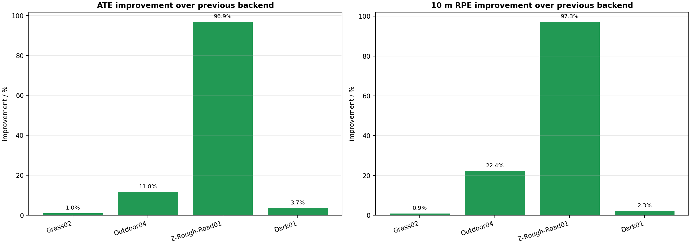
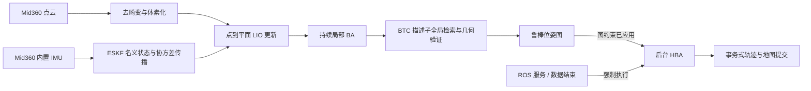
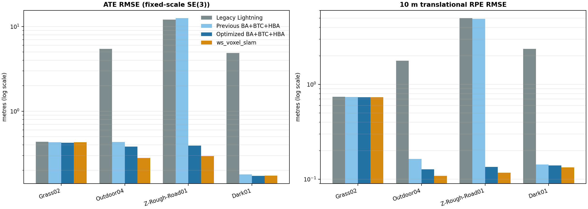
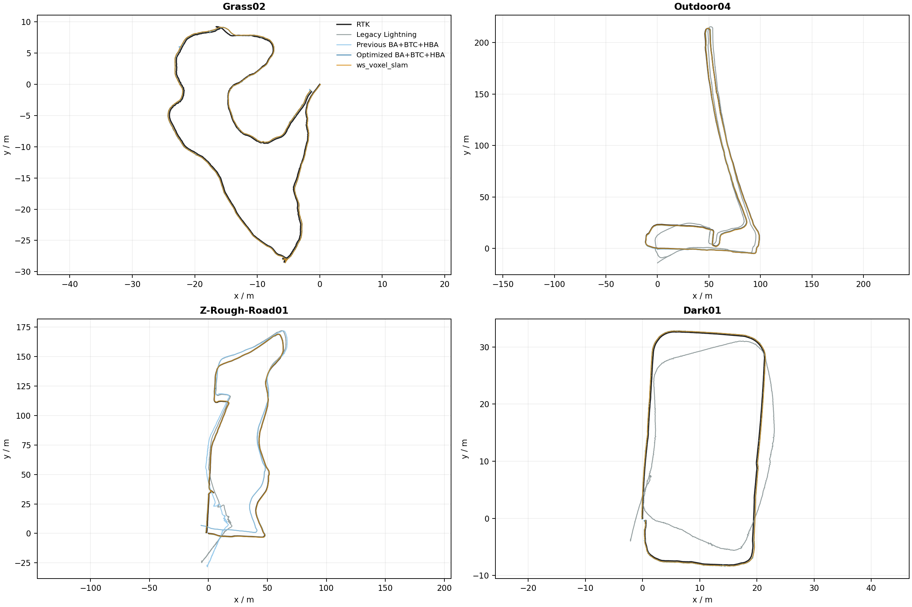
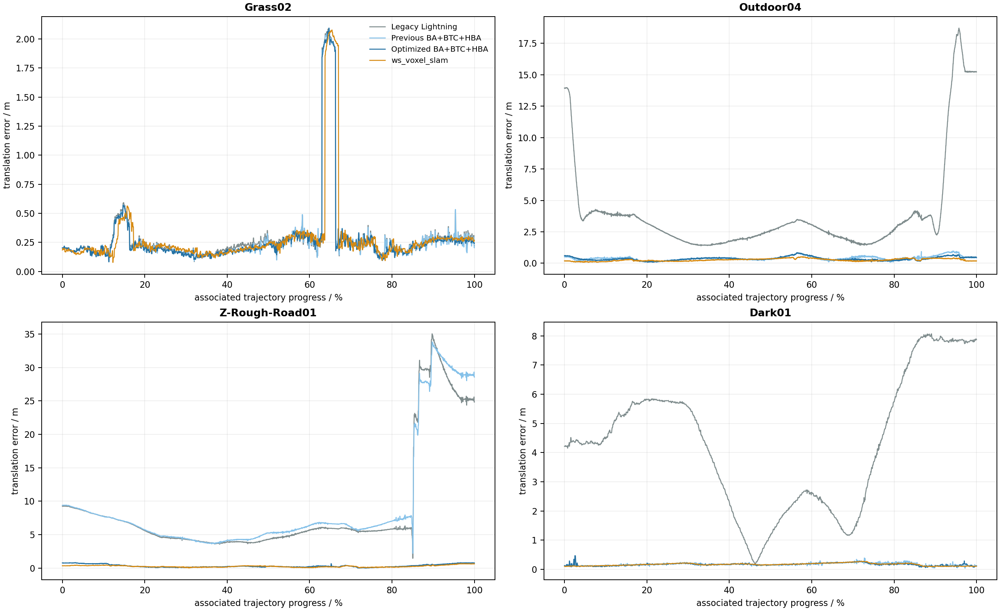
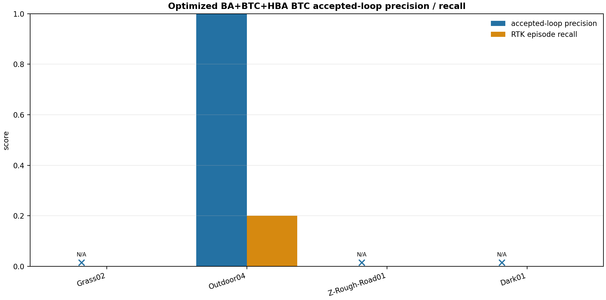
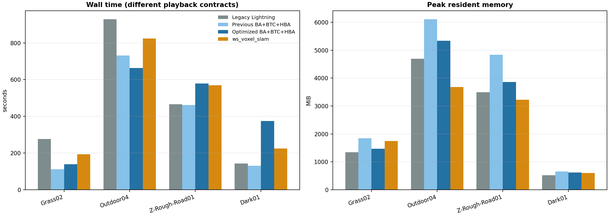
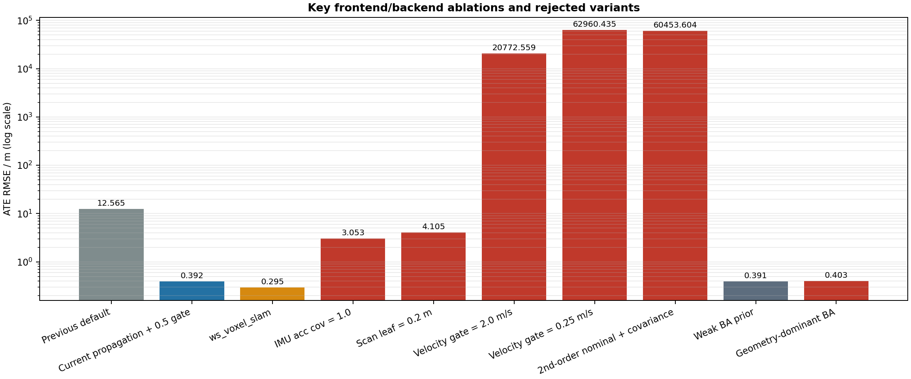

# Lightning-LM 四序列后端优化与 Z-Rough-Road01 专项报告

> 分支：`feature/backend-ba-btc-hba-v2`<br>
> 传感器：Livox Mid360 + 内置 IMU<br>
> 真值：M3DGR RTK，仅用于离线评测与参数选择<br>
> 主实验：Grass02、Outdoor04、Z-Rough-Road01、Dark01，统一参数、每组单次完整运行<br>
> 报告日期：2026-07-15

## 1. 管理摘要

本轮完成了上一版报告 §8.3 中优先级最高的三个工作：修复 Z-Rough-Road01 的前端传播问题、收紧 BTC 假回环、降低无效 HBA 触发带来的内存压力。Outdoor01 按项目决策退出后续实验，因为参考 ws_voxel_slam 也无法形成完整可比轨迹；本报告只比较其余四组数据。

最重要的结果如下：

- Z-Rough-Road01 ATE 从 **12.5653 m 降至 0.3916 m，改善 96.88%**；10 m RPE 从 **4.9057 m 降至 0.1347 m，改善 97.25%**。
- 四序列平均 ATE 从上一版的 **3.4021 m 降至 0.3432 m，改善 89.91%**；平均 10 m RPE 从 **1.4873 m 降至 0.2828 m，改善 80.99%**。
- 四组 ATE 均较上一版改善，没有跨序列精度回归。Grass02、Dark01 的 ATE 已略优于 ws_voxel_slam；Outdoor04、Z-Rough-Road01 仍落后。
- BTC 接受结果从上一版的多个假阳性收敛为 **1 个接受检测、1 个 RTK 真阳性、0 个假阳性**，总体接受检测 Precision 为 **1.000**；但只覆盖 Outdoor04 的一个闭环片段，四序列宏平均 Recall 仍只有 **0.050**。
- HBA 改为仅在回环约束真正进入位姿图后自动触发，手动服务和数据结束仍强制运行。四序列平均峰值内存相对上一版下降 **16.06%**。
- 四序列平均 ATE 仍比 ws_voxel_slam 高 **16.27%**，平均 RPE 高 **3.84%**。因此本轮已解决灾难性粗糙路面漂移，但尚不能宣称整体精度全面不低于 ws_voxel_slam。

建议将当前参数作为 M3DGR 单 Mid360 的新统一默认值保留，并继续使用 YAML 的 `legacy` / `ba_btc_hba` 回退能力。下一阶段应优先提高 BTC Recall，再针对 Outdoor04 与 Z-Rough-Road01 的局部几何约束做小步优化。



## 2. 目标、边界与验收口径

### 2.1 本轮目标

1. 解决 Z-Rough-Road01 后段 30 m 级漂移，而不破坏 Grass02、Outdoor04、Dark01。
2. 保留持续局部 BA、BTC 描述子全局检索、鲁棒位姿图、后台 HBA 的统一架构。
3. 通过统一 YAML 参数在离线建图中验证；在线 SLAM 继续复用同一 `BackendPipeline`。
4. RTK 精度作为主要判据；闭环 Precision/Recall、耗时、内存作为次要判据。

### 2.2 明确不在本轮范围内的内容

- 不使用 RTK、轮速、相机或其他外部传感器参与估计。
- 不进行点云地图视觉质量或地图分层效果对比。
- 不再运行或比较 Outdoor01。此前完整 bag 上 Lightning 与 ws_voxel_slam 均无法形成公平的全长对照，继续调试的投入产出比不足。
- 不以单次 wall time 判定实时性达标；本轮优先离线精度，实时接口只保证架构兼容。

### 2.3 评测协议

- 轨迹：优化后的 `trajectory_slam_opt.tum`。
- 时间关联：最大 0.2 s 插值间隔。
- 对齐：固定尺度 SE(3)，不允许尺度修正。
- 主指标：平移 ATE RMSE。
- 局部指标：10 m 路径间隔平移 RPE RMSE。
- 闭环指标：RTK 定义的重访片段 Precision/Recall。
- 完整性：当前四次运行均为 `algorithm_rc=0`、`completion=reached_final_lidar`，RTK 覆盖率均大于 98%。

## 3. 系统架构与本轮改动



### 3.1 Z-Rough-Road01 根因：名义状态与协方差传播不一致

上一版统一配置为 `propagate_velocity: false`。这意味着 ESKF 仍使用 IMU 对误差协方差进行传播，但名义速度没有持续执行

\[
\dot{\mathbf v}=\mathbf R(\mathbf a_m-\mathbf b_a)+\mathbf g,
\qquad
\dot{\mathbf p}=\mathbf v.
\]

平整路面上，LiDAR 更新可暂时掩盖这种不一致；在 Z-Rough-Road01 的高频姿态和加速度激励下，速度创新持续积累，后段一次不受控更新便会把轨迹推入错误状态。证据是：参考 ws_voxel_slam 在没有接受任何闭环边的情况下仍能获得 0.2948 m ATE，因此 12.5653 m 的差距首先属于前端传播，而不是 HBA 或回环问题。

最终修改为：

```yaml
fasterlio:
  propagate_velocity: true
  adaptive_velocity_propagation: false
  max_update_velocity_step: 0.5
```

`0.5 m/s` 的 LiDAR 速度更新限幅是不可分割的安全条件。放宽到 `2.0 m/s` 或收紧到 `0.25 m/s` 都会导致 Z 序列发散，说明这里控制的是非线性更新稳定域，而不是“越宽越好”或“越严越好”的普通阈值。

### 3.2 BTC：用统一分数门槛优先消除假阳性

上一版 `min_loop_score=0.29` 在 Grass02 和 Outdoor04 接受了多个 RTK 假阳性。四序列日志显示：Outdoor04 的可信检测分数约为 0.615/0.635，而已接受假阳性的最高分数低于 0.506。因此统一默认值调整为：

```yaml
backend:
  btc:
    min_loop_score: 0.60
    degenerate_min_loop_score: 0.60
    max_odom_revisit_distance: 0.0
```

`max_odom_revisit_distance: 0.0` 表示候选检索不使用里程计距离门控。闭环仍由 BTC 描述子全局匹配、平面几何验证、时序确认和图修正安全门共同决定。RTK 只用于运行后的阈值选择和 Precision/Recall 统计，不进入在线检测。

### 3.3 HBA：只为图发生变化的有效闭环自动工作

上一版只要 BTC 几何验证通过，即使回环修正量小到没有进入位姿图，也会启动 HBA；事务式提交随后又必然回滚这次点级优化。这种工作没有改变结果，却使 HBA 点云和主地图同时驻留。

本轮把自动触发条件收紧为 `apply_constraint == true`：

```cpp
if (apply_constraint) {
    RequestHba(false, "accepted_btc_loop");
}
```

以下行为保持不变：

- 数据结束时强制请求 HBA 并等待后台线程完成；
- ROS 服务可手动强制请求；
- `require_applied_loop_for_commit: true` 保证没有有效图修正时不提交点级 HBA 结果；
- 离线和在线入口使用同一套线程、触发与提交逻辑。

### 3.4 局部 BA：保留强先验，而非追求更大修正

当前局部 BA 在每个关键帧窗口持续运行。Z 序列中，弱化修正先验只把 ATE 从 0.39156 m 改到 0.39146 m，却增加耗时和内存；几何主导的极弱先验使 ATE、RPE同时退化。最终保留原强先验，因为当前 BA 的职责是平滑、局部一致性和后端接口，而不是替代稳定的 LIO 前端。

### 3.5 YAML 模式选择

```yaml
backend:
  mode: ba_btc_hba  # ba_btc_hba | legacy | disabled
```

- `ba_btc_hba`：持续局部 BA + BTC + 位姿图 + 后台 HBA；
- `legacy`：原距离候选和传统位姿图后端；
- `disabled`：仅前端，用于消融和故障隔离。

## 4. 四序列精度结果

### 4.1 主结果



| 数据集 | 方法 | RTK覆盖率 | ATE RMSE / m | ATE中位数 / m | 10 m RPE / m |
|---|---|---:|---:|---:|---:|
| Grass02 | 旧 Lightning | 98.69% | 0.4364 | 0.2243 | 0.7382 |
|  | 上一版 BA+BTC+HBA | 98.69% | 0.4297 | 0.2101 | 0.7363 |
|  | **本轮优化版** | 98.69% | **0.4253** | **0.2062** | **0.7294** |
|  | ws_voxel_slam | 99.18% | 0.4313 | 0.2145 | 0.7305 |
| Outdoor04 | 旧 Lightning | 99.78% | 5.4570 | 2.8236 | 1.7755 |
|  | 上一版 BA+BTC+HBA | 99.78% | 0.4341 | 0.3804 | 0.1639 |
|  | **本轮优化版** | 99.78% | 0.3830 | 0.3273 | 0.1273 |
|  | ws_voxel_slam | 99.82% | **0.2806** | **0.2516** | **0.1087** |
| Z-Rough-Road01 | 旧 Lightning | 99.59% | 12.0604 | 5.7521 | 4.9838 |
|  | 上一版 BA+BTC+HBA | 99.59% | 12.5653 | 6.4002 | 4.9057 |
|  | **本轮优化版** | 99.59% | 0.3916 | 0.2463 | 0.1347 |
|  | ws_voxel_slam | 99.78% | **0.2948** | **0.2297** | **0.1168** |
| Dark01 | 旧 Lightning | 98.94% | 4.8719 | 4.3757 | 2.3613 |
|  | 上一版 BA+BTC+HBA | 98.94% | 0.1794 | 0.1707 | 0.1430 |
|  | **本轮优化版** | 98.94% | **0.1729** | **0.1669** | 0.1398 |
|  | ws_voxel_slam | 99.31% | 0.1738 | 0.1723 | **0.1333** |

### 4.2 相对上一版的改善

| 数据集 | ATE改善 | RPE改善 | 峰值内存下降 | 结论 |
|---|---:|---:|---:|---|
| Grass02 | 1.04% | 0.95% | 20.62% | 无回归，略优于 ws 的 ATE/RPE |
| Outdoor04 | 11.76% | 22.35% | 12.65% | 消除错误图修正后明显改善，仍落后 ws |
| Z-Rough-Road01 | **96.88%** | **97.25%** | 20.13% | 灾难性漂移已解决，接近 ws |
| Dark01 | 3.67% | 2.27% | 4.87% | ATE 略优于 ws，RPE仍有小差距 |
| **四序列算术平均** | **89.91%** | **80.99%** | **16.06%** | 统一参数跨序列成立 |

### 4.3 轨迹和误差分布





轨迹曲线给出三点证据：

1. Z-Rough-Road01 上一版在约 85% 进度处出现 30 m 级跃迁，本轮曲线全程保持亚米级；这与传播模型修复的因果预期一致。
2. Outdoor04 的旧 Lightning 在首尾均有显著全局偏差；上一版后端已修复大部分，本轮通过去除假回环进一步降低局部和全局误差。
3. Grass02 的约 64% 进度存在所有方法共同出现的约 2 m 短时误差峰值，说明它更可能来自数据/关联条件，而不是本轮后端特有回归。

## 5. BTC 回环检测结果



| 数据集 | BTC候选 | 上一版接受/应用 | 上一版 P/R | 本轮接受/应用 | 本轮 P/R |
|---|---:|---:|---:|---:|---:|
| Grass02 | 116 | 3 / 0 | 0.000 / 0.000 | 0 / 0 | N/A / 0.000 |
| Outdoor04 | 634 | 9 / 1 | 0.222 / 0.200 | **1 / 0** | **1.000 / 0.200** |
| Z-Rough-Road01 | 289 | 0 / 0 | N/A / 0.000 | 0 / 0 | N/A / 0.000 |
| Dark01 | 4 | 0 / 0 | N/A / 0.000 | 0 / 0 | N/A / 0.000 |

Outdoor04 本轮唯一接受检测为描述子 `761 → 5`，确认分数 0.6077；RTK 判定为真阳性。其图修正平移量只有 0.131 m、旋转量 0.378°，低于“值得修改位姿图”的门槛，所以没有应用图约束，也没有自动启动 HBA。这个行为符合当前策略：识别出重访，但不为了极小收益扰动一条已经稳定的轨迹。

阈值收紧解决了 Precision，但 Recall 仍是明确短板。ws_voxel_slam 在这四组日志中同样没有接受回环边；它在 Z、Dark 的精度主要来自前端和局部优化，而不是回环。下一阶段若提高 Recall，必须保持当前 RTK 假阳性为零的安全边界，不能再通过简单降低全局分数门槛获取表面上的召回。

## 6. 后端工作量、耗时与内存

### 6.1 模块统计

| 数据集 | 关键帧 | 局部BA 接受/尝试 | BTC描述子/候选 | 回环接受/应用 | HBA接受/运行 | BA/BTC/HBA耗时 / s |
|---|---:|---:|---:|---:|---:|---:|
| Grass02 | 1,707 | 1,698 / 1,698 | 170 / 116 | 0 / 0 | 0 / 1 | 3.167 / 9.466 / 0.884 |
| Outdoor04 | 7,806 | 7,797 / 7,797 | 780 / 634 | 1 / 0 | 0 / 1 | 14.732 / 75.640 / 3.987 |
| Z-Rough-Road01 | 5,314 | 5,305 / 5,305 | 531 / 289 | 0 / 0 | 0 / 1 | 9.745 / 27.190 / 2.407 |
| Dark01 | 2,040 | 2,031 / 2,031 | 204 / 4 | 0 / 0 | 0 / 1 | 3.524 / 0.969 / 0.642 |

每组 HBA 都运行一次，是数据结束时的强制执行；由于四组都没有应用图修正，事务式提交均未接受点级结果。局部 BA 持续运行的架构要求已满足。

### 6.2 资源结果



| 数据集 | 上一版 wall / RSS | 本轮 wall / RSS | ws_voxel_slam wall / RSS |
|---|---:|---:|---:|
| Grass02 | 112.33 s / 1849.4 MiB | 138.52 s / **1468.0 MiB** | 192.94 s / 1746.7 MiB |
| Outdoor04 | 731.51 s / 6110.5 MiB | **663.47 s** / 5337.3 MiB | 823.54 s / **3680.3 MiB** |
| Z-Rough-Road01 | **462.00 s** / 4831.5 MiB | 579.33 s / 3858.8 MiB | 568.89 s / **3223.1 MiB** |
| Dark01 | **130.37 s** / 652.9 MiB | 374.79 s / 621.1 MiB | 225.21 s / **602.0 MiB** |

内存下降与 HBA 自动触发次数减少一致：Grass02 从 4 次降为 1 次，Outdoor04 从 10 次降为 1 次。当前平均峰值 RSS 为 2821.3 MiB，相对上一版的 3361.1 MiB 下降 16.06%。

wall time 只能作为单次观测：历史运行、当前运行和 ws runner 的播放与机器负载条件并不完全一致，尤其 Dark01 当前 wall time 与算法内部 BA/BTC/HBA 累计时间不匹配，明显受系统负载影响。因此本报告不把 wall time 的升降解释为算法确定性结论；峰值内存和模块内部累计时间更适合指导下一轮优化。

## 7. Z-Rough-Road01 消融实验



| 方案 | ATE / m | 10 m RPE / m | 判定 |
|---|---:|---:|---|
| 上一版统一参数 | 12.5653 | 4.9057 | 前端传播失败 |
| **持续速度传播 + 0.5 m/s门控** | **0.3916** | **0.1347** | 采用 |
| IMU加速度协方差 1.0 | 3.0529 | 1.2162 | 否决，低估/高估关系被破坏 |
| 扫描体素 0.2 m | 4.1050 | 0.6909 | 否决，更多点没有带来更稳约束 |
| 速度更新门控 2.0 m/s | 20,772.5587 | 3,659.5379 | 否决，更新发散 |
| 速度更新门控 0.25 m/s | 62,960.4347 | 8,314.8687 | 否决，过严门控同样发散 |
| 二阶名义状态 + 二阶协方差 | 60,453.6043 | 6,236.8390 | 否决并回滚代码 |
| 仅名义状态二阶 | 1,807.2782 | 573.2858 | 否决并回滚代码 |
| 弱 BA 先验 | 0.3915 | 0.1345 | 收益不可辨、资源更高，否决 |
| 几何主导 BA | 0.4026 | 0.1432 | 精度退化，否决 |
| ws_voxel_slam | 0.2948 | 0.1168 | 参考上界 |

### 7.1 为什么没有保留“看起来更先进”的二阶传播

二阶积分本身并不自动提高精度。当前系统的去畸变、状态时间戳、协方差离散化和 LiDAR 更新是按原一阶模型共同标定的，只替换其中一部分会破坏一致性。两次完整实验均出现数量级发散，所以相关代码和测试已完整回滚，没有把未经证实的复杂性留在生产路径。

### 7.2 为什么 0.5 m/s 是统一默认，而不是 Z 专用参数

同一配置在四组数据上的 ATE/RPE 相对上一版分别改善：Grass02 1.04%/0.95%、Outdoor04 11.76%/22.35%、Z 96.88%/97.25%、Dark01 3.67%/2.27%。这说明它不是只对 Z 有效的数据集特判，而是修复了原模型不一致后，在四个环境中均保持正收益。

## 8. 风险、结论与下一阶段

### 8.1 已关闭风险

- Z-Rough-Road01 的后段灾难性漂移；
- BTC 低门槛造成的已接受 RTK 假阳性；
- 无图修正时反复自动运行、必然回滚的 HBA；
- 为解决单序列而引入的二阶传播、宽/严门控等不稳定实验代码。

### 8.2 仍存在的风险

1. **BTC Recall 偏低。** 四序列只有 Outdoor04 检出一个真闭环，宏平均 Recall 0.05。
2. **尚未全面达到 ws 精度。** Outdoor04、Z 的 ATE 分别比 ws 高约 36.5%、32.8%；四序列平均 ATE 高 16.27%。
3. **Outdoor04 峰值内存仍高。** 5337 MiB 明显高于 ws 的 3680 MiB；即使 HBA触发减少，地图和描述子生命周期仍可优化。
4. **实时性能未专项验收。** 在线接口已适配，但本轮 wall time 不具备严格可比的实时结论。

### 8.3 下一阶段排序

1. **提高 BTC Recall，同时锁定 Precision。** 优先做描述子多尺度/多分辨率检索与候选重排；保持 `0.60` 接受门槛，在几何验证前扩大候选覆盖，而不是直接降低最终门槛。
2. **缩小 Outdoor04、Z 与 ws 的局部精度差。** 对照 ws 的体素平面统计量、退化方向权重和窗口边缘化；每个改动必须继续通过四序列统一回归。
3. **继续降低 HBA/地图内存。** 缩短原始子图点云生命周期，以平面统计量替代非必要原始点，限制 HBA 与地图导出并发驻留。
4. **建立受控实时基准。** 固定 CPU、缓存状态、播放速率和后台负载，至少重复三次后再给出实时性结论。

### 8.4 最终工程判断

当前版本适合作为新的研发默认后端：它在四序列统一参数下消除了主要精度故障，Precision 和内存方向均改善，并保留旧后端回退开关。它还不适合被描述为“全面超过 ws_voxel_slam”或“高召回闭环系统”；更准确的状态是：**前端稳定性已接近参考实现，后端架构完整且假阳性受控，下一瓶颈从轨迹发散转移到了描述子召回和局部几何精度。**

## 附录 A：完整算法改动清单

| 文件 | 改动 | 工程作用 |
|---|---|---|
| `config/reproduction/single_lidar/m3dgr/lightning_m3dgr_mid360_benchmark.yaml` | `propagate_velocity: false → true` | 使名义速度与 IMU 协方差传播一致 |
| 同上 | `max_update_velocity_step: 2.0 → 0.5` | 限制粗糙路面上的非线性速度更新 |
| 同上 | BTC `min_loop_score: 0.29 → 0.60` | 拒绝四序列中观测到的低分假阳性 |
| 同上 | `degenerate_min_loop_score: 0.29 → 0.60` | 退化平面情况下使用同一安全门槛 |
| `src/core/backend/backend_pipeline.cc` | HBA 自动触发从 `accepted` 改为 `apply_constraint` | 避免对未修改位姿图的重访执行必然回滚的 HBA |
| `scripts/reproduction/single_lidar/m3dgr/generate_backend_ablation_configs.py` | 新增速度门控、IMU协方差、扫描密度、弱/几何 BA 先验变体 | 固化失败实验，使结论可复现 |
| `scripts/reproduction/single_lidar/m3dgr/build_algorithm_report_assets.py` | 支持四方法、四序列布局、改善图、完整性字段 | 从原始评测 JSON 自动生成报告证据 |
| `doc/backend_ba_btc_hba_four_sequence_optimization_manifest.json` | 新增四序列结果与消融 manifest | 绑定原始 JSON、轨迹和图表 |

未保留的实验性改动：ESKF 二阶名义/协方差传播。它们在完整 Z 序列上发散，已从源码和测试中回滚；因此最终 diff 不包含这些路径。

## 附录 B：实验过程与复现

### B.1 当前四次最终运行的完整性指纹

| 项目 | 值 |
|---|---|
| 配置 SHA-256 | `72c952017719fb7530bda6f977afbf6ec4294474518e5670a4c4e1a38b2a88cf` |
| 算法二进制 SHA-256 | `77268cd64994e7a66344e2b3e38b477a519cca2990bdcf7b28e7d1c0d11760a4` |
| 四组 completion | `reached_final_lidar` |
| 四组 algorithm_rc | `0` |
| CPU 分配 | `0-7`，8 核 |
| 重复次数 | 1 |

四组最终实验使用同一配置哈希和同一二进制哈希，没有序列专用参数。

### B.2 报告资产生成

```powershell
python scripts/reproduction/single_lidar/m3dgr/build_algorithm_report_assets.py `
  --manifest doc/backend_ba_btc_hba_four_sequence_optimization_manifest.json `
  --output-dir doc/assets/backend_ba_btc_hba_four_sequence_optimization
```

机器可读汇总：

- `doc/assets/backend_ba_btc_hba_four_sequence_optimization/metrics_summary.csv`
- `doc/assets/backend_ba_btc_hba_four_sequence_optimization/metrics_summary.json`
- `doc/assets/backend_ba_btc_hba_four_sequence_optimization/validation_summary.json`

### B.3 最终配置生成与运行入口

```powershell
python scripts/reproduction/single_lidar/m3dgr/generate_backend_ablation_configs.py `
  --base config/reproduction/single_lidar/m3dgr/lightning_m3dgr_mid360_benchmark.yaml `
  --output-dir <config-output>
```

离线 runner、评测脚本和 ws 对照入口沿用：

- `scripts/reproduction/single_lidar/m3dgr/run_lightning_offline.sh`
- `scripts/reproduction/single_lidar/m3dgr/evaluate_backend_runs.py`
- `scripts/reproduction/single_lidar/m3dgr/run_voxel_slam_full_backend.sh`

## 附录 C：数据解释约束

- RTK 未进入算法，只在运行后用于轨迹对齐、误差和闭环真值评测。
- Precision 在没有接受检测时记为 N/A，而不是 0；Recall 可为 0。
- ATE/RPE 算术平均用于项目级总览，不代表不同长度序列按里程加权的总体误差。
- wall time 是单次观测，不用于宣称确定性性能提升。
- 本报告不包含点云地图对比，也不把 Outdoor01 的局部片段当作完整序列结果。
