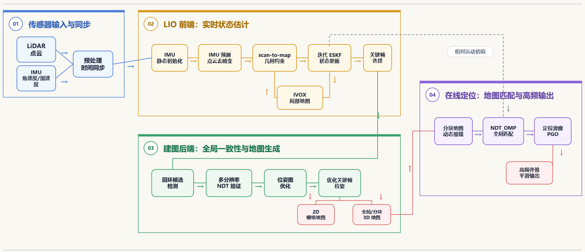
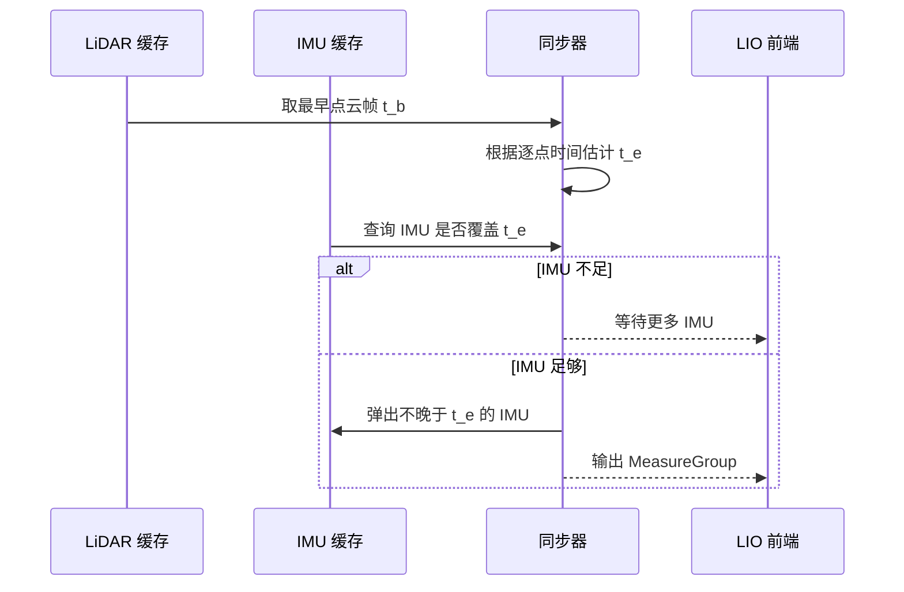
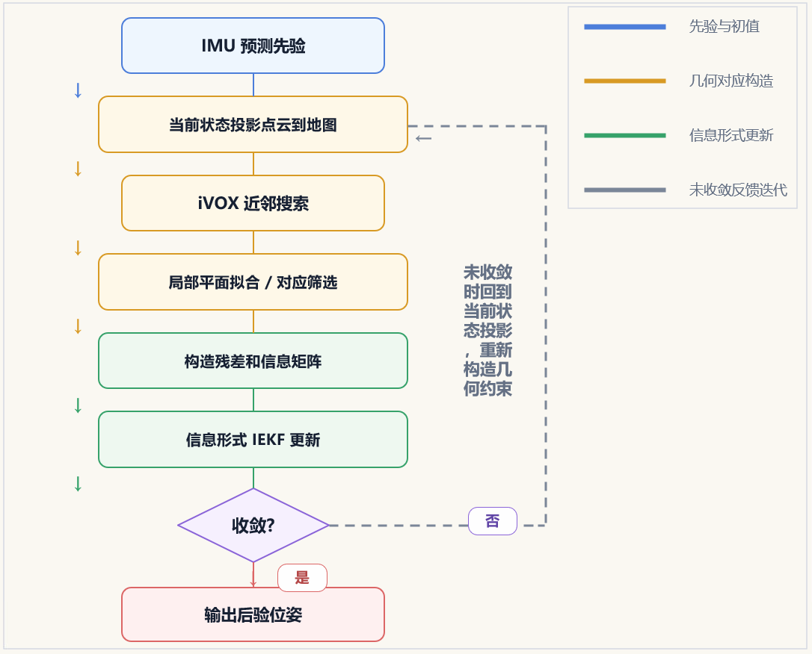
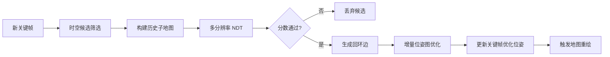
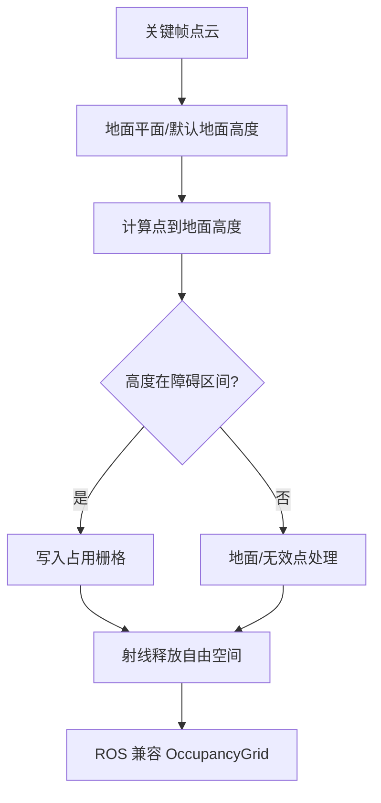
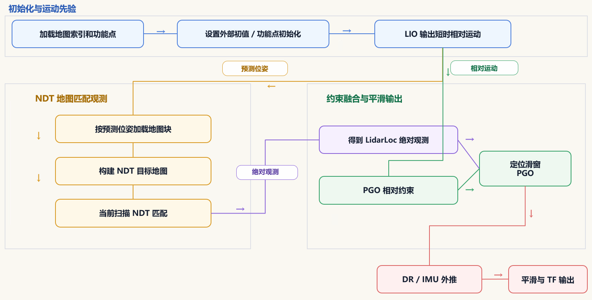

# SLAM 建图定位方案技术文档

## 1. 概述

本文面向一个以 LiDAR-IMU 融合为核心的 SLAM 建图定位系统，给出建图、回环、地图表达、重定位和在线定位的整体技术方案。系统以激光雷达点云提供几何约束，以 IMU 提供高频运动预测和点云运动畸变补偿，通过误差状态迭代卡尔曼滤波实现前端里程计，通过关键帧、回环检测和位姿图优化保证全局地图一致性，并在定位阶段利用分块点云地图、NDT 匹配和滑窗位姿图融合输出高频稳定位姿。

本文统一采用 [符号说明.md](./符号说明.md) 中的约定。局部新增的坐标系或索引会在首次出现处说明；若某处为了表达简洁省略右下标，默认仍遵循“上标表示表达坐标系、右下标表示从哪个坐标系原点指向哪个点”的规则。

系统的核心目标如下：

1. **实时建图**：在 LiDAR 与 IMU 输入下估计连续位姿，生成全局一致的三维点云地图。
2. **全局一致性**：通过关键帧回环检测与位姿图优化抑制前端累积漂移。
3. **地图可用性**：同时输出全局 PCD、分块点云地图和可选 2D 栅格地图。
4. **在线定位**：加载已有地图，结合 LIO 短时相对运动预测与全局点云匹配得到稳定定位结果。
5. **大场景适应**：通过地图分块动态加载、动态层更新和高频外推降低内存与延迟压力。

## 2. 坐标系与状态定义

本文使用以下坐标系：

| 坐标系 | 含义 |
| --- | --- |
| $\mathcal{F}_w$ | 世界坐标系，也是建图和定位输出的全局参考系 |
| $\mathcal{F}_i$ | IMU 坐标系 |
| $\mathcal{F}_l$ | LiDAR 坐标系 |
| $\mathcal{F}_{l_j}$ | 当前扫描中第 $j$ 个点采样时刻的 LiDAR 坐标系 |
| $\mathcal{F}_{l_e}$ | 当前扫描结束时刻的 LiDAR 坐标系 |

旋转矩阵 $\mathbf{R}_{wi}$ 表示从 $\mathcal{F}_i$ 到 $\mathcal{F}_w$ 的旋转；平移 ${}^{w}\mathbf{t}_{wi}$ 表示从 $o_w$ 指向 $o_i$ 的向量，在 $\mathcal{F}_w$ 下表达。LiDAR 到 IMU 的外参写作 $\mathbf{T}_{il}=(\mathbf{R}_{il},{}^{i}\mathbf{t}_{il})$。

前端名义状态采用惯导导航状态：

$$
\hat{\mathbf{x}} =
\left(
{}^{w}\hat{\mathbf{p}}_{wi},
\hat{\mathbf{R}}_{wi},
{}^{w}\hat{\mathbf{v}},
{}^{i}\hat{\mathbf{b}}_g,
{}^{i}\hat{\mathbf{b}}_a,
{}^{w}\hat{\mathbf{g}}
\right).
$$

其中 ${}^{i}\hat{\mathbf{b}}_g$ 为陀螺零偏，${}^{i}\hat{\mathbf{b}}_a$ 为加速度计零偏，${}^{w}\hat{\mathbf{g}}$ 为世界系重力向量。方案层采用完整 LiDAR-IMU 惯导建模，在线前端以位置、姿态、速度、陀螺零偏和加速度计零偏为主要可修正误差块；重力由静态初始化给定，可根据实现选择固定、弱约束或在线估计；LiDAR-IMU 外参通常采用配置或离线标定结果。若工程代码为实时性和稳定性暂不估计 ${}^{i}\mathbf{b}_a$，可视为对完整模型的降维实现，而不是物理模型中不需要加速度计零偏。

误差状态采用切空间小扰动：

$$
\tilde{\mathbf{x}} =
\begin{bmatrix}
\delta{}^{w}\mathbf{p}_{wi}^{\mathsf{T}} &
\delta\boldsymbol{\theta}^{\mathsf{T}} &
\delta{}^{w}\mathbf{v}^{\mathsf{T}} &
\delta{}^{i}\mathbf{b}_g^{\mathsf{T}} &
\delta{}^{i}\mathbf{b}_a^{\mathsf{T}}
\end{bmatrix}^{\mathsf{T}},
$$

并通过广义加法注入名义状态：

$$
\mathbf{x} = \hat{\mathbf{x}} \boxplus \tilde{\mathbf{x}},
\quad
\mathbf{R}_{wi} =
\hat{\mathbf{R}}_{wi}\operatorname{Exp}(\delta\boldsymbol{\theta}).
$$

## 3. 系统总体架构

系统分为建图链路和定位链路。建图链路侧重生成高质量地图，定位链路侧重利用已有地图输出稳定低延迟位姿。两者共享 LiDAR-IMU 前端、点云预处理、地图表达和位姿图优化等基础能力。

图中 IEKF 到 NDT 全局匹配的虚线表示定位阶段的短时相对运动预测：LIO 前端根据 IMU 传播和 scan-to-map 更新，连续输出上一时刻到当前时刻的里程计增量。该增量不会提供长期全局一致的位置，而是用于把上一帧绝对定位结果递推到当前帧附近，作为 NDT 匹配的初值，从而缩小搜索范围并提高收敛稳定性。

建图阶段的主流程为：

1. 对 LiDAR 和 IMU 数据进行格式统一、时间检查和缓存。
2. 按一帧 LiDAR 扫描的起止时间同步 IMU 序列。
3. 启动阶段统计 IMU 均值，初始化重力方向、陀螺零偏和加速度计零偏先验。
4. 正常运行阶段用 IMU 对当前扫描周期做前向传播，补偿点云运动畸变。
5. 将去畸变点云与 iVOX 局部地图匹配，构造点到面几何残差。
6. 使用迭代 ESKF 更新当前位姿，并增量维护局部地图。
7. 当运动超过距离或角度阈值时生成关键帧。
8. 对关键帧序列进行回环检测、NDT 验证和位姿图优化。
9. 根据优化后关键帧位姿输出全局点云地图、分块地图和 2D 栅格地图。

定位阶段的主流程为：

1. 加载建图阶段保存的分块地图索引和起点功能点。
2. 根据外部初值或功能点初始化全局位姿。
3. LIO 前端持续输出短时相对运动估计，作为全局匹配初值。
4. 根据预测位姿动态加载附近地图块，并构造 NDT 目标地图。
5. 将当前扫描与局部全局地图做 NDT 匹配，得到绝对定位观测。
6. 使用定位滑窗 PGO 融合 LidarLoc 绝对约束、LidarOdom 相对约束和 DR/IMU 递推约束。
7. 通过外推和平滑器输出与 IMU 接近同频的定位结果。

## 4. 传感器预处理与时间同步

### 4.1 点云统一表达

系统支持多种 LiDAR 数据源，预处理层需要将不同消息格式统一为带时间戳的点云：

$$
{}^{l}\mathbf{p}_{lj} =
\begin{bmatrix}
x_j & y_j & z_j
\end{bmatrix}^{\mathsf{T}},
\quad
\tau_j \in [0,T_s],
$$

其中 $\tau_j$ 为点在当前扫描帧内的相对采样时间，$T_s$ 为扫描周期。逐点时间是后续去畸变的关键。如果 $\tau_j$ 的单位、起点或范围错误，点云补偿会沿错误轨迹执行，点到面残差将出现系统性偏差。

预处理还包含以下质量控制：

| 步骤 | 目的 |
| --- | --- |
| 盲区过滤 | 去除距离过近、几何不稳定或传感器盲区内的点 |
| ROI 高度过滤 | 去除明显无关的高空点或地面以下异常点 |
| 点云抽样 | 控制当前扫描规模，降低 IEKF 观测构造成本 |
| 强度/标签过滤 | 对部分雷达剔除低质量回波、多路径或异常回波 |
| 时间戳检查 | 检测 LiDAR/IMU 回退和断流，避免缓存污染 |

### 4.2 LiDAR-IMU 时间同步

对第 $k$ 帧点云，设扫描起始时刻为 $t_k^b$，结束时刻为 $t_k^e$：

$$
t_k^e = t_k^b + \max_j \tau_j.
$$

系统从 IMU 缓存中取出满足

$$
t_k^b \leq t_{\mathrm{imu}} \leq t_k^e
$$

的 IMU 序列，与当前点云组成一个测量组。只有当最新 IMU 时间覆盖到 $t_k^e$ 之后，才允许进入本帧处理；否则等待后续 IMU 数据。这一策略保证了去畸变和滤波预测拥有完整的扫描周期运动信息。

## 5. LIO 前端里程计

LIO 前端是系统实时性的核心，里面最关键的就是误差状态卡尔曼滤波器，具体公式推导参考 [ESKF](./ESKF/ESKF.md) 。它将 IMU 预测、点云去畸变、scan-to-map 几何匹配和局部地图更新放在同一个闭环内，形成“预测-配准-更新-建图”的迭代过程。

### 5.1 IMU 静态初始化

启动阶段假设载体近似静止。IMU 测量模型为：

$$
\begin{aligned}
{}^{i}\overline{\boldsymbol{\omega}}
&= {}^{i}\boldsymbol{\omega}
 + {}^{i}\mathbf{b}_g
 + {}^{i}\boldsymbol{\eta}_g, \\
{}^{i}\overline{\mathbf{a}}
&= \mathbf{R}_{iw}
\left({}^{w}\mathbf{a}-{}^{w}\mathbf{g}\right)
 + {}^{i}\mathbf{b}_a
 + {}^{i}\boldsymbol{\eta}_a .
\end{aligned}
$$

静止时 ${}^{i}\boldsymbol{\omega}\approx\mathbf{0}$，${}^{w}\mathbf{a}\approx\mathbf{0}$。因此可用 IMU 统计均值估计陀螺零偏和重力方向，并为加速度计零偏设置初始先验：

$$
{}^{i}\hat{\mathbf{b}}_g
=
\frac{1}{M}\sum_{k=1}^{M}{}^{i}\overline{\boldsymbol{\omega}}_k,
\quad
{}^{w}\hat{\mathbf{g}}
=
-\frac{\bar{\mathbf{a}}}{\|\bar{\mathbf{a}}\|}g,
\quad
{}^{i}\hat{\mathbf{b}}_{a,0}
=
{}^{i}\mathbf{b}_{a}^{\mathrm{calib}}
\ \text{或}\ 
\mathbf{0}.
$$

这里 $\bar{\mathbf{a}}$ 为加速度计均值，$g\approx 9.81\,\mathrm{m/s^2}$。如果加速度均值模长接近 $1$，说明输入可能以 $g$ 为单位，需进行尺度修正；如果模长接近 $9.81$，则通常已经是 $\mathrm{m/s^2}$。仅依靠静止加速度均值无法严格区分重力方向误差和加速度计零偏，因此 ${}^{i}\hat{\mathbf{b}}_{a,0}$ 通常来自离线标定；没有标定值时可置零并赋予较大的先验协方差，让后续 LiDAR-IMU 约束逐步修正。

静态初始化的可靠性直接影响后续姿态水平度和点云去畸变质量。实际使用中应尽量保证启动前若干帧 IMU 无明显加减速和大角速度。

### 5.2 IMU 预测模型

本节下标 $k$ 表示 IMU 预测的离散时间索引。设去零偏角速度和加速度为：

$$
\begin{aligned}
{}^{i}\hat{\boldsymbol{\omega}}_k
&= {}^{i}\overline{\boldsymbol{\omega}}_k
 - {}^{i}\hat{\mathbf{b}}_{g,k},\\
{}^{i}\hat{\mathbf{a}}_k
&= {}^{i}\overline{\mathbf{a}}_k
 - {}^{i}\hat{\mathbf{b}}_{a,k}.
\end{aligned}
$$

惯导预测模型可写为：

$$
\begin{aligned}
\hat{\mathbf{R}}_{wi,k+1}^{-}
&=
\hat{\mathbf{R}}_{wi,k}^{+}
\operatorname{Exp}\!\left({}^{i}\hat{\boldsymbol{\omega}}_k\Delta t\right),\\
{}^{w}\hat{\mathbf{v}}_{k+1}^{-}
&=
{}^{w}\hat{\mathbf{v}}_k^{+}
+
\left(
\hat{\mathbf{R}}_{wi,k}^{+}{}^{i}\hat{\mathbf{a}}_k
+{}^{w}\hat{\mathbf{g}}
\right)\Delta t,\\
{}^{w}\hat{\mathbf{p}}_{wi,k+1}^{-}
&=
{}^{w}\hat{\mathbf{p}}_{wi,k}^{+}
+
{}^{w}\hat{\mathbf{v}}_k^{+}\Delta t
+
\frac{1}{2}
\left(
\hat{\mathbf{R}}_{wi,k}^{+}{}^{i}\hat{\mathbf{a}}_k
+{}^{w}\hat{\mathbf{g}}
\right)\Delta t^2,\\
{}^{i}\hat{\mathbf{b}}_{g,k+1}^{-}
&=
{}^{i}\hat{\mathbf{b}}_{g,k}^{+},\\
{}^{i}\hat{\mathbf{b}}_{a,k+1}^{-}
&=
{}^{i}\hat{\mathbf{b}}_{a,k}^{+}.
\end{aligned}
$$

名义预测中零偏保持常值，真值零偏通常按随机游走建模：

$$
\begin{aligned}
{}^{i}\mathbf{b}_{g,k+1}
&=
{}^{i}\mathbf{b}_{g,k}
+{}^{i}\boldsymbol{\eta}_{bg,k}\Delta t,\\
{}^{i}\mathbf{b}_{a,k+1}
&=
{}^{i}\mathbf{b}_{a,k}
+{}^{i}\boldsymbol{\eta}_{ba,k}\Delta t.
\end{aligned}
$$

在工程实现中，即使将加速度计零偏纳入状态，速度仍容易受到加速度零偏、时间同步误差和姿态误差影响，因此可对速度积分和协方差膨胀采用更保守的策略。无论采用完整积分还是保守外推，核心原则都是：IMU 给出扫描周期内的连续运动先验，LiDAR 观测负责校正长期漂移。

将误差状态传播写为：

$$
\tilde{\mathbf{x}}_{k+1}^{-}
=
\mathbf{F}_{\tilde{x},k}\tilde{\mathbf{x}}_k^{+}
+\mathbf{F}_{\eta,k}\boldsymbol{\eta}_k,
\quad
\boldsymbol{\eta}_k=
\begin{bmatrix}
{}^{i}\boldsymbol{\eta}_{g,k}^{\mathsf{T}} &
{}^{i}\boldsymbol{\eta}_{a,k}^{\mathsf{T}} &
{}^{i}\boldsymbol{\eta}_{bg,k}^{\mathsf{T}} &
{}^{i}\boldsymbol{\eta}_{ba,k}^{\mathsf{T}}
\end{bmatrix}^{\mathsf{T}}.
$$

协方差预测为：

$$
\tilde{\mathbf{P}}_{k+1}^{-}
=
\mathbf{F}_{\tilde{x},k}
\tilde{\mathbf{P}}_k^{+}
\mathbf{F}_{\tilde{x},k}^{\mathsf{T}}
+
\mathbf{F}_{\eta,k}
\mathbf{W}_k
\mathbf{F}_{\eta,k}^{\mathsf{T}}.
$$

其中 $\mathbf{F}_{\tilde{x},k}$ 是误差状态对误差状态的雅可比，$\mathbf{F}_{\eta,k}$ 是误差状态对 IMU 噪声的雅可比，$\mathbf{W}_k$ 是 $\boldsymbol{\eta}_k$ 的协方差，通常包含陀螺白噪声、加速度计白噪声、陀螺零偏随机游走和加速度计零偏随机游走。为了避免滤波器过度自信，协方差预测后可进行轻微膨胀，并强制保持对称和正定下限。

### 5.3 点云运动畸变补偿

一帧机械式或固态 LiDAR 点云并非在同一时刻采集。若载体在扫描周期内运动，原始点云会出现扭曲。系统通过 IMU 在扫描周期内积分得到离散位姿序列，并将每个点补偿到扫描结束时刻。

设第 $j$ 个点采样时刻为 $t_j=t_k^b+\tau_j$，扫描结束时刻为 $t_e$。点在采样时刻 LiDAR 坐标系下为 ${}^{l_j}\mathbf{p}_{l_jj}$。补偿链路为：

$$
{}^{i_j}\mathbf{p}_{i_jj}
=
\mathbf{R}_{il}\,{}^{l_j}\mathbf{p}_{l_jj}
+
{}^{i}\mathbf{t}_{il},
$$

$$
{}^{w}\mathbf{p}_{wj}
=
\mathbf{R}_{wi_j}\,{}^{i_j}\mathbf{p}_{i_jj}
+
{}^{w}\mathbf{t}_{wi_j},
$$

$$
{}^{l_e}\mathbf{p}_{l_ej}
=
\mathbf{R}_{li}
\left[
\mathbf{R}_{i_ew}
\left(
{}^{w}\mathbf{p}_{wj}
-
{}^{w}\mathbf{t}_{wi_e}
\right)
-
{}^{i}\mathbf{t}_{il}
\right].
$$

上述三式可按如下步骤理解：

1. 将原始点从采样时刻 LiDAR 坐标系 $\mathcal{F}_{l_j}$ 转到同一时刻 IMU 坐标系 $\mathcal{F}_{i_j}$。该步骤只使用 LiDAR-IMU 外参 $\mathbf{R}_{il}$ 与 ${}^{i}\mathbf{t}_{il}$，得到 ${}^{i_j}\mathbf{p}_{i_jj}$。

2. 根据 IMU 在扫描周期内的预测轨迹，取点采样时刻 $t_j$ 对应的 IMU 位姿 $\left(\mathbf{R}_{wi_j},{}^{w}\mathbf{t}_{wi_j}\right)$，将该点从 $\mathcal{F}_{i_j}$ 转到世界坐标系 $\mathcal{F}_{w}$，得到 ${}^{w}\mathbf{p}_{wj}$。这一步保留了该点真实采样时刻的运动状态。

3. 取扫描结束时刻 $t_e$ 的 IMU 位姿 $\left(\mathbf{R}_{wi_e},{}^{w}\mathbf{t}_{wi_e}\right)$，用其逆变换将 ${}^{w}\mathbf{p}_{wj}$ 转回扫描结束时刻 IMU 坐标系 $\mathcal{F}_{i_e}$。其中 $\mathbf{R}_{i_ew}=\mathbf{R}_{wi_e}^{\mathsf{T}}$。

4. 最后使用 IMU-LiDAR 外参的逆变换，将点从 $\mathcal{F}_{i_e}$ 转到扫描结束时刻 LiDAR 坐标系 $\mathcal{F}_{l_e}$，得到补偿后的点 ${}^{l_e}\mathbf{p}_{l_ej}$。所有点都统一到 $\mathcal{F}_{l_e}$ 后，点云内部的时间畸变被压缩为同一参考时刻下的空间结构，并作为当前帧 scan-to-map 匹配输入。

### 5.4 Scan-to-Map 观测模型

当前帧去畸变点云降采样后，与 iVOX 局部地图建立对应关系。对第 $j$ 个点，先变换到世界系：

$$
{}^{w}\hat{\mathbf{p}}_{wj}
=
\hat{\mathbf{R}}_{wi}
\left(
\mathbf{R}_{il}\,{}^{l}\mathbf{p}_{lj}
+
{}^{i}\mathbf{t}_{il}
\right)
+
{}^{w}\hat{\mathbf{p}}_{wi}.
$$

在局部地图中查询近邻点并拟合局部平面：

$$
{}^{w}\mathbf{n}_{j}^{\mathsf{T}}{}^{w}\mathbf{p}
+ d_j = 0,
\quad
\|{}^{w}\mathbf{n}_{j}\|=1.
$$

点到面残差定义为：

$$
r_j
=
{}^{w}\mathbf{n}_{j}^{\mathsf{T}}
{}^{w}\hat{\mathbf{p}}_{wj}
+ d_j.
$$

令

$$
{}^{i}\mathbf{p}_{ij}
=
\mathbf{R}_{il}\,{}^{l}\mathbf{p}_{lj}
+
{}^{i}\mathbf{t}_{il},
$$

对位置和右扰动姿态的一阶雅可比可写为：

$$
\mathbf{J}_j
=
\begin{bmatrix}
{}^{w}\mathbf{n}_{j}^{\mathsf{T}} &
-
{}^{w}\mathbf{n}_{j}^{\mathsf{T}}
\hat{\mathbf{R}}_{wi}
\left[{}^{i}\mathbf{p}_{ij}\right]_{\times}
\end{bmatrix}.
$$

点到面约束利用局部平面结构，通常比点到点 ICP 收敛更快；但在单一平面、走廊、长直道路等场景中存在可观性退化。系统会通过有效点数量、残差分布和信息矩阵特征值判断观测质量。当 $\mathbf{H}^{\mathsf{T}}\mathbf{H}$ 出现低秩或病态时，可对退化方向降低更新权重或膨胀协方差，避免错误约束把状态拉偏。

可选的点到点 ICP 项用于增强局部几何不足时的约束。设最近邻目标点为 ${}^{w}\mathbf{q}_{wj}$，点到点残差为：

$$
\mathbf{r}^{\mathrm{pt}}_j
=
{}^{w}\hat{\mathbf{p}}_{wj}
-
{}^{w}\mathbf{q}_{wj}.
$$

实际更新中，点到面和点到点约束会按权重累积为 6 维位姿信息矩阵和信息向量：

$$
\mathbf{H}^{\mathsf{T}}\mathbf{H}
=
\sum_j \mathbf{J}_j^{\mathsf{T}}\mathbf{J}_j,
\quad
\mathbf{H}^{\mathsf{T}}\mathbf{r}
=
\sum_j \mathbf{J}_j^{\mathsf{T}}r_j.
$$

这种形式避免直接存储大规模观测矩阵，使计算复杂度主要与状态维度相关，而不是与点数线性放大到矩阵求逆维度。

### 5.5 迭代 ESKF 更新

LiDAR 观测更新采用迭代误差状态滤波。把残差写成 $\mathbf{r}_k(\mathbf{x}_k)+\mathbf{n}_k=\mathbf{0}$；对于标准观测，可取 $\mathbf{r}_k=\mathbf{h}(\mathbf{x}_k)-\mathbf{z}_k$。每次迭代在当前名义状态 $\hat{\mathbf{x}}_k^\kappa$ 处重新建立对应关系、拟合平面并线性化残差：

$$
\mathbf{r}_k
\left(
\hat{\mathbf{x}}_k^\kappa\boxplus\tilde{\mathbf{x}}_k^\kappa
\right)
\approx
\mathbf{r}_k^\kappa
+
\mathbf{H}_k^{\kappa}\tilde{\mathbf{x}}_k^\kappa,
\quad
\mathbf{r}_k^\kappa=\mathbf{r}_k(\hat{\mathbf{x}}_k^\kappa).
$$

更新可从最大后验角度理解为：

$$
\min_{\tilde{\mathbf{x}}_k^\kappa}
\left\|
\tilde{\mathbf{x}}_k^\kappa
-
\tilde{\boldsymbol{\mu}}_k^{\kappa-}
\right\|_{\left(\tilde{\mathbf{P}}_k^{\kappa-}\right)^{-1}}^2
+
\left\|
\mathbf{r}_k^\kappa
+
\mathbf{H}_k^{\kappa}\tilde{\mathbf{x}}_k^\kappa
\right\|_{\mathbf{N}_k^{-1}}^2.
$$

由于点云残差数量很大，系统采用信息形式更新。观测信息被累加到位姿 6 维块中，再与先验协方差融合：

$$
\left[
\left(\tilde{\mathbf{P}}_k^{\kappa-}\right)^{-1}
+
\left(\mathbf{H}_k^\kappa\right)^{\mathsf{T}}
\mathbf{N}_k^{-1}
\mathbf{H}_k^\kappa
\right]
\tilde{\boldsymbol{\mu}}_k^{\kappa+}
=
\left(\tilde{\mathbf{P}}_k^{\kappa-}\right)^{-1}
\tilde{\boldsymbol{\mu}}_k^{\kappa-}
-
\left(\mathbf{H}_k^\kappa\right)^{\mathsf{T}}
\mathbf{N}_k^{-1}
\mathbf{r}_k^\kappa.
$$

求得增量后通过 $\boxplus$ 注入名义状态。若增量小于阈值或达到最大迭代次数，则结束当前帧更新。为了提高收敛稳定性，可启用 Anderson Acceleration；若加速后残差反而变大，则回退到上一可靠迭代状态。

### 5.6 iVOX 局部地图

局部地图采用增量式体素索引结构。三维空间被划分为分辨率为 $r_v$ 的体素，每个体素只保存有限数量的代表点。查询某个点的邻域时，可在中心体素及其 6/18/26 邻域内查找候选点，并选择距离最近的若干点用于平面拟合。

iVOX 的作用有三点：

1. **提供低延迟近邻查询**：避免每帧对全局点云做大规模 KD-Tree 重建。
2. **控制局部地图密度**：通过体素中心距离和已有近邻判断是否加入新点。
3. **服务实时观测模型**：为当前扫描的点到面残差提供局部几何面片。

增量更新时，当前帧点云经过后验位姿变换到世界系：

$$
{}^{w}\mathbf{p}_{wj}
=
\hat{\mathbf{R}}_{wi}
\left(
\mathbf{R}_{il}\,{}^{l}\mathbf{p}_{lj}
+
{}^{i}\mathbf{t}_{il}
\right)
+
{}^{w}\hat{\mathbf{p}}_{wi}.
$$

如果当前点所在体素中已有更靠近体素中心的代表点，则可拒绝加入；如果该区域稀疏或缺少近邻，则直接加入。这种自适应策略使地图在边缘和稀疏区域保留更多信息，在平坦密集区域抑制冗余点。

### 5.7 关键帧策略

关键帧是全局地图、回环检测和 2D 栅格地图的基本单元。当当前位姿相对上一关键帧满足任一条件时创建新关键帧：

$$
\left\|
{}^{w}\mathbf{p}_{w n_k}
-
{}^{w}\mathbf{p}_{w n_{k_{\mathrm{last}}}}
\right\|
>
d_{\mathrm{kf}},
$$

或

$$
\left\|
\operatorname{Log}
\left(
\mathbf{R}_{w n_{k_{\mathrm{last}}}}^{\mathsf{T}}
\mathbf{R}_{w n_k}
\right)
\right\|
>
\theta_{\mathrm{kf}}.
$$

关键帧保存当前去畸变点云、LIO 位姿、优化位姿和时间戳。LIO 位姿表示前端原始轨迹，优化位姿表示经过回环或后端修正后的全局一致轨迹。新关键帧的初始优化位姿由上一关键帧优化位姿递推得到：

$$
\mathbf{T}_{w n_k}^{\mathrm{opt}}
=
\mathbf{T}_{w n_{k-1}}^{\mathrm{opt}}
\left(
\mathbf{T}_{w n_{k-1}}^{\mathrm{lio}}
\right)^{-1}
\mathbf{T}_{w n_k}^{\mathrm{lio}}.
$$

这样即使前端 LIO 轨迹后续被全局修正，关键帧序列仍能保持连续一致。

## 6. 回环检测与全局优化

前端 LIO 不可避免存在累积漂移。回环检测通过发现当前关键帧与历史关键帧的重复观测，构造长距离约束，并通过位姿图优化把漂移分摊到整条轨迹中。

### 6.1 候选帧筛选

候选帧筛选分为“是否触发检测”和“历史帧是否可作为候选”两个层次。前者控制计算频率，后者控制候选质量：

| 参数 | 筛选层次 | 作用 |
| --- | --- | --- |
| 回环检测间隔 $N_{\mathrm{gap}}$ | 当前关键帧触发门限 | 当前关键帧距离上一次回环检测关键帧太近时，直接跳过本次检测，避免每个关键帧都做历史搜索和 NDT 验证 |
| 当前-历史最小 ID 间隔 $N_{\mathrm{close}}$ | 候选帧时间排除 | 历史关键帧 $i$ 与当前关键帧 $k$ 的 ID 太近时，不认为是回环候选，避免把短期局部重叠误判为回环 |
| 候选间最小 ID 间隔 $N_{\mathrm{cand}}$ | 候选集去冗余 | 已选中某个历史候选后，跳过其附近的历史关键帧，避免一段连续历史轨迹产生大量重复候选 |
| 平面距离阈值 $d_{\mathrm{loop}}$ | 候选帧空间筛选 | 只保留优化位姿下 $xy$ 平面距离足够近的历史关键帧 |

因此，“回环检测间隔”和“当前-历史最小 ID 间隔”的对象不同：前者判断当前关键帧 $k$ 要不要启动一次检测，后者判断某个历史关键帧 $i$ 能不能进入候选集。设当前关键帧为 $k$，历史关键帧为 $i$。候选帧首先需要满足：

$$
|k-i| > N_{\mathrm{close}},
\quad
\left\|
\left(
{}^{w}\mathbf{p}_{w n_k}^{\mathrm{opt}}
-
{}^{w}\mathbf{p}_{w n_i}^{\mathrm{opt}}
\right)_{xy}
\right\|
<
d_{\mathrm{loop}},
$$

若 $i$ 被加入候选集，则后续与其 ID 距离小于 $N_{\mathrm{cand}}$ 的历史关键帧会被跳过。这样既保留长距离回环的可能性，又避免同一段历史轨迹产生过多相似候选。

### 6.2 多分辨率 NDT 验证

候选帧通过几何配准验证。系统围绕历史候选关键帧构建局部子图，将若干邻近关键帧点云按优化位姿拼接为目标子地图；当前关键帧或其局部点云作为源点云，使用多分辨率 NDT 从粗到细优化。

NDT 将目标地图按体素划分，并在每个体素中估计均值和协方差：

$$
{}^{w}\boldsymbol{\mu}_v
=
\frac{1}{M_v}\sum_{m=1}^{M_v}{}^{w}\mathbf{q}_{m},
\quad
{}^{w}\boldsymbol{\Sigma}_v
=
\frac{1}{M_v-1}
\sum_{m=1}^{M_v}
\left({}^{w}\mathbf{q}_{m}-{}^{w}\boldsymbol{\mu}_v\right)
\left({}^{w}\mathbf{q}_{m}-{}^{w}\boldsymbol{\mu}_v\right)^{\mathsf{T}}.
$$

源点变换后落入体素 $v(j)$，负对数似然中的主要残差为：

$$
e_j
=
\left(
{}^{w}\hat{\mathbf{p}}_{wj}
-
{}^{w}\boldsymbol{\mu}_{v(j)}
\right)^{\mathsf{T}}
{}^{w}\boldsymbol{\Sigma}_{v(j)}^{-1}
\left(
{}^{w}\hat{\mathbf{p}}_{wj}
-
{}^{w}\boldsymbol{\mu}_{v(j)}
\right).
$$

多分辨率策略先用大体素扩大收敛域，再用小体素细化位姿。若最终 NDT 概率分数超过阈值，则认为回环有效，并生成相对位姿约束。

### 6.3 位姿图优化

位姿图以关键帧位姿为顶点：

$$
\mathcal{V}=\{\mathbf{T}_{w n_k}\}.
$$

边包括相邻关键帧运动约束、回环约束和可选高度约束：

$$
\min_{\{\mathbf{T}_{w n_k}\}}
\sum_{(a,b)\in\mathcal{E}_{\mathrm{odom}}}
\left\|
\operatorname{Log}
\left(
\left(\mathbf{T}_{n_a n_b}^{\mathrm{meas}}\right)^{-1}
\mathbf{T}_{w n_a}^{-1}
\mathbf{T}_{w n_b}
\right)
\right\|_{\boldsymbol{\Omega}_{ab}}^2
+
\sum_{(a,b)\in\mathcal{E}_{\mathrm{loop}}}
\rho
\left(
\left\|
\operatorname{Log}
\left(
\left(\mathbf{T}_{n_a n_b}^{\mathrm{meas}}\right)^{-1}
\mathbf{T}_{w n_a}^{-1}
\mathbf{T}_{w n_b}
\right)
\right\|_{\boldsymbol{\Omega}_{ab}}^2
\right).
$$

其中 $\mathbf{T}_{n_a n_b}^{\mathrm{meas}}$ 是从关键帧坐标系 $\mathcal{F}_{n_b}$ 到 $\mathcal{F}_{n_a}$ 的相对位姿观测，$\boldsymbol{\Omega}_{ab}$ 是信息矩阵，$\rho(\cdot)$ 是鲁棒核函数。运动约束通常权重更高，回环约束使用 Cauchy 等鲁棒核降低误匹配影响。

当启用高度约束时，可加入

$$
r_{h,k} = z_k - z_0
$$

作为先验约束，用于室外平面或单层场景抑制 Z 轴漂移。但在多层室内、坡道、立体结构场景中，高度约束可能压制真实三维运动，应谨慎开启。

## 7. 地图构建与地图表达

### 7.1 全局三维地图

建图结束时，将所有关键帧点云按位姿拼接为全局地图：

$$
\mathcal{M}_{3D}
=
\bigcup_k
\left\{
\mathbf{T}_{w n_k}^{\mathrm{map}}
{}^{n_k}\mathbf{p}_{n_k j}
\right\},
$$

其中 $\mathbf{T}_{w n_k}^{\mathrm{map}}$ 根据是否启用回环，选择优化位姿或 LIO 位姿；${}^{n_k}\mathbf{p}_{n_k j}$ 表示第 $k$ 个关键帧坐标系下的第 $j$ 个点。全局地图通常进行体素滤波，平衡精度、体积和加载速度。

系统输出两类三维地图：

| 地图 | 用途 |
| --- | --- |
| 全局 PCD | 便于整体检查、可视化和离线评估 |
| 分块点云地图 | 供定位阶段按需加载，支持大场景和动态层 |

### 7.2 分块地图

分块地图将全局点云按二维平面网格切分。设分块边长为 $s_c$，点 ${}^{w}\mathbf{p}$ 对应的块索引为：

$$
\mathbf{g}
=
\left\lfloor
\frac{
\begin{bmatrix}
{}^{w}p_x & {}^{w}p_y
\end{bmatrix}^{\mathsf{T}}
}{s_c}
+
\begin{bmatrix}
0.5 \\ 0.5
\end{bmatrix}
\right\rfloor .
$$

每个地图块保存为独立 PCD，并在索引文件中记录：

1. 地图原点。
2. 块 ID 与二维网格坐标。
3. 每个块对应的点云文件。
4. 功能点，例如建图起点、恢复点或人工标注定位点。

定位时，根据当前预测位姿只加载附近若干块：

$$
\|\mathbf{g}-\mathbf{g}_{\mathrm{cur}}\|_1
\leq
N_{\mathrm{load}}.
$$

远离当前位置的地图块会被卸载。这样可使定位计算量与局部环境大小相关，而不是与全局地图大小相关。

### 7.3 动静态图层

定位阶段除了静态地图，还可维护动态点云层。静态地图来自建图结果，动态图层来自定位过程中可靠匹配后的在线扫描。动态图层的作用是适应临时障碍、场景布置变化和局部结构更新。

动态层可采用三种策略：

| 策略 | 行为 | 适用场景 |
| --- | --- | --- |
| 短期 | 离开区域后清空 | 临时障碍频繁变化 |
| 长期 | 留在内存但不落盘 | 单次任务内的环境变化 |
| 持久 | 保存到磁盘，下次启动加载 | 稳定变化的长期场景 |

更新动态图层需要满足匹配成功、定位置信度足够高、与上次更新距离或时间超过阈值等条件。为避免把车辆自身或低矮地面噪声写入地图，更新前会进行高度过滤。

### 7.4 3D 到 2D 栅格地图

可选的 g2p5 模块将三维关键帧点云投影为二维占据栅格。该模块假设 LiDAR 近似水平安装，或可通过地面估计获得 LiDAR 系下的地面平面：

$$
\pi_f:\quad
{}^{l}\mathbf{n}_f^{\mathsf{T}}{}^{l}\mathbf{p}_{lp}+d_f=0.
$$

对每个 LiDAR 点计算其到地面的高度：

$$
h_j =
{}^{l}\mathbf{n}_f^{\mathsf{T}}{}^{l}\mathbf{p}_{lj}+d_f.
$$

若在高度障碍物区间

$$
h_{\min} < h_j < h_{\max},
$$

则该点被视为可投影障碍物，对应世界坐标下的栅格标记为占用。与此同时，从 LiDAR 原点到障碍点方向上的可见区域通过射线更新为自由空间。

输出栅格可转换为 ROS 导航兼容格式：

| 栅格值 | 含义 | 保存图像 |
| --- | --- | --- |
| $0$ | 自由空间 | 白色 |
| $100$ | 占用空间 | 黑色 |
| $-1$ | 未知空间 | 灰色 |

2D 栅格主要服务导航和显示，不参与默认三维定位。回环发生后，由于关键帧优化位姿改变，需要触发全局重绘，以保持 2D 地图与优化后的三维轨迹一致。

## 8. 在线定位方案

定位阶段的输入是在线 LiDAR/IMU 数据和建图阶段保存的分块地图。定位输出是世界系下的高频位姿 $\mathbf{T}_{w b_t}$ 或 $\mathbf{T}_{w l_t}$。

### 8.1 定位总体流程

定位由两类信息共同决定：

1. **相对运动**：LIO/IMU 给出短时间连续运动，频率高、局部平滑，但会漂移。
2. **绝对匹配**：当前点云与全局地图 NDT 匹配，频率较低、依赖初值和地图质量，但可消除漂移。

系统不直接用全局匹配替代里程计输出，而是通过滑窗 PGO 和高频外推融合二者，使输出既平滑又不长期漂移。

### 8.2 初始位姿

定位需要一个足够接近真实位置的初值。系统支持两类初值：

1. **外部初值**：由人工、上位机、GNSS 或其他系统给定 $\mathbf{T}_{w b_0}$。
2. **功能点初值**：地图索引中保存的功能点，如建图起点或恢复点。

给定初值后，系统加载该位置附近地图块，并执行 NDT 匹配。如果置信度超过初始化阈值，则定位进入正常跟踪状态。若初值存在较大 yaw 不确定性，可采用 yaw 网格搜索：固定位置、roll、pitch，在一定角度范围内采样多个 yaw 初值，选择 NDT 分数最高者，再进入精配准。

### 8.3 NDT 全局匹配

定位匹配使用 NDT_OMP。地图块被组合为当前目标点云，并预计算体素高斯分布。当前扫描以 LIO 递推位姿为初值：

$$
\mathbf{T}_{w b_k}^{\mathrm{guess}}
=
\mathbf{T}_{w b_{k-1}}^{\mathrm{abs}}
\left(
\mathbf{T}_{o b_{k-1}}^{\mathrm{lio}}
\right)^{-1}
\mathbf{T}_{o b_k}^{\mathrm{lio}},
$$

其中 $\mathbf{T}_{w b_{k-1}}^{\mathrm{abs}}$ 是上一帧绝对定位结果，$\mathbf{T}_{o b_k}^{\mathrm{lio}}$ 是载体系 $\mathcal{F}_{b_k}$ 相对 LIO 局部里程计系 $\mathcal{F}_o$ 的位姿。NDT 在该初值附近求解：

$$
\mathbf{T}_{w b_k}^{\mathrm{ndt}}
=
\arg\min_{\mathbf{T}}
\sum_j
\left(
{}^{w}\mathbf{p}_{wj}(\mathbf{T})
-
{}^{w}\boldsymbol{\mu}_{v(j)}
\right)^{\mathsf{T}}
{}^{w}\boldsymbol{\Sigma}_{v(j)}^{-1}
\left(
{}^{w}\mathbf{p}_{wj}(\mathbf{T})
-
{}^{w}\boldsymbol{\mu}_{v(j)}
\right).
$$

为了避免全局匹配在退化场景中产生跳变，可对 NDT 相对初值的修正量做比例融合：

$$
\mathbf{T}_{w b_k}^{\mathrm{loc}}
=
\mathbf{T}_{w b_k}^{\mathrm{guess}}
\operatorname{Exp}
\left(
\alpha
\operatorname{Log}
\left[
\left(\mathbf{T}_{w b_k}^{\mathrm{guess}}\right)^{-1}
\mathbf{T}_{w b_k}^{\mathrm{ndt}}
\right]
\right),
\quad
0<\alpha\leq1.
$$

当启用强制 2D 定位时，输出会将 roll、pitch 和 z 分量投影到约束平面：

$$
\mathrm{roll}=0,\quad
\mathrm{pitch}=0,\quad
z=0.
$$

这适合平面车辆定位，但不适合多层、坡道或明显三维运动场景。

### 8.4 定位滑窗 PGO

定位 PGO 将低频绝对匹配和高频相对运动融合。每个定位帧为一个 SE(3) 顶点，约束包括：

| 约束 | 类型 | 作用 |
| --- | --- | --- |
| LidarLoc | 绝对先验 | 将当前帧拉回全局地图 |
| LidarOdom | 相对边 | 维持短时连续性和平滑性 |
| DR/IMU | 相对边 | 在 LiDAR 匹配延迟或失败时外推 |
| Prior | 边缘化先验 | 滑窗移除旧帧后保留历史信息 |

优化目标为：

$$
\min_{\{\mathbf{T}_{w b_k}\}}
\sum_k
\left\|
\operatorname{Log}
\left[
\left(\mathbf{T}_{w b_k}^{\mathrm{loc}}\right)^{-1}
\mathbf{T}_{w b_k}
\right]
\right\|_{\boldsymbol{\Omega}_{\mathrm{loc}}}^2
+
\sum_{(a,b)}
\left\|
\operatorname{Log}
\left[
\left(\mathbf{T}_{b_a b_b}^{\mathrm{rel}}\right)^{-1}
\mathbf{T}_{w b_a}^{-1}\mathbf{T}_{w b_b}
\right]
\right\|_{\boldsymbol{\Omega}_{\mathrm{rel}}}^2.
$$

LidarLoc 分数较低时，绝对约束权重降低；LidarOdom 被判定异常时，其相对约束可被短时间降权或跳过。滑窗中早期帧收敛后可边缘化为先验约束，以限制计算规模。

### 8.5 高频输出与平滑

全局匹配通常低于 IMU 频率，且 NDT 匹配存在计算延迟。系统使用最新 PGO 结果作为低频基准，再用 DR/IMU 或 LIO 队列外推到最新时刻：

$$
\mathbf{T}_{w b_t}^{\mathrm{out}}
=
\mathbf{T}_{w b_k}^{\mathrm{pgo}}
\left(
\mathbf{T}_{s b_k}^{-1}
\mathbf{T}_{s b_t}
\right),
\quad
t\geq t_k.
$$

其中 $\mathbf{T}_{s b}$ 是载体系相对外推源坐标系 $\mathcal{F}_s$ 的位姿。最后通过平滑器抑制小幅抖动，输出稳定的 TF 或定位消息。若车辆处于静止状态，可直接保持上一定位结果，避免静止时匹配噪声导致位姿跳动。

## 9. 工程实施补充

本章仅保留方案落地时需要关注的质量控制、参数取舍和适用边界，不再展开为独立算法章节。

### 9.1 质量控制要点

| 环节 | 主要风险 | 处理原则 |
| --- | --- | --- |
| LIO 前端 | 单一地面、长走廊、稀疏开阔区域会造成几何退化 | 监测 $\mathbf{H}^{\mathsf{T}}\mathbf{H}$ 特征值，对弱约束方向降低更新强度，并适当膨胀协方差 |
| 点云对应 | 近邻不足、平面拟合不稳定或动态物体干扰会产生错误残差 | 约束近邻数量、平面残差、点到面距离和有效匹配点数；必要时跳过 LiDAR 更新 |
| 回环检测 | 重复结构或多层场景可能产生错误回环 | 同时检查时间间隔、空间距离、NDT 分数、鲁棒核误差和优化后残差 |
| 在线定位 | 地图匹配失败、地图块加载异常或静止抖动会影响输出稳定性 | 监测 NDT 置信度、LIO/Loc 相对运动差异、地图加载状态；连续失败时降级为 LIO/DR 跟随或重新初始化 |

### 9.2 参数配置原则

| 参数组 | 配置原则 |
| --- | --- |
| 前端参数 | 点云降采样、iVOX 分辨率和平面阈值应保证有效约束数量；ESKF 迭代次数通常取 3-5 次；IMU 噪声应依据设备标定设置 |
| 关键帧与回环 | 关键帧阈值过小会导致地图冗余，过大会影响回环和栅格地图密度；回环搜索半径和 NDT 分数阈值应随场景重复度调节 |
| 地图与定位 | 地图加载范围应覆盖匹配收敛域；NDT 多分辨率由粗到细设置；强制 2D 仅适用于平面车辆或固定高度场景 |
| 动态与平滑 | 动态层策略根据环境变化周期选择；输出平滑因子需要在响应速度和抖动抑制之间折中 |

### 9.3 适用边界

该方案适用于室外园区、道路、厂区、仓储、机器人巡检和室内外混合通道等具备稳定几何结构的场景。方案优势集中在 LiDAR-IMU 紧耦合前端、高效 iVOX 局部地图、NDT 回环验证、位姿图全局优化、分块地图加载和高频定位输出。

需要注意的是，大量动态物体、长直通道、开阔平面、玻璃墙面、多层强别名场景以及较大的初始化误差都会削弱系统稳定性。逐点时间、IMU-LiDAR 时间同步和外参标定是前端精度的基础；若这些输入存在系统误差，后续滤波、回环和定位匹配都会受到影响。
