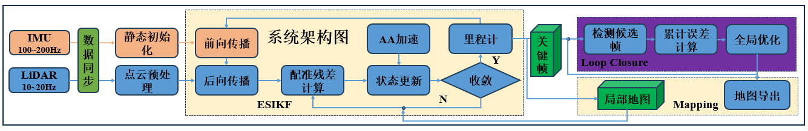
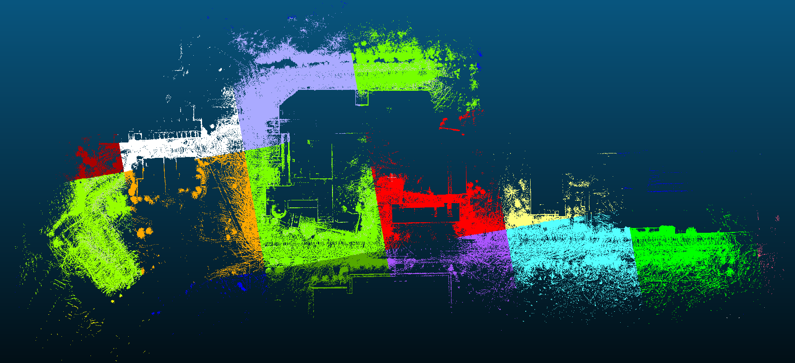
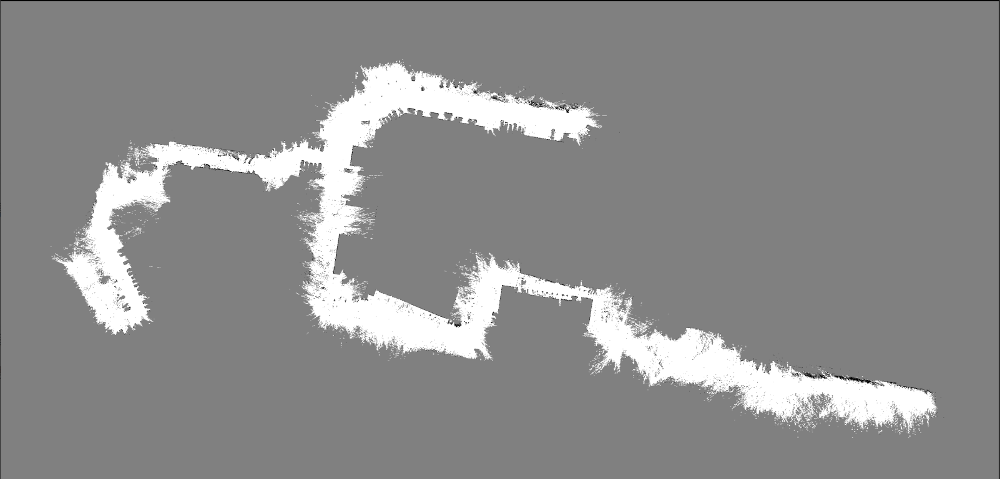

# 一、引言

## 1.1.系统背景

此框架是一个高性能的实时激光雷达-IMU 建图定位系统，基于[AA-FasterLIO](https://ieeexplore.ieee.org/document/9917282)的快速LIO前端，支持紧耦合的IMU-激光融合、实时回环检测、高精度定位和3D到2D地图转换。

## 1.2.符号约定

本文统一采用 [符号说明.md](./符号说明.md) 中的约定。为便于阅读，这里列出后文最常用的符号：

| **符号** | **说明** |
| --- | --- |
| $a,b,c$ | 标量 |
| $p,q,o_a$ | 点；$o_a$ 表示坐标系 $\mathcal{F}_a$ 的原点 |
| $\mathbf{a},\mathbf{b},\mathbf{c}$ | 向量，小写黑体 |
| $\mathbf{A},\mathbf{B},\mathbf{C}$ | 矩阵，大写黑体 |
| $\mathcal{F}_w,\mathcal{F}_i,\mathcal{F}_l$ | 世界坐标系、IMU 坐标系、LiDAR 坐标系 |
| ${}^{a}\mathbf{p}_{ap}$ | 点 $p$ 在坐标系 $\mathcal{F}_a$ 下的坐标列向量；右下标 $ap$ 表示从 $o_a$ 指向点 $p$ |
| ${}^{a}\mathbf{v}$ | 向量 $\mathbf{v}$ 在坐标系 $\mathcal{F}_a$ 下的坐标表达 |
| $\mathbf{R}_{ab}$ | 从坐标系 $\mathcal{F}_b$ 到坐标系 $\mathcal{F}_a$ 的旋转矩阵，${}^{a}\mathbf{v}=\mathbf{R}_{ab}{}^{b}\mathbf{v}$ |
| ${}^{a}\mathbf{t}_{ab}$ | 从 $o_a$ 指向 $o_b$ 的平移向量，在 $\mathcal{F}_a$ 下表达 |
| $\mathbf{T}_{ab}=(\mathbf{R}_{ab},{}^{a}\mathbf{t}_{ab})$ | 从坐标系 $\mathcal{F}_b$ 到坐标系 $\mathcal{F}_a$ 的位姿变换 |
| $[\boldsymbol{\phi}]_{\times}$ | 向量 $\boldsymbol{\phi}$ 对应的叉乘矩阵 |
| $\operatorname{Exp}(\boldsymbol{\phi})$ / $\operatorname{Log}(\mathbf{R})$ | $\operatorname{SO}(3)$ 上的向量形式指数映射和对数映射 |

# 二、系统总体架构

## 2.1.系统概述



建图过程首先从数据加载开始，系统会从指定的ROS bag文件中读取激光雷达点云数据和IMU测量数据，这些数据构成了整个建图过程的基础。在数据处理阶段，系统会对原始激光雷达点云进行预处理，包括点云滤波、采样以及运动畸变校正等操作，同时IMU数据经过的积分处理以提供初始的运动估计信息。预处理后的点云数据会通过高效的iVOX 3D索引结构进行组织，以便于后续的快速邻域搜索和点云配准操作。

系统的核心是LIO前端模块，它采用误差状态迭代卡尔曼滤波器(ESKF)将IMU和激光雷达数据进行紧耦合融合，实现高精度的实时位姿估计。这一过程通过迭代卡尔曼滤波更新来不断优化系统状态，包括位置、姿态、速度和IMU偏差等参数。在位姿估计的同时，系统会根据点云的几何特征和运动轨迹选择关键帧，这些关键帧代表了环境的重要结构信息，将作为后续地图构建和回环检测的基础。

地图构建阶段系统采用增量式的方式将关键帧点云融合到全局地图中，通过分块地图管理技术支持大规模环境的建图需求。每个关键帧的点云数据会被精确地配准到当前估计的位姿上，并与已有地图进行融合，从而构建出稠密的环境三维点云地图。为了确保地图的全局一致性，系统集成了基于多分辨率NDT配准算法的回环检测模块，当检测到回环时会进行位姿图优化以消除累积误差。

在完成三维地图构建后，系统还可以通过g2p5模块将3D点云地图转换为2D栅格地图，为移动机器人导航提供支持。最终整个建图过程会输出完整的点云地图文件和可选的栅格地图文件，这些地图可以用于后续的定位任务。整个离线建图流程确保了处理过程的完整性和可重复性，用户可以通过调试和参数优化来获得最佳的建图效果。

## 2.2.开源数据可视化结果

### 2.2.1.实时可视化效果

略

### 2.2.2.导出地图

当3D地图导出时，系统会保存两种形式的地图数据：**全局地图**是将所有关键帧点云融合后形成的完整点云地图，通常保存为单个PCD文件，代表整个环境的三维结构信息。**分块地图**则是将全局地图按照空间网格划分成多个区块存储，每个区块对应一个独立的文件，这样在后续定位时可以实现按需加载特定区域的地图数据，根据需要进行动态加载和卸载，有效控制内存使用,大大提高定位系统的运行效率。



2D栅格地图:



# 三、关键模块设计

## 3.1 传感器输入层

传感器输入层负责把外部 ROS/rosbag 中的 IMU 与 LiDAR 消息转换为系统内部统一的数据结构，并按时间顺序写入缓存队列。它的处理顺序可以概括为：

```text
外部消息 -> 内部数据格式 -> IMU/LiDAR预处理与缓存 -> 点云-IMU时间同步 -> MeasureGroup
```

在线模式下，输入来自 `SlamSystem` 或 `LocSystem` 中的 ROS2 subscriber；离线模式下，输入来自 `RosbagIO` 对 bag 文件的遍历读取。两种模式最终都会进入 `LaserMapping` 的输入接口。

### **3.1.1 数据格式定义**

**IMU数据格式**：

```C++
struct IMU {
    double timestamp = 0;                         // 时间戳（秒）
    Vec3d angular_velocity = Vec3d::Zero();       // 陀螺仪测量 [rad/s]
    Vec3d linear_acceleration = Vec3d::Zero();    // 加速度计测量 [m/s²]
};
```

**激光雷达数据格式**：

```C++
struct PointXYZIT {
    PCL_ADD_POINT4D;    // x, y, z
    PCL_ADD_INTENSITY;  // intensity
    double time;        // 点在当前扫描帧内的相对时间，单位为毫秒
};
```

系统内部统一使用 `PointCloudType = pcl::PointCloud<PointXYZIT>`。不同雷达的原始字段并不完全一致，例如 Livox 使用 `offset_time`，Ouster 使用 `t`，Velodyne 可能携带 `time` 或需要根据扫描角度估算时间；预处理模块会把这些差异统一到 `PointXYZIT::time` 字段中，供后续时间同步和运动畸变补偿使用。

同步后的数据使用 `MeasureGroup` 表示：

```C++
struct MeasureGroup {
    double lidar_begin_time_ = 0;       // 当前点云帧开始时间
    double lidar_end_time_ = 0;         // 当前点云帧结束时间
    std::deque<IMUPtr> imu_;            // 当前点云帧时间范围内的IMU测量
    CloudPtr scan_ = nullptr;           // 预处理后的当前点云帧
    CloudPtr scan_undist_ = nullptr;    // 去畸变后的点云
};
```

### **3.1.2 预处理与缓存**

这一节对应 `LaserMapping` 的输入接口：

```C++
void LaserMapping::ProcessIMU(const lightning::IMUPtr& imu);
void LaserMapping::ProcessPointCloud2(const sensor_msgs::msg::PointCloud2::SharedPtr& msg);
void LaserMapping::ProcessPointCloud2(const livox_ros_driver2::msg::CustomMsg::SharedPtr& msg);
void LaserMapping::ProcessPointCloud2(CloudPtr cloud);
```

这些函数并不直接执行点云-IMU紧耦合估计，而是完成输入检查、基础预处理和缓存写入。真正的同步和融合发生在后续 `LaserMapping::Run()` 中。

#### **3.1.2.1 IMU预处理与缓存**

IMU 输入进入：

```C++
void LaserMapping::ProcessIMU(const lightning::IMUPtr& imu)
```

该函数主要做三件事：

1. 检查 IMU 时间戳是否倒退。若 `timestamp < last_timestamp_imu_`，清空 `imu_buffer_`，避免旧数据继续参与同步；
2. 如果 IMU 已经完成初始化，则用当前 IMU 调用 `kf_imu_.Predict()` 做高频状态外推，用于 UI 或高频状态输出；
3. 更新 `last_timestamp_imu_`，并将当前 IMU 写入 `imu_buffer_`。

因此，IMU 回调阶段只负责数据缓存和初始化后的高频预测。IMU 静态初始化本身不在这里执行，而是在点云-IMU同步成功后由 `ImuProcess::Process()` 触发。

#### **3.1.2.2 LiDAR点云预处理与缓存**

LiDAR 输入进入：

```C++
void LaserMapping::ProcessPointCloud2(...)
```

该函数先读取点云帧起始时间，然后调用 `PointCloudPreprocess::Process()` 将不同雷达的原始消息统一成系统内部的 `PointCloudType`。

统一后的点包含：

- `x, y, z`：LiDAR 坐标系下的三维坐标；
- `intensity`：统一后的反射强度；
- `time`：点在当前扫描帧内的相对时间，单位为毫秒。

不同雷达的预处理差异如下：

| 功能       | Livox                                     | Ouster                                | Velodyne                              | 说明         |
| ---------- | ----------------------------------------- | ------------------------------------- | ------------------------------------- | ------------ |
| 格式转换   | `CustomMsg -> PointCloudType`             | `PointCloud2 -> PointCloudType`       | `PointCloud2 -> PointCloudType`       | 屏蔽消息格式差异 |
| 点过滤     | 标签、盲区、重复点、抽样                   | 盲区、抽样                             | 盲区、抽样                             | 控制点云质量和规模 |
| 强度字段   | `reflectivity`                            | `intensity`                           | `intensity`                           | 统一为 `intensity` |
| 时间字段   | `offset_time / 1e6`                       | `t / 1e6`                             | 原始 `time` 或扫描角估算               | 统一为毫秒级相对时间 |

其中最关键的是逐点相对时间。预处理阶段必须保证 `time` 字段单位正确、范围合理，并能覆盖当前扫描周期，因为后续时间同步和点云去畸变都依赖该字段。不同雷达的时间来源如下：

| 特性       | Livox                 | Ouster     | Velodyne (有原始时间戳) | Velodyne (无原始时间戳) |
| ---------- | --------------------- | ---------- | ----------------------- | ----------------------- |
| 时间戳字段 | offset_time           | t          | time                    | -                       |
| 计算方式   | offset_time / 1000000 | t / 1e6    | time * time_scale_      | 基于扫描角度计算        |
| 时间基准   | 帧起始点              | 帧起始点   | 帧起始点                | 每条扫描线起始点        |
| 时间范围   | 0~100ms               | 0~100ms    | 0~100ms                 | 每条线0~(360/3.6)ms     |
| 原始单位   | 纳秒 (ns)             | 纳秒 (ns)  | 微秒 (μs)               | -                       |
| 输出单位   | 毫秒 (ms)             | 毫秒 (ms)  | 毫秒 (ms)               | 毫秒 (ms)               |

需要注意的是，Velodyne 在没有原始逐点时间戳时，会根据扫描角度估算相对时间，这一假设依赖雷达转速配置；如果实际转速与假设不一致，会影响后续去畸变效果。

Livox 还会额外使用 `tag` 字段过滤低质量回波：

```C++
((msg->points[i].tag & 0x30) == 0x10 || (msg->points[i].tag & 0x30) == 0x00)
```

这里通过 `0x30` 提取 `tag` 中与回波质量相关的位，只保留 `0x00` 和 `0x10` 两类点，丢弃更可能由弱回波、多路径或杂散反射产生的点。

> 参考Livox 的官网 “[How to use Tag Information in Livox LiDAR Point Cloud](https://www.livoxtech.com/showcase/livox-tag?utm_source=chatgpt.com)” 

预处理完成后，点云和帧起始时间分别写入缓存：

```C++
lidar_buffer_.push_back(cloud);
time_buffer_.push_back(timestamp);
```

其中 `lidar_buffer_` 保存点云本体，`time_buffer_` 保存该点云帧的绝对起始时间。这样设计是因为 PCL 点云内部只保存逐点相对时间，而帧起始时间来自 ROS 消息头。

### **3.1.3 时间同步机制**

时间同步发生在前端循环中：

```C++
bool LaserMapping::SyncPackages();
```

该函数从缓存中取出一帧点云，并收集覆盖该点云扫描周期的 IMU 测量，形成 `MeasureGroup`。同步过程如下：

1. 从 `lidar_buffer_` 取出最早的一帧点云作为当前扫描；
2. 从 `time_buffer_` 取出该帧点云的起始时间，写入 `measures_.lidar_begin_time_`；
3. 根据当前点云最后一个点的相对时间估计帧结束时间：

```C++
lidar_end_time_ = measures_.lidar_begin_time_
                + measures_.scan_->points.back().time / 1000.0;
```

4. 如果最新 IMU 时间 `last_timestamp_imu_` 还早于 `lidar_end_time_`，说明 IMU 尚未覆盖完整点云扫描周期，本次同步失败，等待更多 IMU 数据；
5. 如果 IMU 数据充足，则从 `imu_buffer_` 中取出时间不超过 `lidar_end_time_` 的 IMU 测量，写入 `measures_.imu_`；
6. 弹出已经同步完成的点云帧和对应起始时间。

同步成功后，`LaserMapping::Run()` 会调用：

```C++
p_imu_->Process(measures_, kf_, scan_undistort_);
```

这一阶段才真正使用“点云 + 对齐 IMU”的测量组：若 IMU 尚未初始化，则执行静态初始化；若已经初始化，则进行 IMU 前向传播和点云运动畸变补偿。

## 3.2 前端里程计（LiDAR Odometry）

借鉴[Fast-LIO](https://arxiv.org/abs/2010.08196)算法采用紧耦合的传感器融合架构，区别于松耦合仅融合两种传感器的最终结果，该架构将 LiDAR 点云数据和 IMU 的角速度、加速度数据深度融合到同一个状态估计框架中。两种数据共同参与状态方程构建和残差计算，能充分利用各自优势 ——IMU 高频特性可弥补 LiDAR 帧率低的缺陷，解决快速运动时的点云畸变问题；LiDAR 的高精度距离测量则能校正 IMU 的累积误差。

在代码实现上，前端里程计的主入口是 `LaserMapping::Run()`。上一节得到的 `MeasureGroup` 会首先进入 IMU 处理模块：

```C++
p_imu_->Process(measures_, kf_, scan_undistort_);
```

其中 `measures_` 是当前点云帧及其时间范围内的 IMU 序列，`kf_` 是 LIO 前端维护的 ESKF 状态，`scan_undistort_` 是 IMU 处理后的去畸变点云输出。`ImuProcess::Process()` 是这一阶段的调度入口：如果 IMU 尚未初始化，则执行静态初始化；如果初始化已经完成，则执行 IMU 前向传播和点云运动畸变补偿。

### 3.2.1 IMU处理入口

`ImuProcess::Process()` 的主要逻辑如下：

```C++
void ImuProcess::Process(const MeasureGroup& meas, ESKF& kf_state, CloudPtr& scan) {
    if (meas.imu_.empty()) {
        return;
    }

    if (imu_need_init_) {
        IMUInit(meas, kf_state, init_iter_num_);
        ...
        return;
    }

    UndistortPcl(meas, kf_state, scan);
}
```

这个函数本身不做复杂数学计算，而是根据 `imu_need_init_` 选择后续流程：

1. `imu_need_init_ == true`：调用 `IMUInit()`，统计启动初期 IMU 数据，初始化重力方向和陀螺零偏；
2. `imu_need_init_ == false`：调用 `UndistortPcl()`，利用当前点云周期内的 IMU 序列进行 ESKF 前向传播，并把点云补偿到扫描结束时刻。

因此，它对应文档中后续三个部分：IMU静态初始化、前向传播、点云去畸变。

### 3.2.2 IMU静态初始化

IMU初始化是激光雷达惯性里程计(LIO)系统中的关键步骤，其目的是通过统计方法估计IMU的关键参数，包括：

- **重力向量**：确定重力在世界坐标系中的方向
- **零偏**：估计IMU系统性偏差
- **噪声**：估计IMU的测量噪声方差

IMU连续时间测量模型如下：

$$
\begin{aligned}
{}^{i}\overline{\mathbf{a}}
&= \mathbf{R}_{iw}\left({}^{w}\mathbf{a}-{}^{w}\mathbf{g}\right)
   +{}^{i}\mathbf{b}_a+\mathbf{n}_a,\\
{}^{i}\overline{\boldsymbol{\omega}}
&= {}^{i}\boldsymbol{\omega}+{}^{i}\mathbf{b}_g+\mathbf{n}_g .
\end{aligned}
$$

其中，$\mathbf{n}_g,\mathbf{n}_a$ 表示 IMU 测量噪声，${}^{i}\mathbf{b}_g,{}^{i}\mathbf{b}_a$ 表示 IMU 零偏，${}^{i}\overline{\mathbf{a}},{}^{i}\overline{\boldsymbol{\omega}}$ 表示 IMU 测量值，均在 IMU 坐标系 $\mathcal{F}_i$ 下表达。加速度计测量包含重力项，所以模型中需要显式写出 ${}^{w}\mathbf{g}$。这里 $\mathbf{R}_{iw}=\mathbf{R}_{wi}^{\mathsf{T}}$，用于把世界系中的向量转到 IMU 坐标系表达。

所谓静态初始化，就是假设系统启动初期 IMU 处于静止或近似静止状态。在这段时间内，由于载体没有明显运动，可以简单地认为 IMU 的陀螺仪主要测到零偏，而加速度计主要测到重力方向。当前代码中的初始化入口位于：

```C++
void ImuProcess::IMUInit(const MeasureGroup& meas, ESKF& kf_state, int& N);
```

它不是在 IMU 回调中立即执行，而是在 `LaserMapping::Run()` 完成点云与 IMU 时间同步后，由 `p_imu_->Process(measures_, kf_, scan_undistort_)` 触发。初始化阶段会累计同步得到的 IMU 样本，使用增量均值公式统计陀螺仪和加速度计读数：

```C++
mean_acc_ += (cur_acc - mean_acc_) / N;
mean_gyr_ += (cur_gyr - mean_gyr_) / N;
```

然后使用加速度均值的反方向初始化重力向量，并使用角速度均值初始化陀螺零偏：

```C++
init_state.grav_ = -mean_acc_ / mean_acc_.norm() * G_m_s2;
init_state.bg_ = mean_gyr_;
```

因此，当前实现中的初始化流程可以概括为：

1. 启动后 IMU 数据先进入 `imu_buffer_`；
2. 点云数据进入 `lidar_buffer_` 和 `time_buffer_`；
3. `SyncPackages()` 取出一帧点云及其结束时间之前的 IMU，组成 `MeasureGroup`；
4. `ImuProcess::Process()` 在 `imu_need_init_ == true` 时调用 `IMUInit()`；
5. `IMUInit()` 统计累计 IMU 样本的加速度均值和角速度均值；
6. 由加速度均值初始化重力方向，由角速度均值初始化陀螺零偏；
7. 当累计样本数超过 `max_init_count_` 后，`imu_need_init_` 置为 `false`，后续进入正常 IMU 前向传播和点云去畸变流程。

> 注意：
>
> - 当前代码没有轮速计静止判定，也没有显式的 10 秒初始化窗口；它默认启动初期数据可用于静态初始化，并以累计 IMU 样本数 `max_init_count_ = 20` 作为结束条件。
> - 当前代码初始化了陀螺零偏 `bg_` 与重力方向 `grav_`，没有显式估计加速度计零偏；初始化阶段统计得到的 `cov_acc_`、`cov_gyr_` 随后会被配置中的 `acc_cov`、`gyr_cov` 覆盖为过程噪声参数。
> - 在重力方向初始化之后，理论上还可以基于矢量定姿进一步估计 $\mathbf{R}_{wi}$ 作为姿态初值，但当前实现没有额外做这一步。

### 3.2.3 前向传播：ESKF 预测与状态缓存

初始化完成后，`ImuProcess::Process()` 会调用 `UndistortPcl()`。该函数首先把上一帧末尾的 `last_imu_` 插入当前 IMU 序列头部，保证相邻点云帧之间的 IMU 积分连续：

```C++
auto v_imu = meas.imu_;
v_imu.push_front(last_imu_);
```

随后遍历当前点云扫描周期内的 IMU 测量。对每一对相邻 IMU 测量 `head` 和 `tail`，代码取平均角速度和平均加速度作为该时间段内的输入：

```C++
angvel_avr = 0.5 * (head->angular_velocity + tail->angular_velocity);
acc_avr = 0.5 * (head->linear_acceleration + tail->linear_acceleration);
acc_avr = acc_avr * acc_scale_factor_;
```

其中 `acc_scale_factor_` 来自初始化阶段，用于兼容加速度单位为 `g` 或 `m/s²` 的数据。接着根据 IMU 时间差 `dt` 调用 ESKF 预测：

```C++
kf_state.Predict(dt, Q_, gyro, acc);
```

当前版本的 `NavState` 主要包含位置、姿态、速度、陀螺零偏和重力方向：

```C++
struct NavState {
    Vec3d pos_;    // IMU在世界系下的位置
    SO3 rot_;      // IMU到世界系的旋转
    Vec3d vel_;    // 世界系速度
    Vec3d bg_;     // 陀螺零偏
    Vec3d grav_;   // 世界系重力向量
};
```

名义状态的连续运动模型可以概括为：

$$
\dot{\mathbf{p}} = \mathbf{v}, \quad
\dot{\mathbf{R}}_{wi} = \mathbf{R}_{wi}[{}^{i}\overline{\boldsymbol{\omega}}-{}^{i}\mathbf{b}_g]_{\times},\quad
{}^{w}\dot{\mathbf{v}} = \mathbf{R}_{wi}({}^{i}\overline{\mathbf{a}}-{}^{i}\mathbf{b}_a)+{}^{w}\mathbf{g}
$$

对应到代码，是 `NavState::get_f()`、`NavState::df_dx()`、`NavState::df_dw()` 和 `NavState::oplus()` 共同完成名义状态积分与协方差传播。

每完成一次预测，代码会把当前 IMU 时刻对应的状态缓存到 `imu_pose_`：

```C++
imu_pose_.emplace_back(
    Pose6D(offs_t, acc_s_last_, angvel_last_,
           imu_state.vel_, imu_state.pos_, imu_state.rot_.matrix()));
```

`imu_pose_` 可以理解为当前扫描周期内的离散 IMU 轨迹。后续点云去畸变会根据每个点的相对时间，找到它所在的 IMU 时间区间，并将点补偿到统一参考时刻。

最后，如果 IMU 序列末尾时间 `imu_end_time` 和点云帧结束时间 `pcl_end_time` 不一致，代码会再执行一次预测，把滤波器状态对齐到点云帧末尾：

```C++
dt = note * (pcl_end_time - imu_end_time);
kf_state.Predict(dt, Q_, gyro, acc);
```

### 3.2.4 后向传播：点云去畸变

完成前向传播后，将当前帧点云按照点的 `time` 字段进行升序排序。遍历点云去畸变阶段采用“双向遍历”策略，从最后一个点向前遍历，同时从最后一个 IMU 结点向前遍历 `imu_pose_`，保证在时间上“对齐”每个点所属的 IMU 时间区间。

假设第 $j$ 个点在相邻两个 IMU 结点 $t_m$ 与 $t_{m+1}$ 之间，点所在时间 $t_j=t_m+\Delta t$。

- 姿态更新：

$$
\mathbf{R}_{wi_j}\approx
\mathbf{R}_{wi_m}\operatorname{Exp}\left({}^{i}\boldsymbol{\omega}_{\text{avg}}\Delta t\right)
$$

- 位置更新（匀加速模型+欧拉积分）：

$$
{}^{w}\mathbf{t}_{wi_j}
\approx {}^{w}\mathbf{t}_{wi_m}
      +{}^{w}\mathbf{v}_{m}\Delta t
      +\frac{1}{2}{}^{w}\mathbf{a}_{m}\Delta t^2
$$

代码中的实现对应为：

```C++
Mat3d R_i(R_imu * math::exp(angvel_avr, 0.5 * dt).matrix());
Vec3d T_ei = pos_imu + vel_imu * dt + 0.5 * acc_imu * dt * dt - imu_state.pos_;
```

给定一个在时刻 $t_j$ 采集的原始点 $p_j$，其在采样时刻 LiDAR 坐标系 $\mathcal{F}_{l_j}$ 下的坐标为 ${}^{l_j}\mathbf{p}_{l_jj}$。补偿过程可以抽象为以下 4 步坐标变换（约定：世界坐标系为 $\mathcal{F}_w$，IMU 坐标系为 $\mathcal{F}_i$，LiDAR 坐标系为 $\mathcal{F}_l$），坐标变换链如下：

- LiDAR → IMU（外参）：

$$
{}^{i_j}\mathbf{p}_{i_jj}
= \mathbf{R}_{il}\,{}^{l_j}\mathbf{p}_{l_jj}
  +{}^{i}\mathbf{t}_{il}
$$

- IMU → 世界，在采样时刻 $t_j$：

$$
{}^{w}\mathbf{p}_{wj}
= \mathbf{R}_{wi_j}\,{}^{i_j}\mathbf{p}_{i_jj}
  +{}^{w}\mathbf{t}_{wi_j}
$$

- 世界 → 参考 IMU 帧（帧末 $t_{e}$）：

$$
{}^{i_e}\mathbf{p}_{i_ej}
= \mathbf{R}_{i_ew}
  \left({}^{w}\mathbf{p}_{wj}-{}^{w}\mathbf{t}_{wi_e}\right)
$$

- IMU → LiDAR（再用外参反变换）：

$$
{}^{l_e}\mathbf{p}_{l_ej}
= \mathbf{R}_{li}
  \left({}^{i_e}\mathbf{p}_{i_ej}-{}^{i}\mathbf{t}_{il}\right)
$$

综合起来就是：点从采样时刻的 LiDAR 坐标系 $\mathcal{F}_{l_j}$ → 参考时刻的 LiDAR 坐标系 $\mathcal{F}_{l_e}$ 的完整变换链。

代码中的实现：

```C++
Vec3d p_compensate = R_lidar_imu_.transpose() *
                     (imu_state.rot_.inverse() *
                          (R_i * (R_lidar_imu_ * P_i + t_lidar_mu_) + T_ei) -
                      t_lidar_mu_);
```

与上述公式一一对应

- `R_lidar_imu_` ≈ $\mathbf{R}_{il}$；
- `t_lidar_mu_` ≈ ${}^{i}\mathbf{t}_{il}$；
- `R_i` ≈ $\mathbf{R}_{wi_j}$；
- `imu_state.rot_` / `imu_state.pos_` ≈ $\mathbf{R}_{wi_e},{}^{w}\mathbf{t}_{wi_e}$；
- `T_ei` ≈ ${}^{w}\mathbf{t}_{wi_j}-{}^{w}\mathbf{t}_{wi_e}$。

最终 `p_compensate` 就是该点补偿到帧末参考时刻 $t_e$ 后，在 LiDAR 坐标系 $\mathcal{F}_{l_e}$ 下的坐标，用来回写到点云中。

### 3.2.5.状态更新

```C++
void ESKF::Update(ESKF::ObsType obs, const double& R);
```

#### 3.2.5.1.模块总体思路

ESKF（误差状态卡尔曼滤波）的状态更新模块运行在预测步骤之后，用于在给定观测的条件下修正当前名义状态和误差协方差。该模块采用迭代扩展卡尔曼滤波（IEKF）框架：在每次更新周期内，以预测结果为线性化起点，通过多次迭代不断重算观测残差和雅可比，直到状态增量和残差满足收敛条件或者达到最大迭代次数为止。

在此基础上，模块支持多种观测类型（激光雷达、轮速、GPS、加速度重力约束以及偏置观测等），并引入 Anderson 加速来改善大规模点云观测下的迭代收敛速度。在状态空间的数学处理上，旋转部分使用 SO(3) 李群/李代数形式，重力使用 S² 球面流形表示，因此在误差状态和协方差的传播、更新中都包含必要的流形变换。

卡尔曼增益的计算对观测维度具有自适应特性：对于维度较低的稀疏观测，直接使用经典的矩阵形式；而在激光雷达等高维场景下，则转为信息形式以避免在大规模矩阵上进行直接求逆，从而提高数值稳定性和计算效率。

#### 3.2.5.2.观测模型线性化

观测更新对具体传感器（Lidar、轮速、GPS、加速度重力约束、偏置约束等）做了一层统一抽象：

$$
\mathbf{r}_k
= \mathbf{z}_k-\mathbf{h}(\hat{\mathbf{x}}_k,\tilde{\mathbf{x}}_k)
= \mathbf{n}_k,\quad
\mathbf{n}_k\sim\mathcal{N}(\mathbf{0},\mathbf{N}_k)
$$

在 $\hat{\mathbf{x}}_k^\kappa$ 处关于 $\tilde{\mathbf{x}}_k^\kappa=\mathbf{0}$ 线性化得到：

$$
\mathbf{r}_{k,j}^\kappa
= \mathbf{z}_{k,j}^\kappa
 - \mathbf{h}(\hat{\mathbf{x}}_k^\kappa,\mathbf{0})
 - \mathbf{H}_{k,j}^\kappa\tilde{\mathbf{x}}_k^\kappa
= \mathbf{n}_{k,j}^\kappa,\quad
\mathbf{n}_{k,j}^\kappa\sim\mathcal{N}(\mathbf{0},\mathbf{N}_{k,j}^\kappa)
$$

其中雅可比为：

$$
\mathbf{H}_{k,j}^\kappa
= \left.
   \frac{\partial\mathbf{h}}{\partial\hat{\mathbf{x}}_k}
  \right|_{\hat{\mathbf{x}}_k=\hat{\mathbf{x}}_k^\kappa}
  \left.
   \frac{\partial\hat{\mathbf{x}}_k}{\partial\tilde{\mathbf{x}}_k}
  \right|_{\tilde{\mathbf{x}}_k^\kappa=\mathbf{0}}
$$

$$
\frac{\partial\hat{\mathbf{x}}_k}{\partial\tilde{\mathbf{x}}_k}
= \operatorname{diag}\left(
-\mathbf{I}_3,
-\mathbf{I}_3,
\mathbf{J}_r^{-1}(\boldsymbol{\theta}_{wi}),
-\mathbf{I}_3,
-\mathbf{I}_3,
-\mathbf{I}_3
\right)
$$

其中 $\mathbf{J}_r$ 是 $\operatorname{SO}(3)$ 的右雅可比，参数为当前姿态对应的旋转向量 $\boldsymbol{\theta}_{wi}=\operatorname{Log}(\mathbf{R}_{wi})$。**观测模型只负责给出** $\mathbf{r}_{k,j}^\kappa,\mathbf{H}_{k,j}^\kappa,\mathbf{N}_{k,j}^\kappa$，求解误差状态、Anderson 加速、协方差更新等都由 ESKF 内部统一完成。

#### 3.2.5.3.先验分布在迭代点的表示

已有先验分布 $\tilde{\mathbf{x}}_k^{-}\sim\mathcal{N}(\mathbf{0},\tilde{\mathbf{P}}_k^{-})$。由于线性化点变为 $\hat{\mathbf{x}}_k^\kappa$，需要把先验分布重新表示到当前迭代误差坐标中：

$$
\tilde{\mathbf{x}}_k^\kappa
\sim \mathcal{N}\left(
\tilde{\boldsymbol{\mu}}_k^{\kappa-},
\tilde{\mathbf{P}}_k^{\kappa-}
\right)
$$

其中，

$$
\mathbf{J}_k^\kappa
= \operatorname{diag}\left(
\mathbf{I}_3,\mathbf{I}_3,\mathbf{J}_r^{-1}(\boldsymbol{\xi}_{R,k}^{\kappa}),
\mathbf{I}_3,\mathbf{I}_3,\mathbf{I}_3
\right),
$$

$$
\boldsymbol{\xi}_{R,k}^{\kappa}
= \operatorname{Log}\left(\mathbf{R}_{wi_k^{-}}^{\mathsf{T}}\mathbf{R}_{wi_k^\kappa}\right)
= \operatorname{Log}\left(\mathbf{R}_{i_k^{-}i_k^\kappa}\right).
$$

最终得到：

$$
\tilde{\boldsymbol{\mu}}_k^{\kappa-}
\approx -(\mathbf{J}_k^\kappa)^{-1}
          \left(\hat{\mathbf{x}}_k^\kappa\boxminus\hat{\mathbf{x}}_k^{-}\right),
\quad
\tilde{\mathbf{P}}_k^{\kappa-}
\approx
(\mathbf{J}_k^\kappa)^{-1}
\tilde{\mathbf{P}}_k^{-}
(\mathbf{J}_k^\kappa)^{-\mathsf{T}}
$$

#### 3.2.5.4.迭代更新

最终迭代更新变为最大后验估计（MAP）问题：


进行如下分量合并:

$$
\mathbf{H}_k^\kappa
= \begin{bmatrix}
\mathbf{H}_{k,1}^\kappa\\
\vdots\\
\mathbf{H}_{k,M_k}^\kappa
\end{bmatrix},\quad
\mathbf{N}_k^\kappa
= \operatorname{diag}\left(
\mathbf{N}_{k,1}^\kappa,\dots,\mathbf{N}_{k,M_k}^\kappa
\right),
$$

$$
\mathbf{r}_k^\kappa
= \begin{bmatrix}
\mathbf{r}_{k,1}^\kappa\\
\vdots\\
\mathbf{r}_{k,M_k}^\kappa
\end{bmatrix},\quad
\mathbf{z}_k^\kappa
= \begin{bmatrix}
\mathbf{z}_{k,1}^\kappa\\
\vdots\\
\mathbf{z}_{k,M_k}^\kappa
\end{bmatrix}.
$$

最终得到ESKF更新方程如下：

$$
\begin{aligned}
\mathbf{K}_k^\kappa
&= \tilde{\mathbf{P}}_k^{\kappa-}\mathbf{H}_k^{\kappa\mathsf{T}}
   \left(
      \mathbf{H}_k^\kappa\tilde{\mathbf{P}}_k^{\kappa-}\mathbf{H}_k^{\kappa\mathsf{T}}
      +\mathbf{N}_k^\kappa
   \right)^{-1},\\
\tilde{\boldsymbol{\mu}}_k^{\kappa+}
&= \tilde{\boldsymbol{\mu}}_k^{\kappa-}
   +\mathbf{K}_k^\kappa
      \left(\mathbf{r}_k^\kappa
      -\mathbf{H}_k^\kappa\tilde{\boldsymbol{\mu}}_k^{\kappa-}\right),\\
\tilde{\mathbf{P}}_k^{\kappa+}
&= \left(\mathbf{I}-\mathbf{K}_k^\kappa\mathbf{H}_k^\kappa\right)
   \tilde{\mathbf{P}}_k^{\kappa-}.
\end{aligned}
$$

### 3.2.5 卡尔曼增益优化策略

借鉴FAST-LIO 中优化的卡尔曼增益计算方法。传统的ESKF更新方程如上所示，其中卡尔曼增益计算公式为：


其中 $\tilde{\mathbf{P}}$ 是误差状态协方差矩阵，$\mathbf{H}$ 是观测雅可比矩阵，$\mathbf{N}$ 是观测噪声协方差矩阵。当用于计算残差的特征点数量特别大时，计算 $\mathbf{H}\tilde{\mathbf{P}}\mathbf{H}^{\mathsf{T}}+\mathbf{N}$ 时维度将变为 $m\times m$，需要对该矩阵进行求逆，导致计算量急剧增加。

FAST-LIO 通过 Sherman-Morrison-Woodbury（SMW）恒等式解决了这一问题，提出了一个新的卡尔曼增益计算公式，并证明它与传统卡尔曼增益计算结果是等价的。新公式的计算复杂度取决于状态维度 $n$ 而不是测量维度 $m$，从而大幅降低了计算负担。


### **3.2.6 点云直接配准技术（Direct Registration）**

采用直接配准技术，即不提取特征直接将原始点配准到地图（并随后更新地图，即建图）。这一技术使得环境中的细微特征能够被使用，从而提高匹配准确性，且取消提取特征模块能够适应有着不同扫描模式的新兴雷达。

传统的基于LOAM算法的激光里程计需要从点云中提取边缘特征和平面特征（基于局部平滑度等几何属性），用特征点与地图匹配以减少计算量。这里对其进一步优化，取消手动特征提取步骤，直接将所有原始点云配准到地图，既能保留环境细微结构提升精度，又能适配不同扫描模式的 LiDAR。

直接配准技术的优势主要体现在：

- **精度提升**：能够利用环境中的细微特征，提高匹配准确性
- **适应性增强**：无需针对特定 LiDAR 的扫描模式定制算法，自然适配固态激光雷达等多种传感器
- **计算简化**：减少了特征提取的计算开销，提高整体效率

**点到面距离残差模型**：

$$
r_j
= {}^{w}\mathbf{n}_{j}^{\mathsf{T}}
  \left(
    \mathbf{R}_{wi}\,{}^{i}\mathbf{p}_{ij}
    +{}^{w}\mathbf{t}_{wi}
    -{}^{w}\mathbf{p}_{wq_j}
  \right)
  +d_j
$$

其中 ${}^{w}\mathbf{n}_{j}$ 和 $d_j$ 表示局部平面参数，${}^{i}\mathbf{p}_{ij}$ 是当前扫描点在 IMU 坐标系下的坐标，${}^{w}\mathbf{p}_{wq_j}$ 是平面上一点 $q_j$ 在世界坐标系下的坐标。

```C++
// 观测模型实现（laser_mapping.cc:501-625）
struct ObsModel {
    // 点到平面距离残差
    float pd2 = plane_coef_[i].dot(temp);  // plane_coef: [a,b,c,d]
    residuals_[i] = pd2;  // 点到平面的有向距离

    // 雅可比矩阵计算
    Vec3f norm_vec = corr_norm_[i].head<3>();
    Vec3f C(Rt * norm_vec);          // 法向量转换到机体坐标系
    Vec3f A(point_crossmat * C);     // 旋转部分雅可比

    // 完整雅可比矩阵 [位置, 旋转, 外参旋转, 外参平移]
    obs.h_x_.block<1, 12>(i, 0) << norm_vec[0], norm_vec[1], norm_vec[2],  // 位置
                                   A[0], A[1], A[2],                    // 旋转
                                   B[0], B[1], B[2],                    // 外参旋转
                                   C[0], C[1], C[2];                    // 外参平移
};
```

## 3.3 **局部地图构建（Local Mapping）**

激光建图系统中，局部地图管理模块ivox、EKF（扩展卡尔曼滤波器）和长期地图关键帧（Keyframe）三者紧密协作，共同支撑定位与建图的实时性和精度：

1. **实时定位**：EKF 通过 IMU 预测位姿，结合ivox提供的局部点云匹配结果修正位姿，输出高频状态。
2. **局部建图**：ivox以 EKF 位姿为基准，增量式存储近期点云，为 EKF 提供观测约束。
3. **长期地图**：当移动超过阈值时，EKF 位姿和ivox中的点云被封装为关键帧，构建全局地图。
4. **全局修正**：回环检测通过关键帧匹配发现漂移，修正后的位姿反哺 EKF 和 ivox，确保局部与全局地图的一致性。

### 3.3.1 局部地图结构

增量式体素网格ivox作为局部地图管理的核心组件，负责高效存储、更新和查询激光点云数据，为前端里程计laser_mapping提供实时点云匹配的环境模型。ivox基于**体素网格（Voxel Grid）** 实现，是一种轻量级的三维空间索引结构，专为实时 SLAM 场景设计。其核心思路包括：

1. 空间分区与稀疏存储
   1. 将三维空间划分为等大小的立方体体素（voxel），每个体素作为独立的空间单元，仅存储落在该区域内的点云数据。
   2. 采用**稀疏存储策略**：仅为包含点云的体素分配内存，避免对空区域的无效占用，适合大规模场景。
2. 增量式地图更新
   1. 随着传感器移动，新的激光点云（去畸变并转换到世界坐标系后）被**增量式添加到 ivox** 中，无需重建整个地图。
   2. 结合关键帧机制（当移动距离或角度超过阈值时创建关键帧），控制地图增长速度，平衡精度与效率。
3. 高效邻域查询
   1. 支持快速查询目标点周围的邻域体素（如 6 邻域、18 邻域、26 邻域），为点到平面（point-to-plane）匹配提供局部几何特征（如平面系数）。
   2. 通过体素索引加速最近点搜索，减少点云匹配时的计算量。
4. 多分辨率滤波
   1. 对输入点云进行降采样（通过PCL voxel fitler滤波器），控制每个体素内的点数量，避免冗余数据影响性能。

**IVox高效索引结构**：

```C++
template<int Dim, typename PointT, typename DistanceT = IVoxNodeType::PHC>
class IVox {
    enum class NearbyType {
        CENTER,   // 仅中心栅格
        NEARBY6,  // 6邻域
        NEARBY18, // 18邻域
        NEARBY26  // 26邻域
    };
    
private:
    // 哈希网格 + 链表缓存结构
    std::unordered_map<KeyType, typename std::list<std::pair<KeyType, NodeType>>::iterator> grids_map_;
    std::list<std::pair<KeyType, NodeType>> grids_cache_;
    // PHC: Parallel Hierarchical Clustering节点
    // Linear: 线性节点
    struct NodeType {
        PointT point_;          // 中心点
        std::vector<PointT> points_;  // 聚类点集
        DirectVectorArray direct_vector_array_;  // 方向向量数组
    };
};
```

**近邻搜索算法**：

```C++
template<typename PointT>
void IVox::GetKNNPoints(const PointT& point, size_t K,
                       std::vector<PointT>& cloud_res,
                       NearbyType nearby_type = NearbyType::NEARBY6) {
    // 计算查询点所在的网格
    KeyType center_key = PtToKey(point);
    // 根据邻域类型获取候选网格
    std::vector<KeyType> nearby_keys = GetNearbyKeys(center_key, nearby_type);
    // 遍历候选网格，收集候选点
    std::vector<std::pair<PointT, double>> candidates;
    for (const auto& key : nearby_keys) {
        auto it = grids_map_.find(key);
        if (it != grids_map_.end()) {
            for (const auto& pt : it->second->second.points_) {
                double dist = distance_(point, pt);
                candidates.push_back({pt, dist});
            }
        }
    }
    // 距离排序，取前K个最近邻
    std::partial_sort(candidates.begin(), candidates.begin() + K, candidates.end(),
                     [](const auto& a, const auto& b) { return a.second < b.second; });
    for (size_t i = 0; i < K && i < candidates.size(); i++) {
        cloud_res.push_back(candidates[i].first);
    }
}
```

### 3.3.2 **局部地图与EKF**

- EKF为局部地图模块ivox 提供当前传感器的位姿预测，ivox在接收新的激光点云后，需通过 EKF 输出的位姿将点云从车体坐标系转换到世界坐标系，再存入体素网格。
- EKF 的更新阶段（`kf_.Update(ESKF::ObsType::LIDAR, ...)`）需要利用ivox存储的局部点云计算几何约束（如点到平面残差）。ivox 通过高效的邻域查询（如 18 邻域）为当前扫描点提供附近平面特征，帮助 EKF 修正位姿误差，实现 “预测 - 观测 - 更新” 的闭环。

### 3.3.3 **局部地图与全局关键帧**

- **短期存储与长期存储**：局部地图ivox实时维护最近的局部点云（数秒内的扫描数据），用于高频位姿优化；而关键帧则是长期地图的核心，当移动距离或角度超过阈值（`kf_dis_th_`、`kf_angle_th_`）时，当前位姿和点云被永久保存为新的关键帧。
- **回环检测与全局一致**：局部地图ivox仅保留局部数据，而关键帧序列构成全局地图的骨架。回环检测（`loop_closing`模块）通过匹配历史关键帧修正位姿漂移，修正后的位姿会反哺ivox，确保局部地图与全局坐标系的一致性。
- **数据流转与生命周期**：新点云先经ivox增量更新（`MapIncremental`），再根据关键帧触发条件决定是否存入长期地图。关键帧点云可用于g2p5模块生成 2.5D 栅格地图，而ivox专注于为前端定位提供低延迟的局部特征。

## **3.4 回环检测（Loop Closure）**

回环检测（Loop Closure）模块通过检测机器人轨迹、精位姿精匹配和位姿图优化，Loop Closure 模块通过 “候选检测 - 精匹配 - 图优化” 流程实现全局位姿修正，核心依赖关键帧的时空特征和 NDT 配准。其与其他模块的关系体现为：

- **数据层面**：接收`laser_mapping`的关键帧，输出修正后的位姿给`pose_graph`、`g2p5`等模块。
- **功能层面**：弥补前端建图的累积误差，保障`g2p5`栅格地图和`ivox`局部地图的全局一致性，是实现高精度 SLAM 的核心后端模块。

Loop Closure模块核心流程如下：

### **3.4.1 初始化设置**

- **优化器配置**：基于轻量级优化库，采用 Levenberg-Marquardt 算法和稀疏线性求解器，支持增量式优化（无需重建模型）。
- **噪声矩阵设置**：
  - 运动约束噪声矩阵：控制相邻关键帧间相对位姿的权重，位移噪声默认0.1m，旋转噪声默认3°。
  - 回环约束噪声矩阵：控制回环帧间相对位姿的权重，位移噪声默认0.2m，旋转噪声默认3°。
- **参数加载**：从 YAML 文件读取回环检测阈值（如关键帧间隔、距离阈值等），并初始化在线模式的多线程处理。

### **3.4.2 候选帧筛选策略**

- **触发条件**：每间隔一定数量关键帧（默认 20 个）关键帧触发一次检测，避免高频冗余计算。
- **时空筛选**：
  - **时间约束**：候选帧与当前帧的 ID 差需大于`closest_id_th_`（默认 50），且同轨迹内候选帧 ID 差需大于`min_id_interval_`（默认 20），排除近期帧以减少误匹配。
  - **空间约束**：计算候选帧与当前帧在优化位姿下的平面距离（x-y 方向），筛选距离小于`max_range_`（默认 30 米）的帧作为潜在候选。
- **初始位姿估计**：候选帧与当前帧的初始相对位姿由激光里程计（LIO）输出的位姿计算。

**时空双重约束**：

```C++
bool LoopClosing::FindLoopCandidates(Keyframe::Ptr current_kf,
                                   std::vector[Keyframe::Ptr](Keyframe::Ptr)& candidates) {
    const SE3 current_pose = current_kf->GetOptPose();
    for (const auto& kf : keyframe_database_) {
        // 时间约束：避免相邻帧
        if (abs(current_kf->GetId() - kf->GetId()) < min_id_interval_) {
            continue;
        }
        // 空间约束：距离阈值
        double distance = (current_pose.translation() -
                          kf->GetOptPose().translation()).norm();
        if (distance > max_range_) {
            continue;
        }
        // 历史帧间隔约束
        if (current_kf->GetId() - kf->GetId() > closest_id_th_) {
            candidates.push_back(kf);
        }
    }
    // 按距离排序，取前N个候选
    std::sort(candidates.begin(), candidates.end(),
              [&current_pose](const auto& a, const auto& b) {
                  double dist_a = (current_pose.translation() -
                                 a->GetOptPose().translation()).norm();
                  double dist_b = (current_pose.translation() -
                                 b->GetOptPose().translation()).norm();
                  return dist_a < dist_b;
              });
    return candidates.size() > 0;
}
```

### **3.4.3 几何回环验证**

- **子图构建**：为每个候选帧构建局部子图，包含候选帧前后40个关键帧的点云（间隔 4 帧采样），并转换到世界坐标系或候选帧坐标系。
- **多分辨率 NDT 匹配**：
  - 采用正态分布变换（NDT）算法，通过 4 级分辨率（10.0→5.0→2.0→1.0 米）逐步优化，提高匹配精度和鲁棒性。
  - 配准结果的概率得分（`ndt_score_`）需大于阈值`ndt_score_th_`（默认 1.0），筛选有效回环。

**NDT匹配验证**：

```C++
double LoopClosing::ValidateWithNDT(Keyframe::Ptr kf1, Keyframe::Ptr kf2) {
    // 初始位姿估计
    SE3 initial_guess = kf1->GetOptPose().inverse() * kf2->GetOptPose();
    // NDT配准
    pclomp::NormalDistributionsTransform<PointType, PointType> ndt;
    ndt.setTransformationEpsilon(0.01);
    ndt.setStepSize(0.1);
    ndt.setResolution(1.0);
    ndt.setInputSource(kf1->GetCloud());
    ndt.setInputTarget(kf2->GetCloud());
    PointCloudType::Ptr aligned_cloud(new PointCloudType);
    ndt.align(*aligned_cloud, initial_guess.matrix().cast<float>());
    if (ndt.hasConverged()) {
        return ndt.getFitnessScore();  // 返回NDT得分
    }
    return std::numeric_limits<double>::max();
}
```

**几何一致性检查**：

```C++
bool LoopClosing::GeometricConsistencyCheck(const LoopConstraint& constraint) {
    // 检查与周围关键帧的一致性
    auto kf_current = constraint.kf_current_;
    auto kf_loop = constraint.kf_loop_;
    // 获取时空邻近的关键帧
    auto neighbors = GetSpatialTemporalNeighbors(kf_loop, 5, 2.0);
    for (const auto& neighbor : neighbors) {
        // 计算相对位姿
        SE3 relative_meas = kf_current->GetOptPose().inverse() * neighbor->GetOptPose();
        SE3 relative_loop = constraint.relative_pose_ *
                           kf_loop->GetOptPose().inverse() * neighbor->GetOptPose();
        // 位姿差异检查
        double pos_diff = (relative_meas.translation() -
                          relative_loop.translation()).norm();
        double ang_diff = (relative_meas.so3() -
                          relative_loop.so3()).log().norm();
        if (pos_diff > consistency_pos_threshold_ ||
            ang_diff > consistency_ang_threshold_) {
            return false;  // 几何不一致
        }
    }
    return true;
}
```

### **3.4.4 回环优化机制**

- **图优化模型构建**：
  - **顶点**：关键帧的位姿（`VertexSE3`），初始值为激光里程计输出的优化位姿（`GetOptPose`）。
  - **边约束**：
    - **运动约束**：当前帧与前 1-2 个关键帧的相对位姿（由 LIO 计算），使用`info_motion_`作为信息矩阵。
    - **回环约束**：候选帧与当前帧的相对位姿（由 NDT 计算），使用`info_loops_`作为信息矩阵，并通过 Cauchy 鲁棒核（`RobustKernelCauchy`）处理外点。
    - **高度约束（可选）**：若启用`with_height_`，添加 Z 轴零位 prior 约束，修正高度漂移（适用于平面场景）。
- **优化求解**：调用`miao`优化器迭代优化（默认 20 次），输出全局一致的关键帧位姿，并通过`loop_cb_`回调通知其他模块。

**Miao图优化器配置**：

```C++
void LoopClosing::AddLoopConstraint(const LoopConstraint& constraint) {
    // 构建位姿图边
    auto edge_loop = std::make_shared<EdgeSE3>();
    // 设置两个顶点
    edge_loop->setVertex(0, vertex_pos_[constraint.kf_current_->GetId()]);
    edge_loop->setVertex(1, vertex_pos_[constraint.kf_loop_->GetId()]);
    // 设置观测值（相对位姿）
    edge_loop->setMeasurement(constraint.relative_pose_);
    // 设置信息矩阵（权重）
    Eigen::Matrix<double, 6, 6> information = Eigen::Matrix<double, 6, 6>::Identity();
    information(0,0) = 1.0 / pow(loop_trans_noise_, 2);
    information(3,3) = 1.0 / pow(loop_rot_noise_, 2);
    edge_loop->setInformation(information);
    // 设鲁棒核函数（Huber）
    auto huber_kernel = std::make_shared<HuberKernel>(huber_threshold_);
    edge_loop->setRobustKernel(huber_kernel);
    // 添加到优化问题
    problem_->addEdge(edge_loop);
    // 触发优化
    if (loop_constraints_.size() % optimize_every_n_loops_ == 0) {
        OptimizePoseGraph();
    }
}
```

### **3.4.4 回环检测模块关系**

Loop Closure 模块作为后端全局修正核心，与前端建图、定位、地图渲染等模块通过**关键帧（Keyframe）** 实现数据交互，形成闭环协作：

1. 与`laser_mapping`模块（激光建图前端）

- **数据依赖**：`laser_mapping`模块是关键帧的生产者，当机器人移动距离或角度超过阈值时，生成关键帧（包含点云、LIO 位姿等），并通过`AddKF`接口传递给 Loop Closure 模块。
- **修正反馈**：Loop Closure 模块优化后的关键帧位姿通过回调机制反哺`laser_mapping`，更新局部地图（如`ivox`体素地图）和 EKF 状态，确保局部建图与全局坐标系一致。

1. 与`pose_graph`模块（位姿图优化）

- **协同优化**：两者均基于`miao`优化库实现位姿图优化，但分工不同：
  - Loop Closure 模块专注于长距离回环约束的检测与优化，解决全局漂移。
  - `pose_graph`模块（如`PGOImpl`）融合多源信息（激光里程计、DR 等），处理局部滑窗内的位姿优化，提供高频定位结果。
- **数据互通**：Loop Closure 优化后的关键帧位姿可作为`pose_graph`的先验约束，提升局部定位精度。

1. 与`g2p5`模块（3D 到 2D 地图转换）

- **地图一致性保障**：`g2p5`模块将 3D 点云投影为 2.5D 栅格地图，其地图渲染依赖关键帧的位姿。Loop Closure 修正后的位姿会触发`g2p5`的全局重绘（`RedrawGlobalMap`），确保栅格地图的全局一致性。
- **流程联动**：回环检测完成后，`g2p5`通过重绘更新栅格地图，为导航等下游模块提供全局一致的 2D 地图。

1. 与`ivox`局部地图模块

- **局部 - 全局对齐**：`ivox`维护短期局部点云，为前端定位提供实时约束；Loop Closure 修正关键帧位姿后，`ivox`会基于新位姿重新对齐局部点云，避免局部地图累积误差。

## **3.****5** **后端优化（Backend）**

### **3.5.1 位姿图优化设计**

**多源信息融合架构**：

```C++
class PGO {
public:
    // 三种输入源的处理接口
    bool ProcessDR(const NavState& dr_result);           // 航位推算输入
    bool ProcessLidarOdom(const NavState& lio_result);   // 激光里程计输入    bool ProcessLidarLoc(const LocalizationResult& loc_result); // 激光定位输入
    
private:
    // 位姿图结构
    std::map<double, PoseNode> pose_graph_;             // 时间戳到位姿节点
    std::vector<Constraint> motion_constraints_;        // 运动约束
    std::vector<Constraint> loop_constraints_;          // 回环约束
    std::vector<Constraint> localization_constraints_;   // 定位约束
};
```

**优化目标函数**：

$$
\min_{\{\mathbf{T}_{wn_i}\}}
\sum_{(i,j)\in\mathcal{E}}
\left\|
\mathbf{z}_{ij}
-\mathbf{h}(\mathbf{T}_{wn_i},\mathbf{T}_{wn_j})
\right\|_{\boldsymbol{\Omega}_{ij}}^2
$$

其中：

- $\mathbf{T}_{wn_i}$：第 $i$ 个关键帧节点坐标系 $\mathcal{F}_{n_i}$ 到世界坐标系 $\mathcal{F}_w$ 的位姿变换
- $\mathbf{z}_{ij}$：相对观测（里程计、回环、定位）
- $\mathbf{h}(\mathbf{T}_{wn_i},\mathbf{T}_{wn_j})$：由两个关键帧位姿预测出的相对观测
- $\boldsymbol{\Omega}_{ij}$：信息矩阵（权重）

**约束权重配置**：

```C++
// 运动约束权重
Mat6d info_motion_ = Mat6d::Identity();
info_motion_(0,0) = 1.0 / pow(dr_pos_noise_, 2);      // 位置权重
info_motion_(3,3) = 1.0 / pow(dr_ang_noise_, 2);      // 旋转权重

// 激光定位约束权重
Mat6d info_loc_ = Mat6d::Identity();
info_loc_(0,0) = 1.0 / pow(lidar_loc_pos_noise_, 2);
info_loc_(3,3) = 1.0 / pow(lidar_loc_ang_noise_, 2);

// 回环约束权重
Mat6d info_loop_ = Mat6d::Identity();
info_loop_(0,0) = 1.0 / pow(loop_trans_noise_, 2);
info_loop_(3,3) = 1.0 / pow(loop_rot_noise_, 2);
```

### **3.5.2 滑窗策略**

**关键帧选择策略**：

```C++
bool IsKeyFrame(const NavState& current_state, const Keyframe::Ptr& last_kf) {
    // 空间约束
    double distance = (current_state.pos_ - last_kf->GetOptPose().translation()).norm();
    if (distance > kf_distance_threshold_) return true;
    // 旋转约束
    double angle_diff = (current_state.rot_ - last_kf->GetOptPose().so3()).log().norm();
    if (angle_diff > kf_angle_threshold_) return true;
    // 时间约束
    double time_diff = current_state.timestamp_ - last_kf->GetTimestamp();
    if (time_diff > kf_time_threshold_) return true;
    return false;
}
```

**滑窗优化实现**：

```C++
class SlidingWindow {
private:
    static constexpr size_t window_size_ = 20;           // 滑窗大小
    std::deque[Keyframe::Ptr](Keyframe::Ptr) keyframe_window_;          // 关键帧窗口
    
public:
    void OptimizeWindow() {
        // 构建局部优化问题
        miao::Problem problem;
        // 添加位姿变量节点
        for (size_t i = 0; i < keyframe_window_.size(); i++) {
            auto vertex_pose = std::make_shared<VertexSE3>();
            vertex_pose->setEstimate(keyframe_window_[i]->GetOptPose());
            problem.addVertex(vertex_pose);
        }
        // 添加运动约束
        for (size_t i = 1; i < keyframe_window_.size(); i++) {
            auto edge_motion = std::make_shared<EdgeSE3>();
            // 设置观测和权重...
            problem.addEdge(edge_motion);
        }
        // 求解优化问题
        miao::Optimizer optimizer;
        optimizer.Optimize(problem, max_iterations_);
    }
};
```

## **3.7 全局地图构建（Global Mapping）**

### **3.7.1 整体流程**

 全局地图构建是SLAM 系统保存地图数据的核心接口，支持在线（通过 ROS 服务）和离线两种模式，最终将 3D 点云地图、2D 栅格地图及相关配置文件持久化存储。其处理逻辑可分为**3D 点云地图保存**、**2D 栅格地图保存**两大核心步骤，具体如下：

1. 3D 点云地图的保存

3D 点云地图的保存包含**全局点云整合**和**分块存储**两部分，兼顾完整地图可视化与大规模场景的高效存储：

- **全局点云获取**：
  - 调用激光里程计获取全局点云：
    - 若启用回环检测，则使用优化后的位姿拼接点云（保证全局一致性）。
    - 若禁用回环检测，则直接使用激光里程计（LIO）输出的位姿拼接点云。
  - 点云经过体素滤波（默认分辨率`0.1m`），平衡精度与存储体积。
- **分块存储（TiledMap）**：
  - 初始化`TiledMap`模块，以第一个关键帧的位姿为原点，将全局点云按栅格划分成多个子块。
  - 每个子块根据其在栅格中的坐标配唯一 ID，并保存为独立的 PCD 文件。
  - 生成索引文件，记录：
    - 地图原点坐标。
    - 每个子块的 ID、栅格坐标及对应 PCD 文件路径。
    - 功能点（如起点）的位姿信息（平移 + 旋转）。
- **完整点云备份**：将全局点云整体保存，用于快速可视化（如`pcl_viewer`直接查看）。

1. 2D 栅格地图的保存

若配置中启用 2D 栅格地图，则通过`g2p5`模块生成并保存 ROS 兼容的 2D 地图：

- **栅格地图数据转换**：
  - 调用`g2p5`获取 ROS 格式的栅格地图（`nav_msgs::msg::OccupancyGrid`），包含栅格占用概率（0 = 自由，100 = 占用，-1 = 未知）。
  - 将 ROS 栅格数据转换为 OpenCV 图像：
    - 自由空间（0）→ 白色（255）。
    - 占用空间（100）→ 黑色（0）。
    - 未知区域（-1）→ 灰色（128）。
    - 图像坐标反转，确保与 ROS 地图坐标系一致。
- **图像与配置文件保存**：
  - 将 OpenCV 图像保存为便携式灰度图格式）。
  - 生成`map.yaml`配置文件，记录地图元信息：
    - 图像路径、分辨率（`0.05m/栅格`）。
    - 地图尺寸、原点坐标。
    - 占用 / 自由空间阈值。

1. 模块依赖

- **数据依赖**：3D 点云来自`laser_mapping`模块的全局点云拼接，2D 栅格地图来自`g2p5`模块的 3D 到 2D 投影。
- **条件处理**：
  - 回环检测状态影响 3D 点云的位姿来源（优化后 / 原始 LIO）。
  - 仅当启用grid map时才生成 2D 地图文件。
- **兼容性**：输出的`map.pgm`和`map.yaml`符合 ROS 导航模块的输入格式，可直接用于导航。

通过分层存储（分块 3D 点云 + 2D 栅格）和格式兼容设计，既能满足大规模场景的高效存储需求，又能保证与下游应用（如导航）的无缝对接。

### **3.7.2 全局地图拼接**

**分块地图管理**：

```C++
class TiledMap {
private:
    // 地图分块参数
    double tile_size_ = 100.0;                    // 每块100m x 100m
    int map_size_x_ = 50;                         // x方向分块数
    int map_size_y_ = 50;                         // y方向分块数
    // 分块存储
    std::unordered_map<std::string, MapChunk::Ptr> map_chunks_;
    std::string current_center_tile_;              // 当前中心分块
    
public:
    void AddKeyframe(Keyframe::Ptr kf) {
        // 计算关键帧所在的分块
        std::string tile_id = GetTileID(kf->GetOptPose().translation());
        // 获取或创建分块
        auto chunk = GetOrCreateChunk(tile_id);
        chunk->AddKeyframe(kf);
        // 更新当前中心分块
        UpdateCenterTile(tile_id);
        // 卸载远离的分块以节省内存
        UnloadDistantTiles();
    } 
};
```

**地图更新策略**：

```C++
void MapChunk::UpdateWithKeyframe(Keyframe::Ptr kf) {
    // 自适应点云密度管理
    double current_density = GetPointDensity();
    double target_density = target_points_per_volume_;
    if (current_density > target_density * 1.5) {
        // 密度过高，进行降采样
        DownsamplePoints(target_density);
    } else if (current_density < target_density * 0.5) {
        // 密度过低，添加更多点
        RetainImportantPoints(kf->GetCloud());
    }
    // 更新分块的时间戳和位姿信息
    last_update_time_ = kf->GetTimestamp();
    latest_pose_ = kf->GetOptPose();
}
```

# 四、**配置文件与参数说明**

###  **4.1.****YAML参数结构**

```YAML
Lightning-LM配置文件结构
common:                    # 通用配置
  dataset: "nclt"         # 数据集类型
  lidar_topic: "points_raw"    # 激光雷达话题
  imu_topic: "imu_raw"         # IMU话题

fasterlio:                # LIO前端参数
  lidar_type: 2           # 激光雷达类型（1:Livox, 2:Velodyne, 3:Ouster）
  scan_line: 32           # 激光雷达线数
  point_filter_num: 10    # 点云采样参数
  max_iteration: 6        # ESKF最大迭代次数
  use_aa: true           # 是否使用Anderson加速

loop_closing:             # 回环检测参数  loop_kf_gap: 20        # 回环检测间隔
  ndt_score_th: 1.0      # NDT匹配阈值
  max_range: 30.0        # 候选帧最大距离

lidar_loc:               # 定位参数
  init_with_fp: true     # 功能点初始化
  min_init_confidence: 1.8 # 初始化置信度阈值
  update_dynamic_cloud: true # 动态点云更新
```

### **4.2.** **关键参数解释**

| 参数类别   | 参数名                           | 默认值 | 说明             | 调参建议                       |
| ---------- | -------------------------------- | ------ | ---------------- | ------------------------------ |
| 传感器配置 | fasterlio.lidar_type             | 2      | 激光雷达类型     | 根据实际设备选择               |
|            | fasterlio.scan_line              | 32     | 激光雷达线数     | 16/32/64线                     |
| LIO前端    | fasterlio.max_iteration          | 6      | ESKF最大迭代次数 | 性能和精度平衡，3-10           |
|            | fasterlio.point_filter_num       | 10     | 点云采样率       | 点云稀疏时减小，密集时增大     |
|            | fasterlio.ivox_grid_resolution   | 0.5    | IVox栅格分辨率   | 根据环境复杂度调整             |
|            | fasterlio.use_aa                 | TRUE   | Anderson加速     | 建议开启，可提升30-50%收敛速度 |
| 噪声参数   | fasterlio.acc_cov                | 0.1    | 加速度计噪声方差 | 根据IMU性能调整                |
|            | fasterlio.gyr_cov                | 0.1    | 陀螺仪噪声方差   | 根据IMU性能调整                |
|            | fasterlio.b_acc_cov              | 0.0001 | 加速度计零偏噪声 | IMU零偏稳定性                  |
|            | fasterlio.b_gyr_cov              | 0.0001 | 陀螺仪零偏噪声   | IMU零偏稳定性                  |
| 回环检测   | loop_closing.loop_kf_gap         | 20     | 检查间隔         | 计算资源限制下可增大           |
|            | loop_closing.ndt_score_th        | 1      | NDT匹配阈值      | 误匹配多时增大，漏检多时减小   |
|            | loop_closing.max_range           | 30     | 候选帧距离       | 根据场景规模调整               |
| 定位参数   | lidar_loc.min_init_confidence    | 1.8    | 初始化置信度     | 室内环境可降低                 |
|            | lidar_loc.update_lidar_loc_score | 2.5    | 定位质量阈值     | 根据地图质量调整               |

### **4.3.****推荐参数配置**

#### 4**.3.1 车载建图配置**

```YAML
fasterlio:
  point_filter_num: 5        # 高频采样保证精度
  ivox_grid_resolution: 0.3  # 较精细的网格
  max_iteration: 8           # 更多迭代次数

loop_closing:
  loop_kf_gap: 10           # 频繁回环检测
  max_range: 50.0           # 大范围候选

g2p5:
  grid_map_resolution: 0.05  # 高精度2D地图
```

#### 4**.3.2 室内定位配置**

```YAML
lidar_loc:
  min_init_confidence: 1.0   # 降低初始化要求
  force_2d: true            # 强制2D定位
  grid_search_angle_step: 30 # 更精细的角度搜索

loop_closing:
  ndt_score_th: 0.8        # 更严格的匹配
```

#### 4**.3.3 资源受限配置**

```YAML
fasterlio:
  point_filter_num: 15      # 增大采样间隔
  max_iteration: 4          # 减少迭代次数
  use_aa: true              # 开启加速

loop_closing:
  loop_kf_gap: 30           # 降低回环检测频率

system:
  with_ui: false           # 关闭3D可视化
  with_g2p5: false         # 关闭2D地图生成
```
