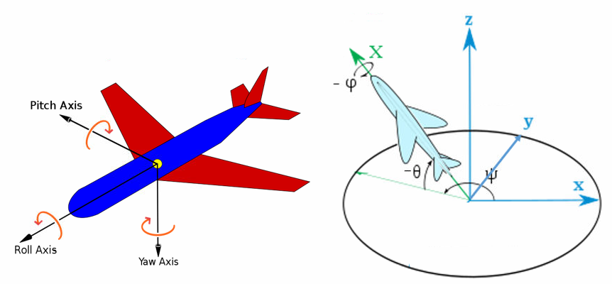
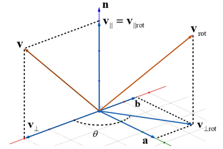

# 几何学

## 关键公式索引

本文只给常用、跨章节会反复用到的公式编号：

* 式 ($\ref{eq:skew-def}$)：反对称矩阵定义
* 式 ($\ref{eq:skew-product}$)：两个反对称矩阵相乘
* 式 ($\ref{eq:rot-basis}$)：旋转矩阵的列向量含义
* 式 ($\ref{eq:rot-adjoint}$)：旋转矩阵与反对称矩阵的伴随性
* 式 ($\ref{eq:exp-adjoint}$)：指数映射的伴随性
* 式 ($\ref{eq:se3-point}$)：欧式变换的点坐标形式
* 式 ($\ref{eq:se3-matrix}$)：欧式变换矩阵
* 式 ($\ref{eq:se3-inverse}$)：欧式变换逆矩阵
* 式 ($\ref{eq:euler-zyx}$)：ZYX 欧拉角旋转矩阵
* 式 ($\ref{eq:euler-inverse}$)：ZYX 欧拉角反解
* 式 ($\ref{eq:rodrigues}$)：罗德里格斯公式
* 式 ($\ref{eq:rot-log}$)：旋转矩阵的对数映射
* 式 ($\ref{eq:quat-product}$)：四元数乘法
* 式 ($\ref{eq:quat-rotate}$)：四元数旋转向量
* 式 ($\ref{eq:quat-to-rot}$)：四元数转旋转矩阵

## 坐标系与向量

### 向量在坐标系下的表示

要描述车辆的位姿，需要先定义坐标系。常见坐标系包括：

**世界系 / 惯性系**：固定不动的参考坐标系，记为 $\mathcal{F}_w$。

**车体系 / 载体系**：车辆自身的坐标系，记为 $\mathcal{F}_b$。常见约定有前左上、右前上等。

**传感器坐标系**：传感器自身坐标系，记为 $\mathcal{F}_s$。相机坐标系常用右下前，LiDAR 坐标系常用前左上。传感器坐标系与车体系之间的关系通常由外参标定得到。

SLAM 的核心任务之一，就是求车辆坐标系与世界坐标系之间随时间变化的变换关系。由这个关系可以进一步定义线速度、角速度、加速度等物理量。

坐标系由一组基向量组成。以坐标系 $\mathcal{F}_a$ 为例：

$$
\mathcal{F}_a=\{o_a,\mathbf{i}_a,\mathbf{j}_a,\mathbf{k}_a\}.
$$

其中 $o_a$ 是坐标系原点，$\mathbf{i}_a,\mathbf{j}_a,\mathbf{k}_a$ 是三个单位正交基向量。三维向量 $\mathbf{v}$ 在坐标系 $\mathcal{F}_a$ 下的坐标写作

$$
{}^{a}\mathbf{v}
=
\begin{bmatrix}
{}^{a}v_x\\
{}^{a}v_y\\
{}^{a}v_z
\end{bmatrix}.
$$

坐标与基向量共同确定几何向量：

$$
\mathbf{v}
=
\mathcal{F}_a({}^{a}\mathbf{v})
=
{}^{a}v_x\mathbf{i}_a
+{}^{a}v_y\mathbf{j}_a
+{}^{a}v_z\mathbf{k}_a.
$$

同一个几何向量可以在不同坐标系下表达：

$$
\mathbf{v}
=
\mathcal{F}_w({}^{w}\mathbf{v})
=
\mathcal{F}_b({}^{b}\mathbf{v}).
$$

### 向量坐标运算（同坐标系）

向量加减、数乘、取模、内积和外积都要求参与运算的向量在**同一个坐标系下表达**。若

$$
\mathbf{a},\mathbf{b}\in\mathbb{R}^{3},
\qquad
{}^{c}\mathbf{a},{}^{c}\mathbf{b}
\text{ 在同一坐标系 } \mathcal{F}_c \text{ 下表达},
$$

则**加法**为

$$
{}^{c}\mathbf{c}
=
{}^{c}\mathbf{a}
+
{}^{c}\mathbf{b}.
$$

**数乘**为
$$
{}^{c}\mathbf{c}
=
\lambda\,{}^{c}\mathbf{a}.
$$

向量**模长**为

$$
\|\mathbf{a}\|
=
\sqrt{\mathbf{a}^{T}\mathbf{a}}
=
\sqrt{a_x^2+a_y^2+a_z^2}.
$$

**内积**为
$$
\mathbf{a}^{T}\mathbf{b}
=
a_xb_x+a_yb_y+a_zb_z
=
\|\mathbf{a}\|\,\|\mathbf{b}\|\cos\theta.
$$

**外积**为
$$
\mathbf{a}\times\mathbf{b}
=
\begin{bmatrix}
a_yb_z-a_zb_y\\
a_zb_x-a_xb_z\\
a_xb_y-a_yb_x
\end{bmatrix}.
$$

外积也可写成**反对称矩阵**形式：

$$
\mathbf{a}\times\mathbf{b}
=
[\mathbf{a}]_{\times}\mathbf{b},
$$

其中

$$
[\mathbf{a}]_{\times}
=
\begin{bmatrix}
0 & -a_z & a_y\\
a_z & 0 & -a_x\\
-a_y & a_x & 0
\end{bmatrix}.
\label{eq:skew-def}
\tag{1}
$$

由定义可知，反对称矩阵满足

$$
[\mathbf{a}]_{\times}^{T}
=
-[\mathbf{a}]_{\times},
\qquad
[\mathbf{a}]_{\times}\mathbf{a}
=
\mathbf{0}.
$$

映射 $\mathbf{a}\mapsto[\mathbf{a}]_{\times}$ 是线性的，因此

$$
[\lambda\mathbf{a}]_{\times}
=
\lambda[\mathbf{a}]_{\times},
\qquad
[\mathbf{a}+\mathbf{b}]_{\times}
=
[\mathbf{a}]_{\times}+[\mathbf{b}]_{\times},
\qquad
[\mathbf{a}-\mathbf{b}]_{\times}
=
[\mathbf{a}]_{\times}-[\mathbf{b}]_{\times}.
$$

两个反对称矩阵相乘时，满足：

$$
[\mathbf{a}]_{\times}[\mathbf{b}]_{\times}
=
\mathbf{b}\mathbf{a}^{T}
-
(\mathbf{a}^{T}\mathbf{b})\mathbf{I}.
\label{eq:skew-product}
\tag{2}
$$

令 $\mathbf{b}=\mathbf{a}$，可得

$$
[\mathbf{a}]_{\times}^{2}
=
\mathbf{a}\mathbf{a}^{T}
-
\|\mathbf{a}\|^{2}\mathbf{I}.
$$

继续左乘 $[\mathbf{a}]_{\times}$，有

$$
[\mathbf{a}]_{\times}^{3}
=
-\|\mathbf{a}\|^{2}[\mathbf{a}]_{\times}.
$$

当 $\|\mathbf{a}\|=1$ 时，上式可简化为

$$
[\mathbf{a}]_{\times}^{2}
=
\mathbf{a}\mathbf{a}^{T}-\mathbf{I},
\qquad
[\mathbf{a}]_{\times}^{3}
=
-[\mathbf{a}]_{\times}.
$$

## 旋转

旋转矩阵 $\mathbf{R}_{wb}$ 表示从坐标系 $\mathcal{F}_b$ 到坐标系 $\mathcal{F}_w$ 的坐标变换：

$$
{}^{w}\mathbf{v}
=
\mathbf{R}_{wb}\,{}^{b}\mathbf{v}.
$$

它的列向量就是 $\mathcal{F}_b$ 的三根坐标轴在 $\mathcal{F}_w$ 下的坐标：

$$
\mathbf{R}_{wb}
=
\begin{bmatrix}
{}^{w}\mathbf{i}_{b} & {}^{w}\mathbf{j}_{b} & {}^{w}\mathbf{k}_{b}
\end{bmatrix}.
\label{eq:rot-basis}
\tag{3}
$$

> 举个简单例子，假设 $\mathcal{F}_b$ 相对于 $\mathcal{F}_w$ 绕 $z$ 轴旋转 $90^{\circ}$，即 ${}^{w}\mathbf{i}_{b}$ 对齐到 ${}^{w}\mathbf{j}_{w}$，则
>
> $$
> \mathbf{R}_{wb}
> =
> \begin{bmatrix}
> 0 & -1 & 0 \\
> 1 & 0 & 0 \\
> 0 & 0 & 1
> \end{bmatrix}.
> $$
>
>
> 可以看出每列都是 $\mathcal{F}_b$ 的基向量在 $\mathcal{F}_w$ 下的坐标。

### 旋转性质

#### 正交性

三维旋转矩阵 $\mathbf{R}$ 满足

$$
\mathbf{R}^{T}\mathbf{R}=\mathbf{I},
\qquad
\mathbf{R}^{-1}=\mathbf{R}^{T},
\qquad
\det(\mathbf{R})=1.
$$

因此 $\mathbf{R}\in\operatorname{SO}(3)$。

> 证明：设旋转矩阵的三列为
>
> $$
> \mathbf{R}
> =
> \begin{bmatrix}
> \mathbf{r}_1 & \mathbf{r}_2 & \mathbf{r}_3
> \end{bmatrix}.
> $$
>
> 旋转后的坐标基仍然是标准正交基，因此
>
> $$
> \mathbf{r}_i^{T}\mathbf{r}_j
> =
> \begin{cases}
> 1, & i=j,\\
> 0, & i\neq j.
> \end{cases}
> $$
>
> 所以
>
> $$
> \mathbf{R}^{T}\mathbf{R}
> =
> \begin{bmatrix}
> \mathbf{r}_1^{T}\\
> \mathbf{r}_2^{T}\\
> \mathbf{r}_3^{T}
> \end{bmatrix}
> \begin{bmatrix}
> \mathbf{r}_1 & \mathbf{r}_2 & \mathbf{r}_3
> \end{bmatrix}
> =
> \begin{bmatrix}
> \mathbf{r}_1^{T}\mathbf{r}_1 & \mathbf{r}_1^{T}\mathbf{r}_2 & \mathbf{r}_1^{T}\mathbf{r}_3\\
> \mathbf{r}_2^{T}\mathbf{r}_1 & \mathbf{r}_2^{T}\mathbf{r}_2 & \mathbf{r}_2^{T}\mathbf{r}_3\\
> \mathbf{r}_3^{T}\mathbf{r}_1 & \mathbf{r}_3^{T}\mathbf{r}_2 & \mathbf{r}_3^{T}\mathbf{r}_3
> \end{bmatrix}
> =
> \mathbf{I}.
> $$
>
> 因而 $\mathbf{R}^{-1}=\mathbf{R}^{T}$。又因为
>
> $$
> \det(\mathbf{R}^{T}\mathbf{R})
> =
> \det(\mathbf{R}^{T})\det(\mathbf{R})
> =
> \det(\mathbf{R})^{2}
> =
> \det(\mathbf{I})
> =
> 1,
> $$
>
> 所以 $\det(\mathbf{R})=\pm1$。旋转保持右手坐标系的方向，不发生镜像反射，因此取
>
> $$
> \det(\mathbf{R})=1.
> $$

#### 伴随性

旋转矩阵与反对称矩阵还满足**伴随性**：

$$
[\mathbf{R}\mathbf{a}]_{\times}
=
\mathbf{R}[\mathbf{a}]_{\times}\mathbf{R}^{T}.
\label{eq:rot-adjoint}
\tag{4}
$$

对应到 $\operatorname{SO}(3)$ 上的指数映射，得到：

$$
\exp\left([\mathbf{R}\mathbf{a}]_{\times}\right)
=
\mathbf{R}\exp\left([\mathbf{a}]_{\times}\right)\mathbf{R}^{T}.
\label{eq:exp-adjoint}
\tag{5}
$$

根据 $\operatorname{Exp}(\mathbf{a})=\exp([\mathbf{a}]_{\times})$，上式也可写为

$$
\operatorname{Exp}(\mathbf{R}\mathbf{a})
=
\mathbf{R}\operatorname{Exp}(\mathbf{a})\mathbf{R}^{T}.
$$

> 证明：
>
> 同一个坐标系下，先对两个向量分别进行 $\mathbf{R}$ 旋转后再叉乘，等价于先对两个向量叉乘再旋转，所以
>
> $$
> (\mathbf{R}\mathbf{a})\times(\mathbf{R}\mathbf{b})
> =
> \mathbf{R}(\mathbf{a}\times\mathbf{b}).
> $$
>
> 用反对称矩阵表示叉乘：
>
> $$
> [\mathbf{R}\mathbf{a}]_{\times}\mathbf{R}\mathbf{b}
> =
> \mathbf{R}[\mathbf{a}]_{\times}\mathbf{b}.
> $$
>
> 上式对任意 $\mathbf{b}$ 都成立，因此
>
> $$
> [\mathbf{R}\mathbf{a}]_{\times}\mathbf{R}
> =
> \mathbf{R}[\mathbf{a}]_{\times}.
> $$
>
> 所以
>
> $$
> [\mathbf{R}\mathbf{a}]_{\times}
> =
> \mathbf{R}[\mathbf{a}]_{\times}\mathbf{R}^{T}.
> $$
>
> 对指数映射，利用矩阵指数的级数定义
>
> $$
> \exp(\mathbf{A})
> =
> \sum_{n=0}^{\infty}\frac{1}{n!}\mathbf{A}^{n}.
> $$
>
> 令 $\mathbf{A}=[\mathbf{a}]_{\times}$，由上面的伴随性可知
>
> $$
> [\mathbf{R}\mathbf{a}]_{\times}
> =
> \mathbf{R}\mathbf{A}\mathbf{R}^{T}.
> $$
>
> 因为 $\mathbf{R}^{T}\mathbf{R}=\mathbf{I}$，所以
>
> $$
> \left(\mathbf{R}\mathbf{A}\mathbf{R}^{T}\right)^{n}
> =
> \mathbf{R}\mathbf{A}^{n}\mathbf{R}^{T}.
> $$
>
> 因此
>
> $$
> \begin{aligned}
> \exp\left([\mathbf{R}\mathbf{a}]_{\times}\right)
> &=
> \exp\left(\mathbf{R}\mathbf{A}\mathbf{R}^{T}\right)\\
> &=
> \sum_{n=0}^{\infty}\frac{1}{n!}
> \left(\mathbf{R}\mathbf{A}\mathbf{R}^{T}\right)^{n}\\
> &=
> \sum_{n=0}^{\infty}\frac{1}{n!}
> \mathbf{R}\mathbf{A}^{n}\mathbf{R}^{T}\\
> &=
> \mathbf{R}
> \left(\sum_{n=0}^{\infty}\frac{1}{n!}\mathbf{A}^{n}\right)
> \mathbf{R}^{T}\\
> &=
> \mathbf{R}\exp\left([\mathbf{a}]_{\times}\right)\mathbf{R}^{T}.
> \end{aligned}
> $$
>

### 主动旋转与被动旋转

#### 主动旋转

主动旋转描述的是几何向量本身被旋转。若向量 $\mathbf{v}$ 被旋转矩阵 $\mathbf{R}$ 旋转，得到**新向量** $\mathbf{v}'$，则

$$
\mathbf{v}'=\mathbf{R}\mathbf{v}.
$$

也可以从坐标轴基向量的角度理解。设原坐标系 $\mathcal{F}_w$ 的三根基向量为

$$
\mathbf{i}_w=
\begin{bmatrix}
1\\0\\0
\end{bmatrix},
\qquad
\mathbf{j}_w=
\begin{bmatrix}
0\\1\\0
\end{bmatrix},
\qquad
\mathbf{k}_w=
\begin{bmatrix}
0\\0\\1
\end{bmatrix}.
$$

主动旋转 $\mathbf{R}$ 会把这三根基向量旋转成

$$
\mathbf{i}'=\mathbf{R}\mathbf{i}_w,
\qquad
\mathbf{j}'=\mathbf{R}\mathbf{j}_w,
\qquad
\mathbf{k}'=\mathbf{R}\mathbf{k}_w.
$$

由于 $\mathbf{i}_w,\mathbf{j}_w,\mathbf{k}_w$ 正好是标准基，所以旋转矩阵可以写成旋转后基向量在原坐标系下的坐标：

$$
\mathbf{R}
=
\begin{bmatrix}
\mathbf{i}' & \mathbf{j}' & \mathbf{k}'
\end{bmatrix}.
$$

因此，主动旋转矩阵的每一列可以看作**原来的坐标轴被主动旋转后，在原坐标系下的坐标**。

如果先执行旋转 $\mathbf{R}_1$，再执行旋转 $\mathbf{R}_2$，则总旋转为

$$
\mathbf{v}''
=
\mathbf{R}_2\mathbf{R}_1\mathbf{v}.
$$

从基向量角度看也是一样：$\mathbf{R}_1$ 先把基向量旋转成 $\mathbf{R}_1\mathbf{i}_w,\mathbf{R}_1\mathbf{j}_w,\mathbf{R}_1\mathbf{k}_w$，$\mathbf{R}_2$ 再继续旋转这些已经旋转后的基向量，所以

$$
\mathbf{R}_{\text{new}}
=
\mathbf{R}_2\mathbf{R}_1.
$$

因此，在同一个固定坐标系下连续做主动旋转时，新增主动旋转通常**左乘**到已有旋转矩阵前面。

#### 被动旋转

被动旋转描述的是**同一个几何向量**在不同坐标系下的坐标变化。若 $\mathbf{R}_{wb}$ 表示从载体系到世界系的旋转，则同一向量满足

$$
{}^{w}\mathbf{v}
=
\mathbf{R}_{wb}\,{}^{b}\mathbf{v}.
$$

反向坐标变换为

$$
{}^{b}\mathbf{v}
=
\mathbf{R}_{bw}\,{}^{w}\mathbf{v}
=
\mathbf{R}_{wb}^{T}\,{}^{w}\mathbf{v}.
$$

若存在多个坐标系 $\mathcal{F}_w,\mathcal{F}_{b_1},\mathcal{F}_{b_2}$，则坐标变换满足

$$
\mathbf{R}_{wb_2}
=
\mathbf{R}_{wb_1}\mathbf{R}_{b_1b_2}.
$$

从被动旋转角度看，新增坐标系变换常**右乘**到已有旋转矩阵后面。

### 欧式变换（不同坐标系）

#### 基本形式

三维欧式变换由旋转和平移组成。若点 $p$ 在坐标系 $\mathcal{F}_b$ 下的坐标为 ${}^{b}\mathbf{p}_{bp}$，在世界系 $\mathcal{F}_w$ 下的坐标为 ${}^{w}\mathbf{p}_{wp}$，则完整写法为

$$
{}^{w}\mathbf{p}_{wp}
=
\mathbf{R}_{wb}\,{}^{b}\mathbf{p}_{bp}
+
{}^{w}\mathbf{t}_{wb}.
\label{eq:se3-point}
\tag{6}
$$

其中 $\mathbf{R}_{wb}$ 是从 $\mathcal{F}_b$ 到 $\mathcal{F}_w$ 的旋转，${}^{w}\mathbf{t}_{wb}$ 是变换矩阵的平移项，表示从世界系原点 $o_w$ 指向载体系原点 $o_b$ 的向量，并在世界系下表达。

若上下文已经明确点 $p$，可简写为

$$
{}^{w}\mathbf{p}
=
\mathbf{R}_{wb}\,{}^{b}\mathbf{p}
+
{}^{w}\mathbf{t}_{wb}.
$$

齐次坐标形式为

$$
\begin{bmatrix}
{}^{w}\mathbf{p}_{wp}\\
1
\end{bmatrix}
=
\mathbf{T}_{wb}
\begin{bmatrix}
{}^{b}\mathbf{p}_{bp}\\
1
\end{bmatrix},
$$

其中欧式变换矩阵可完整写为

$$
\mathbf{T}_{wb}
=
\left(\mathbf{R}_{wb},{}^{w}\mathbf{t}_{wb}\right)
=
\begin{bmatrix}
\mathbf{R}_{wb} & {}^{w}\mathbf{t}_{wb}\\
\mathbf{0}^{T} & 1
\end{bmatrix}
\in\operatorname{SE}(3).
\label{eq:se3-matrix}
\tag{7}
$$

逆变换为

$$
\mathbf{T}_{bw}
=
\mathbf{T}_{wb}^{-1}
=
\begin{bmatrix}
\mathbf{R}_{wb}^{T} & -\mathbf{R}_{wb}^{T}{}^{w}\mathbf{t}_{wb}\\
\mathbf{0}^{T} & 1
\end{bmatrix}.
\label{eq:se3-inverse}
\tag{8}
$$

> 证明：设
>
> $$
> \mathbf{T}_{bw}
> =
> \begin{bmatrix}
> \mathbf{R}_{bw} & {}^{b}\mathbf{t}_{bw}\\
> \mathbf{0}^{T} & 1
> \end{bmatrix}.
> $$
>
> 因为 $\mathbf{T}_{bw}=\mathbf{T}_{wb}^{-1}$，所以应满足
>
> $$
> \mathbf{T}_{wb}\mathbf{T}_{bw}
> =
> \begin{bmatrix}
> \mathbf{R}_{wb} & {}^{w}\mathbf{t}_{wb}\\
> \mathbf{0}^{T} & 1
> \end{bmatrix}
> \begin{bmatrix}
> \mathbf{R}_{bw} & {}^{b}\mathbf{t}_{bw}\\
> \mathbf{0}^{T} & 1
> \end{bmatrix}
> =
> \begin{bmatrix}
> \mathbf{R}_{wb}\mathbf{R}_{bw} &
> \mathbf{R}_{wb}{}^{b}\mathbf{t}_{bw}+{}^{w}\mathbf{t}_{wb}\\
> \mathbf{0}^{T} & 1
> \end{bmatrix}
> =
> \mathbf{I}.
> $$
>
> 因此
>
> $$
> \mathbf{R}_{wb}\mathbf{R}_{bw}
> =
> \mathbf{I},
> \qquad
> \mathbf{R}_{wb}{}^{b}\mathbf{t}_{bw}+{}^{w}\mathbf{t}_{wb}
> =
> \mathbf{0}.
> $$
>
> 由于旋转矩阵满足 $\mathbf{R}_{wb}^{-1}=\mathbf{R}_{wb}^{T}$，可得
>
> $$
> \mathbf{R}_{bw}
> =
> \mathbf{R}_{wb}^{T},
> \qquad
> {}^{b}\mathbf{t}_{bw}
> =
> -\mathbf{R}_{wb}^{T}{}^{w}\mathbf{t}_{wb}.
> $$

若有连续变换 $\mathbf{T}_{ab}$ 与 $\mathbf{T}_{bc}$，则复合变换为

$$
\mathbf{T}_{ac}
=
\mathbf{T}_{ab}\mathbf{T}_{bc}.
$$

### 基础旋转矩阵

绕 $x$ 轴旋转角 $\theta$：

$$
\mathbf{R}_x(\theta)
=
\begin{bmatrix}
1 & 0 & 0\\
0 & \cos\theta & -\sin\theta\\
0 & \sin\theta & \cos\theta
\end{bmatrix}.
$$

绕 $y$ 轴旋转角 $\theta$：

$$
\mathbf{R}_y(\theta)
=
\begin{bmatrix}
\cos\theta & 0 & \sin\theta\\
0 & 1 & 0\\
-\sin\theta & 0 & \cos\theta
\end{bmatrix}.
$$

绕 $z$ 轴旋转角 $\theta$：

$$
\mathbf{R}_z(\theta)
=
\begin{bmatrix}
\cos\theta & -\sin\theta & 0\\
\sin\theta & \cos\theta & 0\\
0 & 0 & 1
\end{bmatrix}.
$$

基础旋转矩阵均满足

$$
\mathbf{R}_i(\theta)^{-1}
=
\mathbf{R}_i(\theta)^{T}
=
\mathbf{R}_i(-\theta),
\qquad i\in\{x,y,z\}.
$$

### 欧拉角

#### 欧拉角简介

欧拉角用三个绕坐标轴的旋转角描述三维旋转。常见角度包括：

$$
\text{roll}=\phi,\qquad
\text{pitch}=\theta,\qquad
\text{yaw}=\psi.
$$

不同领域对旋转顺序和坐标轴方向有不同约定，因此使用欧拉角时必须明确约定。

#### 内旋、外旋与左右乘

欧拉角必须同时说明**旋转顺序**和**旋转轴的表达坐标系**。以常用的 roll-pitch-yaw 为例：

- 外旋：旋转轴在固定坐标系 $\mathcal{F}_w$ 中表达；
- 内旋：旋转轴在当前坐标系中表达；
- 主动旋转：旋转几何向量本身；
- 被动旋转：不旋转几何向量，只改变坐标表达。

设当前坐标系为 $\mathcal{F}_b$，固定坐标系为 $\mathcal{F}_w$。旋转矩阵

$$
\mathbf{R}_{wb}
=
\begin{bmatrix}
{}^{w}\mathbf{i}_b & {}^{w}\mathbf{j}_b & {}^{w}\mathbf{k}_b
\end{bmatrix}
$$

表示 $\mathcal{F}_b$ 的三根坐标轴在 $\mathcal{F}_w$ 下的坐标，也可把 $\mathcal{F}_b$ 中表达的向量变换到 $\mathcal{F}_w$：

$$
{}^{w}\mathbf{v}
=
\mathbf{R}_{wb}\,{}^{b}\mathbf{v}.
$$

因此，当前 $x$ 轴在世界系下的方向为

$$
{}^{w}\mathbf{i}_b
=
\mathbf{R}_{wb}\,{}^{b}\mathbf{i}_b,
\qquad
{}^{b}\mathbf{i}_b
=
\begin{bmatrix}
1\\0\\0
\end{bmatrix}.
$$

这就是“固定轴”和“当前轴”的区别：固定 $x$ 轴在世界系下是 ${}^{w}\mathbf{i}_w$，当前 $x$ 轴在世界系下是 ${}^{w}\mathbf{i}_b$。当 $\mathbf{R}_{wb}\ne\mathbf{I}$ 时，二者通常不是同一根轴。

对列向量主动旋转，外旋中新旋转左乘已有旋转。以外旋 XYZ 为例，设依次得到 $\mathcal{F}_{b_1},\mathcal{F}_{b_2},\mathcal{F}_{b_3}$：

$$
\mathbf{R}_{wb_1}
=
\mathbf{R}_x(\phi),
\\
\mathbf{R}_{wb_2}
=
\mathbf{R}_y(\theta)\mathbf{R}_{wb_1}
=
\mathbf{R}_y(\theta)\mathbf{R}_x(\phi),
\\
\mathbf{R}_{wb_3}
=
\mathbf{R}_z(\psi)\mathbf{R}_{wb_2}
=
\mathbf{R}_z(\psi)\mathbf{R}_y(\theta)\mathbf{R}_x(\phi).
$$

内旋中新旋转右乘已有旋转。以内旋 ZYX 为例，设依次得到 $\mathcal{F}_{b_1'},\mathcal{F}_{b_2'},\mathcal{F}_{b_3'}$：

$$
\mathbf{R}_{wb_1'}
=
\mathbf{R}_z(\psi),
\\
\mathbf{R}_{b_1'b_2'}
=
\mathbf{R}_y(\theta),
\\
\mathbf{R}_{wb_2'}
=
\mathbf{R}_{wb_1'}\mathbf{R}_{b_1'b_2'}
=
\mathbf{R}_z(\psi)\mathbf{R}_y(\theta),
\\
\mathbf{R}_{b_2'b_3'}
=
\mathbf{R}_x(\phi),
\\
\mathbf{R}_{wb_3'}
=
\mathbf{R}_{wb_2'}\mathbf{R}_{b_2'b_3'}
=
\mathbf{R}_z(\psi)\mathbf{R}_y(\theta)\mathbf{R}_x(\phi).
$$

因此外旋 XYZ 与内旋 ZYX 得到同一个矩阵：

$$
\mathbf{R}_{wb_3}
=
\mathbf{R}_{wb_3'}
=
\mathbf{R}_z(\psi)\mathbf{R}_y(\theta)\mathbf{R}_x(\phi).
$$

这个等价关系也可以用伴随性解释。以 pitch 为例，在 $\mathcal{F}_{b_1'}$ 中绕当前 $y$ 轴的相对旋转为

$$
\mathbf{R}_{b_1'b_2'}
=
\exp\left(\theta({}^{b_1'}\mathbf{j}_{b_1'})^{\wedge}\right)
=
\mathbf{R}_y(\theta).
$$

当前 $y$ 轴在世界系下为

$$
{}^{w}\mathbf{j}_{b_1'}
=
\mathbf{R}_{wb_1'}\,{}^{b_1'}\mathbf{j}_{b_1'}.
$$

由伴随性和指数映射的伴随关系，有

$$
\exp\left(\theta({}^{w}\mathbf{j}_{b_1'})^{\wedge}\right)
=
\mathbf{R}_{wb_1'}\mathbf{R}_{b_1'b_2'}\mathbf{R}_{wb_1'}^{T}.
$$

该旋转从世界系看是左作用：

$$
\begin{aligned}
\mathbf{R}_{wb_2'}
&=
\left(
\mathbf{R}_{wb_1'}\mathbf{R}_{b_1'b_2'}\mathbf{R}_{wb_1'}^{T}
\right)\mathbf{R}_{wb_1'}\\
&=
\mathbf{R}_{wb_1'}\mathbf{R}_{b_1'b_2'}.
\end{aligned}
$$

因此，内旋只是旋转轴先在当前坐标系中表达，化到世界系后由伴随性抵消掉 $\mathbf{R}_{wb_1'}^{T}\mathbf{R}_{wb_1'}$，最终表现为相对旋转右乘。

> 内外旋和主动旋转、被动旋转没有直接关系。

#### 欧拉角与旋转矩阵

在列向量主动旋转约定下，常用的 ZYX 欧拉角写成：

$$
\mathbf{R}_{wb}
=
\mathbf{R}_z(\psi)\mathbf{R}_y(\theta)\mathbf{R}_x(\phi).
\label{eq:euler-zyx}
\tag{9}
$$

上一节已说明，该矩阵既可由外旋 XYZ 得到，也可由内旋 ZYX 得到。

若采用被动旋转，即坐标从旋转后的坐标系变回原坐标系，则使用主动旋转矩阵的转置：

$$
\mathbf{R}_{\text{passive}}
=
\mathbf{R}_{\text{active}}^{T}.
$$

记 $\mathbf{R}_{wb}=[R_{ij}]$，展开为

$$
\mathbf{R}_{wb}
=
\begin{bmatrix}
c_{\psi}c_{\theta}
&
c_{\psi}s_{\theta}s_{\phi}-s_{\psi}c_{\phi}
&
c_{\psi}s_{\theta}c_{\phi}+s_{\psi}s_{\phi}\\
s_{\psi}c_{\theta}
&
s_{\psi}s_{\theta}s_{\phi}+c_{\psi}c_{\phi}
&
s_{\psi}s_{\theta}c_{\phi}-c_{\psi}s_{\phi}\\
-s_{\theta}
&
c_{\theta}s_{\phi}
&
c_{\theta}c_{\phi}
\end{bmatrix},
$$

其中

$$
c_{\phi}=\cos\phi,\quad
s_{\phi}=\sin\phi,
$$

其余角度同理。

当 $\cos\theta\ne0$ 时，可由旋转矩阵反解欧拉角，见式 ($\ref{eq:euler-inverse}$)：

$$
\phi
=
\operatorname{atan2}(R_{32},R_{33}),
\qquad
\theta
=
\arcsin(-R_{31}),
\qquad

\psi
=
\operatorname{atan2}(R_{21},R_{11}).
\label{eq:euler-inverse}
\tag{10}
$$

> 这里 $\operatorname{atan2}(y,x)$ 根据正弦项和余弦项所在象限返回角度，比直接使用 $\arctan(y/x)$ 更稳定。
>

当 $\theta=\pm\frac{\pi}{2}$ 时，欧拉角会出现万向锁：
$$
\cos\theta=0.
$$

从反解公式看，roll 和 yaw 分别依赖

$$
R_{32}=\cos\theta\sin\phi,
\qquad
R_{33}=\cos\theta\cos\phi,
$$

以及

$$
R_{21}=\sin\psi\cos\theta,
\qquad
R_{11}=\cos\psi\cos\theta.
$$

当 $\cos\theta=0$ 时，这些用于单独恢复 $\phi$ 和 $\psi$ 的元素同时退化，无法再稳定地区分 roll 和 yaw。

从几何上看，pitch 达到 $\pm\frac{\pi}{2}$ 后，roll 轴和 yaw 轴发生重合，原本三个独立旋转自由度中有两个自由度耦合在一起。因此欧拉角不再唯一，这就是万向锁。实际计算时通常固定其中一个角，例如令 $\phi=0$，再由矩阵中的剩余元素求另一个角。

### 旋转向量

旋转向量也称角轴表示。它用旋转轴方向和旋转角共同描述旋转：

$$
\boldsymbol{\phi}
=
\theta\mathbf{n},
\qquad
\|\mathbf{n}\|=1.
$$

其中 $\mathbf{n}$ 是单位旋转轴，$\theta$ 是旋转角。

旋转向量是李代数元素的三维坐标表示。它与反对称矩阵之间通过 hat / vee 运算对应：

$$
\boldsymbol{\phi}^{\wedge}
=
[\boldsymbol{\phi}]_{\times},
\qquad
([\boldsymbol{\phi}]_{\times})^{\vee}
=
\boldsymbol{\phi}.
$$

#### 旋转向量转旋转矩阵

旋转向量到旋转矩阵的映射为指数映射：

$$
\mathbf{R}
=
\exp(\boldsymbol{\phi}^{\wedge}).
$$

令

$$
\theta=\|\boldsymbol{\phi}\|,
\qquad
\mathbf{n}=\frac{\boldsymbol{\phi}}{\theta},
$$

当 $\theta=0$ 时，$\mathbf{R}=\mathbf{I}$；下面默认 $\theta\ne0$。此时

$$
\boldsymbol{\phi}^{\wedge}
=
\theta\mathbf{n}^{\wedge}.
$$

罗德里格斯公式为

$$
\mathbf{R}
=
\exp(\theta\mathbf{n}^{\wedge})
=
\mathbf{I}
+
\sin\theta\,\mathbf{n}^{\wedge}
+
(1-\cos\theta)(\mathbf{n}^{\wedge})^{2}.
\label{eq:rodrigues}
\tag{11}
$$

等价地，

$$
\mathbf{R}
=
\cos\theta\,\mathbf{I}
+
(1-\cos\theta)\mathbf{n}\mathbf{n}^{T}
+
\sin\theta\,\mathbf{n}^{\wedge}.
$$

> 罗德里格斯公式证明 + 旋转向量-李代数等价证明
>
> * 指数映射证明：
>
> 因为 $\mathbf{n}$ 是单位向量，有
> $$
> (\mathbf{n}^{\wedge})^{2}
> =
> \mathbf{n}\mathbf{n}^{T}-\mathbf{I},
> $$
>
> 以及
>
> $$
> (\mathbf{n}^{\wedge})^{3}
> =
> -\mathbf{n}^{\wedge}.
> $$
>
> 对矩阵指数展开：
>
> $$
> \begin{aligned}
> \exp(\theta\mathbf{n}^{\wedge})
> &=
> \mathbf{I}
> +
> \theta\mathbf{n}^{\wedge}
> +
> \frac{\theta^{2}}{2!}(\mathbf{n}^{\wedge})^{2}
> +
> \frac{\theta^{3}}{3!}(\mathbf{n}^{\wedge})^{3}
> +\cdots\\
> &=
> \mathbf{I}
> +
> \left(\theta-\frac{\theta^{3}}{3!}+\frac{\theta^{5}}{5!}-\cdots\right)\mathbf{n}^{\wedge}\\
> &\quad+
> \left(\frac{\theta^{2}}{2!}-\frac{\theta^{4}}{4!}+\frac{\theta^{6}}{6!}-\cdots\right)(\mathbf{n}^{\wedge})^{2}\\
> &=
> \mathbf{I}
> +
> \sin\theta\,\mathbf{n}^{\wedge}
> +
> (1-\cos\theta)(\mathbf{n}^{\wedge})^{2}.
> \end{aligned}
> $$
>
> * 几何意义证明
>
> 也可以**从旋转向量的几何意义直接证明**。设任意向量 $\mathbf{v}$ 绕单位轴 $\mathbf{n}$ 旋转角 $\theta$，将 $\mathbf{v}$ 分解为平行于旋转轴和垂直于旋转轴的两部分：
> $$
> \mathbf{v}_{\parallel}
> =
> \mathbf{n}\mathbf{n}^{T}\mathbf{v},
> \qquad
> \mathbf{v}_{\perp}
> =
> \mathbf{v}-\mathbf{v}_{\parallel}
> =
> (\mathbf{I}-\mathbf{n}\mathbf{n}^{T})\mathbf{v}.
> $$
>
> 其中 $\mathbf{v}_{\parallel}$ 在旋转中保持不变，$\mathbf{v}_{\perp}$ 在垂直于 $\mathbf{n}$ 的平面内旋转。
>
> 
>
> 按照右手定则，旋转后的向量为
> $$
> \mathbf{R}\mathbf{v}
> =
> \mathbf{v}_{\parallel}
> +
> \cos\theta\,\mathbf{v}_{\perp}
> +
> \sin\theta\,(\mathbf{n}\times\mathbf{v}_{\perp}).
> $$
>
> 由于 $\mathbf{n}\times\mathbf{v}_{\parallel}=\mathbf{0}$，所以
>
> $$
> \mathbf{n}\times\mathbf{v}_{\perp}
> =
> \mathbf{n}\times\mathbf{v}
> =
> \mathbf{n}^{\wedge}\mathbf{v}.
> $$
>
> 代入可得
>
> $$
> \begin{aligned}
> \mathbf{R}\mathbf{v}
> &=
> \mathbf{n}\mathbf{n}^{T}\mathbf{v}
> +
> \cos\theta(\mathbf{I}-\mathbf{n}\mathbf{n}^{T})\mathbf{v}
> +
> \sin\theta\,\mathbf{n}^{\wedge}\mathbf{v}\\
> &=
> \left(
> \cos\theta\,\mathbf{I}
> +
> (1-\cos\theta)\mathbf{n}\mathbf{n}^{T}
> +
> \sin\theta\,\mathbf{n}^{\wedge}
> \right)\mathbf{v}.
> \end{aligned}
> $$
>
> 因为上式对任意 $\mathbf{v}$ 都成立，所以
>
> $$
> \mathbf{R}
> =
> \cos\theta\,\mathbf{I}
> +
> (1-\cos\theta)\mathbf{n}\mathbf{n}^{T}
> +
> \sin\theta\,\mathbf{n}^{\wedge}.
> $$
>
> 再利用
>
> $$
> (\mathbf{n}^{\wedge})^{2}
> =
> \mathbf{n}\mathbf{n}^{T}-\mathbf{I},
> $$
>
> 可得
>
> $$
> \mathbf{R}
> =
> \mathbf{I}
> +
> \sin\theta\,\mathbf{n}^{\wedge}
> +
> (1-\cos\theta)(\mathbf{n}^{\wedge})^{2}.
> $$
>
> 这与矩阵指数展开
>
> $$
> \exp(\theta\mathbf{n}^{\wedge})
> =
> \mathbf{I}
> +
> \sin\theta\,\mathbf{n}^{\wedge}
> +
> (1-\cos\theta)(\mathbf{n}^{\wedge})^{2}
> $$
>
> 完全一致。因此，旋转向量
>
> $$
> \boldsymbol{\phi}
> =
> \theta\mathbf{n}
> $$
>
> 对应的李代数矩阵为
>
> $$
> \boldsymbol{\phi}^{\wedge}
> =
> \theta\mathbf{n}^{\wedge}
> \in\mathfrak{so}(3),
> $$
>
> 并且
>
> $$
> \mathbf{R}
> =
> \operatorname{Exp}(\boldsymbol{\phi})
> =
> \exp(\boldsymbol{\phi}^{\wedge}).
> $$
>
> 所以更准确地说，**旋转向量 $\boldsymbol{\phi}$ 是李代数元素 $\boldsymbol{\phi}^{\wedge}\in\mathfrak{so}(3)$ 的向量坐标表示；通过 $\wedge$ 和 $\vee$ 运算，二者可以一一对应。**
>

#### 旋转矩阵转旋转向量

由罗德里格斯公式可得旋转角：

$$
\theta
=
\arccos\left(\frac{\operatorname{tr}(\mathbf{R})-1}{2}\right).
$$

当 $\theta\ne 0$ 时，旋转轴满足

$$
\mathbf{n}
=
\frac{1}{2\sin\theta}
\begin{bmatrix}
R_{32}-R_{23}\\
R_{13}-R_{31}\\
R_{21}-R_{12}
\end{bmatrix}.
$$

因此旋转向量为

$$
\boldsymbol{\phi}
=
\theta\mathbf{n}.
$$

也可以写成对数映射，见式 ($\ref{eq:rot-log}$)：

$$
\boldsymbol{\phi}^{\wedge}
=
\log(\mathbf{R})
=
\frac{\theta}{2\sin\theta}(\mathbf{R}-\mathbf{R}^{T}).
\label{eq:rot-log}
\tag{12}
$$

> 证明：由罗德里格斯公式
>
> $$
> \mathbf{R}
> =
> \cos\theta\,\mathbf{I}
> +
> (1-\cos\theta)\mathbf{n}\mathbf{n}^{T}
> +
> \sin\theta\,\mathbf{n}^{\wedge}
> $$
>
> 可得
>
> $$
> \begin{aligned}
> \operatorname{tr}(\mathbf{R})
> &=
> \operatorname{tr}(\cos\theta\,\mathbf{I})
> +
> \operatorname{tr}\left((1-\cos\theta)\mathbf{n}\mathbf{n}^{T}\right)
> +
> \operatorname{tr}(\sin\theta\,\mathbf{n}^{\wedge})\\
> &=
> 3\cos\theta
> +
> (1-\cos\theta)\operatorname{tr}(\mathbf{n}\mathbf{n}^{T})
> +
> 0\\
> &=
> 3\cos\theta
> +
> (1-\cos\theta)\mathbf{n}^{T}\mathbf{n}\\
> &=
> 1+2\cos\theta.
> \end{aligned}
> $$
>
> 因此
>
> $$
> \cos\theta
> =
> \frac{\operatorname{tr}(\mathbf{R})-1}{2},
> \qquad
> \theta
> =
> \arccos\left(\frac{\operatorname{tr}(\mathbf{R})-1}{2}\right).
> $$
>
> 再对罗德里格斯公式转置：
>
> $$
> \mathbf{R}^{T}
> =
> \cos\theta\,\mathbf{I}
> +
> (1-\cos\theta)\mathbf{n}\mathbf{n}^{T}
> -
> \sin\theta\,\mathbf{n}^{\wedge}.
> $$
>
> 两式相减，有
>
> $$
> \mathbf{R}-\mathbf{R}^{T}
> =
> 2\sin\theta\,\mathbf{n}^{\wedge}.
> $$
>
> 所以当 $\sin\theta\ne 0$ 时，
>
> $$
> \mathbf{n}^{\wedge}
> =
> \frac{1}{2\sin\theta}(\mathbf{R}-\mathbf{R}^{T}).
> $$
>
> 设
>
> $$
> \mathbf{n}
> =
> \begin{bmatrix}
> n_x\\
> n_y\\
> n_z
> \end{bmatrix},
> \qquad
> \mathbf{n}^{\wedge}
> =
> \begin{bmatrix}
> 0 & -n_z & n_y\\
> n_z & 0 & -n_x\\
> -n_y & n_x & 0
> \end{bmatrix}.
> $$
>
> 对比矩阵元素可得
>
> $$
> \mathbf{n}
> =
> \frac{1}{2\sin\theta}
> \begin{bmatrix}
> R_{32}-R_{23}\\
> R_{13}-R_{31}\\
> R_{21}-R_{12}
> \end{bmatrix}.
> $$
>
> 又因为旋转向量定义为 $\boldsymbol{\phi}=\theta\mathbf{n}$，所以
>
> $$
> \boldsymbol{\phi}^{\wedge}
> =
> \theta\mathbf{n}^{\wedge}
> =
> \frac{\theta}{2\sin\theta}(\mathbf{R}-\mathbf{R}^{T}).
> $$
>
> 这就是 $\log(\mathbf{R})$ 的结果，即
>
> $$
> \log(\mathbf{R})
> =
> \boldsymbol{\phi}^{\wedge}
> =
> \frac{\theta}{2\sin\theta}(\mathbf{R}-\mathbf{R}^{T}).
> $$
>
> 注意：上述轴向公式要求 $\sin\theta\ne0$。当 $\theta=0$ 时，旋转向量为 $\mathbf{0}$；当 $\theta=\pi$ 时，$\mathbf{R}-\mathbf{R}^{T}=\mathbf{0}$，不能用反对称部分直接恢复旋转轴，需要从 $\mathbf{R}$ 的特征向量或对角元素中恢复。

#### 旋转矩阵和旋转向量的联系

旋转矩阵 $\mathbf{R}\in\operatorname{SO}(3)$ 和旋转向量 $\boldsymbol{\phi}\in\mathbb{R}^{3}$ 描述的是同一个三维旋转，但这里更关心它们的数学特性如何对应。

若

$$
\boldsymbol{\phi}
=
\theta\mathbf{n},
\qquad
\|\mathbf{n}\|=1,
\qquad
\theta=\|\boldsymbol{\phi}\|,
$$

则 $\mathbf{n}$ 是旋转轴方向，$\theta$ 是旋转角，对应的李代数矩阵为

$$
\boldsymbol{\phi}^{\wedge}
=
\theta\mathbf{n}^{\wedge}
\in\mathfrak{so}(3).
$$

**1. 旋转轴是不变方向。**

旋转轴方向上的向量在旋转后保持不变，因此

$$
\mathbf{R}\mathbf{n}
=
\mathbf{n},
$$

即**旋转轴是旋转矩阵中特征值为 $1$ 的特征向量**。这说明旋转向量里的方向 $\mathbf{n}$，在旋转矩阵中表现为不动的特征方向。

**2. 旋转角由迹决定。**

由罗德里格斯公式 ($\ref{eq:rodrigues}$) 可得

$$
\operatorname{tr}(\mathbf{R})
=
1+2\cos\theta,
$$

所以

$$
\theta
=
\arccos\left(\frac{\operatorname{tr}(\mathbf{R})-1}{2}\right).
$$

这说明旋转向量的长度 $\|\boldsymbol{\phi}\|=\theta$，对应旋转矩阵整体的迹。

**3. 反对称部分包含旋转轴方向。**

由罗德里格斯公式 ($\ref{eq:rodrigues}$) 可得

$$
\mathbf{R}-\mathbf{R}^{T}
=
2\sin\theta\,\mathbf{n}^{\wedge}.
$$

因此在 $\theta$ 不接近 $0$ 或 $\pi$ 时，可以从 $\mathbf{R}-\mathbf{R}^{T}$ 中读出旋转轴方向；而在小角度时，$\sin\theta\approx\theta$，有

$$
\mathbf{R}-\mathbf{R}^{T}
\approx
2\boldsymbol{\phi}^{\wedge}.
$$

等价地，

$$
\boldsymbol{\phi}^{\wedge}
\approx
\frac{1}{2}(\mathbf{R}-\mathbf{R}^{T}).
$$

**4. 小角度时，旋转矩阵、旋转向量、欧拉角局部一致。**

当 $\|\boldsymbol{\phi}\|$ 很小时，

$$
\mathbf{R}
=
\exp(\boldsymbol{\phi}^{\wedge})
\approx
\mathbf{I}+\boldsymbol{\phi}^{\wedge}.
$$

若 ZYX 欧拉角也很小，则

$$
\mathbf{R}_z(\psi)\mathbf{R}_y(\theta)\mathbf{R}_x(\phi)
\approx
\mathbf{I}
+
\psi\mathbf{k}^{\wedge}
+
\theta\mathbf{j}^{\wedge}
+
\phi\mathbf{i}^{\wedge}.
$$

因此局部一阶近似下，

$$
\boldsymbol{\phi}_{\text{rotvec}}
\approx
\begin{bmatrix}
\phi\\
\theta\\
\psi
\end{bmatrix}.
$$

> 证明：当 $\|\boldsymbol{\phi}\|$ 很小时，矩阵指数可一阶展开为
>
> $$
> \exp(\boldsymbol{\phi}^{\wedge})
> =
> \mathbf{I}
> +
> \boldsymbol{\phi}^{\wedge}
> +
> O(\|\boldsymbol{\phi}\|^{2}).
> $$
>
> 对 ZYX 欧拉角，三个基础旋转在小角度下分别为
>
> $$
> \mathbf{R}_x(\phi)
> \approx
> \mathbf{I}+\phi\mathbf{i}^{\wedge},
> \qquad
> \mathbf{R}_y(\theta)
> \approx
> \mathbf{I}+\theta\mathbf{j}^{\wedge},
> \qquad
> \mathbf{R}_z(\psi)
> \approx
> \mathbf{I}+\psi\mathbf{k}^{\wedge}.
> $$
>
> 因此
>
> $$
> \begin{aligned}
> \mathbf{R}_z(\psi)\mathbf{R}_y(\theta)\mathbf{R}_x(\phi)
> &\approx
> (\mathbf{I}+\psi\mathbf{k}^{\wedge})
> (\mathbf{I}+\theta\mathbf{j}^{\wedge})
> (\mathbf{I}+\phi\mathbf{i}^{\wedge})\\
> &\approx
> \mathbf{I}
> +
> \phi\mathbf{i}^{\wedge}
> +
> \theta\mathbf{j}^{\wedge}
> +
> \psi\mathbf{k}^{\wedge}.
> \end{aligned}
> $$
>
> 上式省略了 $\phi\theta,\theta\psi,\psi\phi$ 等二阶小量。又因为
>
> $$
> \boldsymbol{\phi}_{\text{rotvec}}^{\wedge}
> =
> \begin{bmatrix}
> \phi\\
> \theta\\
> \psi
> \end{bmatrix}^{\wedge}
> =
> \phi\mathbf{i}^{\wedge}
> +
> \theta\mathbf{j}^{\wedge}
> +
> \psi\mathbf{k}^{\wedge},
> $$
>
> 所以
>
> $$
> \exp(\boldsymbol{\phi}_{\text{rotvec}}^{\wedge})
> \approx
> \mathbf{R}_z(\psi)\mathbf{R}_y(\theta)\mathbf{R}_x(\phi),
> \qquad
> \boldsymbol{\phi}_{\text{rotvec}}
> \approx
> \begin{bmatrix}
> \phi\\
> \theta\\
> \psi
> \end{bmatrix}.
> $$

也就是说，在旋转很小时，roll、pitch、yaw 可以近似看作绕 $x,y,z$ 三个轴的旋转向量分量。但这是局部近似，不是全局等价；角度变大后，欧拉角会受旋转顺序影响，也会出现万向锁，而旋转向量没有欧拉角的万向锁问题。

**5. 旋转复合不是普通向量加法。**

若

$$
\mathbf{R}_1=\operatorname{Exp}(\boldsymbol{\phi}_1),
\qquad
\mathbf{R}_2=\operatorname{Exp}(\boldsymbol{\phi}_2),
$$

则

$$
\mathbf{R}_2\mathbf{R}_1
=
\operatorname{Exp}(\boldsymbol{\phi}_2)\operatorname{Exp}(\boldsymbol{\phi}_1)
\ne
\operatorname{Exp}(\boldsymbol{\phi}_1+\boldsymbol{\phi}_2)
$$

一般成立。只有在同轴旋转或小角度近似下，旋转向量加法才可以作为近似。这一点和欧拉角类似：三维旋转本身是非交换、非线性的，任何三维最小参数都只能在局部保持简单加法形式。

### 四元数

四元数由一个实部和一个三维虚部组成：

$$
\mathbf{q}
=
\begin{bmatrix}
s\\
\mathbf{v}
\end{bmatrix}
=
s+\mathbf{v},
$$

其中 $s\in\mathbb{R}$，$\mathbf{v}\in\mathbb{R}^{3}$。也常写作

$$
\mathbf{q}
=
s+x\mathbf{i}+y\mathbf{j}+z\mathbf{k}.
$$

单位四元数满足

$$
\|\mathbf{q}\|^{2}
=
s^{2}+\mathbf{v}^{T}\mathbf{v}
=
1.
$$

#### 四元数运算

* 四元数加法：

$$
\mathbf{q}_a+\mathbf{q}_b
=
\begin{bmatrix}
s_a+s_b\\
\mathbf{v}_a+\mathbf{v}_b
\end{bmatrix}.
$$

* 四元数乘法：

利用内外积可以写成式 ($\ref{eq:quat-product}$) 的向量形式：

$$
\mathbf{q}_a\otimes\mathbf{q}_b
=
\begin{bmatrix}
s_as_b-\mathbf{v}_a^{T}\mathbf{v}_b\\
s_a\mathbf{v}_b+s_b\mathbf{v}_a+\mathbf{v}_a\times\mathbf{v}_b
\end{bmatrix}.
\label{eq:quat-product}
\tag{13}
$$

> 证明：设
>
> $$
> \mathbf{q}_a=s_a+x_a\mathbf{i}+y_a\mathbf{j}+z_a\mathbf{k},
> \qquad
> \mathbf{q}_b=s_b+x_b\mathbf{i}+y_b\mathbf{j}+z_b\mathbf{k}.
> $$
>
> 根据虚部基的乘法规则
>
> $$
> \mathbf{i}^{2}=\mathbf{j}^{2}=\mathbf{k}^{2}=-1,
> \qquad
> \mathbf{i}\mathbf{j}=\mathbf{k},
> \qquad
> \mathbf{j}\mathbf{k}=\mathbf{i},
> \qquad
> \mathbf{k}\mathbf{i}=\mathbf{j},
> $$
>
> 以及交换顺序后变号，例如 $\mathbf{j}\mathbf{i}=-\mathbf{k}$，展开并合并实部和虚部，可得
>
> $$
> \mathbf{q}_a\otimes\mathbf{q}_b
> =
> \begin{bmatrix}
> s_as_b-\mathbf{v}_a^{T}\mathbf{v}_b\\
> s_a\mathbf{v}_b+s_b\mathbf{v}_a+\mathbf{v}_a\times\mathbf{v}_b
> \end{bmatrix}.
> $$

注意到由于最后一项外积的存在，四元数乘法一般没有交换律：

$$
\mathbf{q}_a\otimes\mathbf{q}_b
\ne
\mathbf{q}_b\otimes\mathbf{q}_a.
$$

当 $\mathbf{v}_a$ 和 $\mathbf{v}_b$ 平行时，$\mathbf{v}_a\times\mathbf{v}_b=\mathbf{0}$，此时两者可交换。

可以看出四元数的相乘其实是一个线性组合，所以同样可以把它写成矩阵的形式：

$$
\begin{gather*}
\mathbf{q}_a\otimes\mathbf{q}_b
=
\left[\mathbf{q}_a\right]_L \mathbf{q}_b
=
\left[\begin{array}{llll}
s_a & -x_a & -y_a & -z_a \\
x_a & s_a & -z_a & y_a \\
y_a & z_a & s_a & -x_a \\
z_a & -y_a & x_a & s_a
\end{array}\right]\left[\begin{array}{l}
s_b \\
x_b \\
y_b \\
z_b
\end{array}\right], \\
\mathbf{q}_a\otimes\mathbf{q}_b
=
\left[\mathbf{q}_b\right]_R \mathbf{q}_a
=
\left[\begin{array}{llll}
s_b & -x_b & -y_b & -z_b \\
x_b & s_b & z_b & -y_b \\
y_b & -z_b & s_b & x_b \\
z_b & y_b & -x_b & s_b
\end{array}\right]\left[\begin{array}{l}
s_a \\
x_a \\
y_a \\
z_a
\end{array}\right].
\end{gather*}
$$

其中 $[\bullet]_L,[\bullet]_R$ 分别是四元数的**左乘矩阵**和**右乘矩阵**，它们的向量形式定义如下：

$$
[\mathbf{q}]_L
=
\begin{bmatrix}
s & -\mathbf{v}^{T}  \\
\mathbf{v} & s\mathbf{I}+[\mathbf{v}]_{\times}
\end{bmatrix},
\qquad
[\mathbf{q}]_R
=
\begin{bmatrix}
s & -\mathbf{v}^{T} \\
\mathbf{v} & s\mathbf{I}-[\mathbf{v}]_{\times}
\end{bmatrix}.
$$

四元数的乘法虽然不满足交换律，但是**满足结合律和分配律**：

$$
\begin{align*}
& \left(\mathbf{q}_a\otimes\mathbf{q}_b\right)\otimes\mathbf{q}_c
=
\mathbf{q}_a\otimes\left(\mathbf{q}_b\otimes\mathbf{q}_c\right), \\
& \left(\mathbf{q}_a+\mathbf{q}_b\right)\otimes\mathbf{q}_c
=
\mathbf{q}_a\otimes\mathbf{q}_c+\mathbf{q}_b\otimes\mathbf{q}_c, \\
& \mathbf{q}_a\otimes\left(\mathbf{q}_b+\mathbf{q}_c\right)
=
\mathbf{q}_a\otimes\mathbf{q}_b+\mathbf{q}_a\otimes\mathbf{q}_c.
\end{align*}
$$

* 模长：

$$
\mathbf{q}^{*}\otimes\mathbf{q}
=
\mathbf{q}\otimes\mathbf{q}^{*}
=
\begin{bmatrix}
\|\mathbf{q}\|^{2}\\
\mathbf{0}
\end{bmatrix}.
$$

两个四元数乘积的模等于模的乘积：

$$
\|\mathbf{q}_a\otimes\mathbf{q}_b\|
=
\|\mathbf{q}_a\|\,\|\mathbf{q}_b\|.
$$

这使得单位四元数相乘仍然是单位四元数。

> 证明：利用共轭满足
>$$
> (\mathbf{q}_a\otimes\mathbf{q}_b)^{*}
> =
> \mathbf{q}_b^{*}\otimes\mathbf{q}_a^{*},
> $$
> 
>有
> 
>$$
> \begin{aligned}
> \begin{bmatrix}
> \|\mathbf{q}_a\otimes\mathbf{q}_b\|^{2}\\
> \mathbf{0}
> \end{bmatrix}
> &=
> (\mathbf{q}_a\otimes\mathbf{q}_b)^{*}
> \otimes
> (\mathbf{q}_a\otimes\mathbf{q}_b)\\
> &=
> \mathbf{q}_b^{*}\otimes
> (\mathbf{q}_a^{*}\otimes\mathbf{q}_a)
> \otimes\mathbf{q}_b\\
> &=
> \|\mathbf{q}_a\|^{2}
> \left(\mathbf{q}_b^{*}\otimes\mathbf{q}_b\right)\\
> &=
> \begin{bmatrix}
> \|\mathbf{q}_a\|^{2}\|\mathbf{q}_b\|^{2}\\
> \mathbf{0}
> \end{bmatrix}.
> \end{aligned}
> $$

* 共轭四元数：

$$
\mathbf{q}^{*}
=
\begin{bmatrix}
s\\
-\mathbf{v}
\end{bmatrix}.
$$

也就是说，共轭四元数保持实部不变，将虚部取反。共轭满足

$$
(\mathbf{q}^{*})^{*}
=
\mathbf{q},
\qquad
(\mathbf{q}_a+\mathbf{q}_b)^{*}
=
\mathbf{q}_a^{*}+\mathbf{q}_b^{*},
$$

以及

$$
(\mathbf{q}_a\otimes\mathbf{q}_b)^{*}
=
\mathbf{q}_b^{*}\otimes\mathbf{q}_a^{*}.
$$

注意乘积共轭会反转乘法顺序，这是因为四元数乘法一般不满足交换律，虚部的外积导致的。

此外，四元数与其共轭的乘积，得到一个**实四元数**，其实部为模长的平方：

$$
\mathbf{q}^{*}\otimes\mathbf{q}
=
\mathbf{q}\otimes\mathbf{q}^{*}
=
\begin{bmatrix}
\|\mathbf{q}\|^{2}\\
\mathbf{0}
\end{bmatrix}.
$$

因此对于单位四元数，共轭四元数就是逆四元数。

> 证明：设 $\mathbf{q}=[s,\mathbf{v}]^{T}$。由乘法公式
>
> $$
> \mathbf{q}^{*}\otimes\mathbf{q}
> =
> \begin{bmatrix}
> s\\
> -\mathbf{v}
> \end{bmatrix}
> \otimes
> \begin{bmatrix}
> s\\
> \mathbf{v}
> \end{bmatrix}
> =
> \begin{bmatrix}
> s^{2}+\mathbf{v}^{T}\mathbf{v}\\
> s\mathbf{v}-s\mathbf{v}+(-\mathbf{v})\times\mathbf{v}
> \end{bmatrix}
> =
> \begin{bmatrix}
> \|\mathbf{q}\|^{2}\\
> \mathbf{0}
> \end{bmatrix}.
> $$
>
> 同理可得 $\mathbf{q}\otimes\mathbf{q}^{*}=[\|\mathbf{q}\|^{2},\mathbf{0}]^{T}$。

* 逆四元数：

$$
\mathbf{q}^{-1}
=
\frac{\mathbf{q}^{*}}{\|\mathbf{q}\|^{2}}.
$$

> 证明：由
>
> $$
> \mathbf{q}\otimes\mathbf{q}^{*}
> =
> \begin{bmatrix}
> \|\mathbf{q}\|^{2}\\
> \mathbf{0}
> \end{bmatrix}
> $$
>
> 可知
>
> $$
> \mathbf{q}\otimes\frac{\mathbf{q}^{*}}{\|\mathbf{q}\|^{2}}
> =
> \begin{bmatrix}
> 1\\
> \mathbf{0}
> \end{bmatrix},
> $$
>
> 因此 $\mathbf{q}^{-1}=\mathbf{q}^{*}/\|\mathbf{q}\|^{2}$。

单位四元数满足

$$
\mathbf{q}^{-1}
=
\mathbf{q}^{*}.
$$

两个非零四元数乘积的逆满足

$$
(\mathbf{q}_a\otimes\mathbf{q}_b)^{-1}
=
\mathbf{q}_b^{-1}\otimes\mathbf{q}_a^{-1}.
$$

若 $\mathbf{q}_a,\mathbf{q}_b$ 都是单位四元数，则

$$
(\mathbf{q}_a\otimes\mathbf{q}_b)^{-1}
=
\mathbf{q}_b^{*}\otimes\mathbf{q}_a^{*}.
$$

> 证明：利用结合律，有
>
> $$
> \begin{aligned}
> (\mathbf{q}_a\otimes\mathbf{q}_b)
> \otimes
> (\mathbf{q}_b^{-1}\otimes\mathbf{q}_a^{-1})
> &=
> \mathbf{q}_a\otimes
> (\mathbf{q}_b\otimes\mathbf{q}_b^{-1})
> \otimes\mathbf{q}_a^{-1}\\
> &=
> \mathbf{q}_a\otimes
> \begin{bmatrix}
> 1\\
> \mathbf{0}
> \end{bmatrix}
> \otimes\mathbf{q}_a^{-1}\\
> &=
> \begin{bmatrix}
> 1\\
> \mathbf{0}
> \end{bmatrix}.
> \end{aligned}
> $$
>
> 同理可验证
>
> $$
> (\mathbf{q}_b^{-1}\otimes\mathbf{q}_a^{-1})
> \otimes
> (\mathbf{q}_a\otimes\mathbf{q}_b)
> =
> \begin{bmatrix}
> 1\\
> \mathbf{0}
> \end{bmatrix}.
> $$
>
> 因此
>
> $$
> (\mathbf{q}_a\otimes\mathbf{q}_b)^{-1}
> =
> \mathbf{q}_b^{-1}\otimes\mathbf{q}_a^{-1}.
> $$

#### 四元数与三维旋转

单位四元数可表示三维旋转。令旋转轴为单位向量 $\mathbf{n}$，旋转角为 $\theta$，则对应四元数为

$$
\mathbf{q}
=
\begin{bmatrix}
\cos\frac{\theta}{2}\\
\sin\frac{\theta}{2}\mathbf{n}
\end{bmatrix}.
$$

把三维向量 $\mathbf{v}$ 写成纯虚四元数

$$
\bar{\mathbf{v}}
=
\begin{bmatrix}
0\\
\mathbf{v}
\end{bmatrix}.
$$

旋转后的向量由式 ($\ref{eq:quat-rotate}$) 给出：

$$
\bar{\mathbf{v}}'
=
\mathbf{q}\otimes\bar{\mathbf{v}}\otimes\mathbf{q}^{-1}.
\label{eq:quat-rotate}
\tag{14}
$$

若 $\mathbf{q}$ 是单位四元数，则

$$
\bar{\mathbf{v}}'
=
\mathbf{q}\otimes\bar{\mathbf{v}}\otimes\mathbf{q}^{*}.
$$

> 证明：设
>
> $$
> \mathbf{q}
> =
> \begin{bmatrix}
> c\\
> \mathbf{u}
> \end{bmatrix},
> \qquad
> c=\cos\frac{\theta}{2},
> \qquad
> \mathbf{u}=\sin\frac{\theta}{2}\mathbf{n}.
> $$
>
> 对纯虚四元数 $\bar{\mathbf{v}}=[0,\mathbf{v}]^{T}$，直接用四元数乘法展开可得旋转后的虚部为
>
> $$
> \mathbf{v}'
> =
> (c^{2}-\mathbf{u}^{T}\mathbf{u})\mathbf{v}
> +
> 2\mathbf{u}(\mathbf{u}^{T}\mathbf{v})
> +
> 2c(\mathbf{u}\times\mathbf{v}).
> $$
>
> 代入 $c=\cos\frac{\theta}{2}$ 和 $\mathbf{u}=\sin\frac{\theta}{2}\mathbf{n}$，有
>
> $$
> c^{2}-\mathbf{u}^{T}\mathbf{u}
> =
> \cos\theta,
> \qquad
> 2\mathbf{u}\mathbf{u}^{T}
> =
> (1-\cos\theta)\mathbf{n}\mathbf{n}^{T},
> \qquad
> 2c\mathbf{u}
> =
> \sin\theta\,\mathbf{n}.
> $$
>
> 因此
>
> $$
> \mathbf{v}'
> =
> \cos\theta\,\mathbf{v}
> +
> (1-\cos\theta)\mathbf{n}\mathbf{n}^{T}\mathbf{v}
> +
> \sin\theta(\mathbf{n}\times\mathbf{v}),
> $$
>
> 这正是罗德里格斯公式。因此单位四元数
>
> $$
> \mathbf{q}
> =
> \begin{bmatrix}
> \cos\frac{\theta}{2}\\
> \sin\frac{\theta}{2}\mathbf{n}
> \end{bmatrix}
> $$
>
> 表示绕 $\mathbf{n}$ 轴旋转 $\theta$。

若先用单位四元数 $\mathbf{q}_1$ 旋转，再用单位四元数 $\mathbf{q}_2$ 旋转，则复合旋转对应的四元数为

$$
\mathbf{q}
=
\mathbf{q}_2\otimes\mathbf{q}_1.
$$

也就是说，四元数复合旋转的乘法顺序和矩阵复合旋转一致：后执行的旋转左乘到前面（都是主动旋转）。

> 证明：先用 $\mathbf{q}_1$ 旋转，有
>
> $$
> \bar{\mathbf{v}}'
> =
> \mathbf{q}_1\otimes\bar{\mathbf{v}}\otimes\mathbf{q}_1^{*}.
> $$
>
> 再用 $\mathbf{q}_2$ 旋转，有
>
> $$
> \begin{aligned}
> \bar{\mathbf{v}}''
> &=
> \mathbf{q}_2\otimes\bar{\mathbf{v}}'\otimes\mathbf{q}_2^{*}\\
> &=
> \mathbf{q}_2\otimes
> \left(\mathbf{q}_1\otimes\bar{\mathbf{v}}\otimes\mathbf{q}_1^{*}\right)
> \otimes\mathbf{q}_2^{*}\\
> &=
> (\mathbf{q}_2\otimes\mathbf{q}_1)
> \otimes\bar{\mathbf{v}}
> \otimes
> (\mathbf{q}_1^{*}\otimes\mathbf{q}_2^{*})\\
> &=
> (\mathbf{q}_2\otimes\mathbf{q}_1)
> \otimes\bar{\mathbf{v}}
> \otimes
> (\mathbf{q}_2\otimes\mathbf{q}_1)^{*}.
> \end{aligned}
> $$
>
> 因此复合旋转四元数为 $\mathbf{q}_2\otimes\mathbf{q}_1$。

四元数 $\mathbf{q}$ 与 $-\mathbf{q}$ 表示同一个旋转：

$$
\mathbf{q}\otimes\bar{\mathbf{v}}\otimes\mathbf{q}^{*}
=
(-\mathbf{q})\otimes\bar{\mathbf{v}}\otimes(-\mathbf{q})^{*}.
$$

> 证明：因为 $(-\mathbf{q})^{*}=-\mathbf{q}^{*}$，且四元数乘法对标量乘法满足分配律，所以
>
> $$
> (-\mathbf{q})\otimes\bar{\mathbf{v}}\otimes(-\mathbf{q})^{*}
> =
> (-\mathbf{q})\otimes\bar{\mathbf{v}}\otimes(-\mathbf{q}^{*})
> =
> \mathbf{q}\otimes\bar{\mathbf{v}}\otimes\mathbf{q}^{*}.
> $$

#### 四元数和旋转向量的转换

旋转向量 $\boldsymbol{\phi}=\theta\mathbf{n}$ 转四元数：

$$
\mathbf{q}
=
\begin{bmatrix}
\cos\frac{\theta}{2}\\
\mathbf{n}\sin\frac{\theta}{2}
\end{bmatrix}.
$$

四元数转旋转向量。设

$$
\mathbf{q}
=
\begin{bmatrix}
s\\
\mathbf{v}
\end{bmatrix},
\qquad
\|\mathbf{q}\|=1,
$$

则

$$
\theta
=
2\arctan2(\|\mathbf{v}\|,s),
$$

当 $\|\mathbf{v}\|\ne 0$ 时，

$$
\mathbf{n}
=
\frac{\mathbf{v}}{\|\mathbf{v}\|},
\qquad
\boldsymbol{\phi}
=
\theta\mathbf{n}.
$$

小角度近似下，

$$
\mathbf{q}
\approx
\begin{bmatrix}
1\\
\frac{1}{2}\boldsymbol{\phi}
\end{bmatrix}.
$$

#### 四元数和旋转矩阵的转换

单位四元数

$$
\mathbf{q}
=
\begin{bmatrix}
s\\
x\\
y\\
z
\end{bmatrix}
$$

对应的旋转矩阵为

$$
\mathbf{R}(\mathbf{q})
=
\begin{bmatrix}
1-2y^{2}-2z^{2} & 2xy-2sz & 2xz+2sy\\
2xy+2sz & 1-2x^{2}-2z^{2} & 2yz-2sx\\
2xz-2sy & 2yz+2sx & 1-2x^{2}-2y^{2}
\end{bmatrix}.
$$

也可写成式 ($\ref{eq:quat-to-rot}$) 的向量形式：

$$
\mathbf{R}(\mathbf{q})
=
(s^{2}-\mathbf{v}^{T}\mathbf{v})\mathbf{I}
+
2\mathbf{v}\mathbf{v}^{T}
+
2s[\mathbf{v}]_{\times}.
\label{eq:quat-to-rot}
\tag{15}
$$

> 证明：令纯虚四元数 $\bar{\mathbf{p}}=[0,\mathbf{p}]^{T}$，单位四元数 $\mathbf{q}=[s,\mathbf{v}]^{T}$ 对向量的旋转为
>
> $$
> \bar{\mathbf{p}}'
> =
> \mathbf{q}\otimes\bar{\mathbf{p}}\otimes\mathbf{q}^{*}.
> $$
>
> 根据前面四元数旋转的展开式，旋转后的向量部分为
>
> $$
> \mathbf{p}'
> =
> (s^{2}-\mathbf{v}^{T}\mathbf{v})\mathbf{p}
> +
> 2\mathbf{v}(\mathbf{v}^{T}\mathbf{p})
> +
> 2s(\mathbf{v}\times\mathbf{p}).
> $$
>
> 又因为
>
> $$
> \mathbf{v}\times\mathbf{p}
> =
> [\mathbf{v}]_{\times}\mathbf{p},
> $$
>
> 所以
>
> $$
> \mathbf{p}'
> =
> \left(
> (s^{2}-\mathbf{v}^{T}\mathbf{v})\mathbf{I}
> +
> 2\mathbf{v}\mathbf{v}^{T}
> +
> 2s[\mathbf{v}]_{\times}
> \right)\mathbf{p}.
> $$
>
> 由于 $\mathbf{p}'=\mathbf{R}(\mathbf{q})\mathbf{p}$ 对任意 $\mathbf{p}$ 都成立，因此
>
> $$
> \mathbf{R}(\mathbf{q})
> =
> (s^{2}-\mathbf{v}^{T}\mathbf{v})\mathbf{I}
> +
> 2\mathbf{v}\mathbf{v}^{T}
> +
> 2s[\mathbf{v}]_{\times}.
> $$
>
> 当 $\mathbf{q}$ 是单位四元数时，$s^{2}+x^{2}+y^{2}+z^{2}=1$。令
>
> $$
> \mathbf{v}
> =
> \begin{bmatrix}
> x\\y\\z
> \end{bmatrix},
> \qquad
> [\mathbf{v}]_{\times}
> =
> \begin{bmatrix}
> 0 & -z & y\\
> z & 0 & -x\\
> -y & x & 0
> \end{bmatrix},
> $$
>
> 展开上式，并用 $s^{2}+x^{2}+y^{2}+z^{2}=1$ 化简对角线元素，可得
>
> $$
> \mathbf{R}(\mathbf{q})
> =
> \begin{bmatrix}
> 1-2y^{2}-2z^{2} & 2xy-2sz & 2xz+2sy\\
> 2xy+2sz & 1-2x^{2}-2z^{2} & 2yz-2sx\\
> 2xz-2sy & 2yz+2sx & 1-2x^{2}-2y^{2}
> \end{bmatrix}.
> $$

旋转矩阵转四元数时，可先由迹求实部：
$$
s
=
\frac{1}{2}\sqrt{1+\operatorname{tr}(\mathbf{R})}.
$$

当 $s$ 不接近零时，虚部为

$$
\mathbf{v}
=
\frac{1}{4s}
\begin{bmatrix}
R_{32}-R_{23}\\
R_{13}-R_{31}\\
R_{21}-R_{12}
\end{bmatrix}.
$$

### 旋转表示的使用建议

不同旋转表示各有侧重：

- 旋转矩阵 $\mathbf{R}$ 直接作用于向量，组合方便，但有 9 个参数并受正交约束 $\mathbf{R}^{T}\mathbf{R}=\mathbf{I}$、$\det(\mathbf{R})=1$。
- 欧拉角直观，适合显示和人机交互，但依赖旋转顺序，并存在万向锁。
- 旋转向量 $\boldsymbol{\phi}$ 是三维最小参数，适合表示小扰动和李代数更新；但旋转较大时复合不是普通向量加法。
- 单位四元数适合数值积分和插值，不存在万向锁；但有单位模约束，并且 $\mathbf{q}$ 与 $-\mathbf{q}$ 表示同一个旋转。

实际计算中通常维护旋转矩阵或单位四元数作为姿态状态，用旋转向量或李代数扰动做局部更新。使用四元数积分后应定期归一化：

$$
\mathbf{q}
\leftarrow
\frac{\mathbf{q}}{\|\mathbf{q}\|}.
$$

## 李群和李代数

三维旋转构成特殊正交群：

$$
\operatorname{SO}(3)
=
\left\{
\mathbf{R}\in\mathbb{R}^{3\times 3}
\mid
\mathbf{R}^{T}\mathbf{R}=\mathbf{I},
\det(\mathbf{R})=1
\right\}.
$$

其对应李代数为

$$
\mathfrak{so}(3)
=
\left\{
\boldsymbol{\phi}^{\wedge}
\mid
\boldsymbol{\phi}\in\mathbb{R}^{3}
\right\}.
$$

三维刚体变换构成特殊欧式群：

$$
\operatorname{SE}(3)
=
\left\{
\mathbf{T}
=
\begin{bmatrix}
\mathbf{R} & \mathbf{t}\\
\mathbf{0}^{T} & 1
\end{bmatrix}
\mid
\mathbf{R}\in\operatorname{SO}(3),\mathbf{t}\in\mathbb{R}^{3}
\right\}.
$$

其对应李代数为

$$
\mathfrak{se}(3)
=
\left\{
\boldsymbol{\xi}^{\wedge}
=
\begin{bmatrix}
\boldsymbol{\phi}^{\wedge} & \boldsymbol{\rho}\\
\mathbf{0}^{T} & 0
\end{bmatrix}
\mid
\boldsymbol{\xi}
=
\begin{bmatrix}
\boldsymbol{\rho}\\
\boldsymbol{\phi}
\end{bmatrix}
\in\mathbb{R}^{6}
\right\}.
$$

李代数到李群的映射为指数映射：

$$
\mathbf{R}
=
\exp(\boldsymbol{\phi}^{\wedge}),
\qquad
\mathbf{T}
=
\exp(\boldsymbol{\xi}^{\wedge}).
$$

李群到李代数的映射为对数映射：

$$
\boldsymbol{\phi}^{\wedge}
=
\log(\mathbf{R}),
\qquad
\boldsymbol{\xi}^{\wedge}
=
\log(\mathbf{T}).
$$

在 SLAM 中，旋转和平移的更新通常会在李代数中进行，再通过指数映射回到李群：

$$
\mathbf{T}
\leftarrow
\exp(\delta\boldsymbol{\xi}^{\wedge})\mathbf{T}.
$$

若只关心旋转更新，则有

$$
\mathbf{R}
\leftarrow
\exp(\delta\boldsymbol{\phi}^{\wedge})\mathbf{R}.
$$

后续推导中通常直接使用 $\operatorname{SO}(3)$、$\mathfrak{so}(3)$、$\operatorname{SE}(3)$ 和 $\mathfrak{se}(3)$ 的标准记号，并用 $\exp(\cdot)$ 与 $\log(\cdot)$ 表示李群和李代数之间的映射。
