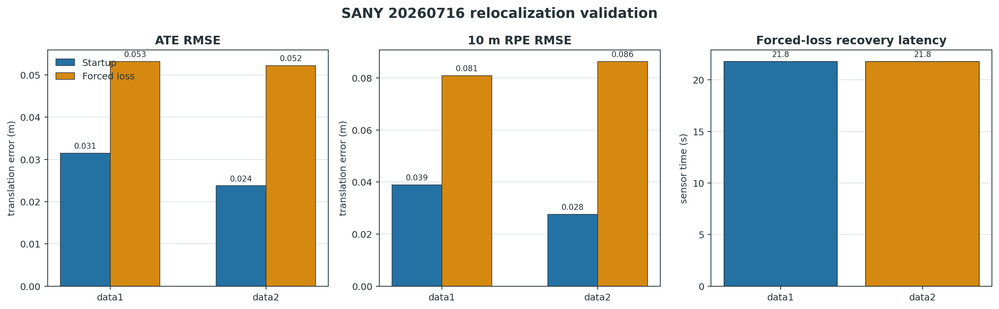
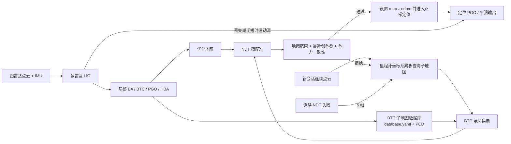
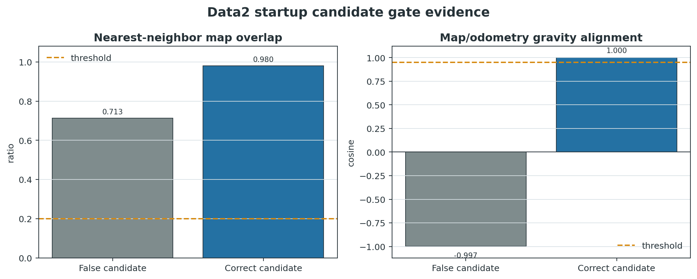
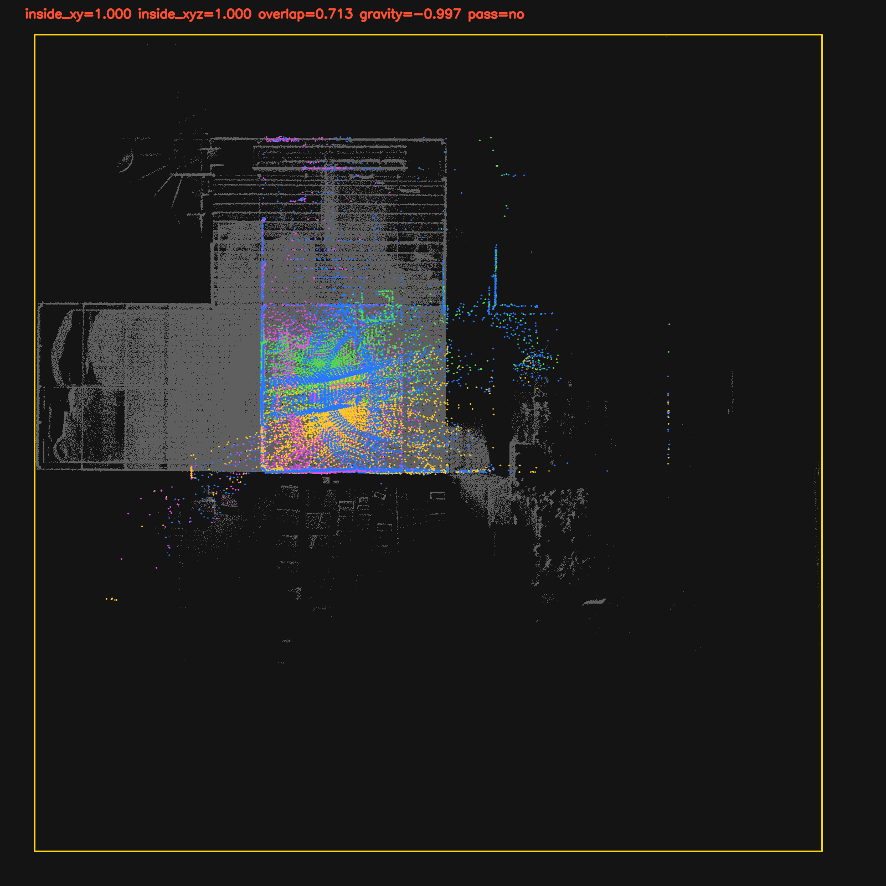
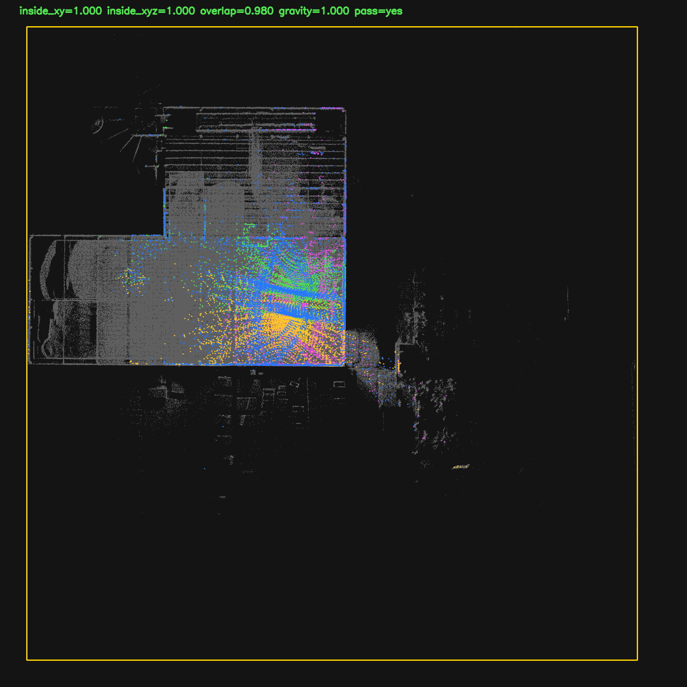
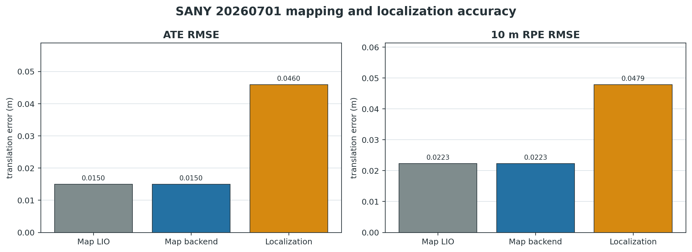
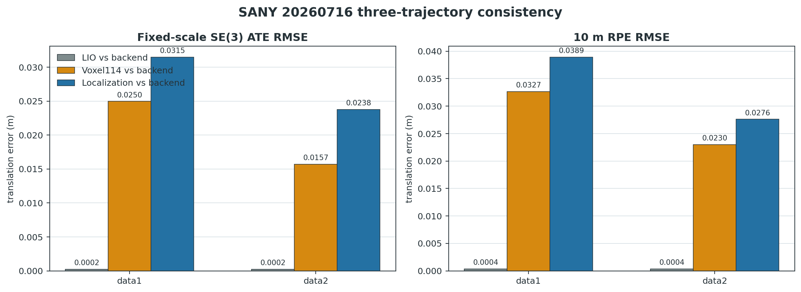
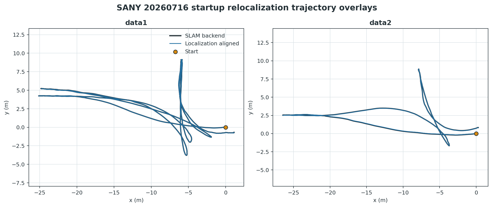
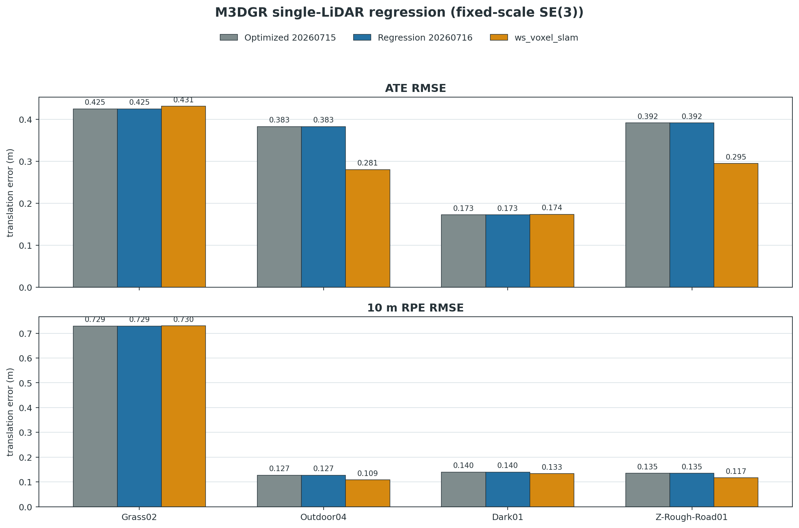

# Lightning-LM 多雷达 BTC 重定位与单雷达回归报告

> 分支：`feature/multi-lidar-relocalization-btc`<br>
> 基线分支：`feature/backend-ba-btc-hba-v2`（提交 `028a5bb`）<br>
> 多雷达数据：SANY 20260701、20260716 data1/data2，4 × Livox Mid360<br>
> 单雷达数据：M3DGR Grass02、Outdoor04、Dark01、Z-Rough-Road01<br>
> 实验日期：2026-07-16；报告日期：2026-07-17

## 1. 管理摘要

本轮完成了四雷达地图的 BTC 重定位数据库导出、非单位阵启动重定位、定位丢失后的自动重定位，以及四组 M3DGR 单雷达回归。结论分为两级：

1. **启动重定位已经稳定通过本轮验收。** 20260716 data1/data2 都在不使用 YAML 单位阵初始位姿的条件下完成 BTC 全局检索、NDT 精配准和地图一致性验证。相对 Lightning 后端参考轨迹，全程 ATE 分别为 **0.0315 m** 和 **0.0238 m**；运动开始后的前 30 s ATE 分别为 **0.0230 m** 和 **0.0232 m**。
2. **运行中丢失恢复功能已经跑通，但时延尚未达到生产级。** 在 data1 第 600 帧、data2 第 350 帧注入定位丢失后，两组都自动恢复，恢复后的完整融合轨迹 ATE 分别为 **0.0532 m** 和 **0.0522 m**。两次恢复都用了约 **21.8 s 传感器时间、22 次 BTC 查询**，因此该能力应标记为“功能正确、时延待优化”。
3. **20260701 多雷达建图和定位没有回归。** 相对指定的 114 单雷达真值，建图后端 ATE 为 **0.0150 m**、10 m RPE 为 **0.0223 m**；定位 ATE 为 **0.0460 m**、10 m RPE 为 **0.0479 m**，均显著低于本轮验收阈值。
4. **室内场景不能只靠“是否超出地图范围”判断重定位。** data2 的错误候选有 100% 点落在地图 XY 范围内，最近邻重叠率也达到 0.713，但地图与里程计的重力方向余弦为 **−0.997**，实际是上下翻转解。加入重力一致性门限 0.95 后，该候选被拒绝，下一正确候选以 0.980 重叠率、1.000 重力余弦通过。
5. **四组 M3DGR 单雷达 SLAM 无精度回退。** Grass02、Outdoor04、Dark01、Z-Rough-Road01 的新优化轨迹与 20260715 报告使用的轨迹逐字节一致，四组平均 ATE 仍为 **0.3432 m**，平均 10 m RPE 仍为 **0.2828 m**。

最终工程判断：当前分支可以作为“多雷达启动重定位已完成、运行中恢复已具备基本能力”的开发基线；在正式部署运行中恢复前，应优先把最坏恢复时延从 21.8 s 降低到业务可接受范围，并用真实故障而非只用注入故障做补充验证。



## 2. 目标、边界与验收口径

### 2.1 本轮目标

1. 在后端优化分支上保证 20260701 四雷达建图和定位正常。
2. 用建图结果自动生成可跨会话使用的 BTC 重定位数据库。
3. 对 20260716 data1/data2 实现非单位阵启动重定位；稳定后再验证运行中位姿丢失恢复。
4. 同时保留 Lightning 前端 LIO、Lightning 后端优化轨迹和 ws_voxel_slam 114 单雷达轨迹作为诊断参考。
5. 回归 M3DGR Grass02、Outdoor04、Dark01、Z-Rough-Road01，确保新增定位代码不破坏单雷达建图。

### 2.2 评测协议

- 对齐：固定尺度 SE(3) Horn/SVD 刚体对齐，尺度固定为 1.0，禁止 Sim(3) 尺度修正。
- 主指标：平移 ATE RMSE。
- 局部指标：1 m、10 m 路径间隔平移 RPE RMSE；报告主表使用 10 m RPE。
- 20260701 真值：`voxel_slam_114_20260701/sany_20260701_livox_114_run2/alidarState.txt`。
- 20260716 无外部真值，因此使用 Lightning 后端优化轨迹作为主参考，Lightning 前端 LIO 和 ws_voxel_slam 114 作为交叉参考。
- 20260701 通过阈值：覆盖率 ≥ 0.95、ATE ≤ 1.0 m、10 m RPE ≤ 0.5 m。
- 20260716 通过阈值：覆盖率 ≥ 0.90、ATE ≤ 0.5 m、1 m RPE ≤ 0.3 m、10 m RPE ≤ 0.5 m。
- 车辆运动范围、Z 波动、瞬时速度只作为诊断项；首尾距离不参与通过判定。

阈值用于识别明显错误重定位，而不是描述最终精度上限。实际结果均比阈值低一个数量级以上。用户给出的“XY 约 40 m 内、Z 波动不超过 1 m、速度通常不超过 4 m/s”被保留为诊断约束，没有用于裁剪、平滑或强行修改轨迹。

### 2.3 明确不在本轮范围内的内容

- 不使用 GNSS、轮速或相机参与 20260716 估计。
- 不把首尾接近作为轨迹正确性的必要条件。
- 不对轨迹做尺度缩放。
- 不把一次强制丢失实验等同于所有真实故障模式。
- 不以单次 wall time 变化宣称性能优化；Windows/WSL 文件缓存和并行负载会影响离线耗时。

## 3. 数据准备与完整性

### 3.1 20260716 分话题 bag 合并

每组数据的两个 bag 是同一时间段分别记录的点云和 IMU 话题。合并采用 SQLite CDR 消息复制并按记录时间建立索引，没有对消息重新序列化。

| 数据 | 合并话题 | 总消息数 | 时长 | 每雷达点云帧 | 结果 |
|---|---:|---:|---:|---:|---|
| data1 | 8 | 95,361 | 115.870 s | 1,037 | 完整 |
| data2 | 8 | 66,318 | 80.700 s | 667 | 完整 |

两组均包含 4 路点云和 4 路 IMU，合并后的消息数逐话题等于两个源 bag 的消息数之和。已按授权删除废弃的 `data_20260715` 评测产物，后续实验只使用 20260716。

### 3.2 参考轨迹

每组 20260716 数据生成三条参考轨迹：

1. Lightning 四雷达前端 LIO：诊断后端是否改变局部运动。
2. Lightning 四雷达后端优化轨迹：定位主参考。
3. ws_voxel_slam 114 单雷达优化轨迹：独立实现的交叉参考。

data1 参考轨迹长度为 1,036 帧，累计路程约 150.1 m；data2 为 666 帧，累计路程约 78.0 m。两组轨迹的 XY 范围分别约为 26.3 × 12.9 m 和 26.8 × 10.6 m，Z 范围均小于 0.36 m，符合装载机两次装卸作业的数据特征。

## 4. 系统架构与算法改动



### 4.1 建图侧：持久化 BTC 重定位数据库

原 BTC 只在同一建图会话内做回环检索，进程结束后描述子和对应子地图不可直接用于定位。本轮在保存地图时增加：

- 用最终优化位姿重新构建每个 BTC 子地图，避免保存描述子初次生成时的旧位姿。
- 使用连续、稠密的 `descriptor_id`，修复“关键帧 ID 与描述子条目 ID 混用”问题。
- 保存每个子地图的压缩 PCD、世界系位姿和完整 BTC 参数。
- 使用版本化的 `database.yaml` 清单进行加载校验。

20260701 地图最终生成 **108 个 BTC 子地图条目**。定位侧加载后关闭同会话“跳过邻近帧”规则，使跨会话查询与参考 ws_voxel_slam 的多会话用法一致。

### 4.2 定位侧：BTC 粗定位 + NDT 精配准

启动时不再依赖 YAML 单位阵。定位侧按当前 LIO 相对运动累积 10 帧点云，构建查询子地图并执行 BTC 全局检索。BTC 只负责给出粗略 SE(3) 候选，最终是否接受由 NDT 和地图一致性共同决定。

本轮同时修复了原 `Localize()` 的关键正确性问题：旧逻辑在初始化和跟踪分支中都会把 `loc_success` 置为 true，导致未收敛或低置信度 NDT 也可能被接受。新逻辑要求：

- NDT `hasConverged()` 为真；
- 置信度和变换矩阵均为有限数；
- 初始化置信度 ≥ 0.5，跟踪置信度 ≥ 0.4；
- 四元数范数有效。

20260701 的正常定位回归和 20260716 的跨会话定位均通过，说明该修复没有依赖人为轨迹平滑来获得正确结果。

### 4.3 地图一致性门控

对 NDT 候选变换后的四雷达融合点云计算：

- 地图 XY 范围内比例，阈值 0.90；
- 0.5 m 最近邻距离内的地图重叠率，阈值 0.20；
- `T_map_odom` 的重力轴夹角余弦，阈值 0.95。

其中重力余弦是室内对称场景的必要补充。俯视图对上下翻转不敏感，错误候选即使没有超出地图边界，也可能把地面和顶面互换。



错误候选俯视图：点云在 XY 上仍位于地图中，但重力为 −0.997，因此拒绝。



下一候选重叠率 0.980、重力余弦 1.000，点云与地图结构切合并被接受。



### 4.4 运行中丢失恢复

正常跟踪连续 5 帧 NDT 拒绝后，状态切换为初始化并重新启动 BTC 查询。丢失期间不传播被拒绝的 NDT 变换，前端 LIO 继续作为短时运动源；BTC/NDT/地图一致性重新接受后，恢复地图坐标系定位。

### 4.5 定位 PGO 与图优化正确性修复

重定位测试暴露出若干与状态复用有关的问题，本轮一并修复：

- PGO 时间戳由函数静态变量改为实例状态，`Reset()` 时完整清理。
- 滑窗淘汰顶点后重建 `frames_by_id_`，避免复用旧优化器顶点 ID。
- 激光里程计相对约束按实际有效帧计数，而不是按可能不连续的 frame ID 差值。
- 修复图边删除时传错指针的问题。
- 增量优化第一次求解后清除一次性新增元素，避免下一帧重复插入活动块。
- DR 外推和 DR 平滑保持可配置；本轮正式结果仍启用原有路径，没有增加基于物理阈值的轨迹裁剪。

## 5. 20260701 多雷达建图与定位回归

| 轨迹 | 估计帧 | 真值关联帧 | 覆盖率 | ATE RMSE | 1 m RPE | 10 m RPE | 结果 |
|---|---:|---:|---:|---:|---:|---:|---|
| 建图前端 LIO | 1,083 | 1,072 | 0.9826 | 0.0150 m | 0.0170 m | 0.0223 m | 通过 |
| 建图后端优化 | 1,083 | 1,072 | 0.9826 | 0.0150 m | 0.0169 m | 0.0223 m | 通过 |
| 地图定位 | 1,073 | 1,061 | 0.9725 | 0.0460 m | 0.0193 m | 0.0479 m | 通过 |



后端优化没有破坏前端轨迹：ATE 从 0.014995 m 变为 0.014972 m，差异仅约 0.000023 m。定位轨迹也完整通过阈值。

20260701 开始静止阶段存在已知的短时 Z/姿态异常。重力一致性门控在前约 10 帧观测到 0.87–0.89 的重力余弦并拒绝候选；LIO 稳定后候选重力余弦接近 1.0，随后正常接受。这说明门控把已知初始化异常转化为短暂延迟，没有把异常姿态写入地图定位结果。

## 6. 20260716 三轨迹一致性

| 数据 | 比较 | ATE RMSE | 1 m RPE | 10 m RPE | 覆盖率 |
|---|---|---:|---:|---:|---:|
| data1 | Lightning 前端 vs 后端 | 0.000239 m | 0.000316 m | 0.000353 m | 1.000 |
| data1 | Voxel114 vs Lightning 后端 | 0.024961 m | 0.023205 m | 0.032657 m | 1.000 |
| data1 | 启动定位 vs Lightning 后端 | 0.031493 m | 0.007186 m | 0.038948 m | 1.000 |
| data2 | Lightning 前端 vs 后端 | 0.000240 m | 0.000318 m | 0.000354 m | 1.000 |
| data2 | Voxel114 vs Lightning 后端 | 0.015705 m | 0.019335 m | 0.022997 m | 1.000 |
| data2 | 启动定位 vs Lightning 后端 | 0.023756 m | 0.008260 m | 0.027607 m | 1.000 |



三种实现的误差都在厘米级，且两组覆盖率均为 1.0。Lightning 前端与后端几乎重合，说明后端在这两组短闭合装卸轨迹上没有引入形变；独立的 Voxel114 轨迹也支持相同运动形状。因 20260716 没有绝对真值，这类跨实现一致性是强证据，但不能替代外部真值。

## 7. 启动重定位结果

启动测试显式关闭 YAML 初始位姿，两个数据的真实初始位置都与建图原点明显不同。

| 数据 | BTC 尝试/候选/接受 | 有效定位帧 | 前 30 s ATE | 前 30 s 10 m RPE | 全程 ATE | 全程 10 m RPE | 结果 |
|---|---:|---:|---:|---:|---:|---:|---|
| data1 | 4 / 1 / 1 | 996 / 1,036 | 0.0230 m | 0.0240 m | 0.0315 m | 0.0389 m | 通过 |
| data2 | 2 / 2 / 1 | 646 / 666 | 0.0232 m | 0.0290 m | 0.0238 m | 0.0276 m | 通过 |

data1 接受的初始位置约为 `[-1.585, 1.763, -0.214] m`；data2 约为 `[-0.207, 1.070, 0.024] m`，均不是单位阵初始位置。data2 的首个上下翻转候选被重力门控拒绝，下一正确候选被接受，后续没有再次触发重定位。



图中只做固定尺度 SE(3) 对齐。两条定位轨迹与建图后端轨迹在运动开始后即重合，满足“通过初始运动段判断重定位是否正确”的验收思路。

## 8. 运行中强制丢失恢复

| 数据 | 注入帧 | 恢复接受帧 | 丢失后 BTC 尝试 | 恢复时延 | 全程覆盖率 | 全程 ATE | 10 m RPE | 结果 |
|---|---:|---:|---:|---:|---:|---:|---:|---|
| data1 | 600 | 819 | 22 | 21.7998 s | 0.9965 | 0.0532 m | 0.0809 m | 功能通过 |
| data2 | 350 | 569 | 22 | 21.7998 s | 1.0000 | 0.0522 m | 0.0863 m | 功能通过 |

丢失区间内，纯地图定位有效帧比例分别降至 0.750 和 0.641，但前端 LIO/定位 PGO 保留了连续的融合输出，因此用于评估的最终轨迹仍有 0.9965 和 1.0000 的参考覆盖率。恢复后的全程误差仍远低于验收阈值，说明重定位回接没有造成米级跳变或地图坐标系错误。

当前主要问题是 21.8 s 时延。查询子地图由 10 帧构成，每个失败候选都会消耗一个查询窗口；两组都在第 22 次查询才找到可接受候选。下一阶段应优先使用滚动查询、Top-K 候选和异步检索降低等待，而不是放宽几何门限接受更早但错误的候选。

## 9. M3DGR 四序列单雷达回归

### 9.1 精度结果

| 序列 | 20260716 ATE | 20260715 ATE | ws_voxel_slam ATE | 20260716 10 m RPE | 20260715 10 m RPE | ws_voxel_slam 10 m RPE |
|---|---:|---:|---:|---:|---:|---:|
| Grass02 | 0.4253 m | 0.4253 m | 0.4313 m | 0.7294 m | 0.7294 m | 0.7305 m |
| Outdoor04 | 0.3830 m | 0.3830 m | 0.2806 m | 0.1273 m | 0.1273 m | 0.1087 m |
| Dark01 | 0.1729 m | 0.1729 m | 0.1738 m | 0.1398 m | 0.1398 m | 0.1333 m |
| Z-Rough-Road01 | 0.3916 m | 0.3916 m | 0.2948 m | 0.1347 m | 0.1347 m | 0.1168 m |
| **平均** | **0.3432 m** | **0.3432 m** | **0.2951 m** | **0.2828 m** | **0.2828 m** | **0.2723 m** |



四组 20260716 优化轨迹与 20260715 报告的轨迹 SHA-256 完全相同，不只是四舍五入后的指标一致。因此可以确认：新增多雷达定位和重定位代码没有改变单雷达建图输出。

与 20260715 结论一致，当前 Lightning 在 Grass02 和 Dark01 的 ATE 略优于 ws_voxel_slam，在 Outdoor04 和 Z-Rough-Road01 仍落后；本轮目标是防止回归，没有重新调节 M3DGR 后端参数。

### 9.2 完整性与资源

| 序列 | 输出帧 | RTK 覆盖率 | Wall time | 峰值 RSS | 接受闭环 | 完整性 |
|---|---:|---:|---:|---:|---:|---|
| Grass02 | 1,708 | 0.9869 | 160.59 s | 1,483.6 MB | 0 | 完整 |
| Outdoor04 | 7,807 | 0.9978 | 564.92 s | 5,349.6 MB | 1 | 完整 |
| Dark01 | 2,041 | 0.9894 | 111.73 s | 588.2 MB | 0 | 完整 |
| Z-Rough-Road01 | 5,315 | 0.9959 | 394.98 s | 3,958.6 MB | 0 | 完整 |

四次运行均为 `algorithm_rc=0`、`completion=reached_final_lidar`，没有无效时间戳、非单调时间戳或超限输出间隔。新运行 wall time 普遍短于历史运行，但受文件缓存和机器负载影响，本报告不把它解释为算法加速。

## 10. 测试与质量门禁

### 10.1 构建

以下目标重新构建成功：

- `run_loc_offline`
- `run_slam_offline`
- `btc_loop_detector_test`
- `localization_pgo_test`

编译器只输出项目中原有的未使用参数、成员初始化顺序和有符号比较警告，没有新增编译错误。

### 10.2 单元测试

- `btc_loop_detector_test`：通过；验证 BTC 回环、数据库保存/重载和跨会话检索，重载分数为 1.0。
- `localization_pgo_test`：通过；验证非零全局初始位姿、连续定位输入及 PGO 输出。

### 10.3 脚本和差异检查

- 两个 shell 入口通过 `bash -n`。
- 所有新增/修改 Python 工具通过 `py_compile`。
- 报告清单通过 `python -m json.tool`。
- `git diff --check` 通过；仅提示少数历史 CRLF 文件下次由 Git 转为 LF。
- 六张统计图和两张俯视调试图均完成最终视觉检查。

## 11. 风险、结论与下一阶段

### 11.1 已关闭风险

- 非单位阵启动时不再依赖人工 YAML 位姿。
- BTC 数据库可随优化地图持久化并跨会话加载。
- NDT 未收敛或低置信度不再被无条件当作成功。
- 仅靠室内 XY 地图边界造成的上下翻转假阳性已由重力门控拦截。
- 运行中连续定位失败可进入全局重定位并恢复。
- 新定位代码没有改变 M3DGR 单雷达建图轨迹。

### 11.2 仍存在的风险

1. **运行中恢复时延 21.8 s。** 功能正确，但装载机持续运动时该空窗可能过长。
2. **20260716 没有绝对真值。** 三实现厘米级一致是强证据，但不能排除三者共享的小幅系统误差。
3. **验证次数有限。** 启动和强制丢失各只在两组数据上完整运行一次。
4. **地图一致性计算仍偏重。** 每个候选会合并活动静态地图并建立 KD-tree；启动阶段最大单帧处理耗时约 1.1–1.5 s。
5. **重力门控有场景假设。** 它要求建图和定位会话都由 LIO 对齐到同一重力方向；极端坡面或错误 IMU 初始化需要额外处理。
6. **M3DGR 现有精度差距未解决。** Outdoor04 和 Z-Rough-Road01 仍落后于 ws_voxel_slam，这属于上一阶段遗留优化项，不是本轮回归。

### 11.3 下一阶段优先级

1. 将 BTC 查询改为滚动窗口和异步线程，并对 Top-K 候选并行执行轻量几何预检。
2. 缓存静态地图 KD-tree 和边界，避免每次候选重建。
3. 引入恢复时延验收指标，例如 P95 ≤ 3–5 s，并补充真实退化/遮挡/地图缺失故障。
4. 对 BTC 数据库增加地图哈希、配置哈希和传感器外参哈希，防止地图与数据库错配。
5. 录制带可靠外部真值的跨会话装卸数据，验证绝对精度和多日稳定性。
6. 在不放宽错误候选门限的前提下，提高室内重复结构中的 BTC 候选召回率。

### 11.4 最终工程判断

本轮真实目标不是“让轨迹看起来平滑”，而是让错误初始位姿能够被全局搜索纠正，并用独立轨迹和地图几何验证其正确性。现有证据支持以下结论：

- 20260701 建图与定位正常；
- 20260716 两组非单位阵启动重定位正确；
- 运行中丢失可以恢复，恢复后的轨迹正确；
- 单雷达 M3DGR 无回归；
- 运行中恢复时延仍需专项优化。

因此建议保留当前分支作为下一阶段开发基线，不回退已经验证过的 NDT 成功判定、地图重叠或重力门控；下一轮只针对查询调度和候选召回优化时延。

## 附录 A：主要代码改动

| 模块 | 文件 | 改动 |
|---|---|---|
| BTC 数据库 | `src/core/backend/btc_loop_detector.*` | 稠密描述子 ID、最终位姿子地图重建、数据库持久化 |
| 地图保存 | `src/core/system/slam.cc` | 保存地图时同步输出 BTC 数据库 |
| BTC 重定位 | `src/core/localization/btc_relocalizer.*` | 数据库加载、查询子地图、跨会话候选检索 |
| 地图查询 | `src/core/maps/tiled_map.*` | 全局静态地图边界与点数接口 |
| 定位 | `src/core/localization/lidar_loc/lidar_loc.*` | 启动/丢失重定位、NDT 判定、地图/重力门控、俯视调试图 |
| 定位入口 | `src/app/run_loc_offline.cc`、`scripts/run_loc_offline.sh` | 禁用 YAML 初值、强制丢失帧等可复现实验参数 |
| 定位 PGO | `src/core/localization/pose_graph/*` | Reset、时间戳、滑窗索引、约束计数、DR 开关 |
| 图优化 | `src/core/miao/core/graph/*` | 边删除和增量新增元素清理修复 |
| 测试 | `src/test/btc_loop_detector_test.cc`、`src/test/localization_pgo_test.cc` | 数据库重载与非零全局位姿覆盖 |
| 数据工具 | `scripts/merge_rosbag2_by_timestamp.py` 等 | bag 合并、检查、轨迹评估和报告资产生成 |

## 附录 B：复现入口

### B.1 多雷达配置

```text
config/reproduction/multi_lidar/sany_4livox/sany_4lidar_frontend_final.yaml
```

### B.2 建图与定位入口

```text
scripts/run_slam_offline.sh
scripts/run_loc_offline.sh
scripts/run_voxel_slam_114_reference.sh
```

### B.3 评估与报告资产

```text
scripts/evaluate_aligned_trajectory_window.py
scripts/reproduction/multi_lidar/sany_4livox/evaluate_sany_trajectory.py
scripts/reproduction/multi_lidar/sany_4livox/build_relocalization_report_assets.py
scripts/reproduction/single_lidar/m3dgr/evaluate_backend_runs.py
```

报告清单：`doc/multi_lidar_btc_relocalization_and_m3dgr_regression_manifest_20260716.json`。

## 附录 C：关键实验产物

### C.1 SANY 20260701

```text
F:/datasets/SANY/mid360/data_20260701/codex_relocalization_eval/mapping_btc_database_20260716
F:/datasets/SANY/mid360/data_20260701/codex_relocalization_eval/localization_identity_final_gravity_gate_20260716
```

### C.2 SANY 20260716 data1/data2

```text
F:/datasets/SANY/mid360/data_20260716/data1/codex_relocalization_eval
F:/datasets/SANY/mid360/data_20260716/data2/codex_relocalization_eval
```

每组目录包含合并 bag、Lightning 前后端参考、Voxel114 参考、启动重定位和强制丢失恢复结果。

### C.3 M3DGR

```text
F:/SLAM_AI_KnowledgeBase/code/_m3dgr_work/bench_relocalization_regression_20260716/runs
F:/SLAM_AI_KnowledgeBase/code/_m3dgr_work/bench_relocalization_regression_20260716/evaluations
```

所有结论均可从上述 JSON、CSV、TUM、运行元数据和日志重新计算；报告图表由清单驱动脚本生成，不包含手工修改的数值。
