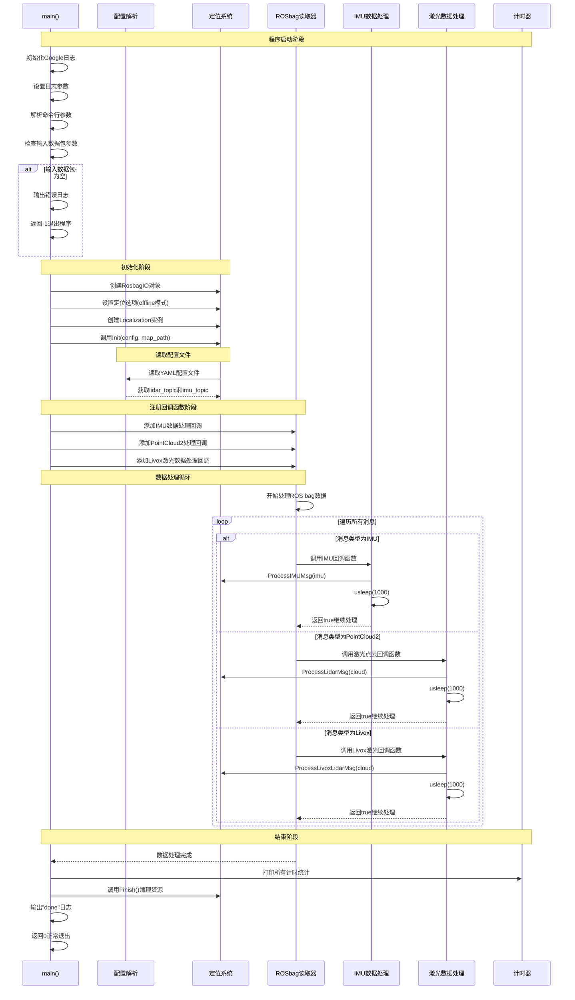

# run_loc_offline.cc 流程时序图



## 关键组件说明

### 1. 初始化阶段
- **日志初始化**: 设置Google Logging参数，启用彩色日志输出
- **参数解析**: 解析命令行参数，包括输入bag路径、配置文件路径、地图路径
- **参数验证**: 检查必需的输入bag参数是否存在

### 2. 定位系统初始化
- **RosbagIO创建**: 用于读取ROS bag数据的接口
- **Localization创建**: 核心定位系统实例，设置为离线模式
- **系统初始化**: 读取配置文件和地图数据

### 3. 回调函数注册
- **IMU回调**: `ProcessIMUMsg()` - 处理IMU数据
- **PointCloud2回调**: `ProcessLidarMsg()` - 处理标准激光点云数据
- **Livox回调**: `ProcessLivoxLidarMsg()` - 处理Livox激光雷达数据

### 4. 数据处理循环
- 按时间顺序遍历ROS bag中的所有消息
- 根据消息类型调用相应的回调函数
- 每次处理后休眠1ms以控制处理速度

### 5. 程序结束
- 打印性能统计信息
- 清理定位系统资源
- 正常退出程序

## 数据流向

```
ROS Bag → RosbagIO → 回调函数 → Localization → 定位结果
```

每个传感器消息都会按照时间顺序被处理，IMU数据和激光数据在Localization系统中进行融合，最终输出定位结果。