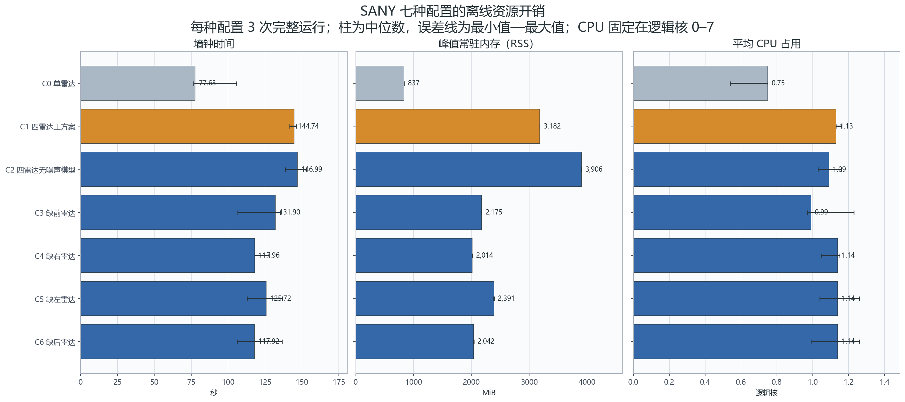
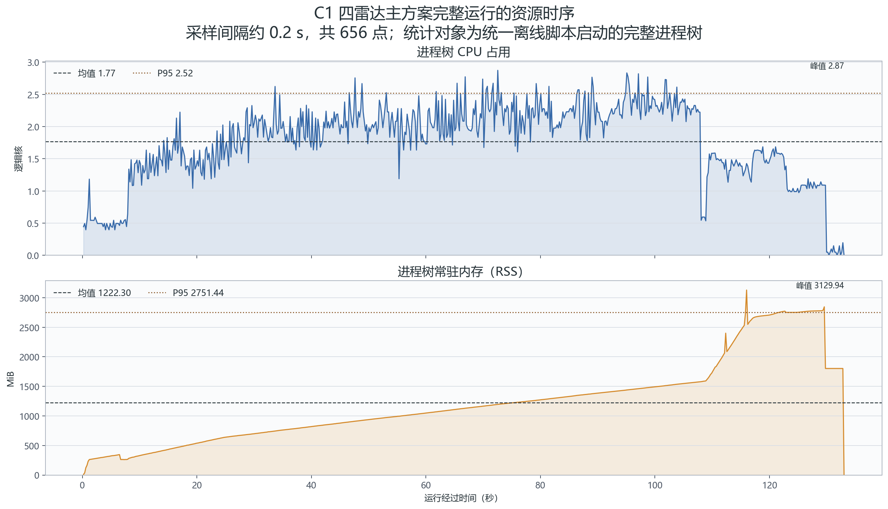
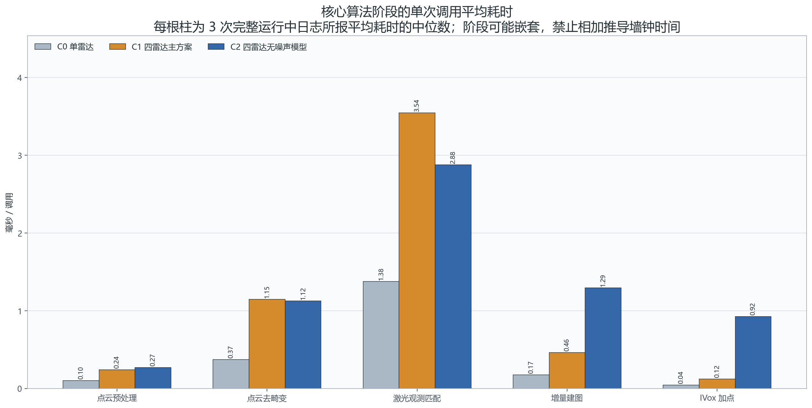

# SANY 四雷达 Lightning-LM 前端 LIO 资源评估报告

> 报告日期：2026-07-13  
> 评估对象：Lightning-LM 单/多雷达统一前端，四 Livox MID-360 主方案 C1  
> 数据范围：SANY 约 120.223 s SQLite3 ROS 2 bag；7 种配置、每种 3 次完整离线运行，共 21 个单元  
> 运行约束：ROS 2 Humble、WSL 2、Windows 挂载盘、CPU 亲和性固定为逻辑核 0–7、离线最快回放

## 技术摘要

**当前四雷达主方案可以稳定完成离线前端，但在本机 WSL 2 测试环境中尚未达到端到端实时。** C1 处理 120.223 s 传感器数据的墙钟时间中位数为 144.74 s，对应处理速度约 0.831×、实时因子约 1.204。若把 1.0× 作为最低实时线，吞吐仍需提高约 20.4%；若要求 20% 工程余量，则目标应为不低于 1.2×。

**与单雷达 C0 相比，四雷达 C1 的主要代价是内存和总处理时间，而不是 8 核 CPU 被占满。** C1 峰值 RSS 中位数为 3,182 MiB，是 C0 的 3.80 倍；墙钟时间为 1.86 倍；GNU time 统计的任务平均 CPU 仅为 1.13 个逻辑核。独立进程树时序采样得到平均 1.77 核、P95 2.52 核、峰值 2.87 核，仍只占 8 核配额的 22.1%、31.5% 和 35.9%。因此，直接增加可用核数未必能解决问题，优先级应放在串行热点、地图数据结构和输入/输出路径。

**激光观测匹配是已埋点核心阶段中最重的单次调用，内存则随地图积累明显增长。** C1 的激光观测匹配单次平均耗时中位数为 3.543 ms，高于点云去畸变的 1.146 ms 和增量建图的 0.462 ms。完整运行的 RSS 从启动后逐步上升，在处理后段进入 2.7–3.1 GiB 区间。这种形态与地图积累及最终导出一致，但仅凭一段 120 s 数据不能判定是否存在长期内存泄漏。

## 四雷达主方案的资源边界清晰，但实时吞吐仍有缺口



图中柱为 3 次完整运行的中位数，误差线为最小值到最大值。C1 是正式四雷达主方案；C0 是只使用 114 雷达的单雷达基线；C2 关闭异方差雷达噪声模型；C3–C6 分别模拟缺少一路点云的降级配置。

| 配置 | 墙钟时间中位数 / s | 峰值 RSS 中位数 / MiB | 平均 CPU / 逻辑核 | 占 8 核配额 |
|---|---:|---:|---:|---:|
| C0 单雷达 | 77.63 | 837 | 0.75 | 9.4% |
| **C1 四雷达主方案** | **144.74** | **3,182** | **1.13** | **14.1%** |
| C2 四雷达无噪声模型 | 146.99 | 3,906 | 1.09 | 13.6% |
| C3 缺前雷达 | 131.90 | 2,175 | 0.99 | 12.4% |
| C4 缺右雷达 | 117.96 | 2,014 | 1.14 | 14.3% |
| C5 缺左雷达 | 125.72 | 2,391 | 1.14 | 14.3% |
| C6 缺后雷达 | 117.92 | 2,042 | 1.14 | 14.3% |

对 C1 而言，144.74 s 包含算法计算、SQLite3 bag 读取、轨迹/地图写盘以及外层运行脚本开销，不是纯算法内核时间。以 120.223 s 输入时长为分母：

- 实时因子：`144.74 / 120.223 = 1.204`，小于等于 1 才能在同等环境下赶上传感器时间；
- 处理速度：`120.223 / 144.74 = 0.831×`；
- 达到 1.0× 需要将吞吐提高约 20.4%，等价于将现有墙钟时间缩短约 16.9%；
- C1 相对 C0 的墙钟时间增加 86.4%，峰值 RSS 增加 2,345 MiB，平均 CPU 增加 50.7%。

三雷达降级配置的峰值 RSS 位于 2,014–2,391 MiB，低于完整四雷达，但它们代表传感器故障后的可运行路径，不应作为常态节省资源的方案。C2 峰值 RSS 达到 3,906 MiB，且既有质量报告已经证明其轨迹和地图发散；它只能作为异常资源压力样本，不能作为可部署候选。

## CPU 有余量，RSS 在处理后段成为更明显的工程约束



该图来自统一离线脚本的一次 C1 运行，共 656 个约 0.2 s 间隔的进程树样本。此运行因旧版结束判据将最后约 1.81 s 误判为不完整，不能用于轨迹验收或端到端速度结论；CPU/RSS 采样本身完整，可用于观察资源随时间的形态。

| 时序指标 | 结果 |
|---|---:|
| 监控时长 | 134.02 s |
| CPU 平均 / P95 / 峰值 | 1.77 / 2.52 / 2.87 核 |
| 8 核配额平均 / P95 / 峰值占比 | 22.1% / 31.5% / 35.9% |
| RSS 平均 / P95 / 峰值 | 1,222 / 2,751 / 3,130 MiB |

CPU 在初始化阶段较低，进入连续点云处理后主要位于约 1.7–2.5 核，运行末段随计算任务结束而下降。整个过程没有接近 8 核上限，说明当前性能缺口不能简单归因于 CPU 配额不足。GNU time 与进程树采样的平均 CPU 数值不同，是因为前者统计完整外层任务的累计 CPU/墙钟比，后者按约 0.2 s 对算法进程树采样；两者适合回答不同问题，不应混为同一指标。

RSS 在主体处理阶段持续上升，并在约 110 s 后快速进入 2.5 GiB 以上区间，峰值约 3.13 GiB。该走势与局部地图/IVox 累积、结果缓存和最终地图导出相符。由于只有一段约 120 s 路线，报告不能确认 RSS 是否会在更长路线中达到稳定平台，也不能据此宣称存在内存泄漏。

## 激光观测匹配是首要计算热点，异常地图增长会进一步放大建图代价



图中展示 C0、C1 和 C2 的五个核心 Timer 阶段。每根柱是 3 次完整运行中日志所报 `average time usage` 的中位数。Timer 仅保留最近最多 2,000 个样本，且不同阶段可能嵌套，因此这些数值用于定位热点，**禁止直接相加推导端到端墙钟时间**。

| 核心阶段 | C0 单雷达 / ms | C1 四雷达 / ms | C1/C0 |
|---|---:|---:|---:|
| 点云预处理 | 0.100 | 0.241 | 2.42× |
| 点云去畸变 | 0.371 | 1.146 | 3.09× |
| 激光观测匹配 | 1.376 | 3.543 | 2.57× |
| 增量建图 | 0.172 | 0.462 | 2.68× |
| IVox 加点 | 0.043 | 0.121 | 2.82× |

C1 的激光观测匹配单次调用最重，是首轮 CPU 优化和更细粒度 profiling 的优先对象。点云去畸变排在第二，且其 C1/C0 放大倍数约 3.09×，符合四路点云带来更多点级处理的预期。

C2 的 IVox 加点和增量建图分别升至 0.923 ms 和 1.294 ms，约为 C1 的 7.61 倍和 2.80 倍。既有实验中 C2 地图点数中位数达到 7,632,079，而 C1 为 1,449,740；因此这里反映的是关闭噪声模型后质量发散和地图膨胀共同造成的资源放大，不能解释为“关闭模型更省计算”。

## 评估范围、数据和指标口径

### 数据与配置

- 输入：`rosbag2_2026_07_01-17_30_42_merged`，主雷达有效时长约 120.223 s；
- 正式矩阵：C0–C6 共 7 种配置，每种 3 次完整技术重复；21/21 单元通过既有 post-hoc 完整性审计；
- CPU 约束：所有正式运行固定 `taskset 0-7`，分配 8 个逻辑核；
- 回放方式：`playback_rate=0`，即不按传感器时间节流，尽快离线处理；
- 正式矩阵运行于历史冻结安装树 `d7e0ca5`。当前统一分支已在提交 `b77db9f` 增加结构化端到端与阶段耗时导出，但尚未用该提交重跑全部 21 个完整单元。

### 指标定义

- **墙钟时间**：GNU time 的 `Elapsed (wall clock) time`；用于端到端离线开销比较；
- **平均 CPU 逻辑核**：GNU time 的 CPU 百分比除以 100；例如 113% 表示平均使用 1.13 个逻辑核；
- **峰值 RSS**：GNU time 的 `Maximum resident set size`，由 KiB 换算为 MiB；它不是系统总内存占用；
- **进程树时序**：统一离线脚本读取 `/proc`，累计算法进程及其子进程的 CPU tick 和 RSS；
- **阶段耗时**：C++ Timer 输出的单次调用均值、中位数和 P95；阶段可重叠或嵌套；
- **技术重复**：同一 bag、同一配置、同一机器的重复执行，用于检查运行稳定性，不代表独立场景样本。

## 方法与稳健性检查

资源总量以 21 个正式单元的 `gnu_time.txt` 为准；对每个配置报告 3 次运行中位数，并在图中保留最小值—最大值。阶段耗时直接从相同单元的算法日志解析；时序图使用统一离线脚本生成的 `resource_samples.csv`。原始数据经脚本转为 CSV 后绘图，生成过程可重复执行。

三次重复的轨迹 SHA 完全一致，说明算法输出具有强确定性；资源数值仍受 WSL 调度、Windows 挂载盘 I/O、文件缓存和后台负载影响。例如 C0 墙钟时间范围为 76.52–105.61 s，表明本环境存在明显外部抖动。因此本报告使用中位数描述典型值，不用单次最优值宣称性能上限。

## 限制与不确定性

1. **平台外推受限。** WSL 2 和 `/mnt/f` Windows 挂载盘不等于目标车载原生 Linux；本报告适合确定当前开发机的相对资源关系，不足以替代目标硬件验收。
2. **路线时长不足。** 120 s 数据无法验证 10 分钟以上的地图内存增长、长期碎片化、热降频或持续实时性。
3. **正式矩阵尚未用最新耗时版本重跑。** 新版 9 阶段结构化统计已经通过限帧 smoke，但本报告的完整 21 单元仍使用历史 5 阶段日志。
4. **墙钟时间不是纯算法时间。** Bag I/O、序列化、PCD 导出和脚本管理都包含在内；这正适合端到端部署判断，但不足以直接指导函数级优化。
5. **三次重复不是三段独立数据。** 误差线反映运行抖动，不代表跨路线、跨天气或跨机器的置信区间。

## 建议的资源预算与下一步

1. **当前 C1 进程内存上限至少预留 4 GiB。** 若连同 ROS 2/DDS、操作系统、监控和其他车载模块考虑，目标计算平台建议从 8 GiB 系统内存起评估；该建议只覆盖当前 120 s 路线，最终规格必须由长路线压力测试确认。
2. **把实时验收目标设为处理速度不低于 1.2×。** 先在目标原生 Linux 上分别执行最快离线回放和 1.0× 节流回放，使用新版 `processing_timing_summary.json` 验证完整数据、非 UI、非限帧条件下的实时因子。
3. **优先细分激光观测匹配。** 将最近邻搜索、平面拟合、残差构造、ESKF 更新分别埋点，并记录每帧有效点数，确认 3.543 ms 的主要来源。
4. **单独测量地图导出与磁盘路径。** 对比 `/mnt/f`、WSL ext4 和目标本地 NVMe；同时跑一次关闭最终 PCD 导出的实验，区分算法计算和输出 I/O。
5. **增加 5、15、30 分钟内存阶梯测试。** 记录 RSS、IVox 体素数、地图点数和局部地图裁剪事件，判断内存是趋于平台、线性增长还是异常增长。
6. **不要以 C2 换取性能。** 当前证据表明 C2 同时恶化轨迹、地图和内存，四雷达主方案应继续保留异方差雷达噪声模型。

## 待回答问题

- 在目标车载 CPU、原生 Linux 和本地存储上，C1 能否稳定达到 1.2× 处理速度？
- RSS 增长在更长路线中是否随局部地图裁剪趋于稳定？
- 激光观测匹配的主要开销来自邻域搜索、残差构造还是 ESKF 更新？
- 采用点数自适应下采样或并行去畸变后，能否在不损害轨迹与地图质量的前提下降低 20% 以上墙钟时间？

## 证据与复现入口

- 图表生成脚本：[`resource_report_assets/build_resource_report_assets.py`](resource_report_assets/build_resource_report_assets.py)
- 正式资源逐运行数据：[`resource_report_assets/formal_resource_runs.csv`](resource_report_assets/formal_resource_runs.csv)
- 正式资源配置汇总：[`resource_report_assets/formal_resource_summary.csv`](resource_report_assets/formal_resource_summary.csv)
- 核心阶段耗时：[`resource_report_assets/formal_stage_timing.csv`](resource_report_assets/formal_stage_timing.csv)
- 图表口径与数据源说明：[`resource_report_assets/source_notes.md`](resource_report_assets/source_notes.md)
- 数据集正式证据根目录：`F:\datasets\SANY\mid360\data_20260701\lightning_lm_4lidar_frontend_20260710\formal_experiments_20260711_v2`

复现图表：

```bash
cd /mnt/f/SLAM_AI_KnowledgeBase/code/WSL_Ubuntu_22.04/lightning-lm

python3 doc/sany/multi_lidar/resource_report_assets/build_resource_report_assets.py \
  --formal-root /mnt/f/datasets/SANY/mid360/data_20260701/lightning_lm_4lidar_frontend_20260710/formal_experiments_20260711_v2 \
  --manual-run /mnt/f/datasets/SANY/mid360/data_20260701/lightning_lm_4lidar_frontend_20260710/manual_4lidar_repro_01 \
  --output-dir doc/sany/multi_lidar/resource_report_assets
```
