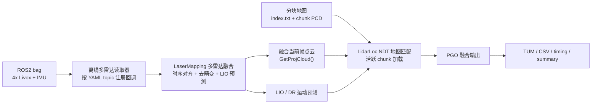
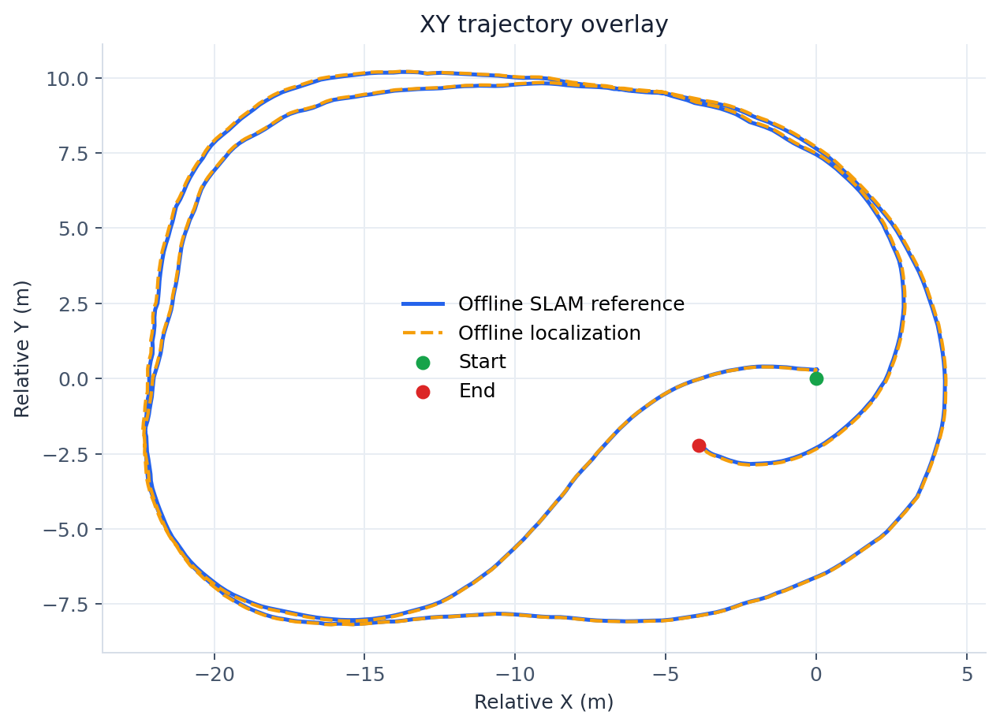
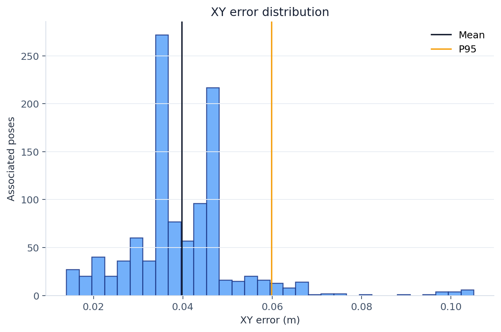
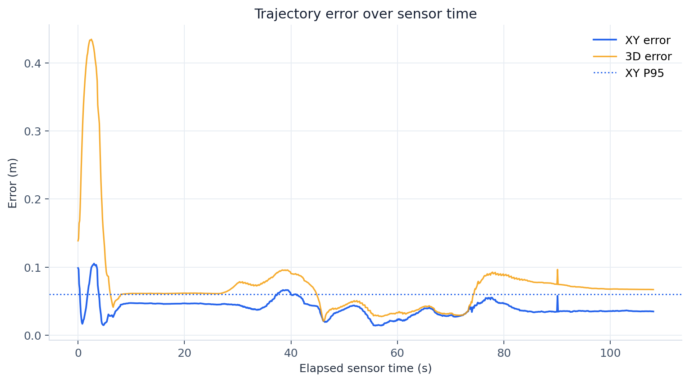
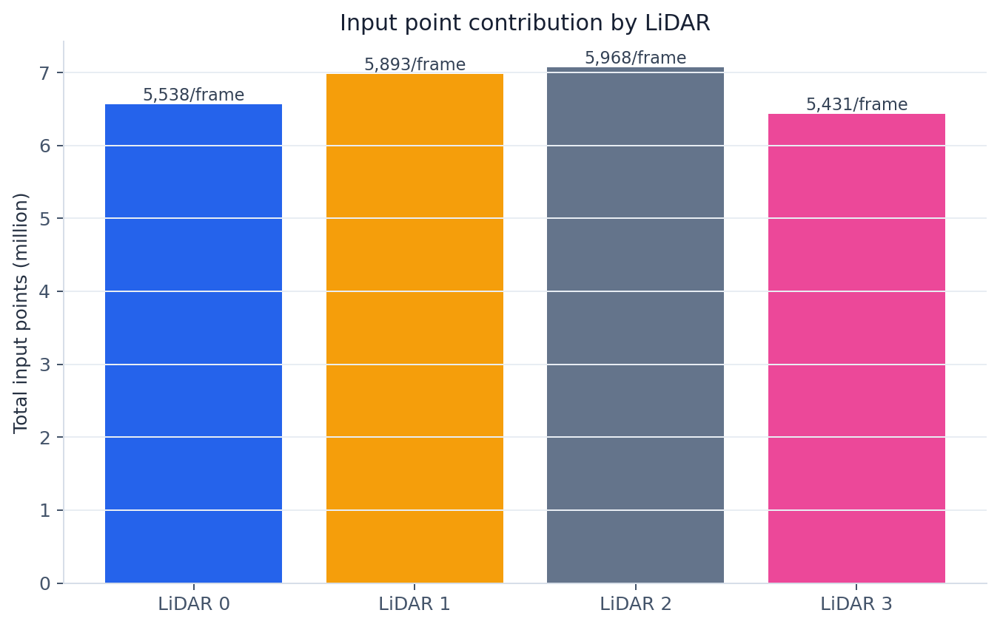
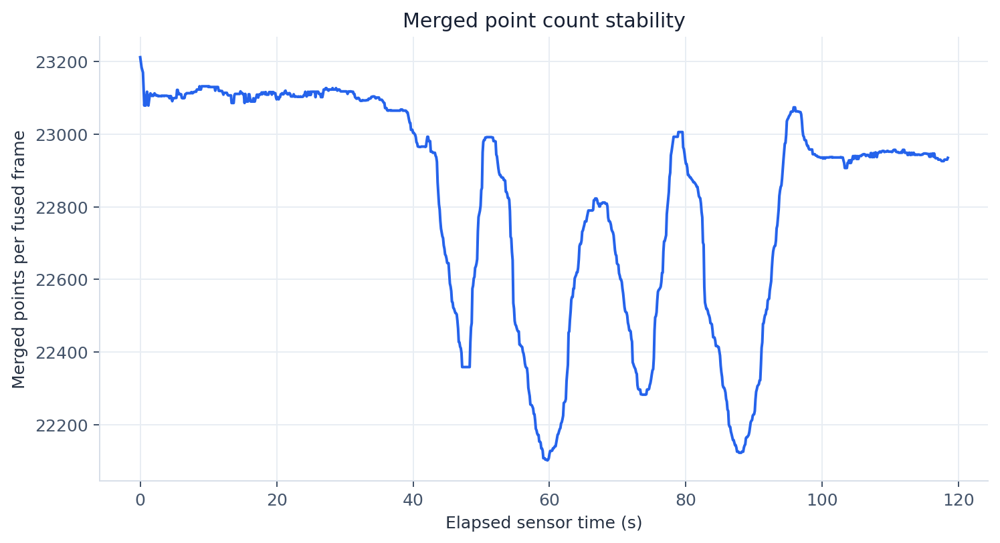
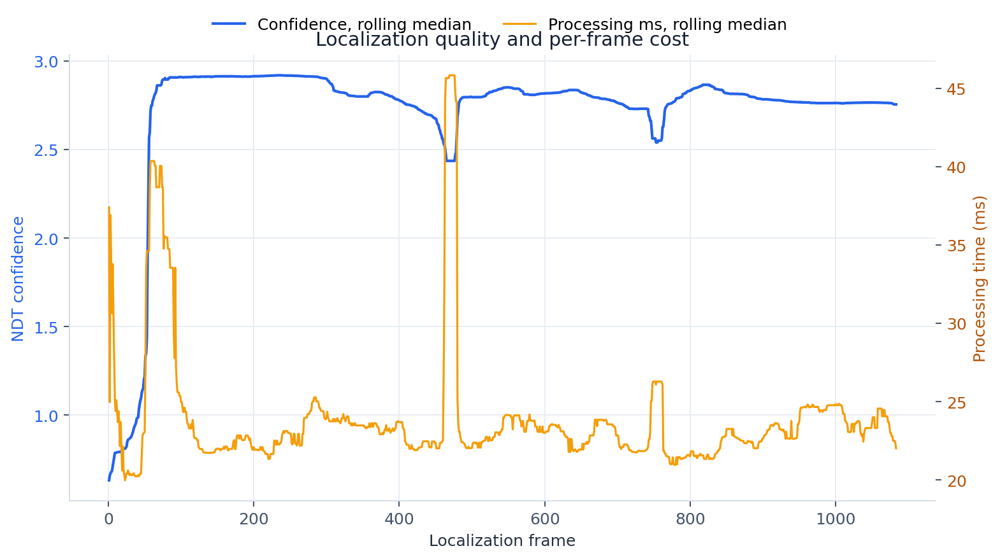
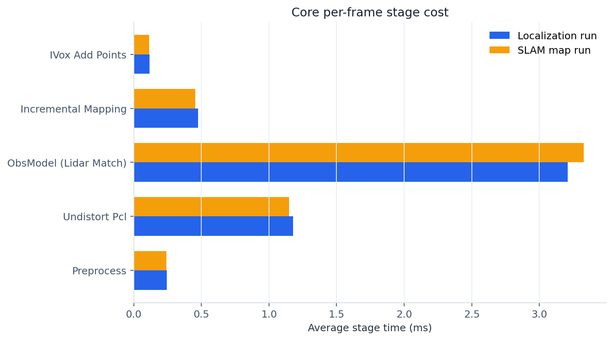
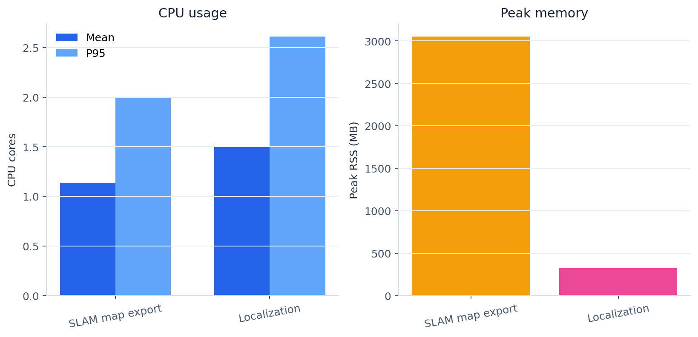

# SANY 四雷达离线多雷达定位算法报告

报告日期：2026-07-13
代码基线：`feature/offline-multi-lidar-localization`，提交 `95fdc23 feat: add offline multi-lidar localization`
数据集：`/mnt/f/datasets/SANY/mid360/data_20260701/rosbag2_2026_07_01-17_30_42_merged`
配置文件：`config/reproduction/multi_lidar/sany_4livox/sany_4lidar_frontend_final.yaml`

## 执行摘要 (Executive Summary)

- **离线多雷达定位模块已经跑通端到端闭环。** 本次实现支持从 YAML 配置读取四路 Livox 雷达、自动加载离线 SLAM 导出的分块地图，并输出融合定位轨迹、原始激光定位轨迹、逐帧匹配统计、同步统计、资源占用和分析摘要。
- **同数据集回放验证显示定位结果与建图轨迹高度一致。** 全量定位输出 `1083 / 1083` 帧有效，XY 平均误差 `3.97 cm`，P95 `5.98 cm`，最大 `10.51 cm`。这说明当前模块在同一采集数据和同一导出地图上具备可用的定位闭环能力。
- **四雷达同步和地图加载链路稳定。** 全量回放共组装 `1185` 个四雷达融合帧，完整帧比例 `100%`，无 partial 帧；定位阶段每帧加载并使用 `6` 个活跃地图块，平均匹配迭代 `2.18` 次。
- **性能当前可用于离线验证，仍不满足实时部署目标。** 定位阶段处理 `120.22 s` 传感器数据耗时 `185.67 s`，处理速度约 `0.65x` 实时；平均单帧定位匹配耗时 `25.51 ms`，P95 `44.92 ms`。后续如果转在线或批量回放，需要做日志降噪、NDT 参数和地图块加载策略优化。

## 本次交付物已经具备离线定位产品雏形

本次工作的核心目标不是再跑一条前端轨迹，而是让定位模块具备独立的“加载已有地图 + 回放新数据 + 输出可验收定位结果”的能力。实现后的运行链路如下。



**业务含义。** 该链路已经把“建图数据”和“定位数据”的工程边界拆开：离线 SLAM 负责导出可加载的分块地图，离线定位只依赖地图目录、配置文件和传感器 bag。当前只有同一组 SANY 数据，因此本报告使用建图轨迹作为参考轨迹做一致性验证；这不是独立真值，但足以验证模块数据流、地图加载、匹配输出和分析脚本是否闭环。

## 关键结果一：轨迹闭合一致，平面误差保持厘米级

定位输出和离线 SLAM 参考轨迹在 XY 平面基本重合。图中蓝线为建图阶段 LIO/SLAM 轨迹，橙色虚线为加载分块地图后的离线定位轨迹。



定量对齐采用时间戳最近邻匹配，最大匹配时间差 `0.05 s`，共匹配 `1082` 对位姿。XY 误差分布如下。



| 指标 | 数值 | 解释 |
|---|---:|---|
| 估计轨迹帧数 | 1083 | `trajectory_loc.tum` 输出行数 |
| 有效定位帧数 | 1083 | 定位 CSV 中 `valid_frames` |
| 有效率 | 100.0% | 全量回放无定位失败帧 |
| XY 平均误差 | 0.0397 m | 与同数据集建图轨迹对齐 |
| XY P95 误差 | 0.0598 m | 95% 对齐点小于约 6 cm |
| XY 最大误差 | 0.1051 m | 最大平面偏差约 10.5 cm |
| 3D 平均误差 | 0.0740 m | 包含高度方向差异 |
| 3D P95 误差 | 0.0957 m | 大部分 3D 差异低于 10 cm |
| 3D 最大误差 | 0.4348 m | 早段高度方向有短时峰值 |

误差随时间变化如下。XY 误差整体较稳定，早段 3D 误差峰值主要来自高度方向差异；由于 SANY 当前只有同一组数据，本次结论更应看作“定位链路一致性验证”，不是跨天、跨场景定位精度上限。



**结论。** 以当前地图和同源 bag 验证，离线多雷达定位已经达到可用于内部算法回归和工程联调的稳定程度。下一步需要采集独立定位 bag，验证地图复用能力和初始位姿误差容忍度。

## 关键结果二：四雷达融合输入稳定，未出现同步掉帧

定位阶段从同一 bag 组装四雷达融合帧 `1185` 帧，其中完整帧 `1185` 帧，partial 帧 `0`。这说明当前配置下四路 Livox topic 都被正确加载，帧同步窗口没有触发 late、duplicate、tolerance 或 invalid drop。



| 雷达 ID | 总输入点数 | 平均每融合帧点数 |
|---:|---:|---:|
| 0 | 6,562,833 | 5,538 |
| 1 | 6,982,756 | 5,893 |
| 2 | 7,072,569 | 5,968 |
| 3 | 6,435,899 | 5,431 |

融合后每帧点数均值为 `22,830`，P95 为 `23,152`。曲线整体平稳，说明定位阶段使用的是稳定的四雷达融合输入，而不是单雷达或间歇性缺雷达输入。



**结论。** 多雷达数据读取、Livox/PointCloud2 类型识别、按 sensor id 注入 LIO 前端、帧统计输出这条工程链路已经可用。对管理视角而言，这降低了后续换定位数据集时“配置读错 topic 或只跑了单雷达”的验收风险。

## 关键结果三：定位匹配稳定，但离线速度仍需优化

定位阶段每帧输出匹配置信度、NDT 迭代次数、活跃地图块、耗时和 LO/定位相对运动差异。全量结果如下。

| 指标 | 平均 | 中位数 | P95 | 最大 |
|---|---:|---:|---:|---:|
| NDT confidence | 2.729 | 2.803 | 2.918 | 2.931 |
| 匹配迭代次数 | 2.18 | 2.00 | 3.00 | 6.00 |
| 定位处理耗时 | 25.51 ms | 22.88 ms | 44.92 ms | 143.79 ms |
| LO/定位相对位移差 | 0.00118 m | 0.00056 m | 0.00417 m | 0.03178 m |
| 活跃地图块 | 6.00 | 6.00 | 6.00 | 6.00 |



从阶段计时看，LIO 前端核心阶段保持在毫秒级，定位新增的主要成本来自地图匹配本身。报告图中的 `ObsModel (Lidar Match)` 是 LIO 前端观测匹配阶段，离线定位实际的 NDT 地图定位耗时来自 `localization_stats.csv` 的 `processing_ms`，平均 `25.51 ms`。



端到端离线耗时：

| 阶段 | 传感器时长 | 墙钟耗时 | 轨迹帧数 | 处理速度 |
|---|---:|---:|---:|---:|
| 离线 SLAM 建图导出 | 120.22 s | 151.72 s | 1083 | 7.14 帧/s |
| 离线定位 | 120.22 s | 185.67 s | 1083 | 0.65x 实时 |

资源占用方面，建图导出阶段峰值内存较高，主要来自全局地图构建和分块导出；定位阶段内存峰值明显较低。



| 阶段 | 平均 CPU 核 | P95 CPU 核 | 峰值 CPU 核 | 平均 RSS | 峰值 RSS |
|---|---:|---:|---:|---:|---:|
| 离线 SLAM 建图导出 | 1.14 | 2.00 | 2.44 | 894 MB | 3054 MB |
| 离线定位 | 1.51 | 2.61 | 3.39 | 277 MB | 321 MB |

**结论。** 当前实现偏“可用和可验收”，还不是实时部署最优版本。离线批处理已经可跑；若转在线定位，应优先优化日志输出、NDT 地图匹配、活跃 chunk 策略和并行度。

## 算法改动概览

本次改动按第一性原理拆分为四个问题：数据如何进来、地图如何加载、匹配如何输出、实验如何验收。

### 1. 多雷达数据加载从硬编码改为配置驱动

旧版离线定位更接近单雷达回放：读取一个 `common.lidar_topic`，并依赖固定 topic。新版离线定位直接复用 `LaserMapping::GetMultiLidarConfig()`，按 `multi_lidar.lidars` 注册每一路雷达 topic，并通过 bag metadata 判断消息类型是 `sensor_msgs/msg/PointCloud2` 还是 `livox_ros_driver2/msg/CustomMsg`。

**收益。** 同一个定位程序可以加载未来不同定位数据集，只要配置文件给出四雷达 topic、外参和主雷达 IMU topic，不再依赖当前 SANY bag 的硬编码 topic。

### 2. 地图加载从默认目录变为显式 `--map_path`

离线定位新增 `--map_path` 参数，启动时检查 `index.txt`，然后将该目录交给 `LidarLoc` 的 `TiledMap`。地图由离线 SLAM 导出的分块地图组成，包括 `index.txt` 和多个 chunk PCD。

**收益。** 定位数据集和建图数据集可以独立切换。后续只需要替换 `--bag` 和 `--map`，即可做“已有地图 + 新采集定位数据”的验证。

### 3. 定位输出从单轨迹扩展为可分析证据包

新版定位输出包括：

| 输出 | 用途 |
|---|---|
| `trajectory_loc.tum` | PGO/fused 后的主定位轨迹 |
| `trajectory_lidar_loc.tum` | 原始激光地图匹配轨迹 |
| `localization_stats.csv` | 每帧状态、置信度、迭代次数、耗时、活跃地图块、多雷达帧统计 |
| `frame_stats.csv` | 每个融合帧四雷达到齐、点数和 partial 状态 |
| `processing_timing_summary.json` | 阶段耗时和端到端性能 |
| `localization_summary.json` | 有效率、误差、耗时、置信度汇总 |
| `trajectory_reference_errors.csv` | 与参考 TUM 的时间对齐误差明细 |

**收益。** 不是只看轨迹图，而是每次运行都有可审计、可复现、可批量对比的数据包。

### 4. 离线建图补齐分块地图导出

新版 `run_slam_offline` 直接走多雷达 `LaserMapping`，回放四雷达数据后导出：

- SLAM/LIO TUM 轨迹；
- 多雷达融合帧统计；
- `global.pcd`；
- `data/new_map/index.txt` 和 chunk PCD；
- keyframe TUM。

**收益。** 同一套数据可以先跑离线 SLAM 生成地图，再把该地图交给离线定位模块验证。SANY 专用流水线脚本已经把这两步串起来。

## 实验过程

### 实验输入

| 项 | 内容 |
|---|---|
| 数据集 | SANY 四 Livox 雷达 ROS2 bag |
| bag 路径 | `/mnt/f/datasets/SANY/mid360/data_20260701/rosbag2_2026_07_01-17_30_42_merged` |
| 传感器时长 | 120.2228 s |
| 主雷达 topic | `/livox/lidar_192_168_1_114` |
| 配置 | `config/reproduction/multi_lidar/sany_4livox/sany_4lidar_frontend_final.yaml` |
| bag payload SHA-256 | `67f4da9784046a847afdba08e2ca8dd1d182492e4f78751a5d85ec21df94f9db` |

### 构建与运行命令

构建命令：

```bash
source /opt/ros/humble/setup.bash
colcon build --packages-select lightning --cmake-args -DCMAKE_BUILD_TYPE=Release
```

SANY 一键闭环脚本：

```bash
bash scripts/reproduction/multi_lidar/sany_4livox/run_sany_offline_localization.sh \
  --output-root /mnt/f/SLAM_AI_KnowledgeBase/code/WSL_Ubuntu_22.04/lightning-lm/runs/sany_offline_loc_full_20260713 \
  --run-prefix full_20260713 \
  --watchdog-margin 420 \
  --wait-ui false
```

最终定位阶段复跑命令：

```bash
bash scripts/run_loc_offline.sh \
  --bag /mnt/f/datasets/SANY/mid360/data_20260701/rosbag2_2026_07_01-17_30_42_merged \
  --config /mnt/f/SLAM_AI_KnowledgeBase/code/WSL_Ubuntu_22.04/lightning-lm/config/reproduction/multi_lidar/sany_4livox/sany_4lidar_frontend_final.yaml \
  --map /mnt/f/SLAM_AI_KnowledgeBase/code/WSL_Ubuntu_22.04/lightning-lm/runs/sany_offline_loc_full_20260713/full_20260713_slam_map/data/new_map \
  --reference-tum /mnt/f/SLAM_AI_KnowledgeBase/code/WSL_Ubuntu_22.04/lightning-lm/runs/sany_offline_loc_full_20260713/full_20260713_slam_map/results/trajectory_slam.tum \
  --output-dir /mnt/f/SLAM_AI_KnowledgeBase/code/WSL_Ubuntu_22.04/lightning-lm/runs/sany_offline_loc_full_20260713/full_20260713_localization_final \
  --sequence SANY_4lidar \
  --completion-tolerance 2.5 \
  --watchdog-margin 420 \
  --wait-ui false
```

### 验收条件

定位 runner 的合同检查包括：

1. 算法进程返回码为 0。
2. watchdog 未超时。
3. 输出轨迹时间单调，四元数合法。
4. 输出轨迹不少于 10 行。
5. 最大相邻输出间隔不超过 `0.30 s`。
6. 处理到主雷达尾部容差内。本次 SANY 数据由于前端有效输出较主雷达最后一帧早约 `1.81 s`，定位阶段使用 `2.5 s` 容差。
7. 生成 TUM、CSV、timing summary、resource summary 等关键产物。

### 运行产物位置

| 产物 | 路径 |
|---|---|
| 建图 run | `runs/sany_offline_loc_full_20260713/full_20260713_slam_map` |
| 分块地图 | `runs/sany_offline_loc_full_20260713/full_20260713_slam_map/data/new_map` |
| 定位 run | `runs/sany_offline_loc_full_20260713/full_20260713_localization_final` |
| 定位摘要 | `runs/sany_offline_loc_full_20260713/full_20260713_localization_final/results/localization_summary.json` |
| 本报告图表 | `doc/sany/multi_lidar/offline_localization_report_assets` |

## 管理层视角的结论与建议

1. **可以进入下一阶段“独立定位数据集验证”。** 当前同源数据验证已经证明算法入口、地图加载、四雷达融合、NDT 匹配和输出分析链路可用。下一步真正影响项目风险的是跨 bag、跨时间、跨初始位姿误差的鲁棒性。
2. **建议把该模块作为离线回归入口固定下来。** 每次修改多雷达前端、地图导出或定位参数后，使用 `run_sany_offline_localization.sh` 生成统一证据包，避免只凭 RViz 或单条 TUM 轨迹判断算法质量。
3. **短期优化目标应聚焦性能和鲁棒性边界，而不是重写框架。** 平面一致性已经达到厘米级，工程框架已经闭环；当前优先级应是降低定位耗时、减少日志开销、验证初始位姿扰动和地图跨数据集复用。
4. **上线或交付前必须补独立数据验证。** 同一数据建图再定位容易给出乐观结果；项目验收需要至少一组独立定位 bag，并最好覆盖不同停车位置、不同起始位姿、不同动态障碍状态。

## 仍需关注的问题

- **当前不是绝对真值评估。** 参考轨迹来自同一数据的离线 SLAM 结果，不是 RTK、全站仪或独立高精地图真值。
- **3D 误差早段存在短时峰值。** XY 精度稳定，但 3D 最大误差达到 `0.435 m`，需要在后续地图高度约束、地面/坡度场景和 NDT 高度自由度上进一步排查。
- **全量建图 run 的 `run_metadata.txt` 中 `map_chunk_count=7` 是旧计数规则结果。** 该计数把 functional point 行也纳入了 chunk 数；实际 `index.txt` 中数字 chunk 为 `6`。代码已在后续 runner 中修正 chunk 计数规则，本报告使用 index-derived `6` 作为地图块数量。
- **离线定位尚未达到实时速度。** 本次完整定位为 `0.65x` 实时，当前足够离线验证，但如果面向在线定位，需要进一步做性能专项。
- **初始位姿当前由配置给定。** 实际项目中若无人工/外部初值，需要补全粗定位、功能点初始化或更大范围 yaw/translation 搜索策略。

## 附录 A：代码级改动清单

| 文件 | 关键位置 | 改动内容 | 管理含义 |
|---|---:|---|---|
| `src/app/run_loc_offline.cc` | 28-30 | 新增 `--map_path`、`--output_lidar_loc_tum`、定位 CSV 等输出参数 | 定位程序可显式加载任意导出地图，并产出可审计数据 |
| `src/app/run_loc_offline.cc` | 127-180 | 新增 `ReadInitialPose()`，支持配置初始位姿 | 当前阶段按配置给初值，后续可替换为外部初值接口 |
| `src/app/run_loc_offline.cc` | 187-196 | 新增定位逐帧 CSV header | 每帧置信度、迭代次数、耗时、地图块、雷达到齐情况可分析 |
| `src/app/run_loc_offline.cc` | 273-383 | 串联 LIO、LidarLoc 和 PGO，输出 fused TUM 和 raw lidar loc TUM | 定位链路从“只读 bag”变成完整定位系统 |
| `src/app/run_slam_offline.cc` | 27-29 | 新增地图导出目录、global map、frame stats 参数 | 建图阶段可标准化导出分块地图 |
| `src/app/run_slam_offline.cc` | 236-340 | 直接使用多雷达 `LaserMapping::RunDetailed()` 并导出 TiledMap | 离线 SLAM 可生成定位模块需要的 `index.txt + chunk PCD` |
| `src/core/localization/lidar_loc/lidar_loc.h` | 68, 139, 248 | 新增 `MatchStats` 和 `GetLastMatchStats()` | 定位匹配从黑盒变为可观测 |
| `src/core/localization/lidar_loc/lidar_loc.cc` | 169-170, 832-902 | 记录 NDT confidence、迭代次数、success、活跃 map chunk | 支撑定位健康度和异常定位排查 |
| `src/core/maps/tiled_map.cc` | 20-41 | 修复新 chunk 创建时首点未写入的问题 | 避免每个地图块少首点，提高地图导出完整性 |
| `scripts/run_slam_offline.sh` | 7-431 | 改造为受监控建图 runner，输出 timing、resource、metadata、map 合同检查 | 建图产物可复现、可验收 |
| `scripts/run_loc_offline.sh` | 7-415 | 改造为受监控定位 runner，调用定位分析脚本 | 定位运行可批处理和可量化对比 |
| `scripts/analyze_localization_run.py` | 全文件 | 新增定位运行汇总分析 | 自动生成有效率、误差、耗时、置信度摘要 |
| `scripts/reproduction/multi_lidar/sany_4livox/run_sany_offline_localization.sh` | 全文件 | 新增 SANY 建图后定位流水线 | 一条命令完成地图导出和定位验证 |
| `config/reproduction/multi_lidar/sany_4livox/sany_4lidar_frontend_final.yaml` | 111-162 | 补齐 `system`、`lidar_loc`、`maps`、`offline_localization.initial_pose` | 同一配置可驱动前端、建图和定位 |

## 附录 B：实验数据与文件来源

| 类型 | 文件 |
|---|---|
| 建图元数据 | `runs/sany_offline_loc_full_20260713/full_20260713_slam_map/run_metadata.txt` |
| 定位元数据 | `runs/sany_offline_loc_full_20260713/full_20260713_localization_final/run_metadata.txt` |
| 定位摘要 | `runs/sany_offline_loc_full_20260713/full_20260713_localization_final/results/localization_summary.json` |
| 定位逐帧 CSV | `runs/sany_offline_loc_full_20260713/full_20260713_localization_final/results/localization_stats.csv` |
| 多雷达帧统计 | `runs/sany_offline_loc_full_20260713/full_20260713_localization_final/results/frame_stats.csv` |
| 参考误差明细 | `runs/sany_offline_loc_full_20260713/full_20260713_localization_final/results/trajectory_reference_errors.csv` |
| 处理耗时 | `runs/sany_offline_loc_full_20260713/full_20260713_localization_final/results/processing_timing_summary.json` |
| 资源占用 | `runs/sany_offline_loc_full_20260713/full_20260713_localization_final/resource_summary.json` |
| 图表生成脚本 | `doc/sany/multi_lidar/offline_localization_report_assets/build_offline_localization_report_assets.py` |
| 图表汇总 JSON | `doc/sany/multi_lidar/offline_localization_report_assets/summary_metrics.json` |

## 附录 C：后续验证建议

| 优先级 | 建议 | 验收方式 |
|---:|---|---|
| P0 | 增加独立定位 bag，使用同一地图定位 | 输出有效率、XY/3D 误差、失败帧、耗时，与本报告格式一致 |
| P0 | 做初始位姿扰动测试 | 对 yaw、x/y 平移扰动设置网格，输出成功率和收敛误差 |
| P1 | 降低定位阶段耗时 | 目标先达到 `>=1.0x` 离线实时速度，再考虑在线 |
| P1 | 评估地图 chunk 加载策略 | 统计活跃 chunk 数、加载时间、匹配耗时和错误定位关系 |
| P1 | 加入小 bag 回归测试 | CI 或本地快速 smoke，验证程序参数、输出合同和 CSV schema |
| P2 | 加入高度约束专项分析 | 对 3D 误差峰值帧定位日志、地图高度、点云分布做复盘 |
