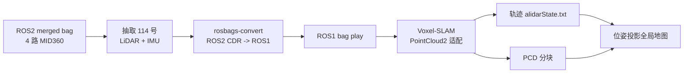
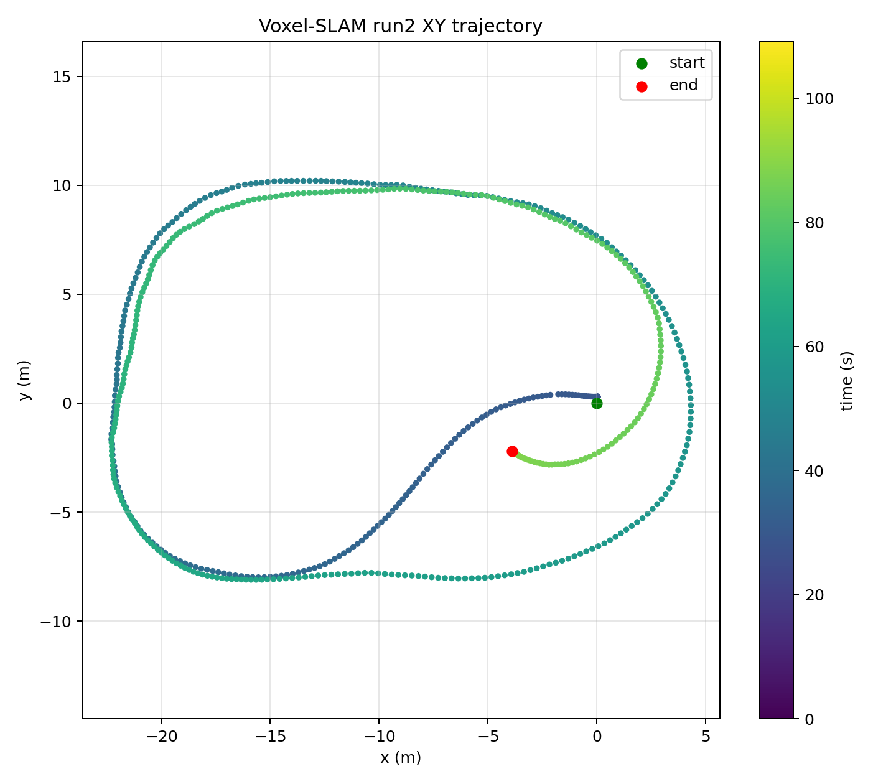
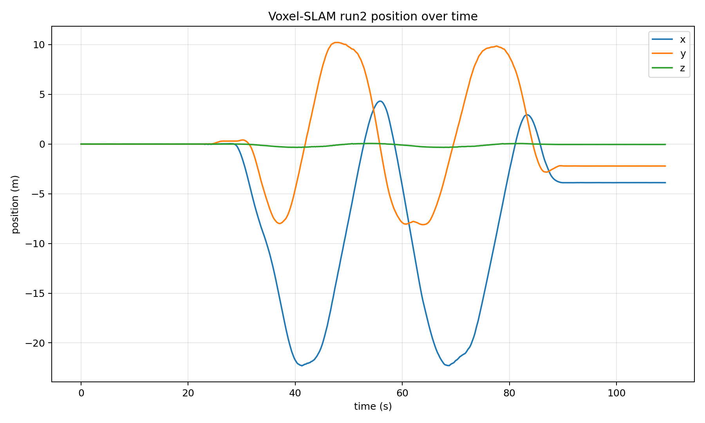
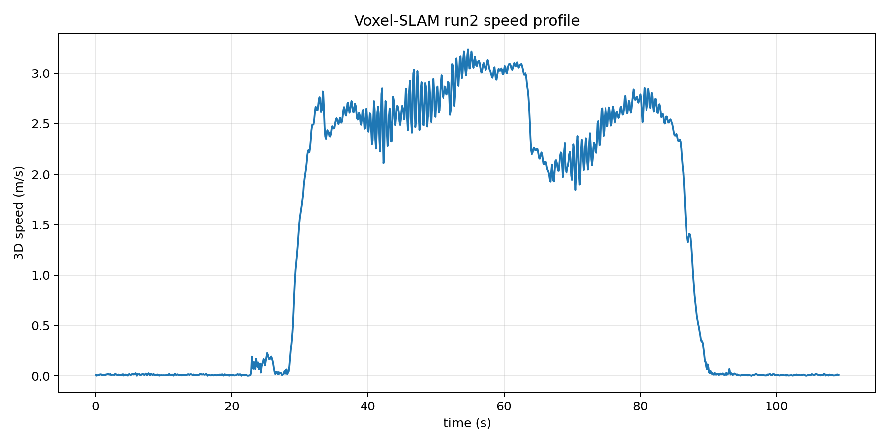
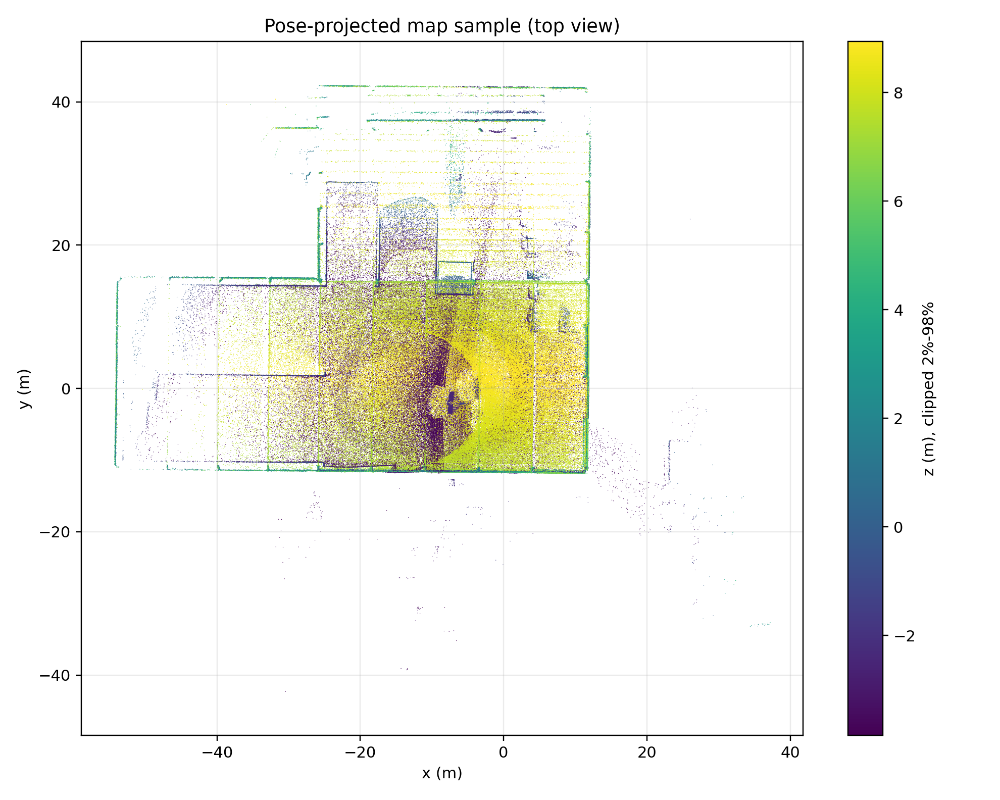
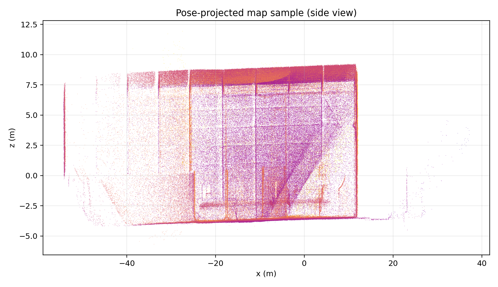

# SANY MID360 data 20260701 Voxel-SLAM 测试报告

> 代码GitHub：https://github.com/gongjun136/Voxel-SLAM
>
> 测试代码分支：[feature/gj_2026.6.25](https://github.com/gongjun136/Voxel-SLAM/tree/feature/gj_2026.6.25)

## 1. 结论摘要

本次使用 `data_20260701` 中掉帧较少的一组 MID360 数据，对 ROS1 版 Voxel-SLAM 做了单雷达单 IMU 测试。测试链路已经跑通：ROS2 bag 转 ROS1 bag、Voxel-SLAM 初始化、局部建图、回环检测、GBA 和结果导出均完成。

核心结论如下：

| 项目 | 结果 |
|---|---:|
| ROS1 bag 时长 | 120 s |
| 点云帧数 | 1,203 |
| IMU 消息数 | 21,735 |
| 有效轨迹位姿 | 1,091 |
| Voxel-SLAM 轨迹时长 | 109.099 s |
| 3D 累计路程 | 151.363 m |
| 起终点 3D 位移 | 4.470 m |
| Z 方向范围 | -0.339 m 到 0.060 m |
| 回环边 | 1 条 |
| 合并地图点数 | 5,841,766 |

## 2. 数据和处理流程

### 2.1 topic 频率和最大相邻时间差

这里的频率按消息 `header.stamp` 统计

| Topic                        | 类型  |  数量 | 平均频率/Hz | 最大相邻 header dt/s | 最大间隔/理论周期 | >10x 间隔数 | 中位 header dt/s | 判定   |
| ---------------------------- | ----- | ----: | ----------: | -------------------: | ----------------: | ----------: | ---------------: | ------ |
| `/livox/imu_192_168_1_114`   | imu   | 21735 |     196.942 |             0.144113 |              28.8 |           1 |         0.005031 | check  |
| `/livox/imu_192_168_1_127`   | imu   | 21713 |     196.743 |             0.169992 |              34.0 |           2 |         0.005049 | check  |
| `/livox/imu_192_168_1_187`   | imu   | 21700 |     196.625 |             0.170038 |              34.0 |           5 |         0.005153 | check  |
| `/livox/imu_192_168_1_195`   | imu   | 21711 |     196.732 |             0.169412 |              33.9 |           2 |         0.005029 | check  |
| `/livox/lidar_192_168_1_114` | lidar |  1203 |      10.000 |             0.100420 |               1.0 |           0 |         0.099840 | normal |
| `/livox/lidar_192_168_1_127` | lidar |  1203 |      10.000 |             0.100460 |               1.0 |           0 |         0.099923 | normal |
| `/livox/lidar_192_168_1_187` | lidar |  1203 |      10.000 |             0.100460 |               1.0 |           0 |         0.099940 | normal |
| `/livox/lidar_192_168_1_195` | lidar |  1203 |      10.000 |             0.100360 |               1.0 |           0 |         0.099840 | normal |

最大相邻间隔出现位置：

| Topic                        | 最大间隔/s | 相对本 topic 起点/s |          gap start/s |            gap end/s |
| ---------------------------- | ---------: | ------------------: | -------------------: | -------------------: |
| `/livox/imu_192_168_1_114`   |   0.144113 |           30.560868 | 1782898281.126407385 | 1782898281.270520210 |
| `/livox/imu_192_168_1_127`   |   0.169992 |           30.555367 | 1782898281.126444578 | 1782898281.296436548 |
| `/livox/imu_192_168_1_187`   |   0.170038 |           30.560801 | 1782898281.129464626 | 1782898281.299502611 |
| `/livox/imu_192_168_1_195`   |   0.169412 |           30.556606 | 1782898281.128659725 | 1782898281.298071623 |
| `/livox/lidar_192_168_1_114` |   0.100420 |           62.699987 | 1782898305.100065708 | 1782898305.200485945 |
| `/livox/lidar_192_168_1_127` |   0.100460 |            2.700008 | 1782898245.100024939 | 1782898245.200484753 |
| `/livox/lidar_192_168_1_187` |   0.100460 |            8.299577 | 1782898250.700024843 | 1782898250.800484896 |
| `/livox/lidar_192_168_1_195` |   0.100360 |           35.799872 | 1782898278.200072527 | 1782898278.300432444 |

本次输入使用合并后的 ROS2 bag，由于当前 Voxel-SLAM 是 ROS1 工程，先使用 `rosbags-convert` 抽取 114 号雷达和 IMU，转换为 ROS1 bag：

## 3. 代码适配说明

本次相关改动已单独提交到分支 `sany/data-20260701-voxel-slam-test`，提交号为 `5950ec2`。主要变化：

1. 新增 `LIVOX_POINTCLOUD2` 点云类型，读取 ROS2 Livox `sensor_msgs/PointCloud2` 里的 `x/y/z/intensity/timestamp` 字段。
2. 新增 20260701 114 号测试配置和 launch：
   - `VoxelSLAM/config/sany_20260701_livox_pc2_114.yaml`
   - `VoxelSLAM/launch/vxlm_sany_20260701_livox_pc2_114.launch`

## 4. 轨迹结果

### 4.1 XY 轨迹

轨迹整体呈闭环形态，起终点没有完全重合，统计残差约 `4.470` m。结合测试现场的实际路线，这个结果在运动趋势上是正确的，但还不能单独说明地图质量已经足够好。

### 4.2 XYZ 随时间变化

Z 方向范围为 `-0.339` m 到 `0.060` m，总跨度约 `0.399` m。相比之前掉帧严重数据导致的 Z 向异常，这次没有出现明显高度发散。

### 4.3 速度曲线

速度统计：

| 指标 | 3D 速度 |
|---|---:|
| 平均速度 | 1.387 m/s |
| 中位速度 | 1.999 m/s |
| 95% 分位速度 | 3.055 m/s |
| 最大相邻位姿速度 | 3.236 m/s |

## 5. 地图结果

### 5.1 位姿投影地图俯视图

### 5.2 位姿投影地图侧视图

