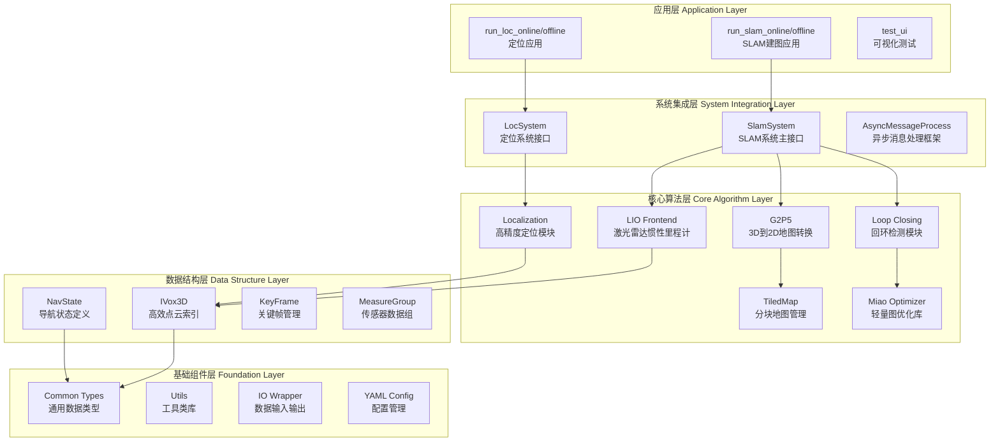
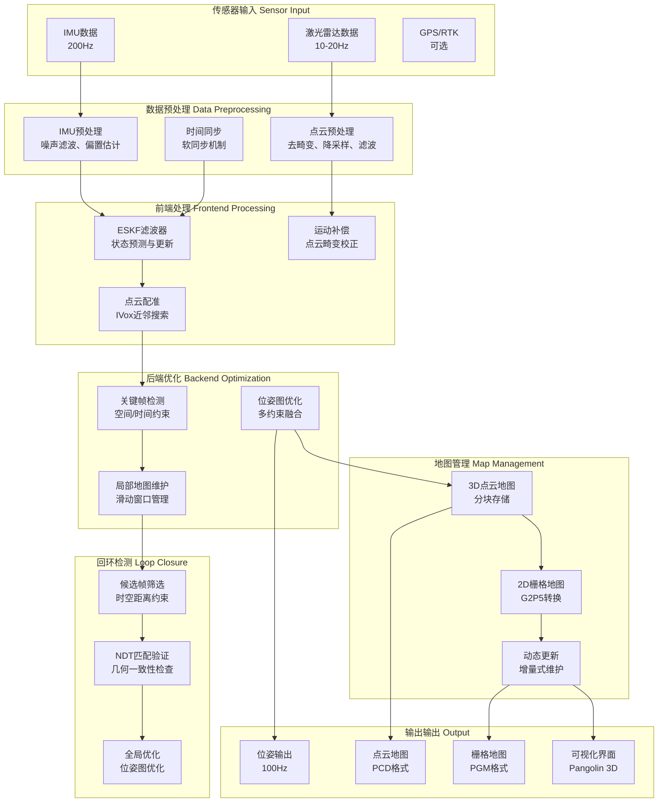
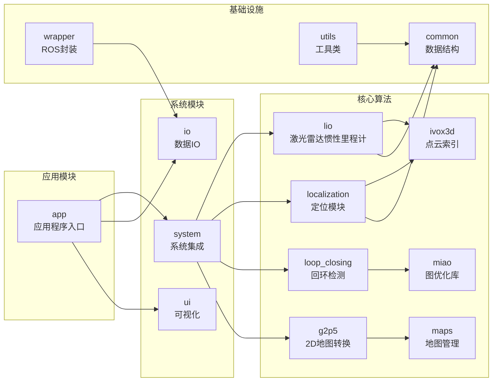
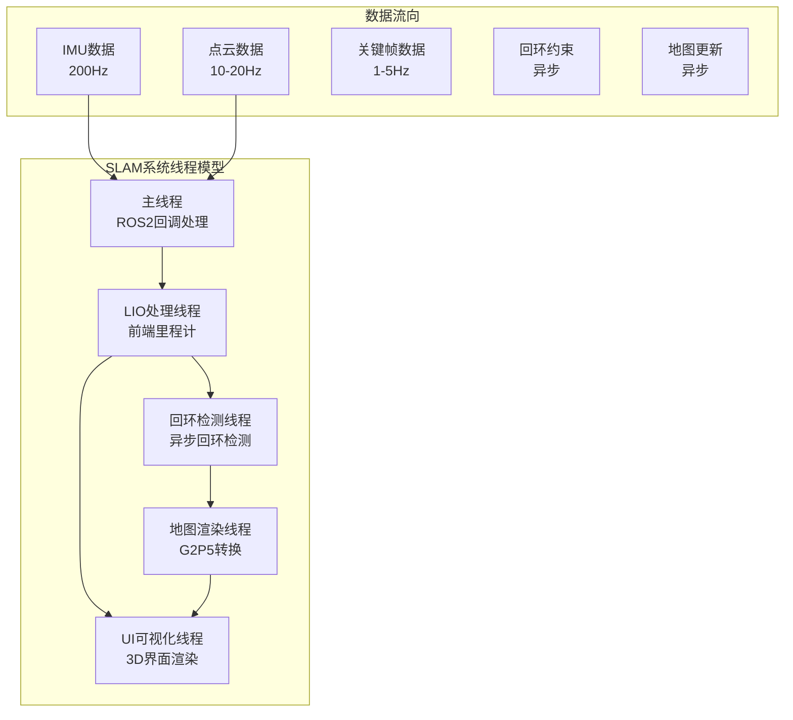
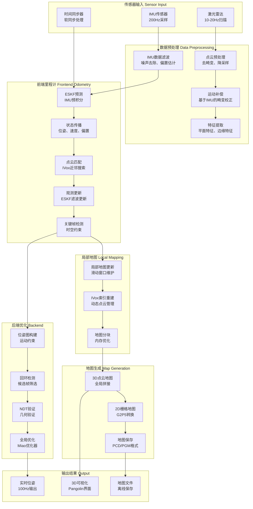
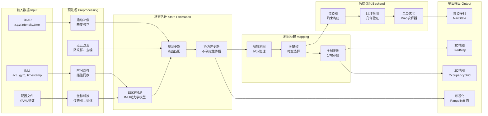
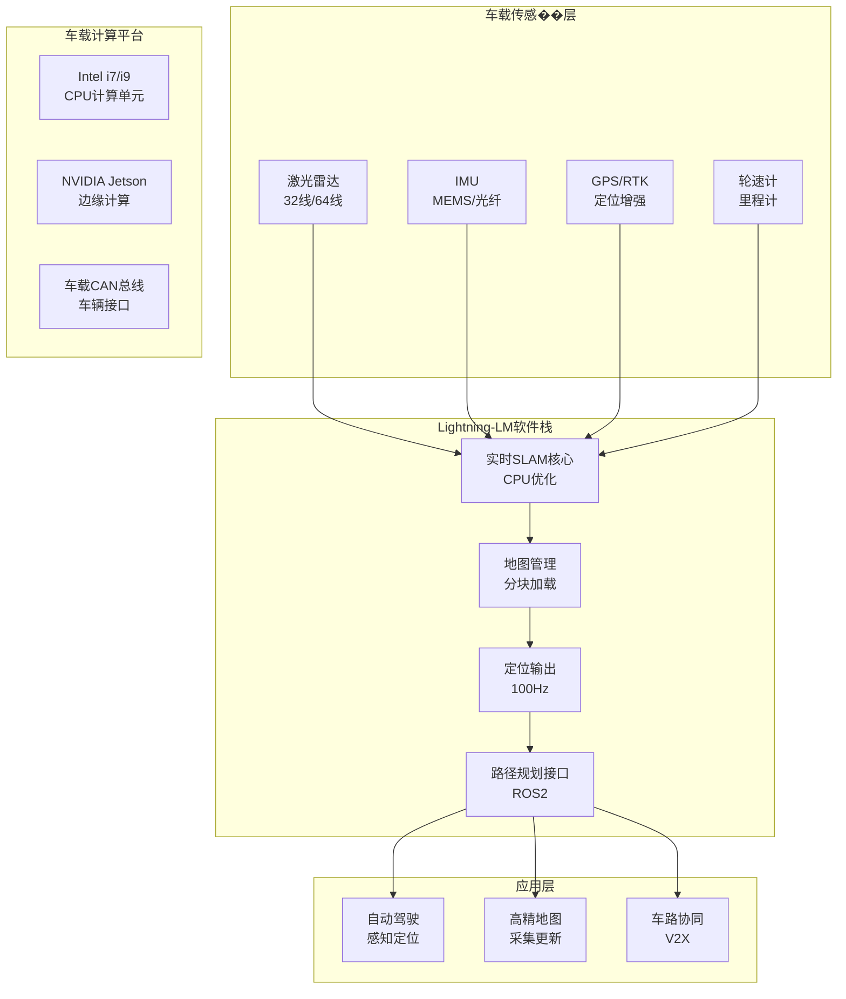

# **建图与定位系统详细设计文档**

## **1. 引言（Introduction）**

### **1.1 系统背景**

Lightning-LM是一个高性能的实时激光雷达SLAM系统，基于AA-FasterLIO的快速LIO前端，支持紧耦合的IMU-激光融合、实时回环检测、高精度定位和3D到2D地图转换。该系统专为自动驾驶、机器人导航和移动测绘应用设计，在纯CPU环境下即可实现极高的实时性能。


### **1.2 设计目标**

- **实时性**：在32线激光雷达下，建图仅需1.2核CPU，定位仅需0.8核CPU
- **高精度**：支持100Hz高频位姿输出，厘米级定位精度
- **鲁棒性**：多传感器融合，具备退化检测和异常值处理能力
- **可扩展性**：模块化设计，支持多种激光雷达类型（Livox、Velodyne、Ouster）
- **低资源**：纯CPU运行，无需GPU依赖，适用于嵌入式平台

### **1.3 使用场景**

- **车载建图**：高精地图制作和道路环境建图
- **机器人导航**：室内外移动机器人的定位与导航
- **自动驾驶**：实时定位和环境感知
- **移动测绘**：手持设备的快速建图与定位

### **1.4 功能范围与非功能需求**

| **功能需求** | **描述**                              |
| ------------ | ------------------------------------- |
| 实时SLAM建图 | 支持在线/离线模式，实时构建3D点云地图 |
| 高精度定位   | 基于预构建地图的厘米级定位            |
| 回环检测     | 基于NDT的几何回环检测和优化           |
| 2D地图生成   | 3D点云到2D栅格地图的自动转换          |
| 多传感器融合 | IMU+激光雷达紧耦合融合                |

| **非功能需求** | **指标**                             |
| -------------- | ------------------------------------ |
| 实时性         | 100Hz位姿更新，<10ms延迟             |
| 内存占用       | <2GB，支持大规模场景                 |
| CPU占用        | 建图1.2核，定位0.8核（32线激光雷达） |
| 可靠性         | 连续运行24小时以上                   |
| 精度           | 定位精度<5cm，建图精度<10cm          |

------

## **2. 系统总体架构（System Architecture）**

### **2.1 系统模块分层架构**



### **2.2 数据流图**



### **2.3 模块依赖关系图**



### **2.4 线程模型与异步队列架构**

```mermaid
sequenceDiagram
    participant Main as 主线程
    participant LIO as LIO处理线程
    participant Loop as 回环检测线程
    participant G2P5 as 地图渲染线程
    participant UI as 可视化线程
    
    Main->>LIO: IMU+点云数据
    LIO->>LIO: ESKF滤波更新
    LIO->>Main: 关键帧通知
    
    Main->>Loop: 关键帧数据
    Loop->>Loop: 候选帧筛选
    Loop->>Loop: NDT匹配验证
    Loop->>Main: 回环约束
    
    Main->>G2P5: 关键帧位姿
    G2P5->>G2P5: 射线投影
    G2P5->>Main: 2D地图更新
    
    Main->>UI: 最新状态
    UI->>UI: 3D渲染
    UI->>Main: 渲染完成
    
    Note over Main,UI: 所有线程通过<br/>AsyncMessageProcess通信<br/>支持跳帧和优先级调度
```

### **2.5 软件工程目录结构**

```
lightning-lm/
├── src/                          # 源代码目录
│   ├── app/                      # 应用程序入口
│   │   ├── run_slam_online.cc    # 在线SLAM建图
│   │   ├── run_slam_offline.cc   # 离线SLAM建图
│   │   ├── run_loc_online.cc     # 在线定位
│   │   ├── run_loc_offline.cc    # 离线定位
│   │   └── test_ui.cc            # UI测试
│   ├── core/                     # 核心算法模块
│   │   ├── lio/                  # 激光雷达惯性里程计
│   │   ├── localization/         # 定位算法
│   │   ├── loop_closing/         # 回环检测
│   │   ├── maps/                 # 地图管理
│   │   ├── g2p5/                 # 3D到2D地图转换
│   │   ├── ivox3d/               # 高效点云索引
│   │   ├── miao/                 # 轻量图优化库
│   │   └── system/               # 系统集成
│   ├── common/                   # 公共数据结构
│   ├── ui/                       # 3D可视化
│   ├── io/                       # 数据输入输出
│   ├── utils/                    # 工具类
│   └── wrapper/                  # ROS2封装
├── config/                       # 配置文件
├── scripts/                      # 部署脚本
├── cmake/                        # 构建配置
└── thirdparty/                   # 第三方依赖
```

------

## **3. 关键模块设计（Module Design）**

### **3.1 传感器输入层**

#### **3.1.1 数据格式定义**

**IMU数据格式**：


```cpp
struct IMU {
    double timestamp;        // 时间戳（秒）
    Eigen::Vector3d acc;     // 加速度计测量 [m/s²]
    Eigen::Vector3d gyro;    // 陀螺仪测量 [rad/s]
};
```

**激光雷达数据格式**：


```cpp
struct PointCloud {
    std::vector<PointXYZI> points;  // 点云数据
    double timestamp;                // 时间戳
    bool is_dense;                  // 是否为密集点云
};

struct PointXYZI {
    float x, y, z;      // 3D坐标
    float intensity;    // 强度信息
    double time;        // 点内时间戳
};
```

#### **3.1.2 时间戳同步机制**

**软同步实现**：


```cpp
class IMUProcessing {
    // 基于时间戳的最近邻插值
    void LIOUpdate(double lidar_time) {
        std::vector<IMU> imu_buffer;
        
        // 获取激光雷达时间窗口内的IMU数据
        for (const auto& imu : imu_queue_) {
            if (imu.timestamp >= lidar_time - time_window_ &&
                imu.timestamp <= lidar_time + time_window_) {
                imu_buffer.push_back(imu);
            }
        }
        
        // IMU预积分
        IMUPreintegration(imu_buffer, lidar_time);
    }
};
```

#### **3.1.3 数据缓冲机制**

**并发安全的数据缓冲**：


```cpp
template<typename T>
class AsyncMessageProcess {
private:
    std::queue<T> msg_queue_;           // 消息队列
    std::mutex queue_mutex_;            // 队列互斥锁
    std::condition_variable cv_;        // 条件变量
    size_t max_queue_size_ = 100;       // 最大队列长度
    
public:
    bool Push(const T& msg) {
        std::unique_lock<std::mutex> lock(queue_mutex_);
        if (msg_queue_.size() >= max_queue_size_) {
            return false;  // 队列满，丢弃消息
        }
        msg_queue_.push(msg);
        cv_.notify_one();
        return true;
    }
};
```

------

### **3.2 前端定位（Frontend）**

#### **3.2.1 IMU预积分**

**状态定义（23维）**：


```cpp
struct NavState {
    // 位置（3维）
    Eigen::Vector3d pos_;           // [p_x, p_y, p_z]
    
    // 姿态（SO(3)李代数，3维）  
    Eigen::Vector3d rot_;           // [φ_x, φ_y, φ_z]
    
    // 速度（3维）
    Eigen::Vector3d vel_;           // [v_x, v_y, v_z]
    
    // IMU偏置（6维）
    Eigen::Vector3d bg_;            // 陀螺仪零偏
    Eigen::Vector3d ba_;            // 加速度计零偏
    
    // 外参（6维）
    Eigen::Vector3d offset_R_lidar_; // IMU到LiDAR旋转外参
    Eigen::Vector3d offset_t_lidar_; // IMU到LiDAR平移外参
    
    // 重力（2维，S2流形）
    Eigen::Vector2d grav_;          // 重力向量
};
```

**连续时间运动方程**：
$$
\begin{align}
\dot{\mathbf{p}} &= \mathbf{v} \\
\dot{\mathbf{R}} &= \mathbf{R} \cdot \lfloor \boldsymbol{\omega} - \mathbf{b}_g \rfloor_\times \\
\dot{\mathbf{v}} &= \mathbf{R} \cdot (\mathbf{a} - \mathbf{b}_a) + \mathbf{g} \\
\dot{\mathbf{b}}_g &= \mathbf{0} \\
\dot{\mathbf{b}}_a &= \mathbf{0} \\
\dot{\mathbf{g}} &= \mathbf{0}
\end{align}
$$
**离散时间状态转移**：


```cpp
// ESKF预测步骤（eskf.cc:9-92）
void ESKF::Predict(const IMU& imu, double dt) {
    // 获取运动函数f和雅可比矩阵
    Eigen::Matrix<double, 24, 1> f_ = x_.get_f(imu.gyro, imu.acc);
    Eigen::Matrix<double, 24, 23> f_x_ = x_.df_dx(imu.acc);
    Eigen::Matrix<double, 24, 12> f_w_ = x_.df_dw();
    
    // 状态递推：x = x + f*dt
    x_.oplus(f_, dt);
    
    // 协方差递推：P = F*P*F^T + L*Q*L^T
    Eigen::Matrix<double, 24, 24> F_x1_ = Eigen::Matrix<double, 24, 24>::Identity();
    F_x1_.block<23, 23>(0, 0) += f_x_ * dt;
    P_ = (F_x1_) * P_ * (F_x1_).transpose() + (dt * f_w_final) * Q * (dt * f_w_final).transpose();
}
```

#### **3.2.2 LiDAR点云预处理**

**运动畸变校正**：


```cpp
// 点云运动补偿（pointcloud_preprocess.cc）
void PointCloudPreprocess::OdomCompensation(PointCloudType::Ptr& cloud, 
                                           const SE3& pose_start, 
                                           const SE3& pose_end) {
    for (auto& point : cloud->points) {
        // 计算点在扫描中的相对时间
        double rel_time = point.time / scan_period_;
        
        // 线性插值当前时刻的位姿
        SE3 pose_interp = pose_start * (pose_start.inverse() * pose_end) * rel_time;
        
        // 将点转换到世界坐标系
        Eigen::Vector3d p_w = pose_interp * Eigen::Vector3d(point.x, point.y, point.z);
        point.x = p_w.x();
        point.y = p_w.y(); 
        point.z = p_w.z();
    }
}
```

**自适应降采样**：


```cpp
void PointCloudPreprocess::Process(PointCloudType::Ptr& cloud) {
    // 根据点云密度自适应调整采样率
    double density = cloud->points.size() / scan_range_;
    int filter_num = std::max(1, int(point_filter_num_ * density));
    
    // 均匀降采样
    for (size_t i = 0; i < cloud->points.size(); i += filter_num) {
        filtered_cloud->points.push_back(cloud->points[i]);
    }
}
```

#### **3.2.3 点云配准算法**

**点到面距离残差模型**：
$$
\text{残差: } r_i = \mathbf{n}_i^T \cdot (\mathbf{R} \cdot \mathbf{p}_i + \mathbf{t} - \mathbf{p}_{target}) + d_i
$$

```cpp
// 观测模型实现（laser_mapping.cc:501-625）
struct ObsModel {
    // 点到平面距离残差
    float pd2 = plane_coef_[i].dot(temp);  // plane_coef: [a,b,c,d]
    residuals_[i] = pd2;  // 点到平面的有向距离

    // 雅可比矩阵计算
    Vec3f norm_vec = corr_norm_[i].head<3>();
    Vec3f C(Rt * norm_vec);          // 法向量转换到机体坐标系
    Vec3f A(point_crossmat * C);     // 旋转部分雅可比

    // 完整雅可比矩阵 [位置, 旋转, 外参旋转, 外参平移]
    obs.h_x_.block<1, 12>(i, 0) << norm_vec[0], norm_vec[1], norm_vec[2],  // 位置
                                   A[0], A[1], A[2],                    // 旋转
                                   B[0], B[1], B[2],                    // 外参旋转
                                   C[0], C[1], C[2];                    // 外参平移
};
```

**ESKF更新方程**：

$$
x \begin{align}\mathbf{K} &= \mathbf{P} \mathbf{H}^T (\mathbf{H} \mathbf{P} \mathbf{H}^T + \mathbf{R})^{-1} \\\delta\mathbf{x} &= \mathbf{K} \cdot \text{residual} \\\mathbf{x}_{new} &= \mathbf{x}_{old} \oplus \delta\mathbf{x} \\\mathbf{P}_{new} &= (\mathbf{I} - \mathbf{K} \mathbf{H}) \mathbf{P}_{old}\end{align}
$$

------

### **3.3 后端优化（Backend）**

#### **3.3.1 位姿图优化设计**

**多源信息融合架构**：


```cpp
class PGO {
public:
    // 三种输入源的处理接口
    bool ProcessDR(const NavState& dr_result);           // 航位推算输入
    bool ProcessLidarOdom(const NavState& lio_result);   // 激光里程计输入  
    bool ProcessLidarLoc(const LocalizationResult& loc_result); // 激光定位输入
    
private:
    // 位姿图结构
    std::map<double, PoseNode> pose_graph_;             // 时间戳到位姿节点
    std::vector<Constraint> motion_constraints_;        // 运动约束
    std::vector<Constraint> loop_constraints_;          // 回环约束
    std::vector<Constraint> localization_constraints_;   // 定位约束
};
```

**优化目标函数**：

$$
\min_{\{\mathbf{T}_i\}} \sum_{(i,j) \in \mathcal{E}} \| \mathbf{z}_{ij} - \mathbf{h}(\mathbf{T}_i, \mathbf{T}_j) \|^2_{\boldsymbol{\Omega}_{ij}}
$$
其中：


- $\mathbf{T}_i$：第i个关键帧的位姿
- $\mathbf{z}_{ij}$：相对观测（里程计、回环、定位）
- $\mathbf{h}(\mathbf{T}_i, \mathbf{T}_j)$：位姿变换预测
- $\boldsymbol{\Omega}_{ij}$：信息矩阵（权重）

**约束权重配置**：


```cpp
// 运动约束权重
Mat6d info_motion_ = Mat6d::Identity();
info_motion_(0,0) = 1.0 / pow(dr_pos_noise_, 2);      // 位置权重
info_motion_(3,3) = 1.0 / pow(dr_ang_noise_, 2);      // 旋转权重

// 激光定位约束权重
Mat6d info_loc_ = Mat6d::Identity();
info_loc_(0,0) = 1.0 / pow(lidar_loc_pos_noise_, 2);
info_loc_(3,3) = 1.0 / pow(lidar_loc_ang_noise_, 2);

// 回环约束权重
Mat6d info_loop_ = Mat6d::Identity();
info_loop_(0,0) = 1.0 / pow(loop_trans_noise_, 2);
info_loop_(3,3) = 1.0 / pow(loop_rot_noise_, 2);
```

#### **3.3.2 滑窗策略**

**关键帧选择策略**：


```cpp
bool IsKeyFrame(const NavState& current_state, const Keyframe::Ptr& last_kf) {
    // 空间约束
    double distance = (current_state.pos_ - last_kf->GetOptPose().translation()).norm();
    if (distance > kf_distance_threshold_) return true;
    
    // 旋转约束
    double angle_diff = (current_state.rot_ - last_kf->GetOptPose().so3()).log().norm();
    if (angle_diff > kf_angle_threshold_) return true;
    
    // 时间约束
    double time_diff = current_state.timestamp_ - last_kf->GetTimestamp();
    if (time_diff > kf_time_threshold_) return true;
    
    return false;
}
```

**滑窗优化实现**：


```cpp
class SlidingWindow {
private:
    static constexpr size_t window_size_ = 20;           // 滑窗���小
    std::deque<Keyframe::Ptr> keyframe_window_;          // 关键帧窗口
    
public:
    void OptimizeWindow() {
        // 构建局部优化问题
        miao::Problem problem;
        
        // 添加位姿变量节点
        for (size_t i = 0; i < keyframe_window_.size(); i++) {
            auto vertex_pose = std::make_shared<VertexSE3>();
            vertex_pose->setEstimate(keyframe_window_[i]->GetOptPose());
            problem.addVertex(vertex_pose);
        }
        
        // 添加运动约束
        for (size_t i = 1; i < keyframe_window_.size(); i++) {
            auto edge_motion = std::make_shared<EdgeSE3>();
            // 设置观测和权重...
            problem.addEdge(edge_motion);
        }
        
        // 求解优化问题
        miao::Optimizer optimizer;
        optimizer.Optimize(problem, max_iterations_);
    }
};
```

------

### **3.4 建图模块（Mapping）**

#### **3.4.1 局部地图结构**

**IVox高效索引结构**：


```cpp
template<int Dim, typename PointT, typename DistanceT = IVoxNodeType::PHC>
class IVox {
    enum class NearbyType {
        CENTER,   // 仅中心栅格
        NEARBY6,  // 6邻域
        NEARBY18, // 18邻域
        NEARBY26  // 26邻域
    };
    
private:
    // 哈希网格 + 链表缓存结构
    std::unordered_map<KeyType, typename std::list<std::pair<KeyType, NodeType>>::iterator> grids_map_;
    std::list<std::pair<KeyType, NodeType>> grids_cache_;
    
    // PHC: Parallel Hierarchical Clustering节点
    // Linear: 线性节点
    struct NodeType {
        PointT point_;          // 中心点
        std::vector<PointT> points_;  // 聚类点集
        DirectVectorArray direct_vector_array_;  // 方向向量数组
    };
};
```

**近邻搜索算法**：


```cpp
template<typename PointT>
void IVox::GetKNNPoints(const PointT& point, size_t K, 
                       std::vector<PointT>& cloud_res, 
                       NearbyType nearby_type = NearbyType::NEARBY6) {
    
    // 计算查询点所在的网格
    KeyType center_key = PtToKey(point);
    
    // 根据邻域类型获取候选网格
    std::vector<KeyType> nearby_keys = GetNearbyKeys(center_key, nearby_type);
    
    // 遍历候选网格，收集候选点
    std::vector<std::pair<PointT, double>> candidates;
    for (const auto& key : nearby_keys) {
        auto it = grids_map_.find(key);
        if (it != grids_map_.end()) {
            for (const auto& pt : it->second->second.points_) {
                double dist = distance_(point, pt);
                candidates.push_back({pt, dist});
            }
        }
    }
    
    // 距离排序，取前K个最近邻
    std::partial_sort(candidates.begin(), candidates.begin() + K, candidates.end(),
                     [](const auto& a, const auto& b) { return a.second < b.second; });
    
    for (size_t i = 0; i < K && i < candidates.size(); i++) {
        cloud_res.push_back(candidates[i].first);
    }
}
```

#### **3.4.2 全局地图拼接**

**分块地图管理**：


```cpp
class TiledMap {
private:
    // 地图分块参数
    double tile_size_ = 100.0;                    // 每块100m x 100m
    int map_size_x_ = 50;                         // x方向分块数
    int map_size_y_ = 50;                         // y方向分块数
    
    // 分块存储
    std::unordered_map<std::string, MapChunk::Ptr> map_chunks_;
    std::string current_center_tile_;              // 当前中心分块
    
public:
    void AddKeyframe(Keyframe::Ptr kf) {
        // 计算关键帧所在的分块
        std::string tile_id = GetTileID(kf->GetOptPose().translation());
        
        // 获取或创建分块
        auto chunk = GetOrCreateChunk(tile_id);
        chunk->AddKeyframe(kf);
        
        // 更新当前中心分块
        UpdateCenterTile(tile_id);
        
        // 卸载远离的分块以节省内存
        UnloadDistantTiles();
    }
};
```

**地图更新策略**：


```cpp
void MapChunk::UpdateWithKeyframe(Keyframe::Ptr kf) {
    // 自适应点云密度管理
    double current_density = GetPointDensity();
    double target_density = target_points_per_volume_;
    
    if (current_density > target_density * 1.5) {
        // 密度过高，进行降采样
        DownsamplePoints(target_density);
    } else if (current_density < target_density * 0.5) {
        // 密度过低，添加更多点
        RetainImportantPoints(kf->GetCloud());
    }
    
    // 更新分块的时间戳和位姿信息
    last_update_time_ = kf->GetTimestamp();
    latest_pose_ = kf->GetOptPose();
}
```

------

### **3.5 回环检测（Loop Closure）**

#### **3.5.1 候选帧筛选策略**

**时空双重约束**：


```cpp
bool LoopClosing::FindLoopCandidates(Keyframe::Ptr current_kf, 
                                   std::vector<Keyframe::Ptr>& candidates) {
    const SE3 current_pose = current_kf->GetOptPose();
    
    for (const auto& kf : keyframe_database_) {
        // 时间约束：避免相邻帧
        if (abs(current_kf->GetId() - kf->GetId()) < min_id_interval_) {
            continue;
        }
        
        // 空间约束：距离阈值
        double distance = (current_pose.translation() - 
                          kf->GetOptPose().translation()).norm();
        if (distance > max_range_) {
            continue;
        }
        
        // 历史帧间隔约束
        if (current_kf->GetId() - kf->GetId() > closest_id_th_) {
            candidates.push_back(kf);
        }
    }
    
    // 按距离排序，取前N个候选
    std::sort(candidates.begin(), candidates.end(), 
              [&current_pose](const auto& a, const auto& b) {
                  double dist_a = (current_pose.translation() - 
                                 a->GetOptPose().translation()).norm();
                  double dist_b = (current_pose.translation() - 
                                 b->GetOptPose().translation()).norm();
                  return dist_a < dist_b;
              });
    
    return candidates.size() > 0;
}
```

#### **3.5.2 几何回环验证**

**NDT匹配验证**：


```cpp
double LoopClosing::ValidateWithNDT(Keyframe::Ptr kf1, Keyframe::Ptr kf2) {
    // 初始位姿估计
    SE3 initial_guess = kf1->GetOptPose().inverse() * kf2->GetOptPose();
    
    // NDT配准
    pclomp::NormalDistributionsTransform<PointType, PointType> ndt;
    ndt.setTransformationEpsilon(0.01);
    ndt.setStepSize(0.1);
    ndt.setResolution(1.0);
    
    ndt.setInputSource(kf1->GetCloud());
    ndt.setInputTarget(kf2->GetCloud());
    
    PointCloudType::Ptr aligned_cloud(new PointCloudType);
    ndt.align(*aligned_cloud, initial_guess.matrix().cast<float>());
    
    if (ndt.hasConverged()) {
        return ndt.getFitnessScore();  // 返回NDT得分
    }
    return std::numeric_limits<double>::max();
}
```

**几何一致性检查**：


```cpp
bool LoopClosing::GeometricConsistencyCheck(const LoopConstraint& constraint) {
    // 检查与周围关键帧的一致性
    auto kf_current = constraint.kf_current_;
    auto kf_loop = constraint.kf_loop_;
    
    // 获取时空邻近的关键帧
    auto neighbors = GetSpatialTemporalNeighbors(kf_loop, 5, 2.0);
    
    for (const auto& neighbor : neighbors) {
        // 计算相对位姿
        SE3 relative_meas = kf_current->GetOptPose().inverse() * neighbor->GetOptPose();
        SE3 relative_loop = constraint.relative_pose_ * 
                           kf_loop->GetOptPose().inverse() * neighbor->GetOptPose();
        
        // 位姿差异检查
        double pos_diff = (relative_meas.translation() - 
                          relative_loop.translation()).norm();
        double ang_diff = (relative_meas.so3() - 
                          relative_loop.so3()).log().norm();
        
        if (pos_diff > consistency_pos_threshold_ || 
            ang_diff > consistency_ang_threshold_) {
            return false;  // 几何不一致
        }
    }
    
    return true;
}
```

#### **3.5.3 回环优化机制**

**Miao图优化器配置**：


```cpp
void LoopClosing::AddLoopConstraint(const LoopConstraint& constraint) {
    // 构建位姿图边
    auto edge_loop = std::make_shared<EdgeSE3>();
    
    // 设置两个顶点
    edge_loop->setVertex(0, vertex_pos_[constraint.kf_current_->GetId()]);
    edge_loop->setVertex(1, vertex_pos_[constraint.kf_loop_->GetId()]);
    
    // 设置观测值（相对位姿）
    edge_loop->setMeasurement(constraint.relative_pose_);
    
    // 设置信息矩阵（权重）
    Eigen::Matrix<double, 6, 6> information = Eigen::Matrix<double, 6, 6>::Identity();
    information(0,0) = 1.0 / pow(loop_trans_noise_, 2);
    information(3,3) = 1.0 / pow(loop_rot_noise_, 2);
    edge_loop->setInformation(information);
    
    // 设��鲁棒核函数（Huber）
    auto huber_kernel = std::make_shared<HuberKernel>(huber_threshold_);
    edge_loop->setRobustKernel(huber_kernel);
    
    // 添加到优化问题
    problem_->addEdge(edge_loop);
    
    // 触发优化
    if (loop_constraints_.size() % optimize_every_n_loops_ == 0) {
        OptimizePoseGraph();
    }
}
```

------

### **3.6 重定位（Relocalization）**

**TODO**: 当前系统主要专注于SLAM建图和基于地图的定位，缺少专门的重定位模块。建议改进方向：


1. **全局描述子提取**：集成基于深度学习的全局描述子（如NetVLAD、PointNetVLAD）
2. **特征匹配重定位**：结合几何特征和外观特征的重定位算法
3. **粒子滤波定位**：在初始定位不确定时使用粒子滤波提高鲁棒性

------

### **3.7 多线程系统设计**

#### **3.7.1 线程架构设计**

**线程安全的数据交换**：


```cpp
template<typename T>
class ThreadSafeContainer {
private:
    std::shared_ptr<T> data_;
    std::mutex data_mutex_;
    std::atomic<bool> has_update_{false};
    
public:
    void Update(std::shared_ptr<T> new_data) {
        std::lock_guard<std::mutex> lock(data_mutex_);
        data_ = new_data;
        has_update_ = true;
    }
    
    std::shared_ptr<T> GetLatest() {
        std::lock_guard<std::mutex> lock(data_mutex_);
        has_update_ = false;
        return data_;
    }
    
    bool HasUpdate() const { return has_update_; }
};
```

**异步消息处理框架**：


```cpp
template<typename MessageType>
class AsyncMessageProcess {
private:
    std::thread process_thread_;
    std::queue<MessageType> message_queue_;
    std::mutex queue_mutex_;
    std::condition_variable cv_;
    std::atomic<bool> running_{true};
    
    // 性能优化参数
    size_t max_queue_size_ = 100;           // 最大队列长度
    int skip_frame_threshold_ = 5;          // 跳帧阈值
    std::atomic<int> skip_counter_{0};      // 跳帧计数器
    
public:
    void Start() {
        process_thread_ = std::thread([this]() {
            while (running_) {
                std::unique_lock<std::mutex> lock(queue_mutex_);
                cv_.wait(lock, [this] { return !message_queue_.empty() || !running_; });
                
                if (!running_) break;
                
                // 智能跳帧策略
                if (message_queue_.size() > skip_frame_threshold_) {
                    int skip_count = message_queue_.size() - skip_frame_threshold_;
                    for (int i = 0; i < skip_count; i++) {
                        message_queue_.pop();
                    }
                    skip_counter_++;
                }
                
                MessageType msg = message_queue_.front();
                message_queue_.pop();
                lock.unlock();
                
                // 处理消息
                ProcessMessage(msg);
            }
        });
    }
};
```

#### **3.7.2 SLAM系统线程模型**

**主要线程定义**：




**线程间同步机制**：


```cpp
class SlamSystem {
private:
    // 关键帧共享数据
    ThreadSafeContainer<Keyframe::Ptr> latest_keyframe_;
    
    // 回环检测结果共享
    ThreadSafeContainer<LoopConstraint::Ptr> latest_loop_constraint_;
    
    // 地图数据共享
    ThreadSafeContainer<G2P5Map::Ptr> latest_map_;
    
    // 线程池管理
    std::vector<std::thread> worker_threads_;
    
public:
    void ProcessCloudAndIMU(const MeasureGroup& meas) {
        // 投递到LIO处理线程
        lio_queue_.Push(meas);
    }
    
    void OnKeyframeGenerated(Keyframe::Ptr kf) {
        // 通知回环检测线程
        loop_queue_.Push(kf);
        
        // 通知地图渲染线程
        map_queue_.Push(kf);
        
        // 共享给可视化线程
        latest_keyframe_.Update(kf);
    }
};
```

------

## **4. 数据流与时序图（Data Flow / Sequence Diagram）**

### **4.1 完整SLAM Pipeline流程图**



### **4.2 关键线程时序图**

```mermaid
sequenceDiagram
    participant Main as 主线程
    participant LIO as LIO线程
    participant Loop as 回环线程
    participant Map as 地图线程
    participant UI as 可视化线程
    
    Note over Main,UI: 传感器数据处理时序
    Main->>LIO: MeasureGroup(IMU+PointCloud)
    LIO->>LIO: IMU预积分
    LIO->>LIO: 点云预处理
    LIO->>LIO: ESKF滤波更新
    LIO->>Main: 关键帧结果
    
    Note over Main,UI: 回环检测异步处理
    Main->>Loop: 关键帧数据
    Loop->>Loop: 候选帧筛选
    Loop->>Loop: NDT匹配验证
    Loop->>Main: 回环约束结果
    
    Note over Main,UI: 地图更新异步处理
    Main->>Map: 关键帧位姿
    Map->>Map: G2P5射线投影
    Map->>Map: 2D栅格地图更新
    Map->>UI: 新地图数据
    
    Note over Main,UI: 可视化同步更新
    Main->>UI: 最新状态(位姿+点云)
    UI->>UI: 3D场景渲染
    UI->>Main: 渲染完成信号
```

### **4.3 数据流全流程图**



------

## **5. 数学模型与核心算法说明**

### **5.1 IMU预积分公式**

**连续时间IMU运动模型**：


```latex
\begin{align}
\dot{\mathbf{p}}(t) &= \mathbf{v}(t) \\
\dot{\mathbf{v}}(t) &= \mathbf{R}(t) \cdot (\mathbf{a}(t) - \mathbf{b}_a(t)) + \mathbf{g} \\
\dot{\mathbf{R}}(t) &= \mathbf{R}(t) \cdot \lfloor \boldsymbol{\omega}(t) - \mathbf{b}_g(t) \rfloor_\times \\
\dot{\mathbf{b}}_g(t) &= \mathbf{n}_{bg} \\
\dot{\mathbf{b}}_a(t) &= \mathbf{n}_{ba}
\end{align}
```

**离散时间预积分**：


```cpp
// IMU预积分实现（eskf.cc）
class IMUPreintegration {
private:
    // 预积分状态
    Eigen::Vector3d delta_p_;      // 位置增量
    Eigen::Vector3d delta_v_;      // 速度增量  
    Eigen::Quaterniond delta_q_;   // 姿态增量
    
    // 协方差矩阵
    Eigen::Matrix<double, 9, 9> cov_;
    
    // 雅可比矩阵
    Eigen::Matrix<double, 9, 6> jacobian_;
    
public:
    void Integrate(const IMU& imu, double dt) {
        // 中值积分法
        Eigen::Vector3d acc_mid = 0.5 * (prev_acc_ + imu.acc);
        Eigen::Vector3d gyr_mid = 0.5 * (prev_gyro_ + imu.gyro);
        
        // 姿态更新
        Eigen::Quaterniond dq = QuaternionFromAngularVelocity(gyr_mid * dt);
        delta_q_ = delta_q_ * dq;
        
        // 速度更新
        delta_v_ = delta_v_ + delta_q_.toRotationMatrix() * acc_mid * dt;
        
        // 位置更新
        delta_p_ = delta_p_ + delta_v_ * dt + 
                  0.5 * delta_q_.toRotationMatrix() * acc_mid * dt * dt;
        
        // 协方差和雅可比更新
        UpdateCovarianceAndJacobian(dt, acc_mid, gyr_mid);
    }
};
```

### **5.2 ESKF误差状态更新**

**误差状态定义**：


```latex
\delta\mathbf{x} = 
\begin{bmatrix}
\delta\boldsymbol{\theta} \\
\delta\mathbf{p} \\
\delta\mathbf{v} \\
\delta\mathbf{b}_g \\
\delta\mathbf{b}_a
\end{bmatrix}
\in \mathbb{R}^{15}
```

**ESKF更新方程**：


```cpp
// ESKF滤波器实现（eskf.cc）
void ESKF::Update(const ObsModel& obs) {
    // 计算卡尔曼增益
    Eigen::MatrixXd H = obs.h_x_;                    // 观测雅可比
    Eigen::MatrixXd R = obs.h_v_;                    // 观测噪声协方差
    
    Eigen::MatrixXd S = H * P_ * H.transpose() + R;  // 新息协方差
    Eigen::MatrixXd K = P_ * H.transpose() * S.inverse(); // 卡尔曼增益
    
    // 状态更新
    Eigen::VectorXd dx = K * obs.residuals_;         // 误差状态增量
    x_.oplus(dx);                                     // 误差状态加到名义状态
    
    // 协方差更新  
    P_ = (Eigen::MatrixXd::Identity(P_.rows(), P_.cols()) - K * H) * P_;
}
```

**SO(3)误差状态加法**：


```cpp
void NavState::oplus(const Eigen::Matrix<double, 24, 1>& delta_x, double dt) {
    // 姿态更新（SO(3)右乘）
    Sophus::SO3d dR = Sophus::SO3d::exp(delta_x.block<3, 1>(0, 0) * dt);
    rot_ = (rot_ * dR).log();
    
    // 位置更新（向量加法）
    pos_ += delta_x.block<3, 1>(3, 0) * dt;
    
    // 速度更新
    vel_ += delta_x.block<3, 1>(6, 0) * dt;
    
    // 偏置更新
    bg_ += delta_x.block<3, 1>(9, 0) * dt;
    ba_ += delta_x.block<3, 1>(12, 0) * dt;
    
    // 外参更新
    offset_R_lidar_ += delta_x.block<3, 1>(15, 0) * dt;
    offset_t_lidar_ += delta_x.block<3, 1>(18, 0) * dt;
}
```

### **5.3 点云配准残差与雅可比**

**雅可比矩阵推导**：
```latex
\begin{align}
\frac{\partial r_i}{\partial \mathbf{t}} &= \mathbf{n}_i^T \\
\frac{\partial r_i}{\partial \boldsymbol{\theta}} &= -\mathbf{n}_i^T \cdot [\mathbf{R} \cdot \mathbf{p}_i]_\times
\end{align}
```

```cpp
// 残差和雅可比计算（laser_mapping.cc）
void ComputeResidualAndJacobian(const SE3& current_pose,
                               const PointCloud& source_cloud,
                               const PointCloud& target_cloud) {
    for (size_t i = 0; i < correspondences.size(); i++) {
        // 源点在当前位姿下的坐标
        Eigen::Vector3d p_transformed = current_pose * source_cloud[i];

        // 目标平面参数 [a, b, c, d]
        Eigen::Vector4d plane_coeff = target_planes[correspondences[i].target_idx];

        // 点到平面距离
        double residual = plane_coeff.head<3>().dot(p_transformed) + plane_coeff[3];

        // 雅可比计算
        Eigen::Vector3d normal = plane_coeff.head<3>();

        // 位置雅可比 ∂r/∂t
        jacobian.block<1, 3>(i, 0) = normal.transpose();

        // 姿态雅可比 ∂r/∂θ
        Eigen::Vector3d p_cross = p_transformed.cross(normal);
        jacobian.block<1, 3>(i, 3) = p_cross.transpose();

        residuals[i] = residual;
    }
}
```

### **5.4 Anderson加速算法**

**Anderson加速数学原理**：


```latex
\begin{align}
\mathbf{u}_{k} &= \mathbf{g}(\mathbf{x}_{k}) \\
\mathbf{dF}_{k} &= [\mathbf{F}_{k} - \mathbf{F}_{k-1}, \ldots, \mathbf{F}_{k} - \mathbf{F}_{k-m}] \\
\mathbf{dG}_{k} &= [\mathbf{G}_{k} - \mathbf{G}_{k-1}, \ldots, \mathbf{G}_{k} - \mathbf{G}_{k-m}] \\
\boldsymbol{\theta}_{k} &= \arg\min_{\boldsymbol{\theta}} \| \mathbf{dF}_{k}\boldsymbol{\theta} - \mathbf{F}_{k} \|^2 \\
\mathbf{x}_{k+1} &= \mathbf{G}_{k} - \mathbf{dG}_{k}\boldsymbol{\theta}_{k}
\end{align}
```

**算法实现**：


```cpp
// Anderson加速实现（anderson_acceleration.h）
template <typename S, int D, int m>
class AndersonAcceleration {
private:
    Eigen::Matrix<S, D, m> prev_dG_;              // 历史G差分矩阵
    Eigen::Matrix<S, D, m> prev_dF_;              // 历史F差分矩阵  
    Eigen::Matrix<S, m, m> M_;                    // 法方程矩阵
    Eigen::Matrix<S, m, 1> theta_;                // 混合系数
    Eigen::Matrix<S, m, 1> dF_scale_;             // 差分缩放因子
    
public:
    Vec compute(const Vec& g) {
        // 构建法方程 Mθ = dF^T * current_F
        cod_.compute(M_.block(0, 0, m_k, m_k));
        theta_.head(m_k) = cod_.solve(
            prev_dF_.block(0, 0, D, m_k).transpose() * current_F_
        );
        
        // Anderson加速更新
        Vec scaled_theta = (theta_.head(m_k).array() / 
                           dF_scale_.head(m_k).array()).matrix();
        
        current_u_ = G - prev_dG_.block(0, 0, D, m_k) * scaled_theta;
        
        return current_u_;
    }
};
```

### **5.5 NDT配准算法**

**正态分布变换目标函数**：


```latex
\text{score}(\mathbf{T}) = \sum_{i=1}^{N} 
\exp\left(-\frac{(\mathbf{T}\mathbf{p}_i - \boldsymbol{\mu}_i)^T 
               \boldsymbol{\Sigma}_i^{-1} 
               (\mathbf{T}\mathbf{p}_i - \boldsymbol{\mu}_i)}{2}\right)
```

**梯度计算**：


```latex
\begin{align}
\nabla \text{score} &= \sum_{i=1}^{N} 
\text{score}_i \cdot \boldsymbol{\Sigma}_i^{-1}(\mathbf{T}\mathbf{p}_i - \boldsymbol{\mu}_i) \\
\mathbf{H} &= \sum_{i=1}^{N} 
\text{score}_i \cdot \boldsymbol{\Sigma}_i^{-1}
\end{align}
```

### **5.6 G2P5射线投影算法**

**射线方程**：


```latex
\mathbf{P}(t) = \mathbf{P}_{\text{lidar}} + t \cdot (\mathbf{P}_{\text{obstacle}} - \mathbf{P}_{\text{lidar}})
```

**射线高度计算**：


```latex
z_{\text{ray}}(t) = z_{\text{lidar}} + t \cdot (z_{\text{obstacle}} - z_{\text{lidar}})
```

**栅格占用判断**：


```cpp
// G2P5射线投影实现（g2p5.cc）
bool G2P5::SetWhitePoints(const std::vector<AngleRange>& scan_data, 
                         Keyframe::Ptr kf, G2P5MapPtr& map) {
    SE3 pose = kf->GetOptPose();
    
    for (const auto& ar : scan_data) {
        // 射线起点（雷达位置）
        Eigen::Vector3d ray_start = pose.translation();
        
        // 射线终点（障碍物位置）
        Eigen::Vector3d obstacle_local(ar.range * cos(ar.angle), 
                                       ar.range * sin(ar.angle), 
                                       ar.height);
        Eigen::Vector3d ray_end = pose * obstacle_local;
        
        // 栅格化射线
        std::vector<Eigen::Vector2i> ray_cells = RayCasting(
            ray_start.head<2>(), ray_end.head<2>(), map->resolution_);
        
        // 检查每个栅格是否被射线穿过
        for (const auto& cell : ray_cells) {
            double ray_height_at_cell = InterpolateRayHeight(
                ray_start, ray_end, cell.cast<double>() * map->resolution_);
            
            // 如果障碍物高度超过射线高度，则标记为占用
            if (ar.height > ray_height_at_cell) {
                map->SetOccupancy(cell.x, cell.y, OCCUPIED);
            }
        }
    }
    
    return true;
}
```

------

## **6. 配置文件与参数说明**

### **6.1 YAML参数结构**

```yaml
# Lightning-LM配置文件结构
common:                    # 通用配置
  dataset: "nclt"         # 数据集类型
  lidar_topic: "points_raw"    # 激光雷达话题
  imu_topic: "imu_raw"         # IMU话题

fasterlio:                # LIO前端参数
  lidar_type: 2           # 激光雷达类型（1:Livox, 2:Velodyne, 3:Ouster）
  scan_line: 32           # 激光雷达线数
  point_filter_num: 10    # 点云采样参数
  max_iteration: 6        # ESKF最大迭代次数
  use_aa: true           # 是否使用Anderson加速

loop_closing:             # 回环检测参数  
  loop_kf_gap: 20        # 回环检测间隔
  ndt_score_th: 1.0      # NDT匹配阈值
  max_range: 30.0        # 候选帧最大距离

lidar_loc:               # 定位参数
  init_with_fp: true     # 功能点初始化
  min_init_confidence: 1.8 # 初始化置信度阈值
  update_dynamic_cloud: true # 动态点云更新
```

### **6.2 关键参数解释**

| **参数类别**   | **参数名**                         | **默认值** | **说明**         | **调参建议**                   |
| -------------- | ---------------------------------- | ---------- | ---------------- | ------------------------------ |
| **传感器配置** | `fasterlio.lidar_type`             | 2          | 激光雷达类型     | 根据实际设备选择               |
|                | `fasterlio.scan_line`              | 32         | 激光雷达线数     | 16/32/64线                     |
| **LIO前端**    | `fasterlio.max_iteration`          | 6          | ESKF最大迭代次数 | 性能和精度平衡，3-10           |
|                | `fasterlio.point_filter_num`       | 10         | 点云采样率       | 点云稀疏时减小，密集时增大     |
|                | `fasterlio.ivox_grid_resolution`   | 0.5        | IVox栅格分辨率   | 根据环境复杂度调整             |
|                | `fasterlio.use_aa`                 | true       | Anderson加速     | 建议开启，可提升30-50%收敛速度 |
| **噪声参数**   | `fasterlio.acc_cov`                | 0.1        | 加速度计噪声方差 | 根据IMU性能调整                |
|                | `fasterlio.gyr_cov`                | 0.1        | 陀螺仪噪声方差   | 根据IMU性能调整                |
|                | `fasterlio.b_acc_cov`              | 0.0001     | 加速度计零偏噪声 | IMU零偏稳定性                  |
|                | `fasterlio.b_gyr_cov`              | 0.0001     | 陀螺仪零偏噪声   | IMU零偏稳定性                  |
| **回环检测**   | `loop_closing.loop_kf_gap`         | 20         | 检查间隔         | 计算资源限制下可增大           |
|                | `loop_closing.ndt_score_th`        | 1.0        | NDT匹配阈值      | 误匹配多时增大，漏检多时减小   |
|                | `loop_closing.max_range`           | 30.0       | 候选帧距离       | 根据场景规模调整               |
| **定位参数**   | `lidar_loc.min_init_confidence`    | 1.8        | 初始化置信度     | 室内环境可降低                 |
|                | `lidar_loc.update_lidar_loc_score` | 2.5        | 定位质量阈值     | 根据地图质量调整               |

### **6.3 推荐参数配置**

#### **6.3.1 车载建图配置**

```yaml
fasterlio:
  point_filter_num: 5        # 高频采样保证精度
  ivox_grid_resolution: 0.3  # 较精细的网格
  max_iteration: 8           # 更多迭代次数

loop_closing:
  loop_kf_gap: 10           # 频繁回环检测
  max_range: 50.0           # 大范围候选

g2p5:
  grid_map_resolution: 0.05  # 高精度2D地图
```

#### **6.3.2 室内定位配置**

```yaml
lidar_loc:
  min_init_confidence: 1.0   # 降低初始化要求
  force_2d: true            # 强制2D定位
  grid_search_angle_step: 30 # 更精细的角度搜索

loop_closing:
  ndt_score_th: 0.8        # 更严格的匹配
```

#### **6.3.3 资源受限配置**

```yaml
fasterlio:
  point_filter_num: 15      # 增大采样间隔
  max_iteration: 4          # 减少迭代次数
  use_aa: true              # 开启加速

loop_closing:
  loop_kf_gap: 30           # 降低回环检测频率

system:
  with_ui: false           # 关闭3D可视化
  with_g2p5: false         # 关闭2D地图生成
```

------

## **7. 性能优化与工程实现**

### **7.1 内存管理策略**

#### **7.1.1 智能指针管理**

```cpp
// 关键帧的共享管理
class Keyframe {
public:
    using Ptr = std::shared_ptr<Keyframe>;
    using ConstPtr = std::shared_ptr<const Keyframe>;
    
    // 点云数据的懒加载
    PointCloudType::Ptr GetCloud() {
        std::call_once(cloud_loaded_flag_, [this]() {
            cloud_ = LoadCloudFromDisk(file_path_);
        });
        return cloud_;
    }
    
private:
    PointCloudType::Ptr cloud_;
    std::once_flag cloud_loaded_flag_;
};
```

#### **7.1.2 内存池设计**

```cpp
template<typename T>
class MemoryPool {
private:
    std::queue<std::unique_ptr<T>> available_objects_;
    std::mutex pool_mutex_;
    
public:
    std::unique_ptr<T> Acquire() {
        std::lock_guard<std::mutex> lock(pool_mutex_);
        if (available_objects_.empty()) {
            return std::make_unique<T>();
        }
        
        auto obj = std::move(available_objects_.front());
        available_objects_.pop();
        return obj;
    }
    
    void Release(std::unique_ptr<T> obj) {
        obj->Reset();  // 重置对象状态
        std::lock_guard<std::mutex> lock(pool_mutex_);
        available_objects_.push(std::move(obj));
    }
};

// 使用示例
auto pointcloud = pointcloud_pool_.Acquire();
// 使用点云数据...
pointcloud_pool_.Release(std::move(pointcloud));
```

### **7.2 多线程加速**

#### **7.2.1 OpenMP并行优化**

```cpp
// 并行点云处理（laser_mapping.cc）
void ProcessPointCloudParallel(const PointCloudType::Ptr& cloud) {
    size_t num_points = cloud->points.size();
    
    #pragma omp parallel for num_threads(4)
    for (size_t i = 0; i < num_points; i++) {
        // 点云坐标变换
        TransformPoint(cloud->points[i]);
        
        // 近邻搜索
        std::vector<PointType> neighbors;
        ivox_->GetKNNPoints(cloud->points[i], 5, neighbors);
        
        // 残差计算
        residuals[i] = ComputeResidual(cloud->points[i], neighbors);
    }
}
```

#### **7.2.2 线程池实现**

```cpp
class ThreadPool {
private:
    std::vector<std::thread> workers_;
    std::queue<std::function<void()>> tasks_;
    std::mutex queue_mutex_;
    std::condition_variable condition_;
    bool stop_;
    
public:
    ThreadPool(size_t threads) : stop_(false) {
        for (size_t i = 0; i < threads; i++) {
            workers_.emplace_back([this] {
                while (true) {
                    std::function<void()> task;
                    
                    {
                        std::unique_lock<std::mutex> lock(queue_mutex_);
                        condition_.wait(lock, [this] { 
                            return stop_ || !tasks_.empty(); 
                        });
                        
                        if (stop_ && tasks_.empty()) return;
                        
                        task = std::move(tasks_.front());
                        tasks_.pop();
                    }
                    
                    task();
                }
            });
        }
    }
    
    template<class F>
    auto Enqueue(F&& f) -> std::future<typename std::result_of<F()>::type> {
        using return_type = typename std::result_of<F()>::type;
        
        auto task = std::make_shared<std::packaged_task<return_type()>>(
            std::forward<F>(f)
        );
        
        std::future<return_type> res = task->get_future();
        
        {
            std::unique_lock<std::mutex> lock(queue_mutex_);
            if (stop_) {
                throw std::runtime_error("enqueue on stopped ThreadPool");
            }
            tasks_.emplace([task](){ (*task)(); });
        }
        
        condition_.notify_one();
        return res;
    }
};
```

### **7.3 SIMD优化**

#### **7.3.1 向量化点云变换**

```cpp
#include <immintrin.h>  // AVX指令集

void TransformPointsAVX(const std::vector<Eigen::Vector3f>& points,
                       const Eigen::Matrix4f& transform,
                       std::vector<Eigen::Vector3f>& transformed) {
    // 加载变换矩阵到AVX寄存器
    __m256 r0 = _mm256_set_ps(transform(0,3), transform(0,2), transform(0,1), transform(0,0),
                             transform(1,3), transform(1,2), transform(1,1), transform(1,0));
    __m256 r1 = _mm256_set_ps(transform(2,3), transform(2,2), transform(2,1), transform(2,0),
                             0.0f, 0.0f, 0.0f, 1.0f);
    
    transformed.resize(points.size());
    
    for (size_t i = 0; i < points.size(); i++) {
        // 加载8个float（2个点）
        __m256 xyz = _mm256_loadu_ps(&points[i].x());
        
        // 矩阵乘法
        __m256 result = _mm256_mul_ps(r0, xyz);
        result = _mm256_hadd_ps(result, result);
        result = _mm256_hadd_ps(result, result);
        
        // 存储结果
        _mm256_storeu_ps(&transformed[i].x(), result);
    }
}
```

### **7.4 算法复杂度分析**

#### **7.4.1 时间复杂度**

| **算法模块** | **时间复杂度** | **优化后复杂度** | **优化方法** |
| ------------ | -------------- | ---------------- | ------------ |
| IVox近邻搜索 | O(N)           | O(log N)         | 哈希网格索引 |
| ESKF滤波更新 | O(M×K)         | O(M×K/P)         | 并行化处理   |
| NDT匹配      | O(N×I)         | O(N×I/P)         | OpenMP并行   |
| 回环检测     | O(N)           | O(N/Q)           | 候选帧筛选   |

其中：


- N: 点云点数
- M: 匹配点数
- K: 迭代次数
- I: NDT迭代次数
- P: 并行度
- Q: 候选帧筛选比例

#### **7.4.2 空间复杂度**

| **数据结构** | **空间复杂度** | **内存占用(32线雷达)** | **优化策略** |
| ------------ | -------------- | ---------------------- | ------------ |
| IVox索引     | O(N)           | ~500MB                 | 动态分块管理 |
| 关键帧缓存   | O(K)           | ~200MB                 | 滑动窗口     |
| 位姿图       | O(V+E)         | ~50MB                  | 稀疏存储     |
| 地图数据     | O(M)           | ~2GB                   | 分块加载     |

### **7.5 调试工具与日志系统**

#### **7.5.1 性能监控**

```cpp
class PerformanceProfiler {
private:
    std::map<std::string, double> timing_stats_;
    std::chrono::high_resolution_clock::time_point start_time_;
    
public:
    void StartTimer(const std::string& name) {
        start_time_ = std::chrono::high_resolution_clock::now();
    }
    
    void EndTimer(const std::string& name) {
        auto end_time = std::chrono::high_resolution_clock::now();
        auto duration = std::chrono::duration_cast<std::chrono::microseconds>(
            end_time - start_time_).count() / 1000.0;
        
        timing_stats_[name] = duration;
        
        // 超时警告
        if (duration > timing_thresholds_[name]) {
            LOG(WARNING) << "Performance warning: " << name 
                        << " took " << duration << "ms";
        }
    }
    
    void PrintReport() {
        for (const auto& stat : timing_stats_) {
            LOG(INFO) << stat.first << ": " << stat.second << "ms";
        }
    }
};
```

#### **7.5.2 调试可视化**

```cpp
class DebugVisualizer {
public:
    // 可视化IVox网格结构
    void VisualizeIVoxGrid(const IVox& ivox) {
        pcl::PointCloud<pcl::PointXYZRGB>::Ptr grid_viz(new pcl::PointCloud<pcl::PointXYZRGB>);
        
        for (const auto& grid_cell : ivox.GetGridCells()) {
            pcl::PointXYZRGB point;
            point.x = grid_cell.center.x();
            point.y = grid_cell.center.y();
            point.z = grid_cell.center.z();
            
            // 根据点云密度着色
            uint8_t intensity = std::min(255, int(grid_cell.point_count * 10));
            point.r = intensity;
            point.g = 255 - intensity;
            point.b = 0;
            
            grid_viz->points.push_back(point);
        }
        
        viewer_->updatePointCloud(grid_viz, "ivox_grid");
    }
    
    // 可视化匹配结果
    void VisualizeMatches(const std::vector<Correspondence>& matches) {
        pcl::PointCloud<pcl::PointXYZRGB>::Ptr match_viz(new pcl::PointCloud<pcl::PointXYZRGB>);
        
        for (const auto& match : matches) {
            // 源点（红色）
            pcl::PointXYZRGB src_point;
            src_point.x = match.source_point.x();
            src_point.y = match.source_point.y();
            src_point.z = match.source_point.z();
            src_point.r = 255; src_point.g = 0; src_point.b = 0;
            match_viz->points.push_back(src_point);
            
            // 目标点（绿色）
            pcl::PointXYZRGB tgt_point;
            tgt_point.x = match.target_point.x();
            tgt_point.y = match.target_point.y();
            tgt_point.z = match.target_point.z();
            tgt_point.r = 0; tgt_point.g = 255; tgt_point.b = 0;
            match_viz->points.push_back(tgt_point);
        }
        
        viewer_->updatePointCloud(match_viz, "matches");
    }
};
```

------

## **8. 与实际工程结合（可选）**

### **8.1 车载部署架构**



### **8.2 多传感器融合框架**

**扩展传感器支持**：


```cpp
class MultiSensorFusion {
private:
    // 传感器管理器
    std::unordered_map<std::string, std::shared_ptr<SensorManager>> sensors_;
    
    // 时间同步器
    std::shared_ptr<TimeSynchronizer> time_synchronizer_;
    
    // 融合权重
    struct SensorWeight {
        double lidar_weight = 0.7;
        double imu_weight = 0.2;
        double gnss_weight = 0.1;
    } weights_;
    
public:
    // 添加新的传感器类型
    void AddSensor(const std::string& sensor_type, 
                   std::shared_ptr<SensorManager> sensor) {
        sensors_[sensor_type] = sensor;
        time_synchronizer_->AddSensor(sensor_type, sensor->GetTimestamp());
    }
    
    // 多传感器融合更新
    NavState FusionUpdate(const std::vector<SensorData>& sensor_data) {
        std::vector<NavState> states;
        
        // 处理各传感器数据
        for (const auto& data : sensor_data) {
            if (data.type == "lidar") {
                states.push_back(ProcessLidarData(data));
            } else if (data.type == "imu") {
                states.push_back(ProcessIMUData(data));
            } else if (data.type == "gnss") {
                states.push_back(ProcessGNSSData(data));
            }
        }
        
        // 加权融合
        return WeightedFusion(states);
    }
};
```

### **8.3 可视化工具集成**

#### **8.3.1 Foxglove集成**

```cpp
class FoxgloveBridge {
private:
    rclcpp::Publisher<foxglove_msgs::msg::SceneUpdate>::SharedPtr scene_publisher_;
    rclcpp::Publisher<foxglove_msgs::msg::PointCloud>::SharedPtr cloud_publisher_;
    
public:
    void PublishPointCloud(const std::string& frame_id, 
                          const PointCloudType::Ptr& cloud) {
        auto msg = std::make_shared<foxglove_msgs::msg::PointCloud>();
        msg->header.frame_id = frame_id;
        msg->header.stamp = get_clock()->now();
        
        // 转换点云数据
        for (const auto& point : cloud->points) {
            geometry_msgs::msg::Point pt;
            pt.x = point.x;
            pt.y = point.y;
            pt.z = point.z;
            msg->points.push_back(pt);
        }
        
        cloud_publisher_->publish(*msg);
    }
    
    void PublishTrajectory(const std::string& frame_id,
                          const std::vector<SE3>& trajectory) {
        auto msg = std::make_shared<foxglove_msgs::msg::SceneUpdate>();
        
        // 构建轨迹几何体
        foxglove_msgs::msg::GeoMarker trajectory_marker;
        trajectory_marker.type = foxglove_msgs::msg::GeoMarker::LINE_STRIP;
        
        for (const auto& pose : trajectory) {
            geometry_msgs::msg::Point pt;
            pt.x = pose.translation().x();
            pt.y = pose.translation().y();
            pt.z = pose.translation().z();
            trajectory_marker.points.push_back(pt);
        }
        
        msg->markers.push_back(trajectory_marker);
        scene_publisher_->publish(*msg);
    }
};
```

------

## **9. 总结与未来扩展**

### **9.1 当前系统优势**

1. **极高性能**：纯CPU环境下实现100Hz高频位姿输出，资源占用极低
2. **模块化设计**：高内聚低耦合的架构，易于维护和扩展
3. **工程成熟度高**：完整的工具链、配置系统和可视化界面
4. **算法先进性**：Anderson加速、IVox高效索引、Miao图优化等创新技术
5. **跨平台兼容**：支持多种激光雷达类型，适配不同应用场景

### **9.2 可优化的方向**

#### **9.2.1 算法层面**

- **深度学习集成**：引入深度特征提取和语义SLAM
- **动态物体处理**：改进动态环境下的鲁棒性
- **多机器人SLAM**：支持分布式协同建图
- **语义地图构建**：结合深度学习的语义分割

#### **9.2.2 工程层面**

- **GPU加速**：针对大规模点云处理引入CUDA支持
- **分布式部署**：支持云端-边缘端协同处理
- **实时优化**：进一步降低延迟，提高实时性
- **内存优化**：更精细的内存管理和垃圾回收

### **9.3 未来规划**

#### **9.3.1 短期目标（6个月）**

1. **多传感器融合扩展**：集成视觉SLAM，支持相机+激光+IMU融合
2. **动态SLAM**：实现动态物体检测和跟踪
3. **语义建图**：结合点云语义分割，构建语义地图
4. **性能优化**：GPU加速和SIMD优化

#### **9.3.2 中期目标（1年）**

1. **多机器人协同**：实现多机器人分布式SLAM
2. **云端SLAM**：云端地图管理和优化
3. **实时重定位**：基于深度学习的全局重定位
4. **自适应参数**：根据环境自动调参

#### **9.3.3 长期目标（2年）**

1. **端到端SLAM**：基于深度学习的端到端定位建图
2. **4D SLAM**：时空一体化的动态SLAM
3. **联邦学习**：多车协同学习的地图更新
4. **产业标准化**：形成行业标准和接口规范

------

**文档版本**：v1.0
**最后更新**：2025年1月19日
**维护团队**：Lightning-LM开发团队


